# cactbot (ffxiv raiding overlay)

1. [About](#about)
1. [Installing](#installing)
1. [Building From Source](#building-from-source)
1. [UI Module Overview](#ui-module-overview)
1. [Cactbot Customization](#cactbot-customization)
1. [Supported Languages](#supported-languages)

## About

cactbot is an ACT overlay that provides raiding tools for [Final Fantasy XIV](http://www.finalfantasyxiv.com/).  This project is an overlay plugin for
[ngld's OverlayPlugin](https://github.com/ngld/OverlayPlugin)
which itself is a plugin for
[Advanced Combat Tracker](http://advancedcombattracker.com/).

cactbot provides these modules:

* raidboss: built-in timelines and triggers:

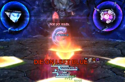

* oopsyraidsy: mistake and death reporting

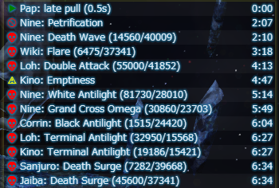

* jobs: condensed gauges with buff and proc tracking

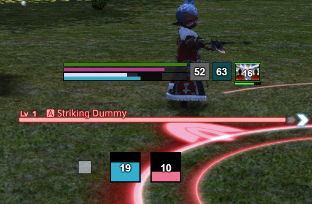

* eureka: Eureka NM tracking map

* fisher: Fishing cast time tracking

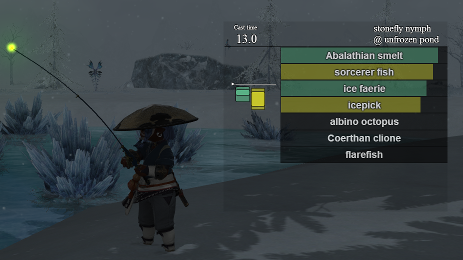

* dps: extra features for dps meters

### Video Examples

* [O4S raidboss + monk jobs](https://www.twitch.tv/videos/209562337)
* [O3S spellblade callouts](https://clips.twitch.tv/StrangeHungryGarageShadyLulu)

## Installing

### Dependencies

Install [.NET Framework](https://www.microsoft.com/net/download/framework) version 4.6.1 or above.

You must have [DirectX 11](http://imgur.com/TjcnjmG) enabled for Final Fantasy XIV.

Install the 64-bit version of [Advanced Combat Tracker](http://advancedcombattracker.com/), if you have not already.

Download and add the most recent version of [ravahn's FFXIV ACT plugin](https://github.com/ravahn/FFXIV_ACT_Plugin/releases/latest) to ACT.  You must enable parsing from the network and make sure that ACT is not firewalled.  Make sure the settings for the FFXIV plugin have the "Include HP for Triggers" button checked.
This is under Plugins -> FFXIV Settings -> Parse Options.

You must have the latest x64 version of the
[ngld OverlayPlugin](https://github.com/ngld/OverlayPlugin/releases/latest)
installed and working in ACT.  You must use the [ngld](https://github.com/ngld) version of
OverlayPlugin and not the original RainbowMage version or the hibiyasleep fork.

fflogs has [a good guide](https://www.fflogs.com/help/start/) to setting up ACT and OverlayPlugin if you prefer video or would like more instructions on how to set these two tools up properly.

### Installing cactbot

1. Find the [latest release](https://github.com/quisquous/cactbot/releases/latest) and download the cactbot-version-number.zip file for that release.  (You likely do *not* want either of the Source zip files.)
1. Right click on the zip file, go to properties.  In the bottom right corner of the properties menu, click "Unblock", and then "OK" to close the menu.
1. Unzip the release zip file.  (If there is no **cactbot\\CactbotOverlay.dll** file, you downloaded the wrong zip file.)
1. Close ACT, if it's still running.
1. Copy the **cactbot\\** folder from inside of the unzipped folder anywhere on disk.  Your user folder, aka **%UserProfile%** aka **C:\\Users\\Username** is a great place.  You can also put it in your **C:\\...\\Advanced Combat Tracker\\** folder as well, but will get security prompts whenever you change it.

1. If you already have an existing **cactbot\\** folder in the location you have copied it, you will be prompted to confirm if you want to merge files with existing files.  Click the `Do this for the next N conflicts` checkbox and then the `Move and Replace` checkbox.  If you end up with an **cactbot\\cactbot\\** folder then you have done something wrong.

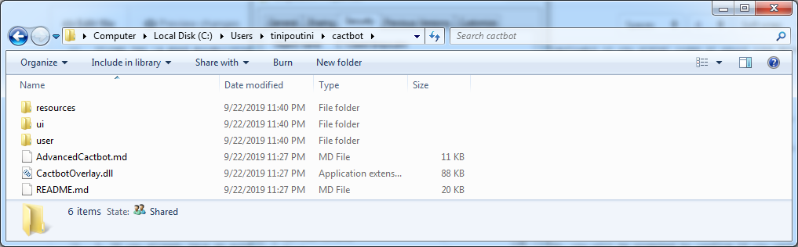

1. Add **cactbot\\CactbotOverlay.dll** as an ACT plugin.  In the ACT -> Plugins -> Plugin Listing tab, click the `Browse` button and find the **cactbot\\CactbotOverlay.dll** where you saved it on disk in the previous steps.  Then click `Add/Enable Plugin`.

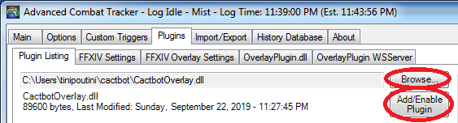

1. Verify your plugins are in the correct order.  The order should be: FFXIV Plugin first, then OverlayPlugin, then cactbot.  It should look like the following:

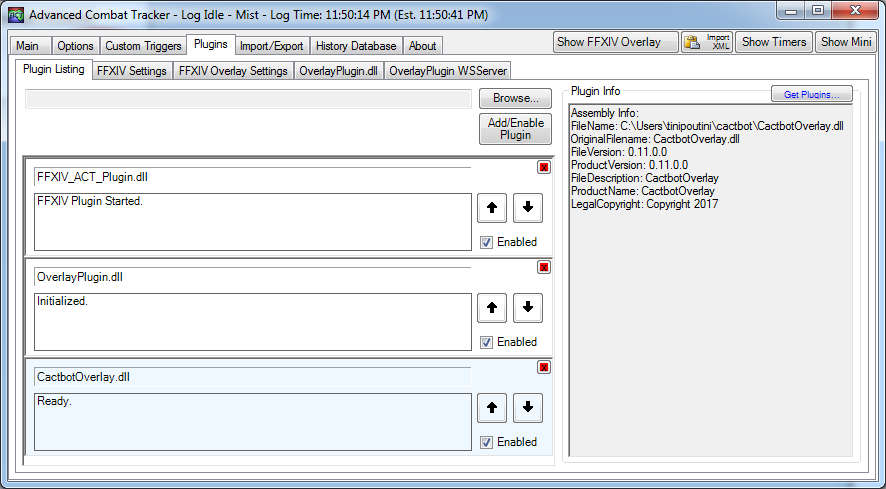

1. Restart ACT.
1. Now add a new overlay in the OverlayPlugin tab in ACT, and choose `MiniParse` as the type.
1. In the URL field, browse to an html file to load.  You do *not* need to check `This is an overlay that requires ACTWebSocket`.

    [ui/test/test.html](ui/test/test.html) is a good place to start to make sure everything is set up properly.

For more instructions about adding and configuring cactbot overlays, see the [Adding Overlay Modules](#adding-overlay-modules) section.

### Potential errors and workarounds

If you get an error that it can't find **FFXIV_ACT_Plugin.dll**, make sure the **FFXIV_ACT_Plugin.dll** is in the same directory as **Advanced Combat Tracker.exe**.

If you get an error in the OverlayPlugin console similar to `Exception in SendFastRateEvents: Method not found: 'Void RainbowMage.HtmlRenderer.Renderer.ExecuteScript(System.String)'.` then you are still using the RainbowMage version of OverlayPlugin.  You need to upgrade to the latest x64 full version of the [ngld OverlayPlugin](https://github.com/ngld/OverlayPlugin/releases/latest) instead.

If you get an error on the OverlayPlugin console similar to `Uncaught TypeError: window.OverlayPluginApi.overlayMessage is not a function`, then you are using an earlier version of the hibiyasleep OverlayPlugin.  You need to upgrade to the latest x64 full version of the [ngld OverlayPlugin](https://github.com/ngld/OverlayPlugin/releases/latest) instead.

If you get an error in the OverlayPlugin console similar to `System.MissingMethodException: Method not found: '!!0[] System.Array.Empty()` then you have installed the wrong .NET framework version.  Please install the [.NET Framework](https://www.microsoft.com/net/download/framework) version 4.6.1 or above.

If you get a [CAS policy](https://blogs.msdn.microsoft.com/drew/2009/12/23/xunit-and-td-net-fixing-the-attempt-was-made-to-load-an-assembly-from-a-network-location-problem/) error on starting the OverlayPlugin, such as `An attempt was made to load an assembly from a network location which would have caused the assembly to be sandboxed in previous version of the .NET Framework.` then this means that you have forgotten to unblock some/all of your DLLs (either OverlayPlugin or cactbot).  First, stop ACT.  Then, unblock everything; the easiest way is to unblock the original zip file and re-extract rather than unblocking every file individually.  Finally, restart ACT again.

If you get an overlay plugin error similar to `Error: (overlay): Exception in SendFastRateEvents: Could not load file or assembly 'FFXIV_ACT_Plugin, Version=(version), Culture=neutral, PublicKeyToken=null' or one of its dependencies. The system cannot find the file specified.` then you likely need to unblock the ffxiv plugin.  See the instructions above for unblocking DLLs.

If triggers or pieces of the UI do not work, ensure that "Disable Parsing from Network Data" is **not** checked in the FFXIV plugin settings. Network data is required for accurate trigger timing.

## Building from source

Follow all the steps above for installing cactbot first.

1. Follow the instructions in the **dummy.txt** file in [CactbotOverlay/ThirdParty/OverlayPlugin](CactbotOverlay/ThirdParty/OverlayPlugin).
1. Follow the instructions in the **dummy.txt** file in [CactbotOverlay/ThirdParty/ACT](CactbotOverlay/ThirdParty/ACT).
1. Open the solution in Visual Studio (tested with Visual Studio 2017).
1. Build for "Release" and "x64".
1. The plugin will be built as **bin/x64/Release/CactbotOverlay.dll**.
1. Add the built plugin directly as an ACT plugin.  In the ACT -> Plugins -> Plugin Listing tab, click the `Browse` button and find the **bin/x64/Release/CactbotOverlay.dll** where this file was built.  Then click `Add/Enable Plugin`.

## UI module overview

The [ui/](ui/) directory contains cactbot's ui modules.  If you installed cactbot following the instructions above, this will most likely be **C:\\...\\Advanced Combat Tracker\\OverlayPlugin\\cactbot\\ui**.

Each cactbot ui module should be added as a separate overlay.  See the [Adding Overlay Modules](#adding-overlay-modules) section for more details about setup.

### [raidboss](ui/raidboss) module

To use this module, point cactbot at **ui/raidboss/raidboss.html**.

This module provides a visual timeline of upcoming events in a fight, as well as text and audio
notifications to help increase raid awareness. Text and sound alerts can be based on the fight
timeline, or come from log messages that occur in the game, similar to ACT's "Custom Triggers".
The module is designed to look and feel similar to the
[BigWigs Bossmods](https://mods.curse.com/addons/wow/big-wigs) addon for World of Warcraft.

Fight timelines are provided in files designed for the [ACT Timeline](https://github.com/grindingcoil/act_timeline)
plugin, [documented here](http://dtguilds.enjin.com/forum/m/37032836/viewthread/26353492-act-timeline-plugin)
with [some extensions](ui/raidboss/data/README.txt).

There are three levels of text alerts, in order of escalating importance: `info`, `alert`, and `alarm`.
Text messages will be in one of these, and more important levels are larger and more eye grabbing colors.  [Text-to-speech can be configured](AdvancedCactbot.md#text-to-speech) if you prefer that over on screen text.

Timeline files are found in [ui/raidboss/data/timelines](ui/raidboss/data/timelines). Triggers
for text and sound alerts are found in [ui/raidboss/data/triggers](ui/raidboss/data/triggers).

In this screenshot, the raidboss module is highlighted, with the timeline circled in red, and the
text alerts circled in yellow, with an `alert`-level text message visible.

### [oopsyraidsy](ui/oopsyraidsy) module

To use this module, point cactbot at **ui/oopsyraidsy/oopsyraidsy.html**.

This module provides mistake tracking and death reporting.  Oopsy raidsy is meant to reduce the time wasted understanding what went wrong on fights and how people died.  During the fight, only a limited number of mistakes are shown (to avoid clutter), but afterwards a full scrollable list is displayed.

When somebody dies, the last thing they took damage from is listed in the log.  For example, if the log specifies: ":skull: Poutine: Iron Chariot (82173/23703)" this means that Poutine most likely died to Iron Chariot, taking 82173 damage and having 23703 health at the time.  The health value itself is not perfect and may be slightly out of date by a ~second due to a hot tick or multiple simultaneous damage sources.

When mistakes are made that are avoidable, oopsy logs warning (:warning:) and failure (:no_entry_sign:) messages, explaining what went wrong.

Mistake triggers are specified for individual fights in the [ui/oopsyraidsy/data](ui/oopsyraidsy/data) folder.

### [jobs](ui/jobs) module

To use this module, point cactbot at **ui/jobs/jobs.html**

This module provides health, mana, and tp bars, as well as icons and timer bars for big raid buffs such as
The Balance and Trick Attack. It also features a food buff warning to keep up your food buff when leveling
or raiding, and a visual pull countdown.

It has more fleshed out support for some jobs but is *strongly* a Work In Progress for others.

* Red Mage: Shows white/black mana, tracks procs for Verstone, Verfire and Impact, and shows the state of the melee combo in progress.
* Warrior: Shows the beast amount, and tracks the remaining Storm's Eye buff time in gcds.
* Monk: Shows chakra count, remaining greased lightning time, and tracks monk buffs and debuffs.

In this screenshot, the jobs module is highlighted for the Red Mage job. The health and mana bars, as well
as Red Mage white/black mana tracking is circled in purple, with the large raid buff tracking pointed to
beside it in orange. The first step of the melee combo has been executed, which is displayed as the yellow
box above the health bar. The proc tracking is circled below in green.

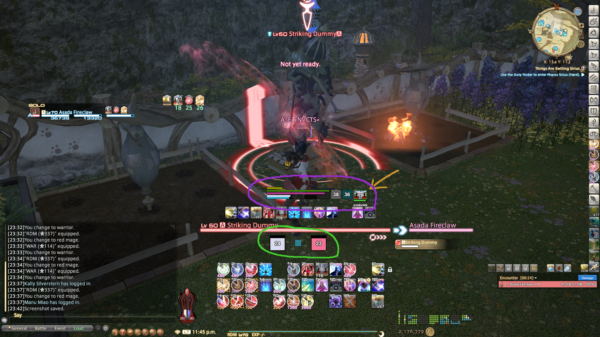

### [eureka](ui/eureka) module

To use this module, point cactbot at **ui/eureka/eureka.html**

This module provides automatic tracking of NMs that are popped or have
been killed.  It shows gales/night timers and any local tracker link
that has been pasted in chat.  Any flags in chat are also temporarily
included on the map.

It currently does not read the tracker information directly.  However,
if you click on the left/red "Copy killed NMs" button in the tracker to
copy the list of currently dead NMs, you can paste it in game, e.g.
`/echo ★ NMs on cooldown: Serket (7m) > Julika (24m) > Poly (54m)`

If you do not see the emoji, make sure you have installed [this Windows update](https://support.microsoft.com/en-us/help/2729094/an-update-for-the-segoe-ui-symbol-font-in-windows-7-and-in-windows-ser).

### [fisher](ui/fisher) module

To use this module, point cactbot at **ui/fisher/fisher.html**

When you cast your line at a fishing hole, this module keeps track of when you reel in particular fish so that you know what you might be getting when you hook it.

### [dps](ui/dps) meters

cactbot can be used with any dps meter overlay designed for OverlayPlugin's miniparse
addon, with the option to build out more features through cactbot's additional Javascript
APIs.  cactbot also auto-stops fights on wipes, so you can configure ACT's fight time to
infinity.

The [xephero](ui/dps/xephero) dps meter is based on the same dps meter built for miniparse,
with the additional ability to do per-phase dps tracking, displayed in additional columns.
In the screenshot below the phases are named B1, B2, B3.  These autogenerate from dungeon bosses, but could be used to differentiate raid fight phases.

The [rdmty](ui/dps/rdmty) dps meter is based on the same dps meter for miniparse, and updated
for Stormblood jobs and recolored to match [fflogs](http://fflogs.com).

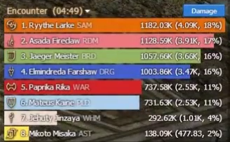

### [pull counter](ui/pullcounter) module

This small module sticks the current pull count for raiding bosses on screen.
This is primarily for folks who stream a lot and want to review video footage.
Having a number on screen makes it easy to scrub through video and find
particular pulls to review.

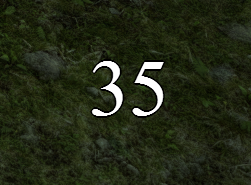

### [test](ui/test) module

To use this module, point cactbot at **ui/test/test.html**

This module is just an onscreen test of cactbot variables and is not meant to be used while playing.
It can be useful to try out to make sure everything is working as expected or to use to help debug
[writing your own module](AdvancedCactbot.md#writing-a-cactbot-ui-module).

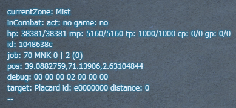

### Adding overlay modules

Here's an example of how to set up the raidboss overlay module.  Adding other modules is exactly the same, except you need to point the URL to a different HTML file for that specific module.

To add a cactbot module is the same as adding any overlay plugin.

1. Open ACT.
1. Navigate to the Plugins tab of ACT and then the OverlayPlugin.dll tab inside it.

    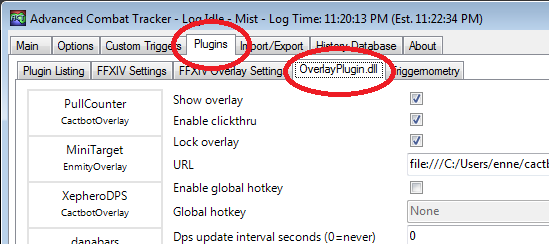

1. Click the "New" button and then select `MiniParse in the "Type" dropdown.

    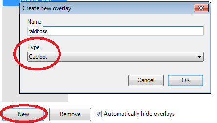

1. Type in any name you'd like as the name of this overlay, e.g. `raidbossy`.
1. A good example to start with is the raidboss module.  Set the filename to be **ui/raidboss/raidboss.html**.  Your config should look like this.

    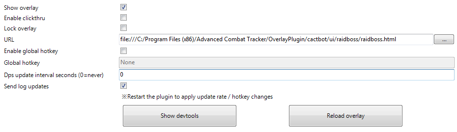

1. At this point, you should see some bunched up test UI appear on screen.  cactbot provides default test UI and a blue background to help with resizing and placing overlays on screen.  These all go away when the overlay is locked in the config panel for the overlay.

    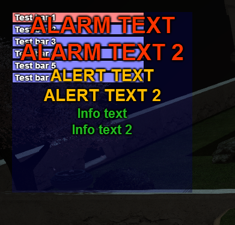

1. Uncheck the **Enable Clickthru** box on the config panel.  Then, in FFXIV, click and drag the lower right corner of the raidboss overlay to resize it.  Click and drag anywhere else on the raidboss overlay to move it.  This will make it look a lot better.  You can [configure this with CSS](AdvancedCactbot.md#configuring-ui-modules) if you want even more control.  It should look something like this:

    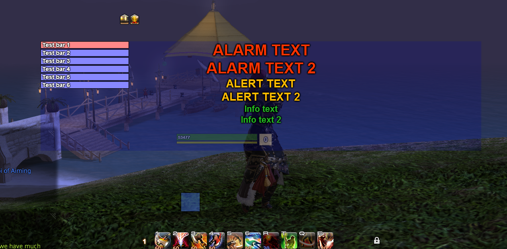

1. Once the overlay is in the right place, check the **Lock Overlay** and the **Enable Clickthru** boxes.

    The "Test bar", "ALARM TEXT", and shaded blue background will disappear once the overlay has been locked.

1. If you want to test the raidboss plugin, teleport to Summerford Farms, and follow [these instructions](ui/raidboss/data/timelines/test.txt).

## Cactbot Customization

See [this documentation](AdvancedCactbot.md#configuring-ui-modules) for more details.

## Supported Languages

cactbot is tested and works with the English, German and French versions of Final Fantasy XIV.

Unicode characters are supported thoughout, through the use of the helpers in the
[resources/regexes.js](resources/regexes.js) file. However [timelines](ui/raidboss/data/timelines)
and log event [triggers](ui/raidboss/data/triggers) may be incorrect if names that appear in the
ACT log events are different.
