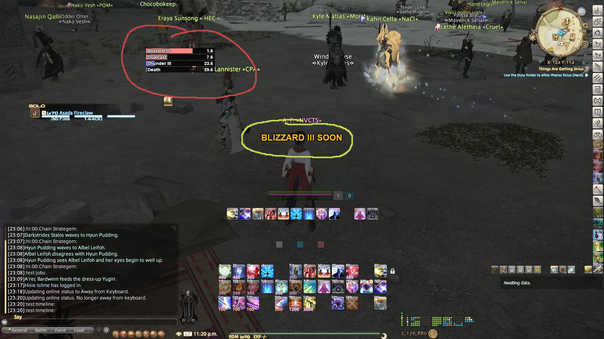
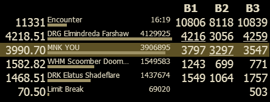

# cactbot (Chromium ACT Bindings Overlay for Things)

1. [About](#About)
2. [UI modules](#ui-modules)
3. [Configuring UI modules](#configuring-ui-modules)
4. [Installing](#installing)
5. [Building from source](#building-from-source)

## About

This project is an overlay plugin for
[hibiyasleep's OverlayPlugin](https://github.com/hibiyasleep/OverlayPlugin)
which itself is a plugin for
[Advanced Combat Tracker](http://advancedcombattracker.com/)

It depends on [ravahn's FFXIV ACT plugin](http://www.eq2flames.com/plugin-discussion/98088-ffxiv-arr-plugin.html).

Its goal is to provide log lines, combatant info, dps info, etc.  Everything
that anybody would need to write a good Javascript UI for
[Final Fantasy XIV](http://www.finalfantasyxiv.com/).

## UI modules

The [`ui/`](ui/) directory has some prebuilt UI modules, and [`resources/`](resources/) has
building blocks for building your own modules.

The modules in [`ui/`](ui/) are:

1. [raidboss](ui/raidboss)

Point cactbot at **ui/raidboss/raidboss.html**.

This module provides a timeline of upcoming events in a fight, as well as text and audio
notifications. It is designed to look and feel similar to the
[BigWigs Bossmods](https://mods.curse.com/addons/wow/big-wigs) addon for World of Warcraft.

The timelines are provided in files designed for the [ACT Timeline](https://github.com/grindingcoil/act_timeline)
plugin, [documented here](http://dtguilds.enjin.com/forum/m/37032836/viewthread/26353492-act-timeline-plugin)
with [some extensions](ui/raidboss/data/timelines/README.txt). It shows a timer bar for each upcoming event,
and can give text alerts before/after/during an event. Timeline files are found in
[ui/raidboss/data/timelines](ui/raidboss/data/timelines).

Text and sounds alerts can be generated from timelines, or from triggers on log lines in ACT. The triggers
that come with the addon are found in [ui/raidboss/data/triggers](ui/raidboss/data/triggers).

In this screenshot, the raidboss module is highlighted, with the timeline circled in red, and the
text alerts circled in yellow.



2. [jobs](ui/jobs)

Point cactbot at **ui/jobs/jobs.html**

This module provides health, mana, and tp bars, as well as icons and timer bars for big raid buffs such as
The Balance and Trick Attack. It also features a food buff warning to keep up your food buff when leveling
or raiding, and a pull countdown timer bar.

It has more fleshed out support for some jobs but is strongly a Work In Progress for others:
- Red Mage: Shows white/black mana, tracks procs for Verstone, Verfire and Impact, and shows the state of the melee combo in progress.
- Warrior: Shows the beast amount, and tracks how many GCDs before Storm's Eye will fall off.

In this screenshot, the jobs module is highlighted for the Red Mage job. The main health and mana, as well
as Red Mage white/black mana tracking is circled in purple, with the large raid buff tracking pointed to
beside it in orange. The proc tracking is circles below in green.


3. [dps meters](ui/dps)

Cactbot is backwards compatible with OverlayPlugin's miniparse addon. This lets you use
dps meters built for OverlayPlugin in Cactbot, with the option to build out more features
through Cactbot's additional Javascript APIs.

The xephero dps meter is based on the same dps meter built for miniparse, with the additional
ability to do per-phase dps tracking, displayed in additional columns. In the screenshot below
the phases are named B1, B2, B3.



The rdmty dps meter is based on the same dps meter, and updated for Stormblood jobs and
recolors to match [fflogs](fflogs.com).


Here is a video of some of these UI modules in action on [Exdeath and Neo Exdeath](https://www.youtube.com/watch?v=Ot_GMEcwv94), before the timelines were added to raidboss.

## Configuring UI modules

Cactbot UI modules can load user settings from the [`user/`](user/) directory. Simply add
a **user/\<name\>.css** or a **user/\<name\>.js** file, where **\<name\>** is the name of
the UI module, such as [jobs](ui/jobs) or [raidboss](ui/raidboss). These 2 UI modules both
support user settings.

The **user/\<name\>.css** file can override positions, sizes, colors, etc. for the visual
appearance. See the **ui/\<name\>/\<name\>.css** to find the names of things you can modify.
For example in [`ui/raidboss/raidboss.css`](ui/raidboss/raidboss.css), you see the
`#popup-text-container` and `#timeline-container` which can be moved in **user/raidboss.css**
to different positions as desired. Or the size and color of info text alerts can be changed via
the `.info-text` class.

The **user/\<name\>.js** file can set options to change the behaviour of the UI module. The
options that can be changed are documented as the `Options` structure at the top of the
**ui/\<name\>/\<name\>.js** file. For example in [`ui/raidboss/raidboss.js`](ui/raidboss/raidboss.js),
you see the `BarExpiresSoonSeconds` option which can change when timeline bars should be
highlighted. You would change that option to 5 seconds by editing **user/raidboss.js** to say:

```
Options.BarExpiresSoonSeconds = 5
```

To add a global trigger alert, for example, add to **user/raidboss.js**:

```
Options.Triggers = [
  { zoneRegex: /./,
    triggers: [
      // Trick Attack used.
      { regex: /:.*?:[0-9A-Fa-f]+:Trick Attack:/,
        sound: '../../resources/sounds/WeakAuras/RoaringLion.ogg',
      },
    ],
  },

  // .. other triggers here ..
]
```

A more sophisticated example that triggers with a 1 second delay, but only when the player's
character name appears in the log message:

```
Options.Triggers = [
  // .. other triggers here ..

  { // Forked Lightning - Get out.
    regex: /:([A-Za-z ']+) gains the effect of Forked Lightning from/,
    delaySeconds: 1,
    alertText: 'Forked Lightning: Get out',
    condition: function(data, matches) { return matches[1] == data.me; },
  },

  // .. other triggers here ..
]
```

## Installing

You should already have [OverlayPlugin](https://github.com/hibiyasleep/OverlayPlugin/releases) installed and working in [Advanced Combat Tracker](http://advancedcombattracker.com/).

1. Find the OverlayPlugin installation, make an `addons` sub-directory inside it (looks like `...\OverlayPlugin\addons`).
2. Copy the `CactbotOverlay.dll` file to the `addons` directory.
3. Make sure to unblock the `CactbotOverlay.dll` (right click -> properties -> unblock) if you downloaded it, instead of building it.
4. If you get an error that it can't find `FFXIV_ACT_Plugin.dll`, make sure it is in the same directory as `Advanced Combat Tracker.exe`.

   The directory structure should look something like this:
   - C:\\...\\Advanced Combat Tracker
     - Advanced Combat Tracker.exe
     - FFXIV_ACT_Plugin.dll
   - C:\\...\\Advanced Combat Tracker\\OverlayPlugin
     - OverlayPlugin.dll etc
   - C:\\...\\Advanced Combat Tracker\\OverlayPlugin\\addons
     - CactbotOverlay.dll

5. Now add a new overlay in the OverlayPlugin tab in ACT, and choose `Cactbot` as the type.
6. In the URL field, browse to an html file to load as a UI element. For example to `/path/to/cactbot/ui/raidboss/raidboss.html`.

## Building from source

You should already have [OverlayPlugin](https://github.com/hibiyasleep/OverlayPlugin/releases) installed and working in [Advanced Combat Tracker](http://advancedcombattracker.com/).

1. Follow the instructions in the `dummy.txt` file in [`CactbotOverlay/ThirdParty/OverlayPlugin`](CactbotOverlay/ThirdParty/OverlayPlugin).
2. Follow the instructions in the `dummy.txt` file in [`CactbotOverlay/ThirdParty/ACT`](CactbotOverlay/ThirdParty/ACT).
3. Open the solution in Visual Studio (tested with Visual Studio 2017).
4. Build for "Release" and "x64".
5. The plugin will be built as `bin/x64/Release/CactbotOverlay.dll`.
