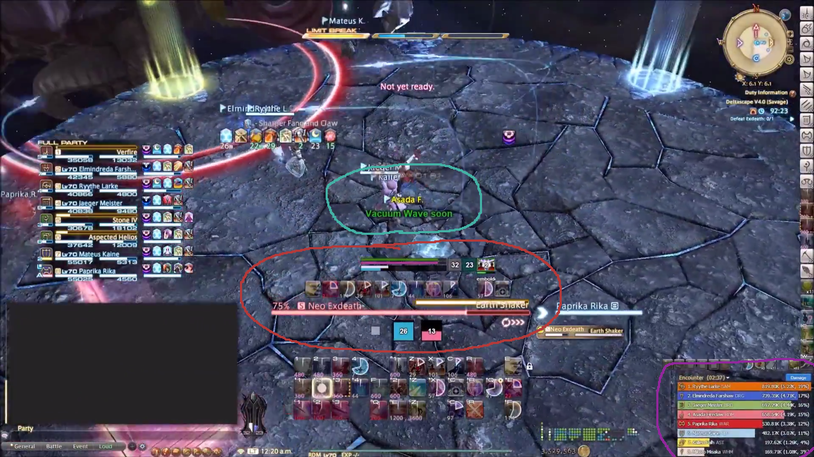

# cactbot (Chromium ACT Bindings Overlay for Things)

## About

This project is an overlay plugin for
[hibiyasleep's OverlayPlugin](https://github.com/hibiyasleep/OverlayPlugin)
which itself is a plugin for
[Advanced Combat Tracker](http://advancedcombattracker.com/)

It depends on [ravahn's FFXIV ACT plugin](http://www.eq2flames.com/plugin-discussion/98088-ffxiv-arr-plugin.html).

Its goal is to provide log lines, combatant info, dps info, etc.  Everything
that anybody would need to write a good Javascript UI for
[Final Fantasy XIV](http://www.finalfantasyxiv.com/).

Cactbot is backwards compatible with OverlayPlugin's miniparse addon. This lets you use
dps meters built for OverlayPlugin in Cactbot, with the option to build out more features
through Cactbot's additional Javascript APIs.

## UIs

The [`ui/`](ui/) directory has some prebuilt UIs, and [`resources/`](resources/) has building blocks for building your own UIs.

In this screenshot, there are 3 cactbots:
- [`ui/jobs/jobs.html`](ui/jobs/jobs.html) is circled in red, showing RDM resources and raid buffs.
- [`ui/raidboss/raidboss.html`](ui/raidboss/raidboss.html) is circled in teal, showing alerts for combat triggers. It can also show timelines of upcoming fight events, similar to the ACT Timeline addon. This module is built to be similar to the [BigWigs Bossmods](https://mods.curse.com/addons/wow/big-wigs) addon for World of Warcraft. Triggers are found in [`ui/raidboss/data/triggers`](ui/raidboss/data/triggers). Timelines are found in [`ui/raidboss/data/timelines`](ui/raidboss/data/timelines).
- [`ui/dps/rdmty/dps.html`](ui/dps/rdmty/dps.html) is circled in purple, which is a dps meter built for OverlayPlugin's miniparse, with some minor modifications including 4.0 jobs and colors.

Here is a video of these UI components in action on [Exdeath and Neo Exdeath](https://www.youtube.com/watch?v=Ot_GMEcwv94), before the timelines were added to raidboss.

## Building

You should already have [OverlayPlugin](https://github.com/hibiyasleep/OverlayPlugin/releases) installed and working in [Advanced Combat Tracker](http://advancedcombattracker.com/).

1. Follow the instructions in the `dummy.txt` file in [`CactbotOverlay/ThirdParty/OverlayPlugin`](CactbotOverlay/ThirdParty/OverlayPlugin).
2. Follow the instructions in the `dummy.txt` file in [`CactbotOverlay/ThirdParty/ACT`](CactbotOverlay/ThirdParty/ACT).
3. Open the solution in Visual Studio (tested with Visual Studio 2017).
4. Build for "Release" and "x64".
5. The plugin will be built as `bin/x64/Release/CactbotOverlay.dll`.

## Installing

You should already have [OverlayPlugin](https://github.com/hibiyasleep/OverlayPlugin/releases) installed and working in [Advanced Combat Tracker](http://advancedcombattracker.com/).

1. Find the OverlayPlugin installation, make an `addons` sub-directory inside it (looks like `...\OverlayPlugin\addons`).
2. Copy the `CactbotOverlay.dll` file to the addons directory.
3. Make sure to unblock the CactbotOverlay.dll (right click -> properties -> unblock) if you downloaded it, instead of building it.
4. If you get an error that it can't find `FFXIV_ACT_Plugin.dll`, make sure it is in the same directory as `Advanced Combat Tracker.exe`.

   The directory structure should look something like this:
   - C:\\...\\Advanced Combat Tracker
     - Advanced Combat Tracker.exe
     - FFXIV_ACT_Plugin.dll
   - C:\\...\\Advanced Combat Tracker\\OverlayPlugin
     - OverlayPlugin.dll etc
   - C:\\...\\Advanced Combat Tracker\\OverlayPlugin\\addons
     - CactbotOverlay.dll

5. Now add a new overlay in the OverlayPlugin tab in ACT, and choose `Cactbot` as the type.
6. In the URL field, browse to an html file to load as a UI element. For example to `CactbotOverlay/resources/dana/raid/raid.html`.

## Sounds

Triggers in [`ui/raidboss`](ui/raidboss) use sound effects from BigWigs which are notlicensed for redistribution. To use the sounds:
1. Download [BigWigs Bossmods](https://mods.curse.com/addons/wow/big-wigs) from curse.com.
2. Open the .zip file.
3. Extract the .ogg files `BigWigs/Sounds` to `resources/sounds/BigWigs`.

You should have:
- `resources/sounds/BigWigs/Alarm.ogg`
- `resources/sounds/BigWigs/Alert.ogg`
- `resources/sounds/BigWigs/Info.ogg`
- `resources/sounds/BigWigs/Long.ogg`