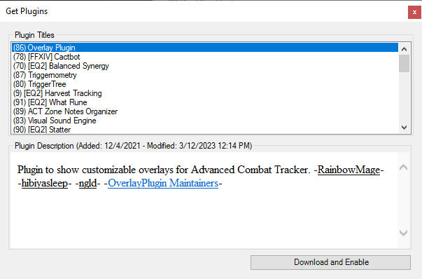
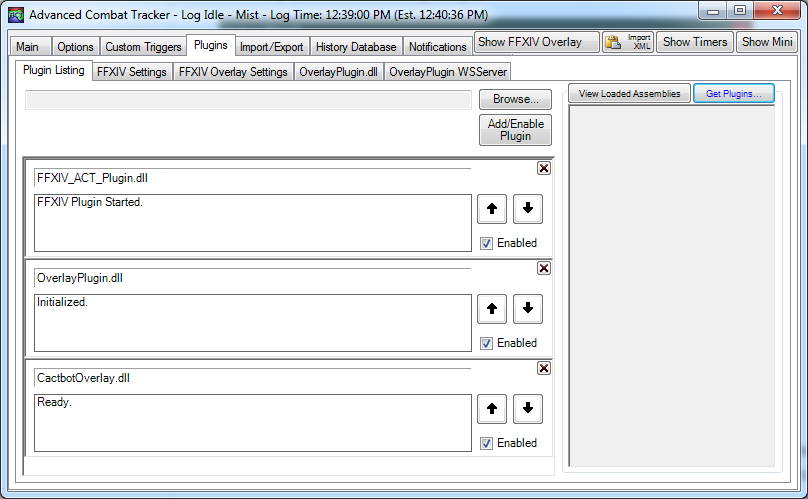
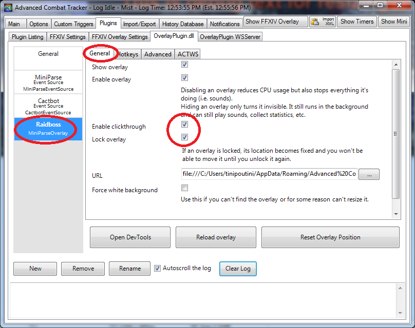
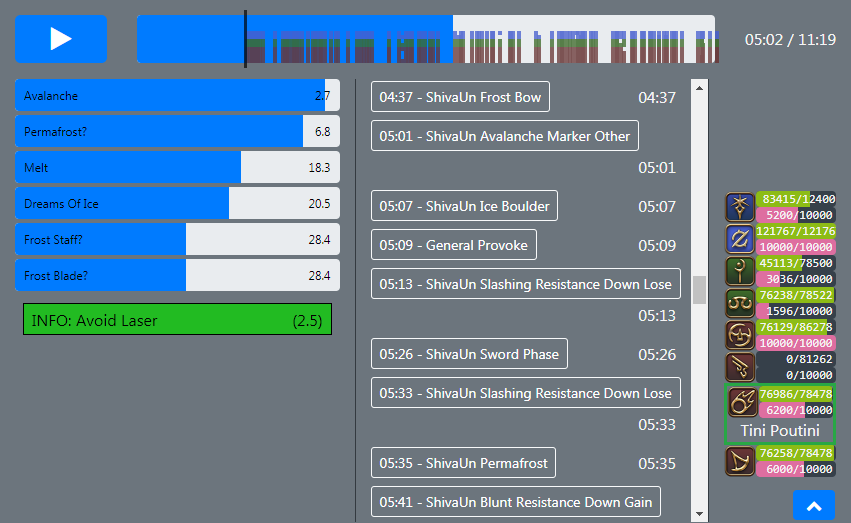
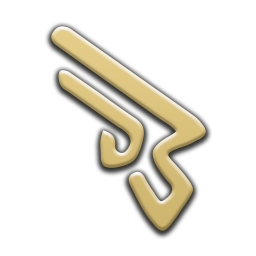

# cactbot (ffxiv raiding overlay)


[](https://github.com/quisquous/cactbot/actions?query=workflow%3ATest+branch%3Amain)
[](https://github.com/quisquous/cactbot/releases/latest)

🌎 [**English**] [[简体中文](docs/zh-CN/README.md)] [[한국어](docs/ko-KR/README.md)]

1. [About](#about)
1. [Installing](#installing)
1. [Building From Source](#building-from-source)
1. [UI Module Overview](#ui-module-overview)
1. [Troubleshooting](#troubleshooting)
1. [Cactbot Customization](#cactbot-customization)
1. [Supported Languages](#supported-languages)

## About

cactbot is an ACT overlay that provides raiding tools for [Final Fantasy XIV](http://www.finalfantasyxiv.com/). This project is an overlay plugin for
[OverlayPlugin](https://github.com/OverlayPlugin/OverlayPlugin)
which itself is a plugin for
[Advanced Combat Tracker](http://advancedcombattracker.com/).

cactbot provides these modules:

* raidboss: built-in timelines and triggers:


* oopsyraidsy: mistake and death reporting


* jobs: condensed gauges with resource, cooldowns, buffs, and procs tracking


* eureka: Adventuring Forays (Eureka/Bozja) tracking map


* fisher: Fishing cast time tracking


* radar: hunt mob directions, puller notifications


* dps: extra features for dps meters


## Installing

### Dependencies

Install [.NET Framework](https://www.microsoft.com/net/download/framework) version 4.6.1 or above.

You must have [DirectX 11](http://imgur.com/TjcnjmG) enabled for Final Fantasy XIV.

Install the 64-bit version of [Advanced Combat Tracker](http://advancedcombattracker.com/), if you have not already.

### Install FFXIV ACT Plugin

If you have just installed ACT,
then you will be presented with a startup wizard.
To get to the startup wizard otherwise,
click on `Options` and then click on `Show Startup Wizard`.


In the startup wizard,
select `FFXIV Parsing Plugin` and then click the `Download/Enable Plugin` button.
This will download `%APPDATA%\Advanced Combat Tracker\Plugins\FFXIV_ACT_Plugin.dll`
and enable it in the list of plugins.


Alternative FFXIV Plugin Guides:

* [fflogs video guide](https://www.fflogs.com/help/start/)
* [TomRichter guide](https://gist.github.com/TomRichter/e044a3dff5c50024cf514ffb20a201a9#installing-act--ffxiv-plugin)

### Install OverlayPlugin

At this point, if you select the `Plugins` tab and go to the `Plugin Listing`,
your list of plugins should look something like this:


Click on `Get Plugins` to open up the ACT plugin installer.

Select `Overlay Plugin` and then click `Download and Enable`.



This will download OverlayPlugin into
`%APPDATA%\Advanced Combat Tracker\Plugins\OverlayPlugin`
and enable `OverlayPlugin.dll` in the list of plugins.

As a note, you must use the [most current fork](https://github.com/OverlayPlugin/OverlayPlugin) of
OverlayPlugin and not the original RainbowMage version or the hibiyasleep fork or the ngld fork.

### Installing cactbot

Again, go to the `Plugins` tab and go to the `Plugin Listing`,
and then select `Get Plugins`.

Select `Cactbot` and then click `Download and Enable`.


This will download the cactbot into
`%APPDATA%\Advanced Combat Tracker\Plugins\cactbot-version\cactbot`
and enable `CactbotOverlay.dll` in the list of plugins.

**Note**: Due to a difference in how ACT expects archives to be
and how cactbot generates its zip files,
there will be something like a `cactbot-0.15.2` folder
that corresponds to the initial version that you downloaded cactbot.
This folder name does not matter and is cosmetic.

### Plugin Load Order

Because of cactbot’s dependencies,
cactbot must be loaded after both OverlayPlugin and the FFXIV ACT plugin.
Verify that your plugins are in this order:

* FFIXV_ACT_Plugin.dll
* OverlayPlugin.dll
* CactbotOverlay.dll



Finally, restart ACT.

## Adding overlay modules

Here's an example of how to set up the raidboss overlay module.
Setting up other cactbot overlays works identically.

1. Open ACT.
1. Make sure you've restarted ACT after adding the cactbot plugin.
1. Navigate to the `Plugins` tab of ACT and then the `OverlayPlugin.dll` tab inside it.
1. Click the "New" button and then pick `Cactbot Raidboss` in the Preset list.

    

1. At this point, you should see some test UI appear on screen.
cactbot provides default test UI,
a large dashed red border,
and a blue background to help with resizing and placing overlays on screen.
These all go away when the overlay is locked in the config panel for the overlay.
You should always lock your overlay once you are done resizing and placing it.

    

1. Type in any name you'd like as the name of this overlay, e.g. `raidbossy`.
1. Click the `OK` button to add this as an Overlay.
It will now appear in the list of overlays in the `Plugins` -> `OverlayPlugin.dll` tab.

1. Drag and resize the overlay to the location that you want it in.

1. In the `General` tab of the `Raidboss` overlay, click the `Lock Overlay` and `Enable Clickthrough` checkboxes.
The test bars, debug text, dashed red border, and shaded blue background will disappear once the overlay has been locked.

    

1. If you want to test the raidboss plugin, teleport to Summerford Farms, and do a `/countdown 5`.

1. Adding other cactbot overlays is a similar process.
Follow the same process but select a different cactbot preset.

## Building from source

Follow all the steps above for installing cactbot first.
To install dependencies there are 2 methods: **per script** and **manually**

### Dependencies: Script Method

1. `curl` MUST be installed (this is used to download dependencies)
1. Execute `ts-node ./util/fetch_deps.ts` script
1. Continue with **Steps to build**

### Dependencies: Manual Method

1. Please download the latest Zip file from <https://github.com/EQAditu/AdvancedCombatTracker/releases/>
1. Extract the `Advanced Combat Tracker.exe` to `cactbot/plugin/ThirdParty/ACT/`
1. Please download the latest SDK Zip file from <https://github.com/ravahn/FFXIV_ACT_Plugin/> (make sure the file says SDK in its name)
1. Extract the `SDK folder` as well as the `FFXIV_ACT_Plugin.dll` to `cactbot/plugin/ThirdParty/FFXIV_ACT/`
1. Please download the latest Zip file from <https://github.com/OverlayPlugin/OverlayPlugin/releases/>
1. Extract the `libs folder` as well as the `OverlayPlugin.dll` to `cactbot/plugin/ThirdParty/OverlayPlugin/`
1. Continue with **Steps to build**

The folder should look something like this (keep in mind files can change with updates in the future):

```plaintext
ThirdParty
|- ACT
|  |- Advanced Combat Tracker.exe
|- FFXIV_ACT
|  |- SDK
|  |  |- FFXIV_ACT_Plugin.Common.dll
|  |  |- FFXIV_ACT_Plugin.Config.dll
|  |  |- FFXIV_ACT_Plugin.LogFile.dll
|  |  |- FFXIV_ACT_Plugin.Memory.dll
|  |  |- FFXIV_ACT_Plugin.Network.dll
|  |  |- FFXIV_ACT_Plugin.Overlay.dll
|  |  |- FFXIV_ACT_Plugin.Parse.dll
|  |  |- FFXIV_ACT_Plugin.Resource.dll
|  |- FFXIV_ACT_Plugin.dll
|- OverlayPlugin
   |- libs
   |  |- HtmlRenderer.dll
   |  |- Markdig.Signed.dll
   |  |- Newtonsoft.Json.dll
   |  |- OverlayPlugin.Common.dll
   |  |- OverlayPlugin.Core.dll
   |  |- OverlayPlugin.Updater.dll
   |  |- SharpCompress.dll
   |  |- System.ValueTuple.dll
   |  |- websocket-sharp.dll
   |- OverlayPlugin.dll
```

### Steps to build plugin

1. Open the solution in Visual Studio (tested with Visual Studio 2017).
1. Build for "Release" and "x64".
1. The plugin will be built as **bin/x64/Release/CactbotOverlay.dll**.
1. Add the built plugin directly as an ACT plugin.  In the ACT -> Plugins -> Plugin Listing tab, click the `Browse` button and find the **bin/x64/Release/CactbotOverlay.dll** where this file was built.  Then click `Add/Enable Plugin`.

### npm and webpack

If you are not a cactbot developer
and are trying to modify cactbot for your own personal triggers,
you should instead refer to the [customization documentation](docs/CactbotCustomization.md)
instead of changing your local cactbot files.

To install npm and start Webpack, follow these steps:

1. Install [nodejs and npm](https://nodejs.org/en/download/)
1. Run `npm install` in the root of the cactbot directory.
1. Run `npm run build` or `npm start`.

See the [contributing](CONTRIBUTING.md#validating-changes-via-webpack) documentation
for more details about using Webpack.

## UI module overview

The [ui/](ui/) directory contains cactbot's ui modules.
If you installed cactbot following the instructions above,
this will most likely be `%APPDATA%\Advanced Combat Tracker\Plugins\cactbot-version\cactbot\ui\`.

Each cactbot ui module should be added as a separate overlay.
See the [Adding Overlay Modules](#adding-overlay-modules) section for more details about setup.

### [raidboss](ui/raidboss) module

To use this module,
point cactbot at **ui/raidboss/raidboss.html** or use the `Cactbot Raidboss` preset.

This module provides a visual timeline of upcoming events in a fight, as well as text and audio
notifications to help increase raid awareness. Text and sound alerts can be based on the fight
timeline, or come from log messages that occur in the game, similar to ACT's "Custom Triggers".
The module is designed to look and feel similar to the
[BigWigs Bossmods](https://www.curseforge.com/wow/addons/big-wigs) addon for World of Warcraft.

[This page](https://quisquous.github.io/cactbot/util/coverage/coverage.html) lists
the currently supported set of content in cactbot.
Support is continually added over time (patches welcome!)
but a lot of old content may not be supported yet.

Fight timelines are provided in files designed for the [ACT Timeline](https://github.com/grindingcoil/act_timeline)
plugin, [documented here](http://dtguilds.enjin.com/forum/m/37032836/viewthread/26353492-act-timeline-plugin)
with [some extensions](docs/TimelineGuide.md).

There are three levels of text alerts, in order of escalating importance: `info`, `alert`, and `alarm`.
Text messages will be in one of these, and more important levels are larger and more eye grabbing colors.  Text-to-speech can be configured if you prefer that over on screen text.

Timeline files and triggers for text and sound alerts are found in [ui/raidboss/data](ui/raidboss/data), timeline files with `.txt` extension and trigger files with `.ts` extension.

In this screenshot, the raidboss module is highlighted, with the timeline circled in red, and the
text alerts circled in yellow, with an `alert`-level text message visible.


### raidboss emulator

If you are writing triggers or timelines and want to test them, you can use the raidboss emulator:
**ui/raidboss/raidemulator.html**.

This currently can only be loaded in a browser and not as an overlay.
This will work in current version of Chrome,
and should work in other browsers as well but this is less tested.

If you want the emulator to use your ACT settings and user triggers,
you will need to enable the OverlayPlugin WS Server via the following instructions:

1. Start ACT.
1. Start the WS Server via Plugins -> OverlayPlugin WSServer -> Stream/Local Overlay.

If you're developing triggers for the cactbot repository,
you can start a local development server via `npm run start`
and load the overlay in Chrome via `http://127.0.0.1:8080/ui/raidboss/raidemulator.html?OVERLAY_WS=ws://127.0.0.1:10501/ws`

If you're developing user triggers,
you can load the overlay in Chrome via `https://quisquous.github.io/cactbot/ui/raidboss/raidemulator.html?OVERLAY_WS=ws://127.0.0.1:10501/ws`

If you're trying to reproduce an issue,
you can load the overlay in Chrome via `https://quisquous.github.io/cactbot/ui/raidboss/raidemulator.html`.
You don't need the WS Server running in this case.

Once you've got the overlay loaded, you can follow these instructions to use the emulator.

1. Drag and drop a [network log](/docs/FAQ-Troubleshooting.md#how-to-find-a-network-log) onto the page.
1. Select the zone and encounter, and then click `Load Encounter`.

If the emulator is not working, check the console log in the inspector for errors.



### [oopsyraidsy](ui/oopsyraidsy) module

To use this module,
point cactbot at **ui/oopsyraidsy/oopsyraidsy.html** or use the `Cactbot OopsyRaidsy` preset.

This module provides mistake tracking and death reporting.  Oopsy raidsy is meant to reduce the time wasted understanding what went wrong on fights and how people died.  During the fight, only a limited number of mistakes are shown (to avoid clutter), but afterwards a full scrollable list is displayed.

When somebody dies, the last thing they took damage from is listed in the log.  For example, if the log specifies: ":skull: Poutine: Iron Chariot (82173/23703)" this means that Poutine most likely died to Iron Chariot, taking 82173 damage and having 23703 health at the time.  The health value itself is not perfect and may be slightly out of date by a ~second due to a hot tick or multiple simultaneous damage sources.

When mistakes are made that are avoidable, oopsy logs warning (:warning:) and failure (:no_entry_sign:) messages, explaining what went wrong.

Mistake triggers are specified for individual fights in the [ui/oopsyraidsy/data](ui/oopsyraidsy/data) folder.


You can copy oopsy lines to the clipboard by clicking them.
(You may need to uncheck `Enable Clickthrough` checkbox from the OverlayPlugin option.)

### [jobs](ui/jobs) module

To use this module,
point cactbot at **ui/jobs/jobs.html** or use the `Cactbot Jobs` preset.

This module includes 3 parts: a resource zone at top middle, a raidbuff zone at top right, and a tracking zone at bottom.

* **resource zone**: HP bars and job-specific resource, along with some special counters for some jobs.
* **tracking zone**: job-specific important buff/debuff duration, cooldowns and procs.
* **raidbuff zone**: important raidbuffs duration and coming cooldowns.

You can change some of the behavior or appearance via the user panel, e.g. only show the raidbuff zone, or enable compact view.

However, customization of some behavior like cooldown alert thresholds and element order is not available for now.

In this screenshot, the RDM jobs UI is shown as an example.
The in-game UI is shown at top and the jobs module is shown at bottom.
HP & MP bar, White Mana and Black Mana are shown in purple.
The right yellow is raidbuff icon.
Verstone Ready duration, Verfire Ready duration, Fleche cooldown, Contre Sixte cooldown are shown in red.


#### Features for Each Job

<details>
<summary>Job Features Table (Click to expand)</summary>

|Job|Feature (left to right, top to bottom)|
|:-:|-|
|<br> Paladin|**Resource zone**: Oath Gauge, Sword Oath stack, combo timer, Requiescat stacks (if under Requiescat). <br> **Tracking zone**: Goring Blade cooldown, Fight or Flight duration & cooldown, Expiacion cooldown.|
|<br> Warrior|**Resource zone**: Beast Gauge, combo timer. <br> **Tracking zone**: Surging Tempest buff duration, Upheaval/Orogeny cooldown, Inner Release cooldown.|
|<br> Dark Knight|**Resource zone**: Blood Gauge, combo timer. <br> **Tracking zone**: Darkside duration, Blood Weapon cooldown, Delirium cooldown, Living Shadow cooldown.|
|<br> Gunbreaker|**Resource zone**: Cartridge amount, combo timer. <br> **Tracking zone**: Gnashing Fang cooldown, No Mercy duration & cooldown, Bloodfest cooldown.|
|<br> White Mage|**Resource zone**: Lily timer, Lily & Blood Lily amount. <br> **Tracking zone**: Dia/Aero DoT duration, Assize cooldown, Lucid Dreaming cooldown.|
|<br> Scholar|**Resource zone**: Aetherflow stack, Faerie Gauge/Seraph duration. <br> **Tracking zone**: Bio DoT duration, Aetherflow cooldown, Lucid Dreaming cooldown.|
|<br> Astrologian|**Resource zone**: arcanum helper, held Minor Arcana, held Sign. <br> **Tracking zone**: Combust DoT duration, Draw cooldown, Minor Arcana cooldown, Lucid Dreaming cooldown.|
|<br> Sage|**Resource zone**: Addersgall timer, Addersgall & Addersting amount. <br> **Tracking zone**: Eukrasian Dosis DoT duration, Phlegma cooldown, Rhizomata cooldown, Lucid Dreaming cooldown.|
|<br> Monk|**Resource zone**: chakra stack, form timer, Master's Gauge. <br> **Tracking zone**: Leaden Fist buff duration, Disciplined Fist buff duration, Demolish DoT duration.|
|<br> Dragoon|**Resource zone**: first brood's gaze stack/Life of the Dragon duration, Firstminds' Focus stack. <br> **Tracking zone**: Jump cooldown, Power Surge buff duration, Lance Charge duration & cooldown, Dragon Sight duration & cooldown.|
|<br> Ninja|**Resource zone**: Ninki amount, combo timer. <br> **Tracking zone**: Huton duration, Trick Attack duration & cooldown, Bunshin cooldown, Mudra cooldown.|
|<br> Samurai|**Resource zone**: Kenki amount, Meditation stack, combo timer, held Sen. <br> **Tracking zone**: Fugetsu buff duration, Fuka buff duration, Tsubame-gaeshi cooldown, Higanbana DoT duration.|
|<br> Reaper|**Resource zone**: Soul amount, Shroud amount, combo timer, Lemure Shroud/Void Shroud stack (under Enshroud). <br> **Tracking zone**: Death's Design duration, Soul Slice/Soul Scythe cooldown, Gluttony cooldown, Arcane Circle duration & cooldown.|
|<br> Bard|**Resource zone**: Repertoire stack, Soul Voice amount, Repertoire tick timer, held Coda. <br> **Tracking zone**: Windbite/Venomous Bite DoT duration, Song duration, Empyreal Arrow cooldown, Straight Shot Ready proc duration.|
|<br> Machinist|**Resource zone**: Heat/Overheated stack, Battery/Automaton Queen duration, combo timer, Wildfire GCD counter (if Wildfire active). <br> **Tracking zone**: Drill/Bioblaster cooldown, Air Anchor cooldown, Chain Saw cooldown, Wildfire duration & cooldown.|
|<br> Dancer|**Resource zone**: Fourfold Feather amount, Esprit amount, combo timer. <br> **Tracking zone**: Standard Step cooldown, Technical Step duration & cooldown, Flourish duration & cooldown.|
|<br> Black Mage|**Resource zone**: Umbral Ice/Astral Fire duration, Polyglot timer, MP tick timer, Umbral Hearts stack & Polyglot stack. <br> **Tracking zone**: Firestarter proc duration, Thunder DoT duration, Thundercloud proc duration.|
|<br> Summoner|**Resource zone**: Trance/Attunement duration, Aetherflow stack, Arcanum held and Attunement stored in. <br> **Tracking zone**: Energy Drain/Energy Siphon cooldown, Summon Bahamut/Phoenix cooldown, Lucid Dreaming cooldown.|
|<br> Red Mage|**Resource zone**: White Mana and Black Mana amount, Mana Stack (if any). <br> **Tracking zone**: Verstone Ready duration, Verfire Ready duration, Fleche cooldown, Contre Sixte cooldown.|
|<br> Blue Mage|**Resource zone**: none. <br> **Tracking zone**: Off-guard/Peculiar Light cooldown, Song of Torment/Nightbloom/Aetherial Spark DoT duration, Lucid Dreaming cooldown.|

</details>

### [eureka](ui/eureka) module

To use this module,
point cactbot at **ui/eureka/eureka.html** or use the `Cactbot Eureka` preset.

This module provides automatic tracking of NMs that are popped or have
been killed.  It shows gales/night timers and any local tracker link
that has been pasted in chat.  Any flags in chat are also temporarily
included on the map.

It currently does not read the tracker information directly.  However,
if you click on the left/red "Copy killed NMs" button in the tracker to
copy the list of currently dead NMs, you can paste it in game, e.g.
`/echo NMs on cooldown: Serket (7m) → Julika (24m) → Poly (54m)`

If you do not see the emoji, make sure you have installed [this Windows update](https://support.microsoft.com/en-us/help/2729094/an-update-for-the-segoe-ui-symbol-font-in-windows-7-and-in-windows-ser).


### [radar](ui/radar) module

To use this module,
point cactbot at **ui/radar/radar.html** or use the `Cactbot Radar` preset.

This module lets you know about nearby hunt mobs (S-rank, A-rank, etc).
When one pops, it gives you an arrow (based on your character's heading)
and a distance to the mob.

There are options to show who pulled the mob,
as well as to configure the display of the radar.
You can also set up custom options for different ranks
(e.g. make noises for S rank, but be silent for B ranks),
or set up custom triggers for any mob name you would like.

See the `cactbot/user/radar-example.js` for more options.


### [fisher](ui/fisher) module

To use this module,
point cactbot at **ui/fisher/fisher.html** or use the `Cactbot Fisher` preset.

When you cast your line at a fishing hole, this module keeps track of when you reel in particular fish so that you know what you might be getting when you hook it.


Cast times are currently only logged as you fish, so there won't be any data until you've caught each fish. Green bars represent light tugs, yellow is a medium tug and red bars are legendary/heavy tugs.

Check [here](docs/FAQ-Troubleshooting.md#fisher-module) for common troubleshooting tips.

### [dps](ui/dps) meters

cactbot can be used with any dps meter overlay designed for OverlayPlugin's miniparse
addon, with the option to build out more features through cactbot's additional Javascript
APIs.  cactbot also auto-stops fights on wipes, so you can configure ACT's fight time to
infinity.

The [xephero](ui/dps/xephero) dps meter is based on the same dps meter built for miniparse,
with the additional ability to do per-phase dps tracking, displayed in additional columns.
In the screenshot below the phases are named B1, B2, B3.  These autogenerate from dungeon bosses, but could be used to differentiate raid fight phases.


The [rdmty](ui/dps/rdmty) dps meter is based on the same dps meter for miniparse, and
recolored to match [fflogs](http://fflogs.com).


### [pull counter](ui/pullcounter) module

This small module sticks the current pull count for raiding bosses on screen.
This is primarily for folks who stream a lot and want to review video footage.
Having a number on screen makes it easy to scrub through video and find
particular pulls to review.

In most cases, you can reset the count for the current boss/zone by typing
`/echo pullcounter reset`.
You can also edit the counts directly in your
`%APPDATA%\Advanced Combat Tracker\Config\RainbowMage.OverlayPlugin.config.json`
file.


### [test](ui/test) module

To use this module,
point cactbot at **ui/test/test.html** or use the `Cactbot Test` preset.

This module is just an onscreen test of cactbot variables and is not meant to be used while playing.
It can be useful to try out to make sure everything is working as expected or to use to help debug overlay issues.


## Troubleshooting

A general FAQ can be found [here](docs/FAQ-Troubleshooting.md) containing solutions to common Cactbot issues.

## Cactbot Customization

Most common cactbot configuration can be done via the control panel,
inside of ACT.


This can be found by going to
Plugins -> OverlayPlugin.dll -> Cactbot Event Source,
and then clicking on options there.

In particular,
if you want to use text to speech for raidboss alerts,
you can change the "Default alert output" to be
"TTS Only" or "Text and TTS".
You can also change this on a per trigger basis.

Or, if for some reason (???) you don't want the ready check sound alert,
you can disable this via the same options panel.
Go to Raidboss -> General Triggers -> General -> General Ready Check,
and set it to `Disabled` instead of `Defaults`.

These options are stored in your
`%APPDATA%\Advanced Combat Tracker\Config\RainbowMage.OverlayPlugin.config.json`
file.
It is not recommended to edit this file directly,
as it must be [strict json](https://jsonlint.com/)
and ACT might fail to load if the file is written incorrectly.

It is recommended that you do most of your configuration via this control panel
rather than with user files.
Files in `cactbot/user/` are more powerful
and can override anything from the control panel.
However, this can also be confusing when the control panel doesn't adjust something
properly that a `cactbot/user/` file is overriding silently.

See [this documentation](docs/CactbotCustomization.md#user-folder-config-overrides)
for more details about user javascript and css files.

## Supported Languages

cactbot is tested and works with the current
international (English, German, French, Japanese) version,
the current Chinese version,
and the current Korean version.
Some translations are still a work in progress.

## Licensing, Trademarks, Copyright

cactbot is open source under the [Apache License, Version 2.0](LICENSE).

FINAL FANTASY is a registered trademark of Square Enix Holdings Co., Ltd.

Final Fantasy art and icons reused non-commercially under the
[FINAL FANTASY® XIV Materials Usage License](https://support.na.square-enix.com/rule.php?id=5382).

See the [LICENSE](LICENSE) file for more details about other bundled projects.
