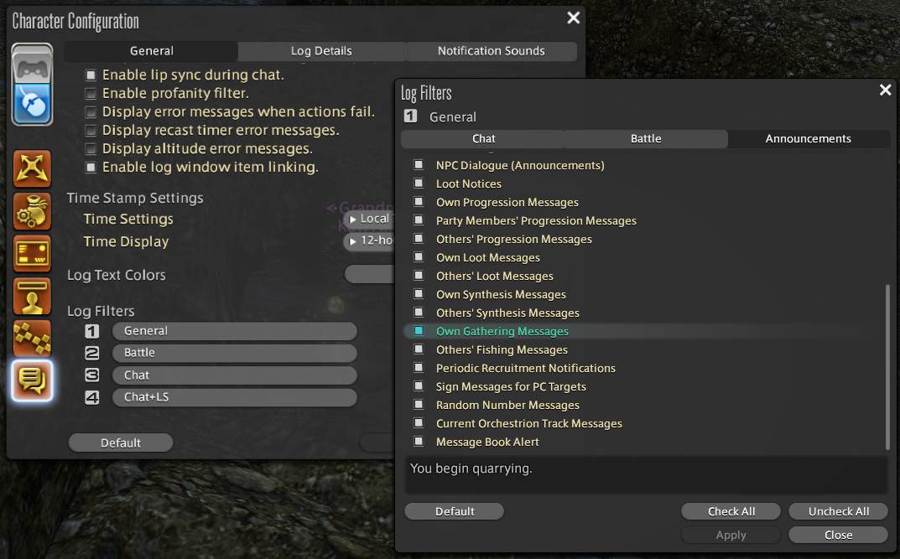
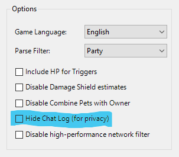

# Potential errors and workarounds

1. [General FFXIV ACT Troubleshooting](#general-ffxiv-act-troubleshooting)
1. [Problems using Cactbot](#problems-using-cactbot)
1. [Fisher Module](#fisher-module)
1. [Other Issues](#other-issues)

## General FFXIV ACT Troubleshooting

ngld (developer of the [OverlayPlugin](https://github.com/ngld/OverlayPlugin) used by Cactbot) has written an excellent FAQ for common FFXIV ACT Plugin and OverlayPlugin issues, which you can find [here](https://gist.github.com/ngld/e2217563bbbe1750c0917217f136687d).

If you get an error that it can't find **FFXIV_ACT_Plugin.dll**, make sure the **FFXIV_ACT_Plugin.dll** is in the `%APPDATA%\Advanced Combat Tracker\Plugins` folder.
You can install **FFXIV_ACT_Plugin.dll** from the ACT Startup Wizard.

## Problems during Cactbot installation

If you get an error in the OverlayPlugin console similar to `Error: JS Handler call failed: System.Exception: Tried to call missing handler "cactbotLoadUser"!` then you are still using the hibiyasleep version of OverlayPlugin and need to upgrade to the latest version of the ngld [OverlayPlugin](https://github.com/ngld/OverlayPlugin/releases/latest) instead.

If you get an error in the OverlayPlugin console similar to `Error: LoadAddons: Cactbot.PluginLoader: RainbowMage.OverlayPlugin.TinyIoCResolutionException: Unable to resolve type: Cactbot.CactbotEventSource` then you have likely installed the `CactbotOverlay.dll` into the `OverlayPlugin/addons` folder.  Please move the Cactbot files to their own separate folder, as described in the [Installing Cactbot](https://github.com/quisquous/cactbot#installing-cactbot) instructions.

If you get an error in the OverlayPlugin console similar to `System.MissingMethodException: Method not found: '!!0[] System.Array.Empty()` then you have installed the wrong .NET framework version.  Please install the [.NET Framework](https://www.microsoft.com/net/download/framework) version 4.6.1 or above.

If you get a [CAS policy](https://blogs.msdn.microsoft.com/drew/2009/12/23/xunit-and-td-net-fixing-the-attempt-was-made-to-load-an-assembly-from-a-network-location-problem/) error on starting the OverlayPlugin, such as `An attempt was made to load an assembly from a network location which would have caused the assembly to be sandboxed in previous version of the .NET Framework.` then this means that you have forgotten to unblock some/all of your DLLs (either hibiyasleep or cactbot).  First, stop ACT.  Then, unblock everything; the easiest way is to unblock the original zip file and re-extract rather than unblocking every file individually.  Finally, restart ACT again.

If you get an overlay plugin error similar to `Error: (overlay): Exception in SendFastRateEvents: Could not load file or assembly 'FFXIV_ACT_Plugin, Version=(version), Culture=neutral, PublicKeyToken=null' or one of its dependencies. The system cannot find the file specified.` then you likely need to unblock the ffxiv plugin.  See the instructions above for unblocking DLLs.

If you get an error that says `Plugin Load Failure` and `The downloaded file did not contain a plugin that could be loaded`,
there could be several potential issues.

- Make sure you have [installed OverlayPlugin](https://github.com/quisquous/cactbot#install-ngld-overlayplugin).
- Check your OverlayPlugin version in **Plugins** -> **Plugin Listing** -> **OverlayPlugin.dll**.
If this is not the same version as [this release](https://github.com/ngld/OverlayPlugin/releases/latest),
then remove it and re-follow the [installation instructions](https://github.com/quisquous/cactbot#install-ngld-overlayplugin).
- Make sure you are running x64 ACT (`Advanced Combat Tracker.exe`) and not x86 ACT (`ACTx86.exe`).
- Finally, make sure you have reloaded ACT once you have installed OverlayPlugin.

## Problems using Cactbot

If triggers or pieces of the UI do not work, ensure that "Disable Parsing from Network Data" is **not** checked in the FFXIV plugin settings. Network data is required for accurate trigger timing.

If you are using cactbot for dps parsing and you don't get any data, make sure that the `DPS update interval seconds` is set to a number higher than zero in your `OverlayPlugin.dll` -> `MiniParse Event Source` config.  Setting it to 3 is a good default.

## Fisher Module

### I can't see the overlay

The overlay is hidden by default until you cast your line at a fishing hole.

### It doesn't show up when fishing

If the overlay doesn't register your casting/catches/reeling in your rod there are a few options you need to check:

- **Ingame chat log filter**

You need to have at least one chat log set to show `Own Gathering Messages` You can find this option in
`Character Configuration` -> `Log Window Settings` -> `Log Filters 1/2/3/4` -> `Announcements`

- **ACT FFXIV Plugin options**

You must have the `Hide Chat Log (for privacy)` option disabled.

- Supported language
Korean is not supported at this time.
You will need to restart ACT after you change parser language.

## Places To Get Help

- ask in the [FFXIV ACT discord](https://discord.gg/ahFKcmx) #troubleshooting channel
- open a [github issue](https://github.com/quisquous/cactbot/issues)

## How To Find A Network Log

If you are having issues with triggers or timelines,
it can be useful to attach a network log from ACT
so that the [network logs](LogGuide.md#network-log-lines)
can be replayed and investigated for errors.

To find your network logs, go to the **Plugins** tab in ACT,
click the **FFXIV Settings** button,
and then click **Open FFXIV Log Folder**.

This will open up a folder window with files in it.
Select a file named something like **Network_etc.log**.
The files are named with your FFXIV ACT Plugin version and the date.

These files are often large, so zip them up first.

You can attach these to github issues directly.
Alternatively, find some file hosting site,
upload the files there,
and then attach the link.
