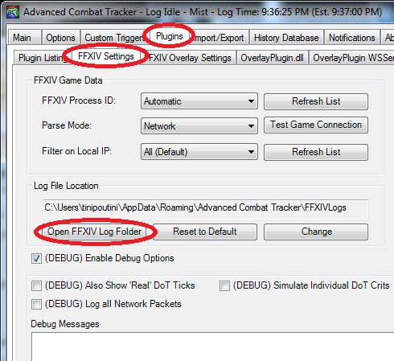
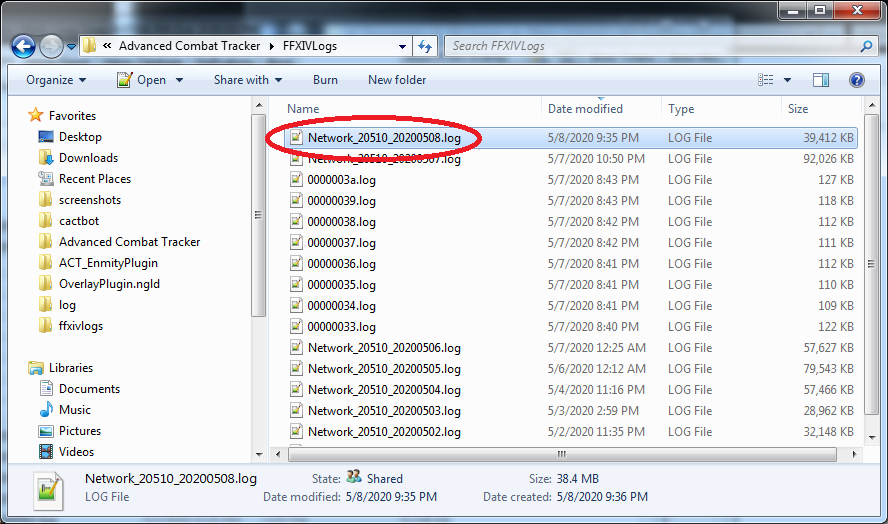

# Troubleshooting FAQ

- [General FFXIV ACT Troubleshooting](#general-ffxiv-act-troubleshooting)
- [Installation Testing](#installation-testing)
  - [Verify That Your Plugins Are in the Right Order](#verify-that-your-plugins-are-in-the-correct-order)
  - [Verify Your Language Settings Match](#verify-your-language-settings-match)
  - [Verify That You Have Added the Overlays You Want](#verify-that-you-have-added-the-overlays-you-want)
  - [Summerford Farms Raidboss Test](#summerford-farms-raidboss-test)
  - [Summerford Farms Provoke Test](#summerford-farms-provoke-test)
- [New Content Isn't Working](#new-content-isnt-working)
  - [Do Your Cactbot Plugin and Overlay Paths Match](#do-your-cactbot-plugin-and-overlay-paths-match)
  - [Has This Content Been Added to Cactbot](#has-this-content-been-added-to-cactbot)
- [Fixing Chat Log Problems](#fixing-chat-log-problems)
  - [Check Game Chat Log Filters](#check-game-chat-log-filters)
  - [Check FFXIV Plugin Filters](#check-ffxiv-plugin-filters)
  - [Check Dalamud Plugins](#check-dalamud-plugins)
  - [Check Your Network Log](#check-your-network-log)
- [Fixing Network Data Problems](#fixing-network-data-problems)
  - [Has the Game Just Updated?](#has-the-game-just-updated)
  - [Test Game Connection](#test-game-connection)
  - [Cactbot Stops Working Randomly](#cactbot-stops-working-randomly)
- [Problems During Cactbot Installation](#problems-during-cactbot-installation)
- [My TTS Isn't Working](#my-tts-isnt-working)
- [Places to Get Help](#places-to-get-help)
- [How to Find a Network Log](#how-to-find-a-network-log)

## General FFXIV ACT Troubleshooting

[This guide](https://github.com/OverlayPlugin/docs/blob/main/faq/README.md)
is an excellent FAQ for common FFXIV ACT Plugin and OverlayPlugin issues.

If you get an error that it can't find **FFXIV_ACT_Plugin.dll**, make sure the **FFXIV_ACT_Plugin.dll** is in the `%APPDATA%\Advanced Combat Tracker\Plugins` folder.
You can install **FFXIV_ACT_Plugin.dll** from the ACT Startup Wizard.

You should also verify that your OverlayPlugin is at least version 0.18.2.
Look at ACT -> Plugins -> Plugin Listing -> OverlayPlugin.dll.
Is the version 0.18.2 or earlier?
If so, follow <https://overlayplugin.github.io/OverlayPlugin/fork_update.html>

## Installation Testing

First, follow the [installation guide](../README.md#installing) for cactbot from the main readme.
Once done, check the following steps.

### Verify That Your Plugins Are in the Right Order

Open ACT -> Plugins -> Plugin Listing.
You should have `FFXIV_ACT_Plugin.dll`, `OverlayPlugin.dll`, and `CactbotOverlay.dll` in that order.

See: [this section](../README.md#plugin-load-order) for more information about load order.

### Verify Your Language Settings Match

Verify that the game language matches the FFXIV ACT Plugin language.
You can check the plugin language via ACT -> Plugins -> FFXIV ACT Plugin -> Language.
(Note: this may not be true for Chinese users.)

Raidboss should pick up the plugin language automatically.
It does not matter which cactbot display, alerts, or timeline language you have set
as these are all for display purposes.

### Verify That You Have Added the Overlays You Want

It is not enough to just add the cactbot plugin,
you also need to add an overlay for the parts of cactbot you want.
Commonly, most people add raidboss for alerts and timelines.

If you are not sure which overlays you have,
go to ACT -> Plugins -> OverlayPlugin.dll -> General and click "Copy Tech Support Info to Clipboard".
Paste this somewhere (like notepad) to look at.
It should list the overlays you think exist (e.g. raidboss for alerts and timelines).

One important note is that raidboss has three versions:

- combined (alerts and timelines)
- timeline only (just timeline, no alerts)
- alerts only (just alerts, no timeline)

A common use case is to add one overlay for timeline only and one overlay for alerts only.
If you are seeing timelines but not alerts or vice versa,
make sure you have the overlays you need.

See: [this section](../README.md#adding-overlays) for how to add cactbot overlays.

### Summerford Farms Raidboss Test

This test verifies that basic timelines and triggers are working
and your overlay has been added correctly.

To do a basic test of raidboss,
teleport to Summerford Farms.
Do a `/countdown 5`.

When the countdown ends,
a timeline should appear on your screen
and several alert messages should appear.
You can teleport to stop the timeline.

If this does not work,
see the [Fixing Chat Log Problems](#fixing-chat-log-problems) section.

### Summerford Farms Provoke Test

A second test to do for network data is to switch to a tank job.
Teleport to Summerford Farms again.
Use Provoke on a Striking Dummy.
You should see an alert trigger when you do this.

If this does not work,
see the [Fixing Network Data Problems](#fixing-network-data-problems) section.

## New Content Isn't Working

A common complaint that people have is that older content works in cactbot but not newer.
There are a number of reasons this could be the case:

### Do Your Cactbot Plugin and Overlay Paths Match

Check the cactbot plugin path in ACT -> Plugins -> Plugin Listing -> CactbotOverlay.dll -> Plugin Info -> FileName.
Then check the overlay URL via ACT -> Plugins -> OverlayPlugin.dll -> (name of a cactbot overlay, e.g. raidboss) -> URL.
Make sure the paths are the same.

If the plugin has a path including `cactbot/cactbot/` and the overlay has a path like `cactbot/cactbot-0.19.2/`
then you should remove and re-add your cactbot overlay.
You can do this via ACT -> Plugins -> OverlayPlugin.dll -> (name of the overlay to remove) -> Remove (button at the bottom).
Then hit New at the bottom to re-add it and select the same overlay type that it was.

Note: This will not remove your settings. Also, this should be a "one time" fix and in the future this won't happen again.

### Has This Content Been Added to Cactbot

It takes time and effort to add support for new content to cactbot.
If it just came out in the last week or few,
it's possible that there is not support for it yet.

Check <https://overlayplugin.github.io/cactbot/util/coverage/coverage.html> for the latest list of supported content.
It is possible that support for content has been added to cactbot but not released.
You can check the release notes for more details.

Additionally, if you are not playing in English,
make sure you check that ACT -> Plugins -> FFXIV ACT Plugin -> Parser Options is set to the language of your client.
Content that has just been added to cactbot may not have been translated yet
and so may not work immediately in non-English languages.
This is usually fixed by the next release.

## Fixing Chat Log Problems

The chat log is currently used by cactbot for a number of things.

The most common things are broken when the chat log has an issue is:

- zones sealing/unsealing to start dungeon timelines
- UCOB Nael dialog
- countdown messages (for the jobs countdown timer and Summerford Farms test)

### Check Game Chat Log Filters

FFXIV doesn't send chat messages to you that you have turned off due to a filter.
In game, go to System -> Character Configuration -> Log Window Settings -> Log Filters.
Pick a log number. It does not have to be the General log,
and could be some log that you don't ever look at.

Verify that these categories are enabled for at least one log:

- Announcements
  - System Messages
  - Echo
  - NPC Dialogue (Announcements)

### Check FFXIV Plugin Filters

The FFXIV plugin has a filter as well that is sometimes enabled.
Go to ACT -> Plugins -> FFXIV ACT Plugin.
Verify that `Hide Chat Log (for privacy)` is not clicked.

### Check Dalamud Plugins

There are a number of quicklauncher/Dalamud plugins that can mess with chat output.
If you are still having issues, try launching the game without quicklauncher.
If this fixes the issue, then one of your Dalamud plugins is at fault.
Figure out which one, and disable it or configure it differently.

### Check Your Network Log

One final check here is to look at the network log file from ACT.
You can find your network log [with these steps](#how-to-find-a-network-log).

In the network log,
you can see if the lines that cactbot is looking for appears in the file
or have been modified by Dalamud plugins.
Chat log lines start with `00`.

If you need an example to try,
queue into Susano normal (The Pool of Tribute trial, level 63) unsynced.
Open ACT. Do a `/countdown 5`, pull the boss, and then wipe.

In your network log, you should be able to find something like each of the following lines (not exact):

```text
00|2023-11-29T11:55:14.0000000-08:00|00B9||Battle commencing in 5 seconds! (Your Name)|0cb8cd44ec6d6723
00|2023-11-29T11:46:08.0000000-08:00|0044|Susano|Let the revels begin!|8cfb1aec4563d935
```

## Fixing Network Data Problems

### Has the Game Just Updated?

If the game has patched recently,
you need to wait for the ACT FFXIV Plugin to update before anything will work.
Even if cactbot has done a release, this is not enough.

### Test Game Connection

Verify your firewall rules by going to ACT -> Plugins -> FFXIV ACT Plugin -> Test Game Connection.
You should get a notification that says something like
`Success: All FFXIV memory signatures detected successfully, and Network data is available.`.

If you do not get this message, ask in the [FFXIV ACT discord](#places-to-get-help) for help.

### Verify DPS Parsing

Even if the game connection works, that doesn't mean everything is correct.
If dps parsing isn't working, then cactbot triggers will likely not work either.

Verify dps parsing works.
Open ACT.
Go hit a striking dummy for 10 seconds.
If you have a dps overlay, numbers should appear.
Regardless of a dps overlay, if you go to ACT -> Main and click on the encounter,
then you should see a dps chart.

If you don't see dps charts,
make sure you have enabled Deucalion via
ACT -> Plugins -> FFXIV ACT Plugin -> Inject and use Deucalion for network data.

### Cactbot Stops Working Randomly

If cactbot and dps parsing works properly and then stops,
then you should enable Deucalion via
ACT -> Plugins -> FFXIV ACT Plugin -> Inject and use Deucalion for network data.

Clicking this option will also allow you to start ACT after the game has started.

## Problems During Cactbot Installation

If you get an error in the OverlayPlugin console similar to `System.MissingMethodException: Method not found: '!!0[] System.Array.Empty()` then you have installed the wrong .NET framework version.  Please install the [.NET Framework](https://www.microsoft.com/net/download/framework) version 4.6.1 or above.

If you get an error that says `Plugin Load Failure` and `The downloaded file did not contain a plugin that could be loaded`,
there could be several potential issues.

- Make sure you have [installed OverlayPlugin](https://github.com/OverlayPlugin/cactbot#install-overlayplugin).
- Check your OverlayPlugin version in **Plugins** -> **Plugin Listing** -> **OverlayPlugin.dll**.
If this is not the same version as [this release](https://github.com/OverlayPlugin/OverlayPlugin/releases/latest),
then remove it and re-follow the [installation instructions](https://github.com/OverlayPlugin/cactbot#install-overlayplugin).
- Make sure you are running x64 ACT (`Advanced Combat Tracker.exe`) and not x86 ACT (`ACTx86.exe`).
- Finally, make sure you have reloaded ACT once you have installed OverlayPlugin.

If you get an error similar to
`Invalid Plugin: This assembly does not have a class that implements ACT's plugin interface, or scanning the assembly threw an error.`
or
`Load Error: Method 'LoadConfig' in type 'CactbotEventSource' etc etc does not have an implementation`
then you should make sure that `CactbotOverlay.dll` is listed after `OverlayPlugin.dll` in
**Plugins** -> **Plugin Listing**.

## My TTS Isn't Working

Cactbot uses ACT for Text to Speech (TTS).
If your TTS isn't working, then ACT is likely not set up properly.
If you are not using some custom plugin like yukkuri etc,
the default ACT TTS settings are in ACT -> Options -> Sound Settings -> Text to Speech.

If you want to test TTS with cactbot, you can use the [test overlay](#test-module).
If you add this overlay and then in game type `/echo tts:thing to say` it will use TTS to play it.

If this does not work, verify that you see the echo line in game.
See: [Fixing Chat Log Problems](#fixing-chat-log-problems).

## Places to Get Help

- ask in the [FFXIV ACT discord](https://discord.gg/ahFKcmx) #troubleshooting channel
- open a [github issue](https://github.com/OverlayPlugin/cactbot/issues)

It is highly recommended that you ask in the FFXIV ACT discord first for most troubleshooting issues.
You should also read the #troubleshooting channel pins first.
Pasting OverlayPlugin's tech support info is also a lot of help in tracking down issues.
Go to ACT -> Plugins -> OverlayPlugin.dll -> General and click "Copy Tech Support Info to Clipboard" to find it.

## How to Find a Network Log

If you are having issues with triggers or timelines,
it can be useful to attach a network log from ACT
so that the [network logs](LogGuide.md#network-log-lines)
can be replayed and investigated for errors.

To find your network logs, go to the **Plugins** tab in ACT,
click the **FFXIV Settings** button,
and then click **Open FFXIV Log Folder**.



This will open up a folder window with files in it.
Select a file named something like **Network_etc.log**.
The files are named with your FFXIV ACT Plugin version and the date.



These files are often large, so zip them up first.

You can attach these to github issues directly.
Alternatively, find some file hosting site,
upload the files there,
and then attach the link.

If you want to split a log to only include a particular fight,
you can use the [log splitter](https://overlayplugin.github.io/cactbot/util/logtools/splitter.html)
by dragging a network log file to the page and selecting the fights you want.

If you are trying to debug something, it is usually better to not split the log.
