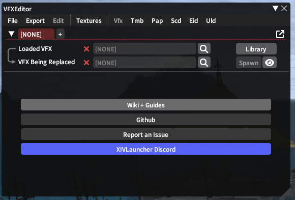
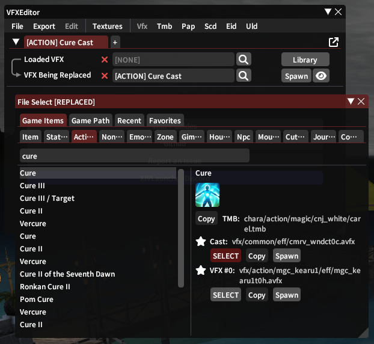
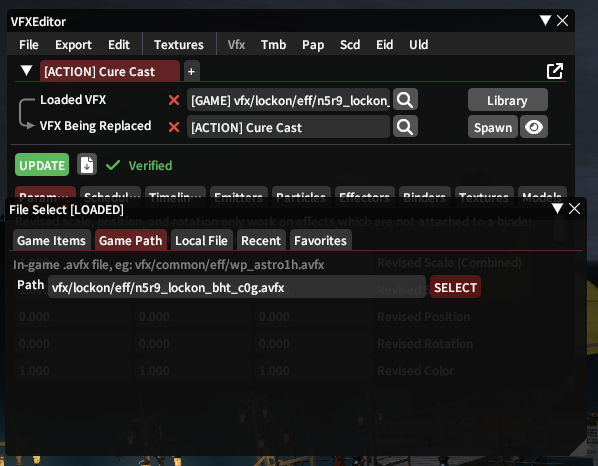
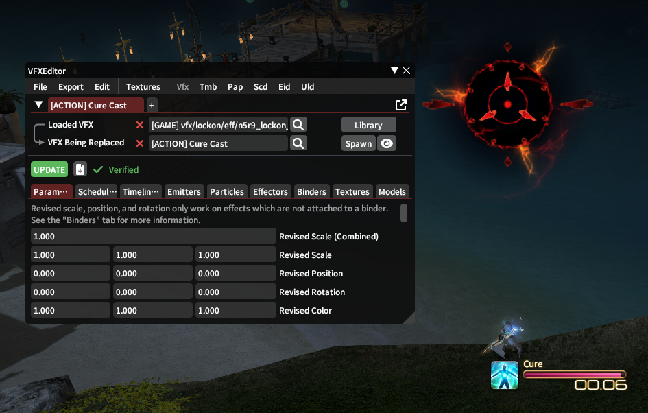

# Headmarker Guide

This is a guide to finding the real ids for "headmarkers",
i.e. the visual that appears above your player's head when you need to spread, stack, etc.

cactbot calls them "headmarkers",
e.g. `NetRegexes.headMarker()`.
The FFXIV parsing plugin calls them "TargetIcon",
e.g. `[21:40:13.596] TargetIcon 1B:4002ADD7:Arcane Cylinder:0000:0000:00B5:0000:0000:0000`.
FFXIV itself calls them "Lockon",
e.g. <https://github.com/xivapi/ffxiv-datamining/blob/master/csv/Lockon.csv>.

This guide will call them "headmarkers" from here on out.

## History and Motivation

During TEA,
Square Enix changed headmarkers to have a per-instance offset in certain content.
This now happens in all ultimates, extremes, and savage raids.
Once the content is no longer current,
sometimes the offsets are then removed.

This same thing happened with ability ids as well during o4s.
However, the FFXIV parsing plugin and fflogs cannot function without real ability ids,
and so the parsing plugin takes care of this itself.
Headmarkers are not parsing related,
and so headmarker offsets are left to downstream developers to fix themselves.

The offset is sent to the client when zoning into the instance,
and so is the same for every pull while in the same instance.

## Handling this in cactbot

cactbot chooses to handle this by trying to figure out the true headmarker ids.
This is so that it's easy to find different content using the same id,
e.g. limit cut starting at `004F` (usually, but not always).
It's also easier to double check that the values are correct.
Ideally, when finding headmarkers, please leave a comment with the full avfx path.

cactbot handles offsets by looking for headmarkers,
recording the first id it finds,
and then comparing to the expected first headmarker to calculate the offset.

### No Offsets

If the encounter does not have headmarker offsets,
please use headmarker ids directly in triggers,
e.g. [p9n](https://github.com/OverlayPlugin/cactbot/blob/7b904e35c7d678013d229080c858f19d35510ac1/ui/raidboss/data/06-ew/raid/p9n.ts#L33-L38).

### Same first headmarker

Most of the time,
if the encounter does have headmarker offsets,
the first headmarker id will always be the same.

Most trigger sets do something like [p11s](https://github.com/OverlayPlugin/cactbot/blob/3ca3589/ui/raidboss/data/06-ew/raid/p11s.ts).

There's a helper function to set the headmarker offset if it's not found,
and return the true headmarker id.

```typescript
// Helper functions.
const firstHeadmarker = parseInt(headmarkers.dike, 16);

const getHeadmarkerId = (data: Data, matches: NetMatches['HeadMarker']) => {
  if (data.decOffset === undefined)
    data.decOffset = parseInt(matches.id, 16) - firstHeadmarker;
  return (parseInt(matches.id, 16) - data.decOffset).toString(16).toUpperCase().padStart(4, '0');
};
```

There's usually also a trigger at the top of the file to always try to set the offset.
In the past there's been bugs where `getHeadmarkerId` has been used in `condition` functions.
(See the P9S defamation example below for how the `getHeadmarkerId` call might be skipped.)

```typescript
    {
      id: 'P11S Headmarker Tracker',
      type: 'HeadMarker',
      netRegex: {},
      condition: (data) => data.decOffset === undefined,
      // Unconditionally set the first headmarker here so that future triggers are conditional.
      run: (data, matches) => getHeadmarkerId(data, matches),
    },
```

Then, any later headmarker trigger has to match all headmarker lines,
and use `getHeadmarkerId` to figure out the correct id.
It's definitely a little bit cumbersome and inefficient, but that's what we got.

```typescript
    {
      id: 'P9S Defamation',
      type: 'HeadMarker',
      netRegex: {},
      condition: (data, matches) => {
        return data.me === matches.target &&
          getHeadmarkerId(data, matches) === headmarkers.defamation;
      },
      alarmText: (_data, _matches, output) => output.defamation!(),
      // etc
```

### Different first headmarker

In rare cases, the first headmarker is not consistent.

As cactbot resets all trigger info (including recorded headmarker offset) on wipe,
any trigger file must handle the first headmarker from any door boss and final boss simultaneously.

For example, [P12S](https://github.com/OverlayPlugin/cactbot/blob/4700770/ui/raidboss/data/06-ew/raid/p12s.ts#L159-L179)
has a door boss with two different first headmarkers (bottom left / bottom right wing)
and a final boss with one first headmarker.

See that file for how that can be solved.

## Lockon table

All visual effects are avfx game data files and are referenced by the `Lockon` table.

You can `exd Lockon` from a local copy of [SaintCoinach](https://github.com/xivapi/SaintCoinach),
or alternatively you can browse the Lockon table online here: <https://github.com/xivapi/ffxiv-datamining/blob/master/csv/Lockon.csv>

Headmarkers are 2 byte hex values,
and the `key` field in the `Lockon` is the decimal representation of that hex value.

Here is some code from: <https://github.com/OverlayPlugin/cactbot/blob/main/ui/raidboss/data/06-ew/raid/p9s.ts>

```typescript
const headmarkers = {
  // vfx/lockon/eff/tank_lockonae_0m_5s_01t.avfx
  dualityOfDeath: '01D4',
  // vfx/lockon/eff/m0361trg_a1t.avfx (through m0361trg_a8t)
  limitCut1: '004F',
  limitCut2: '0050',
  limitCut3: '0051',
  limitCut4: '0052',
  limitCut5: '0053',
  limitCut6: '0054',
  limitCut7: '0055',
  limitCut8: '0056',
  // vfx/lockon/eff/r1fz_skywl_s9x.avfx
  defamation: '014A',
  // vfx/lockon/eff/n5r9_lockon_bht_c0g.avfx
  cometMarker: '01B3',
} as const;
```

The comet marker (that appears on one of the two unbroken meteors during Charybdis in P9S) is `01B3`.
`0x01B3` = 435 in decimal.
In the [LockOn table](https://github.com/xivapi/ffxiv-datamining/blob/master/csv/Lockon.csv#L439),
you can find that key 435 has the string `n5r9_lockon_bht_c0g`.

This corresponds to the game asset `vfx/lockon/eff/n5r9_lockon_bht_c0g.avfx`.
My understanding is that all headmarker effects have this `avfx` extension
and are in the `vfx/lockon/eff/` game directory.

## How to test headmarkers in game

In order to verify that you have the correct headmarker id,
you can use VFXEditor.

Install [FFXIVQuickLauncher](https://github.com/goatcorp/FFXIVQuickLauncher).

Install the [VFXEditor plugin](https://github.com/0ceal0t/Dalamud-VFXEditor).

Type `/vfxedit` to start.



Pick a skill to replace that's easy to do in game, like Cure 1.



Now, type a vfx to replace it with.



Finally, cast cure and observe the different animation.



Headmarkers on mobs (see: p12s wings, this meteor marker) may have odd positions and rotations.

## How to Find True Ids

Mostly this is about sleuthing it out.

Here's some suggestions on things to consider:

- look for new Lockon entries that weren't there in previous patches
- check if normal mode ids still apply (e.g. p12s wings)
- check if the same ids from previous encounters apply (e.g. limit cut ids)
- read names in the Lockon table and try to make connections, e.g. `m0515_turning_right01c` is the orange clockwise laser rotation

## Future Work

If somebody tracked down the network data and game code to find the actual offset and math,
then OverlayPlugin could emit a custom log line for the offset
or custom log lines with adjusted headmarker ids.

Barring that, it's also possible that OverlayPlugin could handle all of the
"first headmarker" tracking itself per zone in C# code and emit custom log lines.

Finally, it'd be nice if somebody could figure out how to automatically extract avfx into gifs
and then we could have an online library of headmarker ids mapped to visuals.
