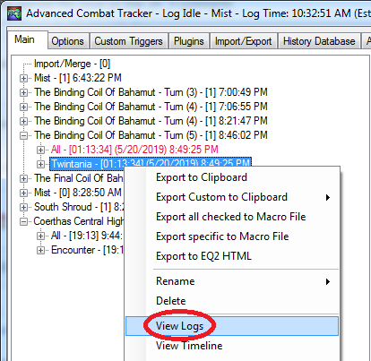
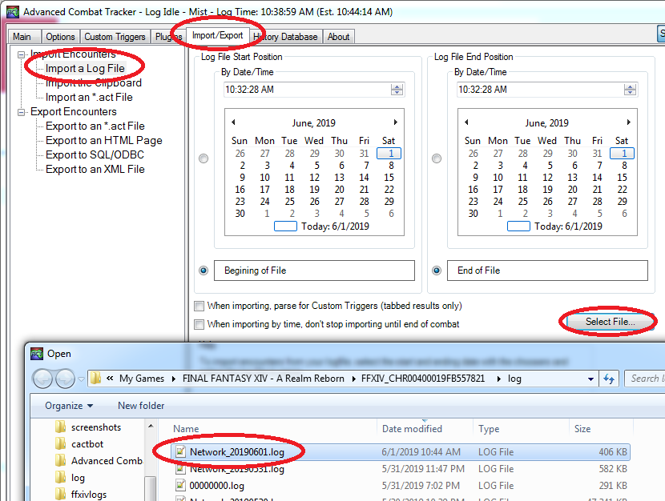
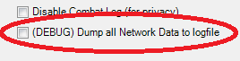
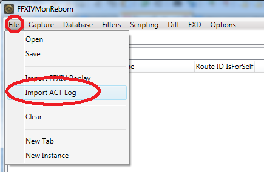
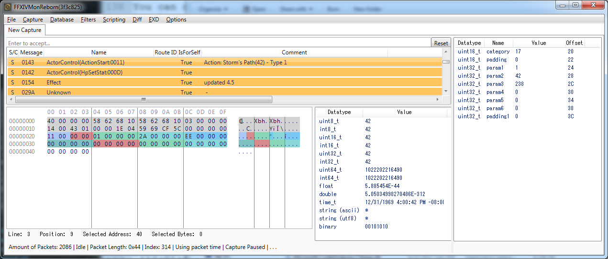
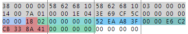

<!-- Disable MD024, duplicate headers are under different subheaders -->
<!-- Disable MD033, no inline HTML for anchors on headings and diagrams -->
<!-- markdownlint-disable MD024 MD033 -->
# Log Lines and Triggers

This is intended to be a comprehensive guide to log lines
for folks who want to write ACT triggers for ff14.

This guide was last updated for:

- [FF14](https://na.finalfantasyxiv.com/lodestone/special/patchnote_log/) Patch 5.58
- [FFXIV Plugin](https://github.com/ravahn/FFXIV_ACT_Plugin/releases) Patch 2.6.1.6

## TOC

<!-- AUTO-GENERATED-CONTENT:START (TOC) -->
- [Data Flow](#data-flow)
  - [Viewing logs after a fight](#viewing-logs-after-a-fight)
  - [Importing an old fight](#importing-an-old-fight)
  - [Importing into ffxivmon](#importing-into-ffxivmon)
- [Glossary of Terms](#glossary-of-terms)
  - [Network Data](#network-data)
  - [Network Log Lines](#network-log-lines)
  - [ACT Log Lines](#act-log-lines)
  - [Game Log Lines](#game-log-lines)
  - [Object/Actor/Entity/Mob/Combatant](#objectactorentitymobcombatant)
  - [Object ID](#object-id)
  - [Ability ID](#ability-id)
- [ACT Log Line Overview](#act-log-line-overview)
  - [Line 00 (0x00): LogLine](#line-00-0x00-logline)
    - [Structure](#structure)
    - [Regexes](#regexes)
    - [Examples](#examples)
    - [Don't Write Triggers Against Game Log Lines](#dont-write-triggers-against-game-log-lines)
  - [Line 01 (0x01): ChangeZone](#line-01-0x01-changezone)
    - [Structure](#structure-1)
    - [Regexes](#regexes-1)
    - [Examples](#examples-1)
  - [Line 02 (0x02): ChangePrimaryPlayer](#line-02-0x02-changeprimaryplayer)
    - [Structure](#structure-2)
    - [Examples](#examples-2)
  - [Line 03 (0x03): AddCombatant](#line-03-0x03-addcombatant)
    - [Structure](#structure-3)
    - [Regexes](#regexes-2)
    - [Examples](#examples-3)
  - [Line 04 (0x04): RemoveCombatant](#line-04-0x04-removecombatant)
    - [Structure](#structure-4)
    - [Regexes](#regexes-3)
    - [Examples](#examples-4)
  - [Line 11 (0x0B): PartyList](#line-11-0x0b-partylist)
    - [Structure](#structure-5)
    - [Examples](#examples-5)
  - [Line 12 (0x0C): PlayerStats](#line-12-0x0c-playerstats)
    - [Structure](#structure-6)
    - [Regexes](#regexes-4)
    - [Examples](#examples-6)
  - [Line 20 (0x14): NetworkStartsCasting](#line-20-0x14-networkstartscasting)
    - [Structure](#structure-7)
    - [Regexes](#regexes-5)
    - [Examples](#examples-7)
  - [Line 21 (0x15): NetworkAbility](#line-21-0x15-networkability)
    - [Structure](#structure-8)
    - [Regexes](#regexes-6)
    - [Examples](#examples-8)
    - [Ability Flags](#ability-flags)
    - [Ability Damage](#ability-damage)
    - [Special Case Shifts](#special-case-shifts)
    - [Ability Examples](#ability-examples)
  - [Line 22 (0x16): NetworkAOEAbility](#line-22-0x16-networkaoeability)
  - [Line 23 (0x17): NetworkCancelAbility](#line-23-0x17-networkcancelability)
    - [Structure](#structure-9)
    - [Examples](#examples-9)
  - [Line 24 (0x18): NetworkDoT](#line-24-0x18-networkdot)
    - [Structure](#structure-10)
    - [Regexes](#regexes-7)
    - [Examples](#examples-10)
  - [Line 25 (0x19): NetworkDeath](#line-25-0x19-networkdeath)
    - [Structure](#structure-11)
    - [Regexes](#regexes-8)
    - [Examples](#examples-11)
  - [Line 26 (0x1A): NetworkBuff](#line-26-0x1a-networkbuff)
    - [Structure](#structure-12)
    - [Regexes](#regexes-9)
    - [Examples](#examples-12)
  - [Line 27 (0x1B): NetworkTargetIcon (Head Marker)](#line-27-0x1b-networktargeticon-head-marker)
    - [Structure](#structure-13)
    - [Regexes](#regexes-10)
    - [Examples](#examples-13)
    - [Head Marker IDs](#head-marker-ids)
  - [Line 28 (0x1C): NetworkRaidMarker (Floor Marker)](#line-28-0x1c-networkraidmarker-floor-marker)
    - [Structure](#structure-14)
    - [Examples](#examples-14)
    - [Combatant Marker Codes](#combatant-marker-codes)
  - [Line 29 (0x1D): NetworkTargetMarker (Player Marker)](#line-29-0x1d-networktargetmarker-player-marker)
    - [Structure](#structure-15)
    - [Examples](#examples-15)
    - [Floor Marker Codes](#floor-marker-codes)
  - [Line 30 (0x1E): NetworkBuffRemove](#line-30-0x1e-networkbuffremove)
    - [Structure](#structure-16)
    - [Regexes](#regexes-11)
    - [Examples](#examples-16)
  - [Line 31 (0x1F): NetworkGauge](#line-31-0x1f-networkgauge)
    - [Structure](#structure-17)
    - [Examples](#examples-17)
  - [Line 32 (0x20): NetworkWorld](#line-32-0x20-networkworld)
  - [Line 33 (0x21): Network6D (Actor Control)](#line-33-0x21-network6d-actor-control)
    - [Structure](#structure-18)
    - [Regexes](#regexes-12)
    - [Examples](#examples-18)
  - [Line 34 (0x22): NetworkNameToggle](#line-34-0x22-networknametoggle)
    - [Structure](#structure-19)
    - [Regexes](#regexes-13)
    - [Examples](#examples-19)
  - [Line 35 (0x23): NetworkTether](#line-35-0x23-networktether)
    - [Structure](#structure-20)
    - [Regexes](#regexes-14)
    - [Examples](#examples-20)
  - [Line 36 (0x24): LimitBreak](#line-36-0x24-limitbreak)
    - [Structure](#structure-21)
    - [Examples](#examples-21)
  - [Line 37 (0x25): NetworkActionSync](#line-37-0x25-networkactionsync)
  - [Line 38 (0x26): NetworkStatusEffects](#line-38-0x26-networkstatuseffects)
    - [Structure](#structure-22)
    - [Regexes](#regexes-15)
    - [Examples](#examples-22)
  - [Line 39 (0x27): NetworkUpdateHP](#line-39-0x27-networkupdatehp)
    - [Structure](#structure-23)
    - [Examples](#examples-23)
  - [Line 40 (0x28): Map](#line-40-0x28-map)
    - [Structure](#structure-24)
    - [Regexes](#regexes-16)
    - [Examples](#examples-24)
  - [Line 41 (0x29): SystemLogMessage](#line-41-0x29-systemlogmessage)
    - [Structure](#structure-25)
    - [Regexes](#regexes-17)
    - [Examples](#examples-25)
  - [Line 42 (0x2A): StatusList3](#line-42-0x2a-statuslist3)
    - [Structure](#structure-26)
    - [Examples](#examples-26)
  - [Line 251 (0xFB): Debug](#line-251-0xfb-debug)
  - [Line 252 (0xFC): PacketDump](#line-252-0xfc-packetdump)
  - [Line 253 (0xFD): Version](#line-253-0xfd-version)
  - [Line 254 (0xFE): Error](#line-254-0xfe-error)
  - [Line 257 (0x100): MapEffect](#line-257-0x101-mapeffect)
    - [Structure](#structure-27)
    - [Regexes](#regexes-18)
    - [Examples](#examples-27)
<!-- AUTO-GENERATED-CONTENT:END -->

## Data Flow


<details>
<summary></summary>
data_flow
  digraph G {
    size ="4,4";
    ff14 [label="ff14 servers"]
    ff14 -> ACT [label="network data"]
    network [label="network log files"]
    ACT [label="ACT + ffxiv plugin",shape=box,penwidth=3]
    ACT -> network [label="write to disk"]
    fflogs
    network -> fflogs [label="upload"]
    network -> ffxivmon [label="import"]
    network -> ACT [label="import"]
    network -> util [label="process"]
    util [label="cactbot util scripts"]
    plugins [label="triggers, ACT plugins"]
    ACT -> plugins [label="ACT log lines"]
    ACT -> plugins [label="network log lines"]
  }
data_flow
</details>

### Viewing logs after a fight

If you have ACT open during a fight, then it will generate logs.
These logs will be trimmed to the start and end of combat.

To see the logs, click on the **Main** tab,
expand the zone you care about,
right click on the encounter you want,
then select **View Logs**.



The **All** entry includes all the encounters in a zone and cannot be viewed.
You must view individual encounters.

The window that pops up has the text that triggers can be made against.
This is usually the best way to search through and find the text that you want to make a trigger for.

### Importing an old fight

Sometimes you have to close ACT, but you want to look at old fights.
Or, somebody else sends you a log, and you want to make triggers from it.

To do this, click the **Import/Export** tab,
click on **Import a Log File**,
click on **Select File...**
select the **Network_plugin_date.log** log file,
(where `plugin` and `date` are the FFXIV plugin version and day)
and finally click the **YOU** button.



This will create encounters whose [logs you can view](#viewing-logs-after-a-fight).

### Importing into ffxivmon

If you want to dig into the network data itself, ffxivmon is a great tool.

To create a log file suitable for ffxivmon,
first turn on the **(DEBUG) Dump all Network Data to logfile** setting in ACT.



Then, run an encounter in game with ACT running.
Once you're done, import that network log file into ffxivmon.



Now, you can walk through and investigate the network data directly.



## Glossary of Terms

### Network Data

This is the raw packet dump sent from ff14 servers to your computer.
This data is processed both by the game itself as well as by the ffxiv plugin to
produce network log lines.



Folks writing triggers generally do not have to worry about raw packet data and
so this document does not focus very much on this type of data.

### Network Log Lines

These represent the lines that the ffxiv plugin writes to disk in
**Network_22009_20210801.log** files in your log directory.
These lines are still processed and filtered by the ffxiv plugin,
and are (mostly) not raw network data.

Here are some example network log lines:

```log
21|2019-05-31T21:14:56.8980000-07:00|10532971|Tini Poutini|DF9|Fire IV|40002F21|Zombie Brobinyak|150003|3B9D4002|1C|DF98000|0|0|0|0|0|0|0|0|0|0|0|0|104815|348652|12000|12000|1000|1000|-767.7882|156.939|-672.0446|26285|28784|13920|15480|1000|1000|-771.8156|157.1111|-671.3281||8eaa0245ad01981b69fc1af04ea8f9a1
30|2019-05-31T20:02:41.4560000-07:00|6b4|Boost|0.00|1069C23F|Potato Chippy|1069C23F|Potato Chippy|00|3394|3394||4f7b1fa11ec7a2746a8c46379481267c
20|2019-05-31T20:02:41.4660000-07:00|105E3321|Tater Tot|2C9D|Peculiar Light|105E3321|Tater Tot||c375d8a2d1cf48efceccb136584ed250
```

Data on network log lines is separated by vertical braces, i.e. `|`.
Network log lines also contain the hash of that line at the end.
The log line type itself is in decimal, e.g. aoe abilities are on lines that begin with `22|`.
The equivalent [ACT log line](#act-log-lines) would be written as the hex type `0x16`, i.e. `NetworkAOEAbility`.

The ffxiv plugin does not write the ACT log lines that plugins interact with
to disk.

The network log lines are used by some tools, such as:

- fflogs uploader
- ffxivmon
- cactbot make_timeline utility

In the past,
cactbot used to use [ACT log lines](#act-log-lines) for all triggers
but has switched to using network log lines instead
as they have more information.
Timelines still use ACT log lines for syncing (for now).

If you [import a network log file into ACT](#importing-an-old-fight),
then it you can view the ACT log lines in the fight.

### ACT Log Lines

These are the log lines that come out of the ffxiv plugin at runtime and are
also exposed to plugins for triggers.
These are what the [View Logs](#viewing-logs-after-a-fight) option in ACT shows.

Data in ACT log lines is separated by colons, i.e. `:`.
The log line type is in hex.

Here is an example:

```log
[21:16:44.288] 15:10532971:Potato Chippy:9C:Scathe:40001299:Striking Dummy:750003:90D0000:1C:9C8000:0:0:0:0:0:0:0:0:0:0:0:0:2778:2778:0:0:1000:1000:-653.9767:-807.7275:31.99997:26945:28784:6720:15480:1000:1000:-631.5208:-818.5244:31.95173:
```

### Game Log Lines

A game log line is a specific type of ACT log line with type `00`.
These log lines also appear directly in your chat windows in game,
possibly in the Battle Log tab.
Try to [avoid writing triggers](#dont-write-triggers-against-game-log-lines) using these lines.

See: [Line 00](#line00) for examples.

### Object/Actor/Entity/Mob/Combatant

These are all words used synonymously in this document to refer to an object
in the game that can use abilities and has stats.
This could be the player, Bahamut, Eos, a Striking Dummy.

### Object ID

Object ids are 4 byte identifiers used for all types of objects.

Player ids always start with the byte `10`,
e.g. `1069C23F` or `10532971`.

Enemy and pet ids always start with the byte `40`,
e.g. `4000A848` or `4000A962`.

For `NetworkAOEAbility` lines that don't affect anybody, e.g. a Titan landslide that somehow nobody stands in,
this is represented as hitting the id `E0000000` (and a blank name).

One thing to note is that in most raids,
there are many mobs in the scene with the same name.
For example, in t13, there are about twenty Bahamut Prime mobs in the zone,
most of which are invisible.
You can often differentiate these by HP values (see [AddCombatant](#line03) log lines).
Often these invisible mobs are used as the damaging actors,
which is why in UWU Titan Phase, both Garuda and Titan use Rock Throw to put people in jails.

### Ability ID

Although ff14 differentiates between abilities and spells,
this document uses these words interchangeably.
All actions taken by a player or an enemy are "abilities" and have a unique 4 byte id.

You can use xivapi.com to look up a particular action, as sometimes these are
listed as "Unknown" from the ffxiv plugin if it hasn't updated yet.
For example, Fire IV has the ability id 0xDF9 = 3577,
so this link will give you more information about it:
<https://xivapi.com/action/3577?columns=ID,Name,Description,ClassJobCategory.Name>

This works for both players and enemies, abilities and spells.

## ACT Log Line Overview

Here's an example of a typical ACT log line:
`[12:01:48.293] 21:80034E29:40000001:E10:00:00:00`.
This log line happens to be the [actor control line](#line33) (type=`0x21`) for commencing Titan Extreme.

ACT log lines lines always start with the time in square brackets.
This time is formatted to be in your local time zone.
The time is followed with a hex value (in this case 0x21) that indicates the type of the line it is.
These types are internal to the ffxiv plugin
and represent its conversion of network data and memory data into discrete events.

The rest of the data in the line needs to be interpreted based on what type it is.
See the following sections that describe each line.

Many line types can have missing combatant names.
[ChangePrimaryPlayer](#line02) and [AddCombatant](#line03) lines should always have combatant names.

<a name="line00"></a>

### Line 00 (0x00): LogLine

These are what this document calls "game log lines".
Because these are not often used for triggers
(other than `0839` and `0044` messages),
the full set of LogTypes is not well-documented.

(Pull requests welcome!)

<!-- AUTO-GENERATED-CONTENT:START (logLines:type=GameLog&lang=en-US) -->

#### Structure

```log
Network Log Line Structure:
00|[timestamp]|[code]|[name]|[line]

ACT Log Line Structure:
[timestamp] ChatLog 00:[code]:[name]:[line]
```

#### Regexes

```log
Network Log Line Regex:
^(?<type>00)\|(?<timestamp>[^|]*)\|(?<code>[^|]*)\|(?<name>[^|]*)\|(?<line>[^|]*)\|

ACT Log Line Regex:
(?<timestamp>^.{14}) ChatLog (?<type>00):(?<code>[^:]*):(?<name>[^:]*):(?<line>[^:]*)(?:$|:)
```

#### Examples

```log
Network Log Line Examples:
00|2021-04-26T14:12:30.0000000-04:00|0839||You change to warrior.|d8c450105ea12854e26eb687579564df
00|2021-04-26T16:57:41.0000000-04:00|0840||You can now summon the antelope stag mount.|caa3526e9f127887766e9211e87e0e8f
00|2021-04-26T14:17:11.0000000-04:00|0B3A||You defeat the embodiment.|ef3b7b7f1e980f2c08e903edd51c70c7
00|2021-04-26T14:12:30.0000000-04:00|302B||The gravity node uses Forked Lightning.|45d50c5f5322adf787db2bd00d85493d
00|2021-04-26T14:12:30.0000000-04:00|322A||The attack misses.|f9f57724eb396a6a94232e9159175e8c
00|2021-07-05T18:01:21.0000000-04:00|0044|Tsukuyomi|Oh...it's going to be a long night.|1a81d186fd4d19255f2e01a1694c7607

ACT Log Line Examples:
[14:12:30.000] ChatLog 00:0839::You change to warrior.
[16:57:41.000] ChatLog 00:0840::You can now summon the antelope stag mount.
[14:17:11.000] ChatLog 00:0B3A::You defeat the embodiment.
[14:12:30.000] ChatLog 00:302B::The gravity node uses Forked Lightning.
[14:12:30.000] ChatLog 00:322A::The attack misses.
[18:01:21.000] ChatLog 00:0044:Tsukuyomi:Oh...it's going to be a long night.
```

<!-- AUTO-GENERATED-CONTENT:END -->

#### Don't Write Triggers Against Game Log Lines

There are a number of reasons to avoid basing triggers on game log lines:

- can show up later than ACT log lines (often up to half a second)
- inconsistent text (gains effect vs suffers effect, begins casting vs readies, you vs player name)
- often vague (the attack misses)
- can change spelling at the whim of SquareEnix

Instead, the recommendation is to base your triggers on ACT log lines that are not type `0x00`.
Prefer using [NetworkBuff](#line26) line instead of "suffers the effect" game log lines.
Prefer using the [NetworkStartsCasting](#line20) "starts using" line instead of the "readies" or "begins casting" game log lines.

At the moment, there are some cases where you must use game log lines,
such as sealing and unsealing of zones, or boss rp text for phase transitions.

Note:
There are examples where [NetworkStartsCasting](#line20) lines show up
after the corresponding `00` "readies" line,
but it is on the order of tens of milliseconds
and does not consistently show up first.
[NetworkAbility](#line21) lines always seem to show up before the `00` "uses" lines.

<a name="line01"></a>

### Line 01 (0x01): ChangeZone

This message is sent when first logging in and whenever the zone is changed.

<!-- AUTO-GENERATED-CONTENT:START (logLines:type=ChangeZone&lang=en-US) -->

#### Structure

```log
Network Log Line Structure:
01|[timestamp]|[id]|[name]

ACT Log Line Structure:
[timestamp] Territory 01:[id]:[name]
```

#### Regexes

```log
Network Log Line Regex:
^(?<type>01)\|(?<timestamp>[^|]*)\|(?<id>[^|]*)\|(?<name>[^|]*)\|

ACT Log Line Regex:
(?<timestamp>^.{14}) Territory (?<type>01):(?<id>[^:]*):(?<name>[^:]*)(?:$|:)
```

#### Examples

```log
Network Log Line Examples:
01|2021-04-26T14:13:17.9930000-04:00|326|Kugane Ohashi|b9f401c0aa0b8bc454b239b201abc1b8
01|2021-04-26T14:22:04.5490000-04:00|31F|Alphascape (V2.0)|8299b97fa36500118fc3a174ed208fe4

ACT Log Line Examples:
[14:13:17.993] Territory 01:326:Kugane Ohashi
[14:22:04.549] Territory 01:31F:Alphascape (V2.0)
```

<!-- AUTO-GENERATED-CONTENT:END -->

<a name="line02"></a>

### Line 02 (0x02): ChangePrimaryPlayer

This redundant message follows every [ChangeZone](#line01) message to indicate the name of the player.

<!-- AUTO-GENERATED-CONTENT:START (logLines:type=ChangedPlayer&lang=en-US) -->

#### Structure

```log
Network Log Line Structure:
02|[timestamp]|[id]|[name]

ACT Log Line Structure:
[timestamp] ChangePrimaryPlayer 02:[id]:[name]
```

#### Examples

```log
Network Log Line Examples:
02|2021-04-26T14:11:31.0200000-04:00|10FF0001|Tini Poutini|5b0a5800460045f29db38676e0c3f79a
02|2021-04-26T14:13:17.9930000-04:00|10FF0002|Potato Chippy|34b657d75218545f5a49970cce218ce6

ACT Log Line Examples:
[14:11:31.020] ChangePrimaryPlayer 02:10FF0001:Tini Poutini
[14:13:17.993] ChangePrimaryPlayer 02:10FF0002:Potato Chippy
```

<!-- AUTO-GENERATED-CONTENT:END -->

<a name="line03"></a>

### Line 03 (0x03): AddCombatant

This message is sent when a new object is added to the scene or
becomes close enough to the player that they can view its actions.

<!-- AUTO-GENERATED-CONTENT:START (logLines:type=AddedCombatant&lang=en-US) -->

#### Structure

```log
Network Log Line Structure:
03|[timestamp]|[id]|[name]|[job]|[level]|[ownerId]|[worldId]|[world]|[npcNameId]|[npcBaseId]|[currentHp]|[hp]|[currentMp]|[mp]|[?]|[?]|[x]|[y]|[z]|[heading]

ACT Log Line Structure:
[timestamp] AddCombatant 03:[id]:[name]:[job]:[level]:[ownerId]:[worldId]:[world]:[npcNameId]:[npcBaseId]:[currentHp]:[hp]:[currentMp]:[mp]:[?]:[?]:[x]:[y]:[z]:[heading]
```

#### Regexes

```log
Network Log Line Regex:
^(?<type>03)\|(?<timestamp>[^|]*)\|(?<id>[^|]*)\|(?<name>[^|]*)\|(?<job>[^|]*)\|(?<level>[^|]*)\|(?<ownerId>[^|]*)\|(?<worldId>[^|]*)\|(?<world>[^|]*)\|(?<npcNameId>[^|]*)\|(?<npcBaseId>[^|]*)\|(?<currentHp>[^|]*)\|(?<hp>[^|]*)\|(?<currentMp>[^|]*)\|(?<mp>[^|]*)\|(?:[^|]*\|){2}(?<x>[^|]*)\|(?<y>[^|]*)\|(?<z>[^|]*)\|(?<heading>[^|]*)\|

ACT Log Line Regex:
(?<timestamp>^.{14}) AddCombatant (?<type>03):(?<id>[^:]*):(?<name>[^:]*):(?<job>[^:]*):(?<level>[^:]*):(?<ownerId>[^:]*):(?<worldId>[^:]*):(?<world>[^:]*):(?<npcNameId>[^:]*):(?<npcBaseId>[^:]*):(?<currentHp>[^:]*):(?<hp>[^:]*):(?<currentMp>[^:]*):(?<mp>[^:]*)(?::[^:]*){2}:(?<x>[^:]*):(?<y>[^:]*):(?<z>[^:]*):(?<heading>[^:]*)(?:$|:)
```

#### Examples

```log
Network Log Line Examples:
03|2021-06-16T20:46:38.5450000-07:00|10FF0001|Tini Poutini|24|46|0000|28|Jenova|0|0|30460|30460|10000|10000|0|0|-0.76|15.896|0|-3.141593|c0e6f1c201e7285884fb6bf107c533ee
03|2021-06-16T21:35:11.3060000-07:00|4000B364|Catastrophe|00|46|0000|00||5631|6358|57250|57250|0|10000|0|0|0|0|0|-4.792213E-05|9c22c852e1995ed63ff4b71c09b7d1a7
03|2021-06-16T21:35:11.3060000-07:00|4000B363|Catastrophe|00|46|0000|00||5631|6358|57250|57250|0|10000|0|0|0|0|0|-4.792213E-05|9438b02195d9b785e07383bc84b2bf37
03|2021-06-16T21:35:11.3060000-07:00|4000B362|Catastrophe|00|46|0000|00||5631|7305|13165210|13165210|10000|10000|0|0|0|-15|0|-4.792213E-05|1c4bc8f27640fab6897dc90c02bba79d
03|2021-06-16T21:35:11.4020000-07:00|4000B365|Catastrophe|00|46|0000|00||5631|6358|57250|57250|0|10000|0|0|0|0|0|-4.792213E-05|8b3f6cf1939428dd9ab0a319aba44910
03|2021-06-16T21:35:11.4020000-07:00|4000B36a|Catastrophe|00|46|0000|00||5631|6358|57250|57250|0|10000|0|0|0|0|0|-4.792213E-05|b3b3b4f926bcadd8b6ef008232d58922

ACT Log Line Examples:
[20:46:38.545] AddCombatant 03:10FF0001:Tini Poutini:24:46:0000:28:Jenova:0:0:30460:30460:10000:10000:0:0:-0.76:15.896:0:-3.141593
[21:35:11.306] AddCombatant 03:4000B364:Catastrophe:00:46:0000:00::5631:6358:57250:57250:0:10000:0:0:0:0:0:-4.792213E-05
[21:35:11.306] AddCombatant 03:4000B363:Catastrophe:00:46:0000:00::5631:6358:57250:57250:0:10000:0:0:0:0:0:-4.792213E-05
[21:35:11.306] AddCombatant 03:4000B362:Catastrophe:00:46:0000:00::5631:7305:13165210:13165210:10000:10000:0:0:0:-15:0:-4.792213E-05
[21:35:11.402] AddCombatant 03:4000B365:Catastrophe:00:46:0000:00::5631:6358:57250:57250:0:10000:0:0:0:0:0:-4.792213E-05
[21:35:11.402] AddCombatant 03:4000B36a:Catastrophe:00:46:0000:00::5631:6358:57250:57250:0:10000:0:0:0:0:0:-4.792213E-05
```

<!-- AUTO-GENERATED-CONTENT:END -->

This combatant may be invisible and fake.  The real ones have more HP.
For example, at the start of Deltascape V2.0 you will see messages like the
latter 5 examples above.

In heavy zones (e.g. Eureka), combatants may be culled if there are too many
things nearby.
Usually other players are culled first, but mobs can be as well.
Eureka NMs (and S ranks) solve this by having a flag on them
that allows them to be seen via AddCombatant message from anywhere in the zone,
which is why it is possible to write triggers for when these pop.

<a name="line04"></a>

### Line 04 (0x04): RemoveCombatant

This message is sent when an object is removed from the scene, either because
the player has moved too far away from it, it has died, or the player has
changed zones.

<!-- AUTO-GENERATED-CONTENT:START (logLines:type=RemovedCombatant&lang=en-US) -->

#### Structure

```log
Network Log Line Structure:
04|[timestamp]|[id]|[name]|[job]|[level]|[owner]|[?]|[world]|[npcNameId]|[npcBaseId]|[?]|[hp]|[?]|[?]|[?]|[?]|[x]|[y]|[z]|[heading]

ACT Log Line Structure:
[timestamp] RemoveCombatant 04:[id]:[name]:[job]:[level]:[owner]:[?]:[world]:[npcNameId]:[npcBaseId]:[?]:[hp]:[?]:[?]:[?]:[?]:[x]:[y]:[z]:[heading]
```

#### Regexes

```log
Network Log Line Regex:
^(?<type>04)\|(?<timestamp>[^|]*)\|(?<id>[^|]*)\|(?<name>[^|]*)\|(?<job>[^|]*)\|(?<level>[^|]*)\|(?<owner>[^|]*)\|(?:[^|]*\|)(?<world>[^|]*)\|(?<npcNameId>[^|]*)\|(?<npcBaseId>[^|]*)\|(?:[^|]*\|)(?<hp>[^|]*)\|(?:[^|]*\|){4}(?<x>[^|]*)\|(?<y>[^|]*)\|(?<z>[^|]*)\|(?<heading>[^|]*)\|

ACT Log Line Regex:
(?<timestamp>^.{14}) RemoveCombatant (?<type>04):(?<id>[^:]*):(?<name>[^:]*):(?<job>[^:]*):(?<level>[^:]*):(?<owner>[^:]*):[^:]*:(?<world>[^:]*):(?<npcNameId>[^:]*):(?<npcBaseId>[^:]*):[^:]*:(?<hp>[^:]*)(?::[^:]*){4}:(?<x>[^:]*):(?<y>[^:]*):(?<z>[^:]*):(?<heading>[^:]*)(?:$|:)
```

#### Examples

```log
Network Log Line Examples:
04|2021-07-23T23:01:27.5480000-07:00|10FF0001|Tini Poutini|05|1E|0000|35|Jenova|0|0|816|816|10000|10000|0|0|-66.24337|-292.0904|20.06466|1.789943|4fbfc851937873eacf94f1f69e0e2ba9
04|2021-06-16T21:37:36.0740000-07:00|4000B39C|Petrosphere|00|46|0000|00||6712|7308|0|57250|0|10000|0|0|-16.00671|-0.01531982|0|1.53875|980552ad636f06249f1b5c7a6e675aad

ACT Log Line Examples:
[23:01:27.548] RemoveCombatant 04:10FF0001:Tini Poutini:05:1E:0000:35:Jenova:0:0:816:816:10000:10000:0:0:-66.24337:-292.0904:20.06466:1.789943
[21:37:36.074] RemoveCombatant 04:4000B39C:Petrosphere:00:46:0000:00::6712:7308:0:57250:0:10000:0:0:-16.00671:-0.01531982:0:1.53875
```

<!-- AUTO-GENERATED-CONTENT:END -->

<a name="line11"></a>

### Line 11 (0x0B): PartyList

This line represents the players currently in the party, and is sent whenever the party makeup changes.

<!-- AUTO-GENERATED-CONTENT:START (logLines:type=PartyList&lang=en-US) -->

#### Structure

```log
Network Log Line Structure:
11|[timestamp]|[partyCount]|[id0]|[id1]|[id2]|[id3]|[id4]|[id5]|[id6]|[id7]|[id8]|[id9]|[id10]|[id11]|[id12]|[id13]|[id14]|[id15]|[id16]|[id17]|[id18]|[id19]|[id20]|[id21]|[id22]|[id23]

ACT Log Line Structure:
[timestamp] PartyList 0B:[partyCount]:[id0]:[id1]:[id2]:[id3]:[id4]:[id5]:[id6]:[id7]:[id8]:[id9]:[id10]:[id11]:[id12]:[id13]:[id14]:[id15]:[id16]:[id17]:[id18]:[id19]:[id20]:[id21]:[id22]:[id23]
```

#### Examples

```log
Network Log Line Examples:
11|2021-06-16T20:46:38.5450000-07:00|8|10FF0002|10FF0003|10FF0004|10FF0001|10FF0005|10FF0006|10FF0007|10FF0008|
11|2021-06-16T21:47:56.7170000-07:00|4|10FF0002|10FF0001|10FF0003|10FF0004|

ACT Log Line Examples:
[20:46:38.545] PartyList 0B:8:10FF0002:10FF0003:10FF0004:10FF0001:10FF0005:10FF0006:10FF0007:10FF0008
[21:47:56.717] PartyList 0B:4:10FF0002:10FF0001:10FF0003:10FF0004
```

<!-- AUTO-GENERATED-CONTENT:END -->

<a name="line12"></a>

### Line 12 (0x0C): PlayerStats

This message is sent whenever your player's stats change and upon entering a new zone/instance.

<!-- AUTO-GENERATED-CONTENT:START (logLines:type=PlayerStats&lang=en-US) -->

#### Structure

```log
Network Log Line Structure:
12|[timestamp]|[job]|[strength]|[dexterity]|[vitality]|[intelligence]|[mind]|[piety]|[attackPower]|[directHit]|[criticalHit]|[attackMagicPotency]|[healMagicPotency]|[determination]|[skillSpeed]|[spellSpeed]|[?]|[tenacity]|[localContentId]

ACT Log Line Structure:
[timestamp] PlayerStats 0C:[job]:[strength]:[dexterity]:[vitality]:[intelligence]:[mind]:[piety]:[attackPower]:[directHit]:[criticalHit]:[attackMagicPotency]:[healMagicPotency]:[determination]:[skillSpeed]:[spellSpeed]:[?]:[tenacity]:[localContentId]
```

#### Regexes

```log
Network Log Line Regex:
^(?<type>12)\|(?<timestamp>[^|]*)\|(?<job>[^|]*)\|(?<strength>[^|]*)\|(?<dexterity>[^|]*)\|(?<vitality>[^|]*)\|(?<intelligence>[^|]*)\|(?<mind>[^|]*)\|(?<piety>[^|]*)\|(?<attackPower>[^|]*)\|(?<directHit>[^|]*)\|(?<criticalHit>[^|]*)\|(?<attackMagicPotency>[^|]*)\|(?<healMagicPotency>[^|]*)\|(?<determination>[^|]*)\|(?<skillSpeed>[^|]*)\|(?<spellSpeed>[^|]*)\|(?:[^|]*\|)(?<tenacity>[^|]*)\|(?<localContentId>[^|]*)\|

ACT Log Line Regex:
(?<timestamp>^.{14}) PlayerStats (?<type>0C):(?<job>[^:]*):(?<strength>[^:]*):(?<dexterity>[^:]*):(?<vitality>[^:]*):(?<intelligence>[^:]*):(?<mind>[^:]*):(?<piety>[^:]*):(?<attackPower>[^:]*):(?<directHit>[^:]*):(?<criticalHit>[^:]*):(?<attackMagicPotency>[^:]*):(?<healMagicPotency>[^:]*):(?<determination>[^:]*):(?<skillSpeed>[^:]*):(?<spellSpeed>[^:]*):[^:]*:(?<tenacity>[^:]*):(?<localContentId>[^:]*)(?:$|:)
```

#### Examples

```log
Network Log Line Examples:
12|2021-04-26T14:30:07.4910000-04:00|21|5456|326|6259|135|186|340|5456|380|3863|135|186|2628|1530|380|0|1260|4000174AE14AB6|3c03ce9ee4afccfaae74695376047054
12|2021-04-26T14:31:25.5080000-04:00|24|189|360|5610|356|5549|1431|189|1340|3651|5549|5549|1661|380|1547|0|380|4000174AE14AB6|53b98d383806c5a29dfe33720f514288
12|2021-08-06T10:29:35.3400000-04:00|38|308|4272|4443|288|271|340|4272|1210|2655|288|271|2002|1192|380|0|380|4000174AE14AB6|4ce3eac3dbd0eb1d6e0044425d9e091d

ACT Log Line Examples:
[14:30:07.491] PlayerStats 0C:21:5456:326:6259:135:186:340:5456:380:3863:135:186:2628:1530:380:0:1260:4000174AE14AB6
[14:31:25.508] PlayerStats 0C:24:189:360:5610:356:5549:1431:189:1340:3651:5549:5549:1661:380:1547:0:380:4000174AE14AB6
[10:29:35.340] PlayerStats 0C:38:308:4272:4443:288:271:340:4272:1210:2655:288:271:2002:1192:380:0:380:4000174AE14AB6
```

<!-- AUTO-GENERATED-CONTENT:END -->

<a name="line20"></a>

### Line 20 (0x14): NetworkStartsCasting

For abilities with cast bars,
this is the log line that specifies that a player or a monster has started casting an ability.
This precedes a [NetworkAbility](#line21),
[NetworkAOEAbility](#line22),
or [NetworkCancelAbility](#line23)
where it uses the ability or is interrupted.

<!-- AUTO-GENERATED-CONTENT:START (logLines:type=StartsUsing&lang=en-US) -->

#### Structure

```log
Network Log Line Structure:
20|[timestamp]|[sourceId]|[source]|[id]|[ability]|[targetId]|[target]|[castTime]|[x]|[y]|[z]|[heading]

ACT Log Line Structure:
[timestamp] StartsCasting 14:[sourceId]:[source]:[id]:[ability]:[targetId]:[target]:[castTime]:[x]:[y]:[z]:[heading]
```

#### Regexes

```log
Network Log Line Regex:
^(?<type>20)\|(?<timestamp>[^|]*)\|(?<sourceId>[^|]*)\|(?<source>[^|]*)\|(?<id>[^|]*)\|(?<ability>[^|]*)\|(?<targetId>[^|]*)\|(?<target>[^|]*)\|(?<castTime>[^|]*)\|(?<x>[^|]*)\|(?<y>[^|]*)\|(?<z>[^|]*)\|(?<heading>[^|]*)\|

ACT Log Line Regex:
(?<timestamp>^.{14}) StartsCasting (?<type>14):(?<sourceId>[^:]*):(?<source>[^:]*):(?<id>[^:]*):(?<ability>(?:[^:]|: )*?):(?<targetId>[^:]*):(?<target>[^:]*):(?<castTime>[^:]*):(?<x>[^:]*):(?<y>[^:]*):(?<z>[^:]*):(?<heading>[^:]*)(?:$|:)
```

#### Examples

```log
Network Log Line Examples:
20|2021-07-27T12:47:23.1740000-04:00|40024FC4|The Manipulator|F63|Carnage|40024FC4|The Manipulator|4.70|-0.01531982|-13.86256|10.59466|-4.792213E-05|488abf3044202807c62fa32c2e36ee81
20|2021-07-27T12:48:33.5420000-04:00|10FF0001|Tini Poutini|DF0|Stone III|40024FC4|The Manipulator|2.35|-0.06491255|-9.72675|10.54466|-3.141591|2a24845eab5ed48d4f043f7b6269ef70
20|2021-07-27T12:48:36.0460000-04:00|10FF0002|Potato Chippy|BA|Succor|10FF0002|Potato Chippy|1.93|-0.7477417|-5.416992|10.54466|2.604979|99a70e6f12f3fcb012e59b3f098fd69b
20|2021-07-27T12:48:29.7830000-04:00|40024FD0|The Manipulator|13BE|Judgment Nisi|10FF0001|Tini Poutini|3.20|8.055649|-17.03842|10.58736|-4.792213E-05|bc1c3d72782de2199bfa90637dbfa9b8
20|2021-07-27T12:48:36.1310000-04:00|40024FCE|The Manipulator|13D0|Seed Of The Sky|E0000000||2.70|8.055649|-17.03842|10.58736|-4.792213E-05|5377da9551e7ca470709dc08e996bb75

ACT Log Line Examples:
[12:47:23.174] StartsCasting 14:40024FC4:The Manipulator:F63:Carnage:40024FC4:The Manipulator:4.70:-0.01531982:-13.86256:10.59466:-4.792213E-05
[12:48:33.542] StartsCasting 14:10FF0001:Tini Poutini:DF0:Stone III:40024FC4:The Manipulator:2.35:-0.06491255:-9.72675:10.54466:-3.141591
[12:48:36.046] StartsCasting 14:10FF0002:Potato Chippy:BA:Succor:10FF0002:Potato Chippy:1.93:-0.7477417:-5.416992:10.54466:2.604979
[12:48:29.783] StartsCasting 14:40024FD0:The Manipulator:13BE:Judgment Nisi:10FF0001:Tini Poutini:3.20:8.055649:-17.03842:10.58736:-4.792213E-05
[12:48:36.131] StartsCasting 14:40024FCE:The Manipulator:13D0:Seed Of The Sky:E0000000::2.70:8.055649:-17.03842:10.58736:-4.792213E-05
```

<!-- AUTO-GENERATED-CONTENT:END -->

These lines are usually (but not always) associated with game log lines that either look like
`00:282B:Shinryu readies Earthen Fury.`
or `00:302b:The proto-chimera begins casting The Ram's Voice.`

<a name="line21"></a>

### Line 21 (0x15): NetworkAbility

This is an ability that ends up hitting a single target (possibly the caster's self).
The reason this is worded as "ends up hitting" is that some AOE abilities may only hit a single target,
in which case they still result in this type

For example, in ucob, if Firehorn's fireball in nael phase hits the whole group, it will be a `22/0x16` type.
If one person runs the fireball out and it only hits them, then it is type `21/0x15` because there's only one target.
If your trigger includes the message type,
it is usually best to write your ACT log line regex `1[56]`
and your network log line regex as `2[12]`
to include both possibilities.

Ground AOEs that don't hit anybody are considered [NetworkAOEAbility](#line22) lines.

<!-- AUTO-GENERATED-CONTENT:START (logLines:type=Ability&lang=en-US) -->

#### Structure

```log
Network Log Line Structure:
21|[timestamp]|[sourceId]|[source]|[id]|[ability]|[targetId]|[target]|[flags]|[damage]|[?]|[?]|[?]|[?]|[?]|[?]|[?]|[?]|[?]|[?]|[?]|[?]|[?]|[?]|[targetCurrentHp]|[targetMaxHp]|[targetCurrentMp]|[targetMaxMp]|[?]|[?]|[targetX]|[targetY]|[targetZ]|[targetHeading]|[currentHp]|[maxHp]|[currentMp]|[maxMp]|[?]|[?]|[x]|[y]|[z]|[heading]|[sequence]|[targetIndex]|[targetCount]

ACT Log Line Structure:
[timestamp] ActionEffect 15:[sourceId]:[source]:[id]:[ability]:[targetId]:[target]:[flags]:[damage]:[?]:[?]:[?]:[?]:[?]:[?]:[?]:[?]:[?]:[?]:[?]:[?]:[?]:[?]:[targetCurrentHp]:[targetMaxHp]:[targetCurrentMp]:[targetMaxMp]:[?]:[?]:[targetX]:[targetY]:[targetZ]:[targetHeading]:[currentHp]:[maxHp]:[currentMp]:[maxMp]:[?]:[?]:[x]:[y]:[z]:[heading]:[sequence]:[targetIndex]:[targetCount]
```

#### Regexes

```log
Network Log Line Regex:
^(?<type>2[12])\|(?<timestamp>[^|]*)\|(?<sourceId>[^|]*)\|(?<source>[^|]*)\|(?<id>[^|]*)\|(?<ability>[^|]*)\|(?<targetId>[^|]*)\|(?<target>[^|]*)\|(?<flags>[^|]*)\|(?<damage>[^|]*)\|(?:[^|]*\|){14}(?<targetCurrentHp>[^|]*)\|(?<targetMaxHp>[^|]*)\|(?<targetCurrentMp>[^|]*)\|(?<targetMaxMp>[^|]*)\|(?:[^|]*\|){2}(?<targetX>[^|]*)\|(?<targetY>[^|]*)\|(?<targetZ>[^|]*)\|(?<targetHeading>[^|]*)\|(?<currentHp>[^|]*)\|(?<maxHp>[^|]*)\|(?<currentMp>[^|]*)\|(?<maxMp>[^|]*)\|(?:[^|]*\|){2}(?<x>[^|]*)\|(?<y>[^|]*)\|(?<z>[^|]*)\|(?<heading>[^|]*)\|(?<sequence>[^|]*)\|(?<targetIndex>[^|]*)\|(?<targetCount>[^|]*)\|

ACT Log Line Regex:
(?<timestamp>^.{14}) (?:ActionEffect|AOEActionEffect) (?<type>(?:15|16)):(?<sourceId>[^:]*):(?<source>[^:]*):(?<id>[^:]*):(?<ability>(?:[^:]|: )*?):(?<targetId>[^:]*):(?<target>[^:]*):(?<flags>[^:]*):(?<damage>[^:]*)(?::[^:]*){14}:(?<targetCurrentHp>[^:]*):(?<targetMaxHp>[^:]*):(?<targetCurrentMp>[^:]*):(?<targetMaxMp>[^:]*)(?::[^:]*){2}:(?<targetX>[^:]*):(?<targetY>[^:]*):(?<targetZ>[^:]*):(?<targetHeading>[^:]*):(?<currentHp>[^:]*):(?<maxHp>[^:]*):(?<currentMp>[^:]*):(?<maxMp>[^:]*)(?::[^:]*){2}:(?<x>[^:]*):(?<y>[^:]*):(?<z>[^:]*):(?<heading>[^:]*):(?<sequence>[^:]*):(?<targetIndex>[^:]*):(?<targetCount>[^:]*)(?:$|:)
```

#### Examples

```log
Network Log Line Examples:
21|2021-07-27T12:48:22.4630000-04:00|40024FD1|Steam Bit|F67|Aetherochemical Laser|10FF0001|Tini Poutini|750003|4620000|1B|F678000|0|0|0|0|0|0|0|0|0|0|0|0|36022|36022|5200|10000|0|1000|1.846313|-12.31409|10.60608|-2.264526|16000|16000|8840|10000|0|1000|-9.079163|-14.02307|18.7095|1.416605|0000DE1F|0|5d60825d70bb46d7fcc8fc0339849e8e
21|2021-07-27T12:46:22.9530000-04:00|10FF0002|Potato Chippy|07|Attack|40024FC5|Right Foreleg|710003|3910000|0|0|0|0|0|0|0|0|0|0|0|0|0|0|378341|380640|8840|10000|0|1000|-6.37015|-7.477235|10.54466|0.02791069|26396|26396|10000|10000|0|1000|-5.443688|-1.163282|10.54466|-2.9113|0000DB6E|0|58206bdd1d0bd8d70f27f3fb2523912b
21|2021-07-27T12:46:21.5820000-04:00|10FF0001|Tini Poutini|03|Sprint|10FF0001|Tini Poutini|1E00000E|320000|0|0|0|0|0|0|0|0|0|0|0|0|0|0|19053|26706|10000|10000|0|1000|-1.210526|17.15058|10.69944|-2.88047|19053|26706|10000|10000|0|1000|-1.210526|17.15058|10.69944|-2.88047|0000DB68|0|29301d52854712315e0951abff146adc
21|2021-07-27T12:47:28.4670000-04:00|40025026|Steam Bit|F6F|Laser Absorption|40024FC4|The Manipulator|0|0|0|0|0|0|0|0|0|0|0|0|0|0|0|0|685814|872320|8840|10000|0|1000|-0.01531982|-13.86256|10.59466|-4.792213E-05|16000|16000|8840|10000|0|1000|0|22.5|10.64999|-3.141593|0000DCEC|0|0f3be60aec05333aae73a042edb7edb4
21|2021-07-27T12:48:39.1260000-04:00|40024FCE|The Manipulator|13D0|Seed Of The Sky|E0000000||0|0|0|0|0|0|0|0|0|0|0|0|0|0|0|0|||||||||||16000|16000|8840|10000|0|1000|8.055649|-17.03842|10.58736|-4.792213E-05|0000DE92|0|ca5594611cf4ca4e276f64f2cfba5ffa

ACT Log Line Examples:
[12:48:22.463] ActionEffect 15:40024FD1:Steam Bit:F67:Aetherochemical Laser:10FF0001:Tini Poutini:750003:4620000:1B:F678000:0:0:0:0:0:0:0:0:0:0:0:0:36022:36022:5200:10000:0:1000:1.846313:-12.31409:10.60608:-2.264526:16000:16000:8840:10000:0:1000:-9.079163:-14.02307:18.7095:1.416605:0000DE1F:0
[12:46:22.953] ActionEffect 15:10FF0002:Potato Chippy:07:Attack:40024FC5:Right Foreleg:710003:3910000:0:0:0:0:0:0:0:0:0:0:0:0:0:0:378341:380640:8840:10000:0:1000:-6.37015:-7.477235:10.54466:0.02791069:26396:26396:10000:10000:0:1000:-5.443688:-1.163282:10.54466:-2.9113:0000DB6E:0
[12:46:21.582] ActionEffect 15:10FF0001:Tini Poutini:03:Sprint:10FF0001:Tini Poutini:1E00000E:320000:0:0:0:0:0:0:0:0:0:0:0:0:0:0:19053:26706:10000:10000:0:1000:-1.210526:17.15058:10.69944:-2.88047:19053:26706:10000:10000:0:1000:-1.210526:17.15058:10.69944:-2.88047:0000DB68:0
[12:47:28.467] ActionEffect 15:40025026:Steam Bit:F6F:Laser Absorption:40024FC4:The Manipulator:0:0:0:0:0:0:0:0:0:0:0:0:0:0:0:0:685814:872320:8840:10000:0:1000:-0.01531982:-13.86256:10.59466:-4.792213E-05:16000:16000:8840:10000:0:1000:0:22.5:10.64999:-3.141593:0000DCEC:0
[12:48:39.126] ActionEffect 15:40024FCE:The Manipulator:13D0:Seed Of The Sky:E0000000::0:0:0:0:0:0:0:0:0:0:0:0:0:0:0:0:::::::::::16000:16000:8840:10000:0:1000:8.055649:-17.03842:10.58736:-4.792213E-05:0000DE92:0
```

<!-- AUTO-GENERATED-CONTENT:END -->

Index | Example | Explanation
--- | --- | ---
0 | 15 | type id (in hex)
1 | 10532971 | caster object id
2 | Tini Poutini | caster name
3 | 07 | ability id
4 | Attack | ability name
5 | 40001299 | target object id
6 | Striking Dummy | target name
7 | 710003 | [flags](#ability-flags)
8 | 9420000 | [damage](#ability-damage)
9-22 | 0 | ??? (see: [special case shifts](#special-case-shifts))
23 | 2778 | target current hp
24 | 2778 | target max hp
25 | 0 | target current mp
26 | 0 | target max mp
27 | 1000 | target current tp
28 | 1000 | target max tp
29 | -653.9767 | target x position
30 | -807.7275 | target y position
31 | 31.99997 | target z position
32 | 66480 | caster current hp
33 | 74095 | caster max hp
34 | 4560 | caster current mp
35 | 4560 | caster max mp
36 | 1000 | caster current tp
37 | 1000 | caster max tp
38 | -653.0394 | caster x position
39 | -807.9677 | caster y position
40 | 31.99997 | caster z position

Network ability lines are a combination of raw network data
(e.g. the `710003` flags and the `9420000` damage)
and frequently sampled data from memory
(e.g. the `66480` current hp value and `-653.0394` x position).

This means that there's a number of caveats going on to handling all the data in these lines.  The raw network data is subject to change over time from ff14 servers.  Also, the data from memory may be slightly stale and out of date

#### Ability Flags

Damage bitmasks:

- 0x01 = dodge
- 0x03 = damage done
- 0x05 = blocked damage
- 0x06 = parried damage
- 0x33 = instant death
- 0x100 = crit damage
- 0x200 = direct hit damage
- 0x300 = crit direct hit damage

Heal bitmasks:

- 0x00004 = heal
- 0x10004 = crit heal

Other bitmasks appear on particular abilities, and can indicate whether bane
missed or hit recipients.  However, these all appear ability-specific.

Some of these flags also indicate whether the ability is part of a combo or not
and whether the positional was hit.
However, these values do not seem to be consistent between jobs.

For example, the flags for successful trick attack are `28710.03`.
The `.` here represents 0-3 as the trick may crit, dh, both, or neither.
The flags for a missed trick attack are `710.03`.
Thus, there's a `0x28700000` mask applied here when the positional is correct,
which was determined via experimentation.

If you care about specific ability flags, you likely have to do this research yourself.
Please send pull requests to this document so it can be shared!

#### Ability Damage

Damage bitmasks:
    0x1000 = hallowed, no damage
    0x4000 = "a lot" of damage

The damage value in an ability usage is not the literal damage, because that would be too easy.

The formula to get from the damage value in the ability log line to the actual damage value is the following.

First, left-extend zeroes to 4 bytes (8 chars), e.g. 2934001 => 02934001, or 1000 => 00001000.

The first two bytes (4 chars) are the damage.

Unless, if there is an 0x00004000 mask, then this implies "a lot" of damage.
In this case, consider the bytes as ABCD, where C is 0x40.
The total damage is calculated as D A (B-D) as three bytes together interpreted
as an integer.

For example, `424E400F` becomes `0F 42 (4E - OF = 3F)` => `0F 42 3F` => 999999

#### Special Case Shifts

It is not clear what this represents, but sometimes the flags is replaced by
one (or more) pairs of values.

The most likely case is that if flags is `3F`,
then the flags and damage are in index 9 and 10 instead of 7 and 8, respectively.
In other words, when you see flags being a particular value,
you need to shift everything over two to find the real flags.
See the example below.
It is also to be noted that this value has slowly increased over time and was
`3C` back in 2017.

The other shift is that plenary indulgence lists the number of stacks in the flags as `113`, `213`, or `313` respectively.
These are always followed by `4C3`.
Therefore, these should also be shifted over two to find the real flags.

#### Ability Examples

1) 18216 damage from Grand Cross Alpha (basic damage)
`16:40001333:Neo Exdeath:242B:Grand Cross Alpha:1048638C:Tater Tot:750003:47280000:1C:80242B:0:0:0:0:0:0:0:0:0:0:0:0:36906:41241:5160:5160:880:1000:0.009226365:-7.81128:-1.192093E-07:16043015:17702272:12000:12000:1000:1000:-0.01531982:-19.02808:0:`

2) 82538 damage from Hyperdrive (0x4000 extra damage mask)
`15:40024FBA:Kefka:28E8:Hyperdrive:106C1DBA:Okonomi Yaki:750003:426B4001:1C:28E88000:0:0:0:0:0:0:0:0:0:0:0:0:35811:62464:4560:4560:940:1000:-0.1586061:-5.753153:0:30098906:31559062:12000:12000:1000:1000:0.3508911:0.4425049:2.384186E-07:`

3) 22109 damage from Grand Cross Omega (:3F:0: shift)
`16:40001333:Neo Exdeath:242D:Grand Cross Omega:1048638C:Tater Tot:3F:0:750003:565D0000:1C:80242D:0:0:0:0:0:0:0:0:0:0:41241:41241:5160:5160:670:1000:-0.3251641:6.526299:1.192093E-07:7560944:17702272:12000:12000:1000:1000:0:19:2.384186E-07:`

4) 15732 crit heal from 3 confession stack Plenary Indulgence (:?13:4C3: shift)
`16:10647D2F:Tako Yaki:1D09:Plenary Indulgence:106DD019:Okonomi Yaki:313:4C3:10004:3D74:0:0:0:0:0:0:0:0:0:0:0:0:7124:40265:14400:9192:1000:1000:-10.78815:11.94781:0:11343:40029:19652:16451:1000:1000:6.336648:7.710004:0:`

5) instant death twister
`16:40004D5D:Twintania:26AB:Twister:10573FDC:Tini Poutini:33:0:1C:26AB8000:0:0:0:0:0:0:0:0:0:0:0:0:43985:43985:5760:5760:910:1000:-8.42179:9.49251:-1.192093E-07:57250:57250:0:0:1000:1000:-8.565645:10.20959:0:`

6) zero damage targetless aoe (E0000000 target)
`16:103AAEE4:Potato Chippy:B1:Miasma II:E0000000::0:0:0:0:0:0:0:0:0:0:0:0:0:0:0:0::::::::::19400:40287:17649:17633:1000:1000:-0.656189:-3.799561:-5.960464E-08:`

<a name="line22"></a>

### Line 22 (0x16): NetworkAOEAbility

This is an ability usage in game that ends up hitting multiple actors or no actors at all.

See: [NetworkAbility](#line21) for a discussion of the difference between `NetworkAbility` and `NetworkAOEAbility`.

<a name="line23"></a>

### Line 23 (0x17): NetworkCancelAbility

For abilities with cast bars, this is the log line that specifies that the cast was cancelled either due to movement or an interrupt and it won't go off.

<!-- AUTO-GENERATED-CONTENT:START (logLines:type=NetworkCancelAbility&lang=en-US) -->

#### Structure

```log
Network Log Line Structure:
23|[timestamp]|[sourceId]|[source]|[id]|[name]|[reason]

ACT Log Line Structure:
[timestamp] CancelAction 17:[sourceId]:[source]:[id]:[name]:[reason]
```

#### Examples

```log
Network Log Line Examples:
23|2021-07-27T13:04:38.7790000-04:00|10FF0002|Potato Chippy|408D|Veraero II|Cancelled|dbce3801c08020cb8ae7da9102034131
23|2021-07-27T13:04:39.0930000-04:00|40000132|Garm|D10|The Dragon's Voice|Interrupted|bd936fde66bab0e8cf2874ebd75df77c
23|2021-07-27T13:04:39.1370000-04:00|4000012F||D52|Unknown_D52|Cancelled|8a15bad31745426d65cc13b8e0d50005

ACT Log Line Examples:
[13:04:38.779] CancelAction 17:10FF0002:Potato Chippy:408D:Veraero II:Cancelled
[13:04:39.093] CancelAction 17:40000132:Garm:D10:The Dragon's Voice:Interrupted
[13:04:39.137] CancelAction 17:4000012F::D52:Unknown_D52:Cancelled
```

<!-- AUTO-GENERATED-CONTENT:END -->

<a name="line24"></a>

### Line 24 (0x18): NetworkDoT

HoT (heal over time) and DoT (damage over time) amounts.
These are the aggregated quantities of damage for every hot or dot on that target.

The reason why there is such a discrepancy between ACT and fflogs about dots
is that ff14 does not return the exact tick amounts for every active dot.
Instead, if a boss has 20 dots applied to it,
then it returns the total tick amount for all of these dots.
Parsers are left to estimate what the individual dot amounts are.

<!-- AUTO-GENERATED-CONTENT:START (logLines:type=NetworkDoT&lang=en-US) -->

#### Structure

```log
Network Log Line Structure:
24|[timestamp]|[id]|[name]|[which]|[effectId]|[damage]|[currentHp]|[maxHp]|[currentMp]|[maxMp]|[?]|[?]|[x]|[y]|[z]|[heading]

ACT Log Line Structure:
[timestamp] DoTHoT 18:[id]:[name]:[which]:[effectId]:[damage]:[currentHp]:[maxHp]:[currentMp]:[maxMp]:[?]:[?]:[x]:[y]:[z]:[heading]
```

#### Regexes

```log
Network Log Line Regex:
^(?<type>24)\|(?<timestamp>[^|]*)\|(?<id>[^|]*)\|(?<name>[^|]*)\|(?<which>[^|]*)\|(?<effectId>[^|]*)\|(?<damage>[^|]*)\|(?<currentHp>[^|]*)\|(?<maxHp>[^|]*)\|(?<currentMp>[^|]*)\|(?<maxMp>[^|]*)\|(?:[^|]*\|){2}(?<x>[^|]*)\|(?<y>[^|]*)\|(?<z>[^|]*)\|(?<heading>[^|]*)\|

ACT Log Line Regex:
(?<timestamp>^.{14}) DoTHoT (?<type>18):(?<id>[^:]*):(?<name>[^:]*):(?<which>[^:]*):(?<effectId>[^:]*):(?<damage>[^:]*):(?<currentHp>[^:]*):(?<maxHp>[^:]*):(?<currentMp>[^:]*):(?<maxMp>[^:]*)(?::[^:]*){2}:(?<x>[^:]*):(?<y>[^:]*):(?<z>[^:]*):(?<heading>[^:]*)(?:$|:)
```

#### Examples

```log
Network Log Line Examples:
24|2021-07-27T12:47:05.5100000-04:00|10FF0002|Potato Chippy|HoT|0|3A1|21194|21194|8964|10000|0|1000|-1.815857|-5.630676|10.55192|2.929996|63d7d7e99108018a1890f367f89eae43
24|2021-07-27T12:47:05.5990000-04:00|10FF0001|Tini Poutini|HoT|0|3BC|26396|26396|10000|10000|0|1000|-0.1373901|-8.438293|10.54466|3.122609|21b814e6f165bc1cde4a6dc23046ecb0
24|2021-07-27T12:47:06.9340000-04:00|40024FC4|The Manipulator|DoT|0|B7F|709685|872320|8840|10000|0|1000|-0.01531982|-13.86256|10.59466|-4.792213E-05|ce3fd23ca493a37ab7663b8212044e78

ACT Log Line Examples:
[12:47:05.510] DoTHoT 18:10FF0002:Potato Chippy:HoT:0:3A1:21194:21194:8964:10000:0:1000:-1.815857:-5.630676:10.55192:2.929996
[12:47:05.599] DoTHoT 18:10FF0001:Tini Poutini:HoT:0:3BC:26396:26396:10000:10000:0:1000:-0.1373901:-8.438293:10.54466:3.122609
[12:47:06.934] DoTHoT 18:40024FC4:The Manipulator:DoT:0:B7F:709685:872320:8840:10000:0:1000:-0.01531982:-13.86256:10.59466:-4.792213E-05
```

<!-- AUTO-GENERATED-CONTENT:END -->

Ground effect dots get listed separately.

<a name="line25"></a>

### Line 25 (0x19): NetworkDeath

This message corresponds to an actor being defeated and killed.
This usually comes along with a game log message such as `You defeat the worm's heart.`

<!-- AUTO-GENERATED-CONTENT:START (logLines:type=WasDefeated&lang=en-US) -->

#### Structure

```log
Network Log Line Structure:
25|[timestamp]|[targetId]|[target]|[sourceId]|[source]

ACT Log Line Structure:
[timestamp] Death 19:[targetId]:[target]:[sourceId]:[source]
```

#### Regexes

```log
Network Log Line Regex:
^(?<type>25)\|(?<timestamp>[^|]*)\|(?<targetId>[^|]*)\|(?<target>[^|]*)\|(?<sourceId>[^|]*)\|(?<source>[^|]*)\|

ACT Log Line Regex:
(?<timestamp>^.{14}) Death (?<type>19):(?<targetId>[^:]*):(?<target>[^:]*):(?<sourceId>[^:]*):(?<source>[^:]*)(?:$|:)
```

#### Examples

```log
Network Log Line Examples:
25|2021-07-27T13:11:08.6990000-04:00|10FF0002|Potato Chippy|4000016E|Angra Mainyu|fd3760add061a5d2e23f63003cd7101d
25|2021-07-27T13:11:09.4110000-04:00|10FF0001|Tini Poutini|4000016E|Angra Mainyu|933d5e946659aa9cc493079d4f6934b3
25|2021-07-27T13:11:11.6840000-04:00|4000016E|Angra Mainyu|10FF0002|Potato Chippy|0b79669140c20f9aa92ad5559be75022
25|2021-07-27T13:13:10.6310000-04:00|400001D1|Queen Scylla|10FF0001|Tini Poutini|8798f2cb87c42fde4601258ae94ffb7f

ACT Log Line Examples:
[13:11:08.699] Death 19:10FF0002:Potato Chippy:4000016E:Angra Mainyu
[13:11:09.411] Death 19:10FF0001:Tini Poutini:4000016E:Angra Mainyu
[13:11:11.684] Death 19:4000016E:Angra Mainyu:10FF0002:Potato Chippy
[13:13:10.631] Death 19:400001D1:Queen Scylla:10FF0001:Tini Poutini
```

<!-- AUTO-GENERATED-CONTENT:END -->

<a name="line26"></a>

### Line 26 (0x1A): NetworkBuff

This message is the "gains effect" message for players and mobs gaining effects whether they are good or bad.

<!-- AUTO-GENERATED-CONTENT:START (logLines:type=GainsEffect&lang=en-US) -->

#### Structure

```log
Network Log Line Structure:
26|[timestamp]|[effectId]|[effect]|[duration]|[sourceId]|[source]|[targetId]|[target]|[count]|[targetMaxHp]|[sourceMaxHp]

ACT Log Line Structure:
[timestamp] StatusAdd 1A:[effectId]:[effect]:[duration]:[sourceId]:[source]:[targetId]:[target]:[count]:[targetMaxHp]:[sourceMaxHp]
```

#### Regexes

```log
Network Log Line Regex:
^(?<type>26)\|(?<timestamp>[^|]*)\|(?<effectId>[^|]*)\|(?<effect>[^|]*)\|(?<duration>[^|]*)\|(?<sourceId>[^|]*)\|(?<source>[^|]*)\|(?<targetId>[^|]*)\|(?<target>[^|]*)\|(?<count>[^|]*)\|(?<targetMaxHp>[^|]*)\|(?<sourceMaxHp>[^|]*)\|

ACT Log Line Regex:
(?<timestamp>^.{14}) StatusAdd (?<type>1A):(?<effectId>[^:]*):(?<effect>(?:[^:]|: )*?):(?<duration>[^:]*):(?<sourceId>[^:]*):(?<source>[^:]*):(?<targetId>[^:]*):(?<target>[^:]*):(?<count>[^:]*):(?<targetMaxHp>[^:]*):(?<sourceMaxHp>[^:]*)(?:$|:)
```

#### Examples

```log
Network Log Line Examples:
26|2021-04-26T14:36:09.4340000-04:00|35|Physical Damage Up|15.00|400009D5|Dark General|400009D5|Dark General|00|48865|48865|cbcfac4df1554b8f59f343f017ebd793
26|2021-04-26T14:23:38.7560000-04:00|13B|Whispering Dawn|21.00|4000B283|Selene|10FF0002|Potato Chippy|4000016E|00|51893|49487|c7400f0eed1fe9d29834369affc22d3b
26|2021-07-02T21:57:07.9110000-04:00|D2|Doom|9.97|40003D9F||10FF0001|Tini Poutini|00|26396|26396|86ff6bf4cfdd68491274fce1db5677e8

ACT Log Line Examples:
[14:36:09.434] StatusAdd 1A:35:Physical Damage Up:15.00:400009D5:Dark General:400009D5:Dark General:00:48865:48865
[14:23:38.756] StatusAdd 1A:13B:Whispering Dawn:21.00:4000B283:Selene:10FF0002:Potato Chippy:4000016E:00:51893:49487
[21:57:07.911] StatusAdd 1A:D2:Doom:9.97:40003D9F::10FF0001:Tini Poutini:00:26396:26396
```

<!-- AUTO-GENERATED-CONTENT:END -->

The `source` can be blank here (and there will be two spaces like the above example if that's the case).

This line corresponds to game log lines that look like this:
`00:12af:The worm's heart suffers the effect of Slashing Resistance Down.`
`00:112e:Tini Poutini gains the effect of The Balance.`
`00:08af:You suffer the effect of Burning Chains.`

Although game log lines differentiate between buffs and debuffs,
this `NetworkBuff` line includes all effect types (both positive and negative).

You cannot count on the time remaining to be precise.
In rare cases, the time will already have counted down a tiny bit.
This matters for cases such as ucob Nael phase doom debuffs.

<a name="line27"></a>

### Line 27 (0x1B): NetworkTargetIcon (Head Marker)

<!-- AUTO-GENERATED-CONTENT:START (logLines:type=HeadMarker&lang=en-US) -->

#### Structure

```log
Network Log Line Structure:
27|[timestamp]|[targetId]|[target]|[?]|[?]|[id]

ACT Log Line Structure:
[timestamp] TargetIcon 1B:[targetId]:[target]:[?]:[?]:[id]
```

#### Regexes

```log
Network Log Line Regex:
^(?<type>27)\|(?<timestamp>[^|]*)\|(?<targetId>[^|]*)\|(?<target>[^|]*)\|(?:[^|]*\|){2}(?<id>[^|]*)\|

ACT Log Line Regex:
(?<timestamp>^.{14}) TargetIcon (?<type>1B):(?<targetId>[^:]*):(?<target>[^:]*)(?::[^:]*){2}:(?<id>[^:]*)(?:$|:)
```

#### Examples

```log
Network Log Line Examples:
27|2021-04-26T14:17:31.6980000-04:00|10FF0001|Tini Poutini|0000|A9B9|0057|0000|0000|0000|4fb326d8899ffbd4cbfeb29bbc3080f8
27|2021-05-11T13:48:45.3370000-04:00|40000950|Copied Knave|0000|0000|0117|0000|0000|0000|fa2e93fccf397a41aac73a3a38aa7410

ACT Log Line Examples:
[14:17:31.698] TargetIcon 1B:10FF0001:Tini Poutini:0000:A9B9:0057:0000:0000:0000
[13:48:45.337] TargetIcon 1B:40000950:Copied Knave:0000:0000:0117:0000:0000:0000
```

<!-- AUTO-GENERATED-CONTENT:END -->

The different headmarker IDs (e.g. `0018` or `001A` in the examples above)
are consistent across fights as far as which marker they *visually* represent.
(Correct *resolution* for the marker mechanic may not be.)
For example, `0039` is the meteor marker in Shinryu EX adds phase and the Baldesion Arsenal Ozma fight.
The fields following `id` always appears to be zero in practice,
although the fields before the `id` infrequently have non-zero values.

Note: It's unclear when the head markers disappear.
Maybe one of these fields is a duration time? It's not clear what either of these unknown values mean.

Also, this appears to only be true on later fights.
Turn 5 fireball and conflag headmarkers are actions from Twintania and not `NetworkTargetIcon` lines.
It seems likely this was implemented later and nobody wanted to break old content by updating it to use newer types.

#### Head Marker IDs

ID | Name | Sample Locations | Consistent meaning?
--- | --- | --- | ---
000[1-2, 4] | Prey Circle (orange) | o6s, The Burn boss 2 | Yes
0007 | Green Meteor | t9n/s | N/A
0008 | Ghost Meteor | t9n/s | N/A
0009 | Red Meteor | t9n/s | N/A
000A | Yellow Meteor | t9n/s | N/A
000D | Devour Flower | t6n/s, Sohm Al boss 1 | Yes
000E | Prey Circle (blue) | t6n/s, o7s | No
0010 | Teal Crystal | Ultima Weapon Ultimate |N/A
0011 | Heavenly Laser (red) | t8n/s, e1n | No
0017 | Red Pinwheel | Sohm Al boss 2, Susano N/EX, e3n/s | No
0028 | Earth Shaker | Sephirot N/EX, o4s | Yes
001C | Gravity Puddle | e1n | N/A
001E | Prey Sphere (orange) | Dun Scaith boss 3, o7n/s | No
001F | Prey Sphere (blue) | t10 | N/A
003[2-5] | Sword Markers 1-4 | Ravana N/EX, Twinning boss 1 | N/A
0037 | Red Dorito | Weeping City boss 2, Ridorana boss 1 | Yes
0039 | Purple Spread Circle (large) | Ravana N/EX, Shinryu EX | Yes
003E | Stack Marker (bordered) | o8n/s, Dun Scaith | Yes
0046 | Green Pinwheel | Dun Scaith boss 1, o5n/s | Yes
0048 | Stack Marker | Sephirot | Yes
004B | Acceleration Bomb | Weeping City boss 3, Susano N/EX, o4s | Yes
004C | Purple Fire Circle (large) | e2n/s | Yes
0054 | Thunder Tether (orange) | Titania EX | N/A
0057 | Flare | o4n/s, e2n/s | Yes
005C | Prey (dark) | Dun Scaith boss 3/4, Holminster Switch boss 3 | No
005D | Stack Marker (tank--no border) | Dun Scaith boss 4, e4s | Yes
0060 | Orange Spread Circle (small) | Hades N | Yes
0061 | Chain Tether (orange) | The Vault boss 3, Shinryu N/EX | Yes
0064 | Stack Marker (bordered) | o3s, Ridorana boss 3 | Yes
0065 | Spread Bubble | o3s, Byakko EX | N/A
006E | Levinbolt | Susano EX | N/A
0076 | Prey (dark) | Bahamut Ultimate | N/A
0078 | Orange Spread Circle (large) | Akadaemia Anyder | Yes
007B | Scatter (animated Play symbol) | Rabanastre boss 4 | N/A
007C | Turn Away (animated eye symbol) | Rabanastre boss 4 | N/A
007E | Green Crystal | Shinryu N/EX | No
0083 | Sword Meteor (Tsukuyomi) | Tsukuyomi EX | N/A
0087 | Prey Sphere (blue) | Akadaemia Anyder | N/A
008A | Orange Spread Circle (large) | Innocence N/EX, Orbonne boss 3 | Yes
008B | Purple Spread Circle (small) | Ridorana boss 1, Hades N | Yes
008E | Death From Above | o10s | N/A
008F | Death From Below | o10s | N/A
009[1-8] | Fundamental Synergy Square/Circle | o12s | N/A
00A1 | Stack Marker (bordered) | Titania N/EX | Yes
00A9 | Orange Spread Circle (small) | o11n/s, e3n/s | Yes
00AB | Green Poison Circle | Qitana Ravel | N/A
00AC | Reprobation Tether | Innocence EX | N/A
00AE | Blue Pinwheel | Sohm Al boss 2 | N/A
00B9 | Yellow Triangle (spread) | e4s | N/A
00BA | Orange Square (stack) | e4s |N/A
00BB | Blue Square (big spread) | e4s |N/A
00BD | Purple Spread Circle (giant) | TItania N/EX | Yes
00BF | Granite Gaol | e4s | N/A

<a name="line28"></a>

### Line 28 (0x1C): NetworkRaidMarker (Floor Marker)

This message indicates a floor waymarker was added or deleted.

<!-- AUTO-GENERATED-CONTENT:START (logLines:type=NetworkRaidMarker&lang=en-US) -->

#### Structure

```log
Network Log Line Structure:
28|[timestamp]|[operation]|[waymark]|[id]|[name]|[x]|[y]|[z]

ACT Log Line Structure:
[timestamp] WaymarkMarker 1C:[operation]:[waymark]:[id]:[name]:[x]:[y]:[z]
```

#### Examples

```log
Network Log Line Examples:
28|2021-04-26T19:04:39.1920000-04:00|Delete|7|10FF0001|Tini Poutini|0|0|0|b714a8b5b34ea60f8bf9f480508dc427
28|2021-04-26T19:27:23.5340000-04:00|Add|4|10FF0001|Tini Poutini|76.073|110.588|0|bcf81fb146fe88230333bbfd649eb240

ACT Log Line Examples:
[19:04:39.192] WaymarkMarker 1C:Delete:7:10FF0001:Tini Poutini:0:0:0
[19:27:23.534] WaymarkMarker 1C:Add:4:10FF0001:Tini Poutini:76.073:110.588:0
```

<!-- AUTO-GENERATED-CONTENT:END -->

#### Combatant Marker Codes

| ID  | Description |
| --- | ----------- |
| 0   | A           |
| 1   | B           |
| 2   | C           |
| 3   | D           |
| 4   | 1           |
| 5   | 2           |
| 6   | 3           |
| 7   | 4           |

<a name="line29"></a>

### Line 29 (0x1D): NetworkTargetMarker (Player Marker)

This message indicates a target marker placed above or removed from a combatant's head by a player.

<!-- AUTO-GENERATED-CONTENT:START (logLines:type=NetworkTargetMarker&lang=en-US) -->

#### Structure

```log
Network Log Line Structure:
29|[timestamp]|[operation]|[waymark]|[id]|[name]|[targetId]|[targetName]

ACT Log Line Structure:
[timestamp] SignMarker 1D:[operation]:[waymark]:[id]:[name]:[targetId]:[targetName]
```

#### Examples

```log
Network Log Line Examples:
29|2021-06-10T20:15:15.1000000-04:00|Delete|0|10FF0001|Tini Poutini|4000641D||50460af5ff3f8ec9ad03e6953d3d1ba9
29|2021-05-25T22:54:32.5660000-04:00|Add|6|10FF0001|Tini Poutini|10FF0002|Potato Chippy|70a8c8a728d09af83e0a486e8271cc57

ACT Log Line Examples:
[20:15:15.100] SignMarker 1D:Delete:0:10FF0001:Tini Poutini:4000641D:
[22:54:32.566] SignMarker 1D:Add:6:10FF0001:Tini Poutini:10FF0002:Potato Chippy
```

<!-- AUTO-GENERATED-CONTENT:END -->

#### Floor Marker Codes

| ID  | Description |
| --- | ----------- |
| 0   | Hexagon 1   |
| 1   | Hexagon 2   |
| 2   | Hexagon 3   |
| 3   | Hexagon 4   |
| 4   | Hexagon 5   |
| 5   | Chain 1     |
| 6   | Chain 2     |
| 7   | Chain 3     |
| 8   | Ignore 1    |
| 9   | Ignore 2    |
| 10  | Square      |
| 11  | Circle      |
| 12  | Plus        |
| 13  | Triangle    |

<a name="line30"></a>

### Line 30 (0x1E): NetworkBuffRemove

This is the paired "end" message to the [NetworkBuff](#line26) "begin" message.
This message corresponds to the loss of effects (either positive or negative).

<!-- AUTO-GENERATED-CONTENT:START (logLines:type=LosesEffect&lang=en-US) -->

#### Structure

```log
Network Log Line Structure:
30|[timestamp]|[effectId]|[effect]|[?]|[sourceId]|[source]|[targetId]|[target]|[count]

ACT Log Line Structure:
[timestamp] StatusRemove 1E:[effectId]:[effect]:[?]:[sourceId]:[source]:[targetId]:[target]:[count]
```

#### Regexes

```log
Network Log Line Regex:
^(?<type>30)\|(?<timestamp>[^|]*)\|(?<effectId>[^|]*)\|(?<effect>[^|]*)\|(?:[^|]*\|)(?<sourceId>[^|]*)\|(?<source>[^|]*)\|(?<targetId>[^|]*)\|(?<target>[^|]*)\|(?<count>[^|]*)\|

ACT Log Line Regex:
(?<timestamp>^.{14}) StatusRemove (?<type>1E):(?<effectId>[^:]*):(?<effect>(?:[^:]|: )*?):[^:]*:(?<sourceId>[^:]*):(?<source>[^:]*):(?<targetId>[^:]*):(?<target>[^:]*):(?<count>[^:]*)(?:$|:)
```

#### Examples

```log
Network Log Line Examples:
30|2021-04-26T14:38:09.6990000-04:00|13A|Inferno|0.00|400009FF|Ifrit-Egi|400009FD|Scylla|00|941742|4933|19164478551c91375dc13d0998365130
30|2021-04-26T14:37:12.8740000-04:00|77B|Summon Order|0.00|400009E8|Eos|400009E8|Eos|01|5810|5810|b1736ae2cf65864623f9779635c361cd
30|2021-04-26T14:23:38.8440000-04:00|BD|Bio II|0.00|10FF0001|Tini Poutini|4000B262|Midgardsormr|00|10851737|51654|e34ec8d3a8db783fe34f152178775804

ACT Log Line Examples:
[14:38:09.699] StatusRemove 1E:13A:Inferno:0.00:400009FF:Ifrit-Egi:400009FD:Scylla:00:941742:4933
[14:37:12.874] StatusRemove 1E:77B:Summon Order:0.00:400009E8:Eos:400009E8:Eos:01:5810:5810
[14:23:38.844] StatusRemove 1E:BD:Bio II:0.00:10FF0001:Tini Poutini:4000B262:Midgardsormr:00:10851737:51654
```

<!-- AUTO-GENERATED-CONTENT:END -->

<a name="line31"></a>

### Line 31 (0x1F): NetworkGauge

Info about the current player's job gauge.

<!-- AUTO-GENERATED-CONTENT:START (logLines:type=NetworkGauge&lang=en-US) -->

#### Structure

```log
Network Log Line Structure:
31|[timestamp]|[id]|[data0]|[data1]|[data2]|[data3]

ACT Log Line Structure:
[timestamp] Gauge 1F:[id]:[data0]:[data1]:[data2]:[data3]
```

#### Examples

```log
Network Log Line Examples:
31|2019-11-27T23:22:40.6960000-05:00|10FF0001|FA753019|FD37|E9A55201|7F47|f17ea56b26ff020d1c0580207f6f4673
31|2021-04-28T00:26:19.1320000-04:00|10FF0002|BF000018|10035|40006600|00|f31bf7667388ce9b11bd5dd2626c7b99

ACT Log Line Examples:
[23:22:40.696] Gauge 1F:10FF0001:FA753019:FD37:E9A55201:7F47
[00:26:19.132] Gauge 1F:10FF0002:BF000018:10035:40006600:00
```

<!-- AUTO-GENERATED-CONTENT:END -->

Each of the values after the name represents the memory for the job gauge,
interpreted as a 4 byte integer.
To get back to the original memory, zero pad out to 4 bytes,
and then reverse the bytes (because little endian).

For example, take this line:
`1F:10532971:Tini Poutini:C8000019:FD32:D0DF8C00:7FC0`

Zero extended:
`:C8000019:0000FD32:D0DF8C00:`

Reversed:
`19 00 00 C8 32 FD 00 00 00 8C DF D0`

The first byte is always the job.
The remaining bytes are a copy of the job gauge memory.

This job is `0x19` (or black mage).
Interpreting these [values](https://github.com/goaaats/Dalamud/blob/4ad5bee0c62128315b0a247466d28f42264c3069/Dalamud/Game/ClientState/Structs/JobGauge/BLMGauge.cs) means:

- `short TimeUntilNextPolyglot` = 0x0000 = 0
- `short ElementTimeRemaining` = 0x32C8 = 13000ms
- `byte ElementStance` = 0xFD = -3 (three stacks of ice)
- `byte NumUmbralHearts` = 0x00 = 0
- `byte EnoState` = 0x00 = 0 (no enochian)

There are a number of references for job gauge memory:

  1) [cactbot FFXIVProcess code](https://github.com/quisquous/cactbot/blob/a4d27eca3628d397cb9f5638fad97191566ed5a1/CactbotOverlay/FFXIVProcessIntl.cs#L267)
  1) [Dalamud code](https://github.com/goaaats/Dalamud/blob/4ad5bee0c62128315b0a247466d28f42264c3069/Dalamud/Game/ClientState/Structs/JobGauge/NINGauge.cs#L15)

Unfortunately, network data about other player's gauge is not sent.
You are unable to see the abilities of other players, only your own.
(This is probably by design to cut down on the amount of network data sent.)

<a name="line32"></a>

### Line 32 (0x20): NetworkWorld

Unused.

<a name="line33"></a>

### Line 33 (0x21): Network6D (Actor Control)

See also: [nari director update documentation](https://xivlogs.github.io/nari/types/director.html)

To control aspects of the user interface, the game sends packets called Actor Controls.
These are broken into 3 types: ActorControl, ActorControlSelf, and ActorControlTarget.
If ActorControl is global, then ActorControlSelf / ActorControlTarget affects individual actor(s).

Actor control commands are identified by a category,
with parameters passed to it as a handler.
DirectorUpdate is a category of ActorControlSelf and is used to control the events inside content for an individual player:

- BGM change
- some cutscenes
- barrier up/down
- fade in/out

<!-- AUTO-GENERATED-CONTENT:START (logLines:type=ActorControl&lang=en-US) -->

#### Structure

```log
Network Log Line Structure:
33|[timestamp]|[instance]|[command]|[data0]|[data1]|[data2]|[data3]

ACT Log Line Structure:
[timestamp] Director 21:[instance]:[command]:[data0]:[data1]:[data2]:[data3]
```

#### Regexes

```log
Network Log Line Regex:
^(?<type>33)\|(?<timestamp>[^|]*)\|(?<instance>[^|]*)\|(?<command>[^|]*)\|(?<data0>[^|]*)\|(?<data1>[^|]*)\|(?<data2>[^|]*)\|(?<data3>[^|]*)\|

ACT Log Line Regex:
(?<timestamp>^.{14}) Director (?<type>21):(?<instance>[^:]*):(?<command>[^:]*):(?<data0>[^:]*):(?<data1>[^:]*):(?<data2>[^:]*):(?<data3>[^:]*)(?:$|:)
```

#### Examples

```log
Network Log Line Examples:
33|2021-04-26T17:23:28.6780000-04:00|80034E6C|4000000F|B5D|00|00|00|f777621829447c53c82c9a24aa25348f
33|2021-04-26T14:17:31.6980000-04:00|80034E5B|8000000C|16|FFFFFFFF|00|00|b543f3c5c715e93d9de2aa65b8fe83ad
33|2021-04-26T14:18:39.0120000-04:00|80034E5B|40000007|00|01|00|00|7a2b827bbc7a58ecc0c5edbdf14a2c14

ACT Log Line Examples:
[17:23:28.678] Director 21:80034E6C:4000000F:B5D:00:00:00
[14:17:31.698] Director 21:80034E5B:8000000C:16:FFFFFFFF:00:00
[14:18:39.012] Director 21:80034E5B:40000007:00:01:00:00
```

<!-- AUTO-GENERATED-CONTENT:END -->

`instance` is 4 bytes made up of two internal fields.
The first two bytes are the update type (e.g. `8003` is the update type for instanced content).
The second two bytes are the `InstanceContentType`,
from the [InstanceContent table](https://github.com/xivapi/ffxiv-datamining/blob/master/csv/InstanceContent.csv).
For example, if `instance` is `80034E6C` then `0x4E6C` is the `InstanceContentType`.
`0x4E6C` is 20076 in decimal, and corresponds to Diamond Weapon (Savage):
<https://xivapi.com/InstanceContent/20076?pretty=true>.

Wipes on most raids and primals these days can be detected via this regex in 6.2:
`21:........:4000000F:`.
Prior to 6.2, you can use this regex:
`21:........:40000010:`.
However, this does not occur on some older fights,
such as coil turns where there is a zone seal.

Known types:

- Initial commence: `21:content:40000001:time:` (time is the lockout time in seconds)
- Recommence: `21:content:40000006:time:00:00:00`
- Lockout time adjust: `21:content:80000004:time:00:00:00`
- Charge boss limit break: `21:content:8000000C:value1:value2:00:00`
- Music change: `21:content:80000001:value:00:00:00`
- Fade out: `21:content:40000005:00:00:00:00` (wipe)
- Fade in: `21:content:4000000F:00:00:00:00` (always paired with barrier up)
- Barrier up: `21:content:40000011:00:00:00:00` (always comes after fade in)
- Victory: `21:zone:40000003:00:00:00:00`

Note: cactbot uses "fade in" as the wipe trigger,
but probably should switch to "fade out" after testing.

Still unknown:

- `21:zone:40000007:00:00:00:00`

<a name="line34"></a>

### Line 34 (0x22): NetworkNameToggle

This log message toggles whether the nameplate for a particular entity is visible or not.
This can help you know when a mob is targetable, for example.

The `toggle` value is either `00` (hide nameplate) or `01` (show nameplate).

<!-- AUTO-GENERATED-CONTENT:START (logLines:type=NameToggle&lang=en-US) -->

#### Structure

```log
Network Log Line Structure:
34|[timestamp]|[id]|[name]|[targetId]|[targetName]|[toggle]

ACT Log Line Structure:
[timestamp] NameToggle 22:[id]:[name]:[targetId]:[targetName]:[toggle]
```

#### Regexes

```log
Network Log Line Regex:
^(?<type>34)\|(?<timestamp>[^|]*)\|(?<id>[^|]*)\|(?<name>[^|]*)\|(?<targetId>[^|]*)\|(?<targetName>[^|]*)\|(?<toggle>[^|]*)\|

ACT Log Line Regex:
^(?<type>34)\|(?<timestamp>[^|]*)\|(?<id>[^|]*)\|(?<name>[^|]*)\|(?<targetId>[^|]*)\|(?<targetName>[^|]*)\|(?<toggle>[^|]*)\|
```

#### Examples

```log
Network Log Line Examples:
34|2021-04-26T14:19:48.0400000-04:00|4001C51C|Dragon's Head|4001C51C|Dragon's Head|00|a7248aab1da528bf94faf2f4b1728fc3
34|2021-04-26T14:22:19.1960000-04:00|4000B283|Selene|4000B283|Selene|01|734eef0f5b1b10810af8f7257d738c67

ACT Log Line Examples:
[14:19:48.040] NameToggle 22:4001C51C:Dragon's Head:4001C51C:Dragon's Head:00
[14:22:19.196] NameToggle 22:4000B283:Selene:4000B283:Selene:01
```

<!-- AUTO-GENERATED-CONTENT:END -->

<a name="line35"></a>

### Line 35 (0x23): NetworkTether

This log line is for tethers between enemies or enemies and players.
This does not appear to be used for player to player skill tethers like dragonsight or cover.
(It can be used for enemy-inflicted player to player tethers such as burning chains in Shinryu N/EX.)

<!-- AUTO-GENERATED-CONTENT:START (logLines:type=Tether&lang=en-US) -->

#### Structure

```log
Network Log Line Structure:
35|[timestamp]|[sourceId]|[source]|[targetId]|[target]|[?]|[?]|[id]

ACT Log Line Structure:
[timestamp] Tether 23:[sourceId]:[source]:[targetId]:[target]:[?]:[?]:[id]
```

#### Regexes

```log
Network Log Line Regex:
^(?<type>35)\|(?<timestamp>[^|]*)\|(?<sourceId>[^|]*)\|(?<source>[^|]*)\|(?<targetId>[^|]*)\|(?<target>[^|]*)\|(?:[^|]*\|){2}(?<id>[^|]*)\|

ACT Log Line Regex:
(?<timestamp>^.{14}) Tether (?<type>23):(?<sourceId>[^:]*):(?<source>[^:]*):(?<targetId>[^:]*):(?<target>[^:]*)(?::[^:]*){2}:(?<id>[^:]*)(?:$|:)
```

#### Examples

```log
Network Log Line Examples:
35|2021-04-26T17:27:07.0310000-04:00|40003202|Articulated Bit|10FF0001|Tini Poutini|0000|0000|0001|10029769|000F|0000|ad71d456437e6792f68b19dbef9507d5
35|2021-04-27T22:36:58.1060000-04:00|10FF0001|Tini Poutini|4000943B|Bomb Boulder|0000|0000|0007|4000943B|000F|0000|a6adfcdf5dad0ef891deeade4d285eb2
35|2021-06-13T17:41:34.2230000-04:00|10FF0001|Tini Poutini|10FF0002|Potato Chippy|0000|0000|006E|1068E3EF|000F|0000|c022382c6803d1d6c1f84681b7d8db20

ACT Log Line Examples:
[17:27:07.031] Tether 23:40003202:Articulated Bit:10FF0001:Tini Poutini:0000:0000:0001:10029769:000F:0000
[22:36:58.106] Tether 23:10FF0001:Tini Poutini:4000943B:Bomb Boulder:0000:0000:0007:4000943B:000F:0000
[17:41:34.223] Tether 23:10FF0001:Tini Poutini:10FF0002:Potato Chippy:0000:0000:006E:1068E3EF:000F:0000
```

<!-- AUTO-GENERATED-CONTENT:END -->

The type of tether in the above three lines are `0001`, `0007`, and `006E` respectively.

Like [NetworkTargetIcon (Head Marker)](#line27),
Type is consistent across fights and represents a particular visual style of tether.

There are also a number of examples where tethers are generated in some other way:

- ultima aetheroplasm orbs: NpcSpawn parentActorId set to opposite orb
- t12 redfire orb: NpcSpawn parentActorId set to target
- t13 dark aether orbs: NpcSpawn parentActorId and targetId set to target player
- Suzaku Extreme birbs: who knows
- player to player tethers (dragonsight, cover, fairy tether)

<a name="line36"></a>

### Line 36 (0x24): LimitBreak

This log line is recorded every server tick where limit break energy is generated while in combat in a light or full party.
(Generation is not recorded while at cap.)
It starts at `0x0000` at the beginning of the instance (or encounter in the caseof a single-encounter instance,)
and counts up by `0x00DC` (220 decimal,) until the limit break is used,
or the instance's maximum limit value is reached.
This rate of increase is constant,
but other actions taken can cause extra increments to happen independent of the base increase.
(These other increments occur in the same packet as the base rate, but separately.)

Each limit break bar is `0x2710` (10,000 decimal) units.
Thus, the maximum possible recorded value would be `0x7530`.

<!-- AUTO-GENERATED-CONTENT:START (logLines:type=LimitBreak&lang=en-US) -->

#### Structure

```log
Network Log Line Structure:
36|[timestamp]|[valueHex]|[bars]

ACT Log Line Structure:
[timestamp] LimitBreak 24:[valueHex]:[bars]
```

#### Examples

```log
Network Log Line Examples:
36|2021-04-26T14:20:09.6880000-04:00|6A90|3|88ce578cb8f05d74feb3a7fa155bedc5
36|2021-04-26T14:20:19.6580000-04:00|4E20|2|a3bf154ba550e147d4fbbd4266db4eb9
36|2021-04-26T14:20:23.9040000-04:00|0000|0|703872b50849730773f7b21897698d00
36|2021-04-26T14:22:03.8370000-04:00|0000|1|c85f02ac4780e208357383afb6cbc232

ACT Log Line Examples:
[14:20:09.688] LimitBreak 24:6A90:3
[14:20:19.658] LimitBreak 24:4E20:2
[14:20:23.904] LimitBreak 24:0000:0
[14:22:03.837] LimitBreak 24:0000:1
```

<!-- AUTO-GENERATED-CONTENT:END -->

<a name="line37"></a>

### Line 37 (0x25): NetworkActionSync

This log line is a sync packet that tells the client to render an action that has previously resolved.
(This can be an animation or text in one of the game text logs.)
It seems that it is emitted at the moment an action "actually happens" in-game,
while the [NetworkAbility](#line21) or [NetworkAOEAbility](#line22) line is emitted before,
at the moment the action is "locked in".

[As Ravahn explains it](https://discordapp.com/channels/551474815727304704/551476873717088279/733336512443187231):

> if I cast a spell, i will get an effectresult packet (line type 21/22) showing the damage amount,
> but the target isnt expected to actually take that damage yet.
> the line 37 has a unique identifier in it which refers back to the 21/22 line and indicates that the damage should now take effect on the target.
> The FFXIV plugin doesn't use these lines currently, they are used by FFLogs.
> It would help though if I did, but ACT doesn't do multi-line parsing very easily,
> so I would need to do a lot of work-arounds."

Structure:
`25:[Player ObjectId]:[Sequence Number]:[Current HP]:[Max HP]:[Current MP]:[Max MP]:[Current TP]:[Max TP]:[Position X]:[Position Y]:[Position Z]:[Facing]:[packet data thereafter]`

Examples:

```log
25:12345678:PlayerOne:0000132A:33635:35817:10000:10000:0::0.3841706:-207.8767:2.901163:-3.00212:03E8:2500:0:01:03000000:0:0:E0000000:
```

<a name="line38"></a>

### Line 38 (0x26): NetworkStatusEffects

For NPC opponents (and possibly PvP) this log line is generated alongside [NetworkDoT](#line24) lines.
For non-fairy allies, it is generated alongside [NetworkBuff](#line26),
[NetworkBuffRemove](#line30),
and [NetworkActionSync](#line37).

<!-- AUTO-GENERATED-CONTENT:START (logLines:type=StatusEffect&lang=en-US) -->

#### Structure

```log
Network Log Line Structure:
38|[timestamp]|[targetId]|[target]|[jobLevelData]|[hp]|[maxHp]|[mp]|[maxMp]|[?]|[?]|[x]|[y]|[z]|[heading]|[data0]|[data1]|[data2]|[data3]|[data4]|[data5]

ACT Log Line Structure:
[timestamp] StatusList 26:[targetId]:[target]:[jobLevelData]:[hp]:[maxHp]:[mp]:[maxMp]:[?]:[?]:[x]:[y]:[z]:[heading]:[data0]:[data1]:[data2]:[data3]:[data4]:[data5]
```

#### Regexes

```log
Network Log Line Regex:
^(?<type>38)\|(?<timestamp>[^|]*)\|(?<targetId>[^|]*)\|(?<target>[^|]*)\|(?<jobLevelData>[^|]*)\|(?<hp>[^|]*)\|(?<maxHp>[^|]*)\|(?<mp>[^|]*)\|(?<maxMp>[^|]*)\|(?:[^|]*\|){2}(?<x>[^|]*)\|(?<y>[^|]*)\|(?<z>[^|]*)\|(?<heading>[^|]*)\|(?<data0>[^|]*)\|(?<data1>[^|]*)\|(?<data2>[^|]*)\|

ACT Log Line Regex:
(?<timestamp>^.{14}) StatusList (?<type>26):(?<targetId>[^:]*):(?<target>[^:]*):(?<jobLevelData>[^:]*):(?<hp>[^:]*):(?<maxHp>[^:]*):(?<mp>[^:]*):(?<maxMp>[^:]*)(?::[^:]*){2}:(?<x>[^:]*):(?<y>[^:]*):(?<z>[^:]*):(?<heading>[^:]*):(?<data0>[^:]*):(?<data1>[^:]*):(?<data2>[^:]*)(?:$|:)
```

#### Examples

```log
Network Log Line Examples:
38|2021-04-26T14:13:16.2760000-04:00|10FF0001|Tini Poutini|46504615|75407|75407|10000|10000|24|0|-645.238|-802.7854|8|1.091302|1500|3C|0|0A016D|41F00000|E0000000|1E016C|41F00000|E0000000|c1b3e1d63f03a265ffa85f1517c1501e
38|2021-04-26T14:13:16.2760000-04:00|10FF0001||46504621|49890|49890|10000|10000|24|0|||||1500|3C|0|f62dbda5c947fa4c11b63c90c6ee4cd9
38|2021-04-26T14:13:44.5020000-04:00|10FF0002|Potato Chippy|46504621|52418|52418|10000|10000|32|0|99.93127|113.8475|-1.862645E-09|3.141593|200F|20|0|0A016D|41F00000|E0000000|1E016C|41F00000|E0000000|0345|41E8D4FC|10FF0001|0347|80000000|10FF0002|d57fd29c6c4856c091557968667da39d

ACT Log Line Examples:
[14:13:16.276] StatusList 26:10FF0001:Tini Poutini:46504615:75407:75407:10000:10000:24:0:-645.238:-802.7854:8:1.091302:1500:3C:0:0A016D:41F00000:E0000000:1E016C:41F00000:E0000000
[14:13:16.276] StatusList 26:10FF0001::46504621:49890:49890:10000:10000:24:0:::::1500:3C:0
[14:13:44.502] StatusList 26:10FF0002:Potato Chippy:46504621:52418:52418:10000:10000:32:0:99.93127:113.8475:-1.862645E-09:3.141593:200F:20:0:0A016D:41F00000:E0000000:1E016C:41F00000:E0000000:0345:41E8D4FC:10FF0001:0347:80000000:10FF0002
```

<!-- AUTO-GENERATED-CONTENT:END -->

It seems likely that this line was added in order to extend functionality
for the [NetworkBuff](#line26),
[NetworkBuffRemove](#line30),
and [NetworkActionSync](#line37)
log lines without breaking previous content or plugins.

<a name="line39"></a>

### Line 39 (0x27): NetworkUpdateHP

It's not completely clear what triggers this log line,
but it contains basic information comparable to [NetworkActionSync](#line37) and [NetworkStatusEffects](#line38).
It applies to allies and fairies/pets.

This log line tends to fire roughly every 3 seconds in some cases.

<!-- AUTO-GENERATED-CONTENT:START (logLines:type=NetworkUpdateHP&lang=en-US) -->

#### Structure

```log
Network Log Line Structure:
39|[timestamp]|[id]|[name]|[currentHp]|[maxHp]|[currentMp]|[maxMp]|[?]|[?]|[x]|[y]|[z]|[heading]

ACT Log Line Structure:
[timestamp] UpdateHp 27:[id]:[name]:[currentHp]:[maxHp]:[currentMp]:[maxMp]:[?]:[?]:[x]:[y]:[z]:[heading]
```

#### Examples

```log
Network Log Line Examples:
39|2021-04-26T14:12:38.5160000-04:00|10FF0001|Tini Poutini|178669|191948|10000|10000|0|0|-648.3234|-804.5252|8.570148|1.010669|7ebe348673aa2a11e4036274becabc81
39|2021-04-26T14:13:21.6370000-04:00|10592642|Senor Esteban|54792|54792|10000|10000|0|0|100.268|114.22|-1.837917E-09|3.141593|883da0db11a9c950eefdbcbc50e86eca
39|2021-04-26T14:13:21.6370000-04:00|106F5D49|O'ndanya Voupin|79075|79075|10000|10000|0|0|99.93127|114.2443|-1.862645E-09|-3.141593|8ed73ee57c4ab7159628584e2f4d5243

ACT Log Line Examples:
[14:12:38.516] UpdateHp 27:10FF0001:Tini Poutini:178669:191948:10000:10000:0:0:-648.3234:-804.5252:8.570148:1.010669
[14:13:21.637] UpdateHp 27:10592642:Senor Esteban:54792:54792:10000:10000:0:0:100.268:114.22:-1.837917E-09:3.141593
[14:13:21.637] UpdateHp 27:106F5D49:O'ndanya Voupin:79075:79075:10000:10000:0:0:99.93127:114.2443:-1.862645E-09:-3.141593
```

<!-- AUTO-GENERATED-CONTENT:END -->

<a name="line40"></a>

### Line 40 (0x28): Map

This line is sent when the map changes.
It will be sent when changing zones,
but is also sent when changing subzones where the map changes
(e.g. crossing a zone line while in a dungeon).

`regionName` and `placeName` are always present,
but `placeNameSub` is optional.

<!-- AUTO-GENERATED-CONTENT:START (logLines:type=Map&lang=en-US) -->

#### Structure

```log
Network Log Line Structure:
40|[timestamp]|[id]|[regionName]|[placeName]|[placeNameSub]

ACT Log Line Structure:
[timestamp] ChangeMap 28:[id]:[regionName]:[placeName]:[placeNameSub]
```

#### Regexes

```log
Network Log Line Regex:
^(?<type>40)\|(?<timestamp>[^|]*)\|(?<id>[^|]*)\|(?<regionName>[^|]*)\|(?<placeName>[^|]*)\|(?<placeNameSub>[^|]*)\|

ACT Log Line Regex:
(?<timestamp>^.{14}) ChangeMap (?<type>28):(?<id>[^:]*):(?<regionName>[^:]*):(?<placeName>[^:]*):(?<placeNameSub>[^:]*)(?:$|:)
```

#### Examples

```log
Network Log Line Examples:
40|2021-07-30T19:43:08.6270000-07:00|578|Norvrandt|The Copied Factory|Upper Stratum|ee5b5fc06ab4610ef6b4f030fc95c90c
40|2021-07-30T19:46:49.3830000-07:00|575|Norvrandt|Excavation Tunnels||41e6dae1ab1a3fe18ce3754d7c45a5d0
40|2021-07-30T19:49:19.8180000-07:00|192|La Noscea|Mist|Mist Subdivision|f3506f063945500b5e7df2172e2ca4d3

ACT Log Line Examples:
[19:43:08.627] ChangeMap 28:578:Norvrandt:The Copied Factory:Upper Stratum
[19:46:49.383] ChangeMap 28:575:Norvrandt:Excavation Tunnels:
[19:49:19.818] ChangeMap 28:192:La Noscea:Mist:Mist Subdivision
```

<!-- AUTO-GENERATED-CONTENT:END -->

<a name="line41"></a>

### Line 41 (0x29): SystemLogMessage

This log line is sent when there are system log messages.
As game chat log lines are read from memory in the FFXIV ACT plugin,
[Line 41](#line41) can be sent both before or after the corresponding [Line 00](#line00).
That said, they are usually sequential in the network log,
and so there is no timing advantage to using one over the other,
but the system log message will have a correct timestamp.

```log
[10:38:40.066] SystemLogMessage 29:00:901:619A9200:00:3C
[10:38:39.000] ChatLog 00:0839::Objective accomplished. If applicable, please make sure to submit items within the time limit.

[10:50:13.565] SystemLogMessage 29:8004001E:7DD:FF5FDA02:E1B:00
[10:50:13.000] ChatLog 00:0839::The Theater of One is sealed off!

[10:55:06.000] ChatLog 00:0839::The teleportation crystal glimmers.
[10:55:06.707] SystemLogMessage 29:8004001E:B3A:00:00:E0000000
```

<!-- AUTO-GENERATED-CONTENT:START (logLines:type=SystemLogMessage&lang=en-US) -->

#### Structure

```log
Network Log Line Structure:
41|[timestamp]|[instance]|[id]|[param0]|[param1]|[param2]

ACT Log Line Structure:
[timestamp] SystemLogMessage 29:[instance]:[id]:[param0]:[param1]:[param2]
```

#### Regexes

```log
Network Log Line Regex:
^(?<type>41)\|(?<timestamp>[^|]*)\|(?<instance>[^|]*)\|(?<id>[^|]*)\|(?<param0>[^|]*)\|(?<param1>[^|]*)\|(?<param2>[^|]*)\|

ACT Log Line Regex:
(?<timestamp>^.{14}) SystemLogMessage (?<type>29):(?<instance>[^:]*):(?<id>[^:]*):(?<param0>[^:]*):(?<param1>[^:]*):(?<param2>[^:]*)(?:$|:)
```

#### Examples

```log
Network Log Line Examples:
41|2021-11-21T10:38:40.0660000-08:00|00|901|619A9200|00|3C|c6fcd8a8b198a5da28b9cfe6a3f544f4
41|2021-11-21T10:50:13.5650000-08:00|8004001E|7DD|FF5FDA02|E1B|00|4eeb89399fce54820eb19e06b4d6d95a
41|2021-11-21T10:55:06.7070000-08:00|8004001E|B3A|00|00|E0000000|1f600f85ec8d36d2b04d233e19f93d39

ACT Log Line Examples:
[10:38:40.066] SystemLogMessage 29:00:901:619A9200:00:3C
[10:50:13.565] SystemLogMessage 29:8004001E:7DD:FF5FDA02:E1B:00
[10:55:06.707] SystemLogMessage 29:8004001E:B3A:00:00:E0000000
```

<!-- AUTO-GENERATED-CONTENT:END -->

The `instance` parameter is identical to `instance` in [actor control line)](#line33).
The first two bytes are the update type
and the second two bytes are ids in the [InstanceContent table](https://github.com/xivapi/ffxiv-datamining/blob/master/csv/InstanceContent.csv).

The `id` parameter is an id into the [LogMessage table](https://github.com/xivapi/ffxiv-datamining/blob/master/csv/LogMessage.csv).

id (hex) | Link | Shortened Message
--- | --- | ---
0x2EE | [link](https://xivapi.com/LogMessage/750?pretty=true) | You obtain (an item)
0x7DC | [link](https://xivapi.com/LogMessage/2012?pretty=true) | will be sealed off in X seconds
0x7DD | [link](https://xivapi.com/LogMessage/2013?pretty=true) | is sealed off
0x7DE | [link](https://xivapi.com/LogMessage/2014?pretty=true) | is no longer sealed

The log message itself determines the other parameters.
It seems that `IntegerParameter(1)` in the log message corresponds to `param1`
and `IntegerParameter(2)` corresponds to `param2`.
It is not clear what `param0` does or how other `Parameter` functions work.

Here are two network log lines:

```log
41|2022-01-11T16:28:50.6340000-08:00|80030054|7DC|02|1008|0F|1a1b91bd4bf5d5e1^M
00|2022-01-11T16:28:50.0000000-08:00|0839||The shell mound will be sealed off in 15 seconds!|3a0befeef04e203b^M
```

`80030054` is the instance.
`8003` means instanced content.
(`8004` means trust content.)
`0054` is the [InstanceContent](https://xivapi.com/InstanceContent/84?pretty=true) id,
so this is The Dead Ends.

`7DC` is the `id`, which [corresponds](https://xivapi.com/LogMessage/2012?pretty=true) to:
`"<Clickable(<SheetEn(PlaceName,2,IntegerParameter(1),2,1)\/>)\/> will be sealed off in <Value>IntegerParameter(2)<\/Value> <If(Equal(IntegerParameter(2),1))>second<Else\/>seconds<\/If>!"`

Use the log message itself to determine what `param1` and `param2` mean, if anything.

In this case,
`param1` is `1008`, which from the log message you can determine is a PlaceName id.
Looking this up in the [PlaceName](https://xivapi.com/PlaceName/4104?pretty=true) table gets "Shell Mound".

`param2` is `0x0F`, which from the log message is used for the seconds in the message, i.e. 15 in decimal.

Here's one other example:

```log
41|2022-02-18T22:03:00.5130000-08:00|1B01EA|2EE|C2BD6401|758A|45D530|9efb90e26e3b41c3
00|2022-02-18T22:03:00.0000000-08:00|0BBE||You obtain a little leafman.|51d9427a6354d3af
```

`2EE` is the `id`, which [corresponds](https://xivapi.com/LogMessage/750?pretty=true) to:
`"<Clickable(<If(Equal(ObjectParameter(1),ObjectParameter(2)))>you<Else/><If(PlayerParameter(7))><SheetEn(ObjStr,2,PlayerParameter(7),1,1)/><Else/>ObjectParameter(2)</If></If>)/> <If(Equal(ObjectParameter(1),ObjectParameter(2)))>obtain<Else/>obtains</If> <SheetEn(Item,1,IntegerParameter(1),1,1)/>."`

Here, `param1` is `758A`, which [corresponds](https://xivapi.com/Item/30090?pretty=true) to "Little Leafman" in the `Item` table.
It is unclear how `ObjectParameter` and `PlayerParameter` work here.

Future work:

- What is `param0`? Is it just skipped?
- How do `PlayerParameter` and `ObjectParameter` work in the `LogMessage` table?
- Some log messages don't show as 41 lines, e.g. "You have arrived at a vista" or "Engage!".

<a name="line42"></a>

### Line 42 (0x2A): StatusList3

This line seems to be sent only for the current player and lists some status effects.
More information is needed.

<!-- AUTO-GENERATED-CONTENT:START (logLines:type=StatusList3&lang=en-US) -->

#### Structure

```log
Network Log Line Structure:
42|[timestamp]|[id]|[name]

ACT Log Line Structure:
[timestamp] StatusList3 2A:[id]:[name]
```

#### Examples

```log
Network Log Line Examples:
42|2022-06-06T21:57:14.8920000+08:00|10FF0001|Tini Poutini|0A0168|41F00000|E0000000|14016A|41F00000|E0000000|29310030|44835452|10FF0001|4361fffcb50708dd
42|2022-06-06T10:04:52.3370000-07:00|10FF0002|Potato Chippy|037F|0|E0000000|ee5bd3e5dbb46f59
42|2022-06-06T10:09:06.2140000-07:00|10FF0002|Potato Chippy|0|0|0|f988f962f9c768e3

ACT Log Line Examples:
[21:57:14.892] StatusList3 2A:10FF0001:Tini Poutini:0A0168:41F00000:E0000000:14016A:41F00000:E0000000:29310030:44835452:10FF0001
[10:04:52.337] StatusList3 2A:10FF0002:Potato Chippy:037F:0:E0000000
[10:09:06.214] StatusList3 2A:10FF0002:Potato Chippy:0:0:0
```

<!-- AUTO-GENERATED-CONTENT:END (logLines:type=StatusList3&lang=en-US) -->

<a name="line251"></a>

### Line 251 (0xFB): Debug

As network log lines, they often have information like this:
`251|2019-05-21T19:11:02.0268703-07:00|ProcessTCPInfo: New connection detected for Process [2644]: 192.168.1.70:49413=>204.2.229.85:55021|909171c500bed915f8d79fc04d3589fa`

ACT log lines are blank for this type.

<a name="line252"></a>

### Line 252 (0xFC): PacketDump

If the setting to dump all network data to logfiles is turned on,
then ACT will emit all network data into the network log itself.
This can be used to import a network log file into ffxivmon and inspect packet data.

ACT log lines are blank for this type.


<a name="line253"></a>

### Line 253 (0xFD): Version

As network log lines, they usually look like this:
`253|2019-05-21T19:11:02.0268703-07:00|FFXIV PLUGIN VERSION: 1.7.2.12, CLIENT MODE: FFXIV_64|845e2929259656c833460402c9263d5c`

ACT log lines are blank for this type.

<a name="line254"></a>

### Line 254 (0xFE): Error

These are lines emitted directly by the ffxiv plugin when something goes wrong.

<a name="line257"></a>

### Line 257 (0x101): MapEffect

This message is sent to cause a specific visual effect to render
in the game client during instanced content.
MapEffect lines are not tied to any particular actor or action
but may provide visual-based information about how an upcoming mechanic will resolve.

For example,
after Aetheric Polyominoid or Polyominoid Sigma casts in P6S,
MapEffect messages are sent to cause the game client to render  '+' and 'x' effects on specific map tiles,
indicating to the player which tiles will later be rendered unsafe by Polyominous Dark IV.

<!-- AUTO-GENERATED-CONTENT:START (logLines:type=MapEffect&lang=en-US) -->

#### Structure

```log
Network Log Line Structure:
257|[timestamp]|[instance]|[id]|[location]|[data0]|[data1]

ACT Log Line Structure:
[timestamp] 257 101:[instance]:[id]:[location]:[data0]:[data1]
```

#### Regexes

```log
Network Log Line Regex:
^(?<type>257)\|(?<timestamp>[^|]*)\|(?<instance>[^|]*)\|(?<id>[^|]*)\|(?<location>[^|]*)\|(?<data0>[^|]*)\|(?<data1>[^|]*)\|

ACT Log Line Regex:
(?<timestamp>^.{14}) 257 (?<type>101):(?<instance>[^:]*):(?<id>[^:]*):(?<location>[^:]*):(?<data0>[^:]*):(?<data1>[^:]*)(?:$|:)
```

#### Examples

```log
Network Log Line Examples:
257|2022-09-27T18:03:45.2834013-07:00|800375A9|00020001|09|F3|0000|de00c57494e85e79
257|2022-09-27T18:06:07.7744035-07:00|800375A9|00400020|01|00|0000|72933fe583158786
257|2022-09-29T20:07:48.7330170-07:00|800375A5|00020001|05|00|0000|28c0449a8d0efa7d

ACT Log Line Examples:
[18:03:45.283] 257 101:800375A9:00020001:09:F3:0000
[18:06:07.774] 257 101:800375A9:00400020:01:00:0000
[20:07:48.733] 257 101:800375A5:00020001:05:00:0000
```

<!-- AUTO-GENERATED-CONTENT:END (logLines:type=MapEffect&lang=en-US) -->

The `instance` parameter is identical to `instance` in [actor control line)](#line33).
See above for more information.

The `id` parameter identifies the visual effect that will be rendered in the game.
For example,
in P6S, id '00020001' equates to a '+'-shaped tile and id '00400020' equates to an 'x'-shaped tile.
Ids do not appear to be unique across multiple instances:
as the above examples illustrate
id '00020001' is used in both P5S and P6S to render completely different visual effects.

That said,
it does appear from initial analysis that when a map effect is rendered,
a second MapEffect line with an id of '00080004' is sent at the conclusion of the effect,
which may correspond to removal of the effect.
This appears to be consistent behavior across several fights so far,
but more information is needed.

The `location` parameter indicates the location in the current instance where the effect will be rendered.
Locations are not consistent across instances and appear to be unique to each instance.
E.g., a location of '05' in P6S corresponds to one of the 16 tiles on the map floor,
whereas the '05' location in P5S appears to correspond to different map coordinates.
