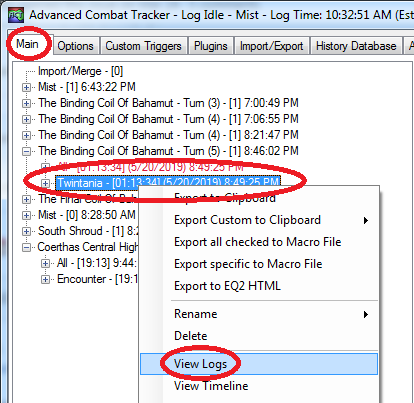
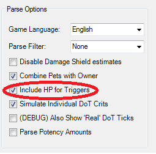

# Log Lines and Triggers

This is intended to be a comprehensive guide to log lines
for folks who want to write ACT triggers for ff14.

This guide was last updated for:

* [FF14](https://na.finalfantasyxiv.com/lodestone/special/patchnote_log/) Patch 4.58
* [FFXIV Plugin](https://github.com/ravahn/FFXIV_ACT_Plugin/releases) 1.7.2.13

With updates for:

* [FF14](https://na.finalfantasyxiv.com/lodestone/special/patchnote_log/) Patch 5.08
* [FFXIV Plugin](https://github.com/ravahn/FFXIV_ACT_Plugin/releases) 2.0.4.0

<!-- manually generated via https://imthenachoman.github.io/nGitHubTOC/ -->
## TOC

* [Data Flow](#data-flow)
  * [Viewing logs after a fight](#viewing-logs-after-a-fight)
  * [Importing an old fight](#importing-an-old-fight)
  * [Importing into ffxivmon](#importing-into-ffxivmon)
* [Glossary of Terms](#glossary-of-terms)
  * [Network Data](#network-data)
  * [Network Log Lines](#network-log-lines)
  * [ACT Log Lines](#act-log-lines)
  * [Game Log Lines](#game-log-lines)
  * [Object/Actor/Entity/Mob/Combatant](#objectactorentitymobcombatant)
  * [Object ID](#object-id)
  * [Ability ID](#ability-id)
* [Log Line Overview](#log-line-overview)
  * [00: LogLine](#00-logline)
    * [Don't Write Triggers Against Game Log Lines](#dont-write-triggers-against-game-log-lines)
  * [01: ChangeZone](#01-changezone)
  * [02: ChangePrimaryPlayer](#02-changeprimaryplayer)
  * [03: AddCombatant](#03-addcombatant)
  * [04: RemoveCombatant](#04-removecombatant)
  * [05: AddBuff](#05-addbuff)
  * [06: RemoveBuff](#06-removebuff)
  * [07: FlyingText](#07-flyingtext)
  * [08: OutgoingAbility](#08-outgoingability)
  * [0A: IncomingAbility](#0a-incomingability)
  * [0B: PartyList](#0b-partylist)
  * [0C: PlayerStats](#0c-playerstats)
  * [0D: CombatantHP](#0d-combatanthp)
  * [14: NetworkStartsCasting](#14-networkstartscasting)
  * [15: NetworkAbility](#15-networkability)
    * [Ability Flags](#ability-flags)
    * [Ability Damage](#ability-damage)
    * [Special Case Shifts](#special-case-shifts)
    * [Ability Examples](#ability-examples)
  * [16: NetworkAOEAbility](#16-networkaoeability)
  * [17: NetworkCancelAbility](#17-networkcancelability)
  * [18: NetworkDoT](#18-networkdot)
  * [19: NetworkDeath](#19-networkdeath)
  * [1A: NetworkBuff](#1a-networkbuff)
  * [1B: NetworkTargetIcon (Head Markers)](#1b-networktargeticon-head-markers)
  * [1C: NetworkRaidMarker](#1c-networkraidmarker)
  * [1D: NetworkTargetMarker](#1d-networktargetmarker)
  * [1E: NetworkBuffRemove](#1e-networkbuffremove)
  * [1F: NetworkGauge](#1f-networkgauge)
  * [20: NetworkWorld](#20-networkworld)
  * [21: Network6D (Actor Control Lines)](#21-network6d-actor-control-lines)
  * [22: NetworkNameToggle](#22-networknametoggle)
  * [23: NetworkTether](#23-networktether)
  * [24: LimitBreak](#24-limitbreak)
  * [25: NetworkActionSync](#25-NetworkActionSync)
  * [26: NetworkStatusEffects](#26-networkstatuseffects)
  * [27: NetworkUpdateHP](#27-networkupdatehp)
  * [FB: Debug](#fb-debug)
  * [FC: PacketDump](#fc-packetdump)
  * [FD: Version](#fd-version)
  * [FE: Error](#fe-error)
  * [FF: Timer](#ff-timer)
* [Future Network Data Science](#future-network-data-science)

## Data Flow


<!-- markdownlint-disable MD033 -->
<details>
<summary></summary>
data_flow
  digraph G {
    size ="4,4";
    ff14 [label="ff14 servers"]
    ff14 -> ACT [label="network data"]
    network [label="network log files"]
    ACT [label="ACT + ffxiv plugin",shape=box,penwidth=3]
    ACT -> network [label="write to disk"]
    fflogs
    network -> fflogs [label="upload"]
    network -> ffxivmon [label="import"]
    network -> ACT [label="import"]
    network -> timeline [label="process"]
    timeline [label="cactbot make_timeline.py"]
    plugins [label="triggers, ACT plugins"]
    ACT -> plugins [label="ACT log lines"]
  }
data_flow
</details>
<!-- markdownlint-enable MD033 -->

### Viewing logs after a fight

If you have ACT open during a fight, then it will generate logs.
These logs will be trimmed to the start and end of combat.

To see the logs, click on the **Main** tab,
expand the zone you care about,
right click on the encounter you want,
then select **View Logs**.



The **All** entry includes all the encounters in a zone and cannot be viewed.
You must view individual encounters.

The window that pops up has the text that triggers can be made against.
This is usually the best way to search through and find the text that you want to make a trigger for.

### Importing an old fight

Sometimes you have to close ACT, but you want to look at old fights.
Or, somebody else sends you a log, and you want to make triggers from it.

To do this, click the **Import/Export** tab,
click on **Import a Log File**,
click on **Select File...**
select the **Network_date.log** log file,
and finally click the **YOU** button.


This will create encounters whose [logs you can view](#viewing-logs-after-a-fight).

### Importing into ffxivmon

If you want to dig into the network data itself, ffxivmon is a great tool.

To create a log file suitable for ffxivmon,
first turn on the **(DEBUG) Dump all Network Data to logfile** setting in ACT.


Then, run an encounter in game with ACT running.
Once you're done, import that network log file into ffxivmon.


Now, you can walk through and investigate the network data directly.


## Glossary of Terms

### Network Data

This is the raw packet dump sent from ff14 servers to your computer.
This data is processed both by the game itself as well as by the ffxiv plugin to
produce network log lines.


Folks writing triggers generally do not have to worry about raw packet data and
so this document does not focus very much on this type of data.

### Network Log Lines

These represent the lines that the ffxiv plugin writes to disk in
**Network_20191002.log** files in your log directory.
These lines are still processed and filtered by the ffxiv plugin,
and are (mostly) not raw network data.

Here are some example network log lines:

```log
21|2019-05-31T21:14:56.8980000-07:00|10532971|Tini Poutini|DF9|Fire IV|40002F21|Zombie Brobinyak|150003|3B9D4002|1C|DF98000|0|0|0|0|0|0|0|0|0|0|0|0|104815|348652|12000|12000|1000|1000|-767.7882|156.939|-672.0446|26285|28784|13920|15480|1000|1000|-771.8156|157.1111|-671.3281||8eaa0245ad01981b69fc1af04ea8f9a1
30|2019-05-31T20:02:41.4560000-07:00|6b4|Boost|0.00|1069C23F|Potato Chippy|1069C23F|Potato Chippy|00|3394|3394||4f7b1fa11ec7a2746a8c46379481267c
20|2019-05-31T20:02:41.4660000-07:00|105E3321|Tater Tot|2C9D|Peculiar Light|105E3321|Tater Tot||c375d8a2d1cf48efceccb136584ed250
```

Data on network log lines is separated by vertical braces, i.e. `|`.
Network log lines also contain the hash of that line at the end.
The log line type itself is in decimal, e.g. aoe abilities are on lines that begin with `22|`.
The equivalent [ACT log line](#act-log-lines) would be written as the hex type `0x16`, i.e. `NetworkAOEAbility`.

The ffxiv plugin does not write the ACT log lines that plugins interact with
to disk.

The network log lines are used by some tools, such as:

* fflogs uploader
* ffxivmon
* cactbot make_timeline utility

If you [import a network log file into ACT](#importing-an-old-fight),
then it you can view the ACT log lines in the fight.  

### ACT Log Lines

These are the log lines that come out of the ffxiv plugin at runtime and are
exposed to plugins for triggers.
These are what the [View Logs](#viewing-logs-after-a-fight) option in ACT shows.

Data in ACT log lines is separated by colons, i.e. `:`.
The log line type is in hex.

Here is an example:

```log
[21:16:44.288] 15:10532971:Potato Chippy:9C:Scathe:40001299:Striking Dummy:750003:90D0000:1C:9C8000:0:0:0:0:0:0:0:0:0:0:0:0:2778:2778:0:0:1000:1000:-653.9767:-807.7275:31.99997:26945:28784:6720:15480:1000:1000:-631.5208:-818.5244:31.95173:
```

### Game Log Lines

A game log line is a specific type of ACT log line with type `00`.
These log lines also appear directly in your chat windows in game,
possibly in the Battle Log tab.
Try to [avoid writing triggers](#dont-write-triggers-against-game-log-lines) using these lines.

See: [00: Log Lines](#00-logline) for examples.

### Object/Actor/Entity/Mob/Combatant

These are all words used synonymously in this document to refer to an object
in the game that can use abilities and has stats.
This could be the player, Bahamut, Eos, a Striking Dummy.

### Object ID

Object ids are 4 byte identifiers used for all types of objects.

Player ids always start with the byte `10`,
e.g. `1069C23F` or `10532971`.

Enemy and pet ids always start with the byte `40`,
e.g. `4000A848` or `4000A962`.

For `NetworkAOEAbility` lines that don't affect anybody, e.g. a Titan landslide that somehow nobody stands in,
this is represented as hitting the id `E0000000` (and a blank name).

One thing to note is that in most raids,
there are many mobs in the scene with the same name.
For example, in t13, there are about twenty Bahamut Prime mobs in the zone,
most of which are invisible.
You can often differentiate these by HP values (see [AddCombatant](#03-addcombatant) log lines).
Often these invisible mobs are used as the damaging actors,
which is why in UWU Titan Phase, both Garuda and Titan use Rock Throw to put people in jails.

### Ability ID

Although ff14 differentiates between abilities and spells,
this document uses these words interchangeably.
All actions taken by a player or an enemy are "abilities" and have a unique 4 byte id.

You can use xivapi.com to look up a particular action, as sometimes these are
listed as "Unknown" from the ffxiv plugin if it hasn't updated yet.
For example, Fire IV has the ability id 0xDF9 = 3577,
so this link will give you more information about it:
<https://xivapi.com/action/3577?columns=ID,Name,Description,ClassJobCategory.Name>

This works for both players and enemies, abilities and spells.

## Log Line Overview

Here's an example of a typical log line:
`[12:01:48.293] 21:80034E29:40000001:E10:00:00:00`.
This log line happens to be the actor control line (type=`0x21`) for commencing Titan Extreme.

Log lines always start with the time in square brackets.
This time is formatted to be in your local time zone.
The time is followed with a hex value (in this case 0x21) that indicates the type of the log line it is.
These types are internal to the ffxiv plugin
and represent its conversion of network data and memory data into discrete events.

The rest of the data in the log line needs to be interpreted based on what type it is.
See the following sections that describe each log line.
The examples in these sections do not include the time prefix for brevity.

### 00: LogLine

Structure:
`00:[Message Type ID]:Message displayed In-Game`

Examples:

```log
00:0839:The Right Hand of Bahamut is no longer sealed!
00:0840:The Final Coil of Bahamut - Turn 2 completion time: 8:37.
00:0b3a:You are defeated by the oppressor 0.5.
00:302b:The gravity node uses Forked Lightning.
00:322a:The attack misses.
```

These are what this document calls "game log lines".
There is a two byte log type and then a string.
Because these are not often used for triggers
(other than `0839` messages),
the full set of LogTypes is not well-documented.

(Pull requests welcome!)

#### Don't Write Triggers Against Game Log Lines

There are a number of reasons to avoid basing triggers on game log lines:

* can show up later than ACT log lines (often up to half a second)
* inconsistent text (gains effect vs suffers effect, begins casting vs readies, you vs player name)
* often vague (the attack misses)
* can change spelling at the whim of SquareEnix

Instead, the recommendation is to base your triggers on ACT log lines that are not type `00`.
Prefer using `1A` "gains the effect" message instead of `00` "suffers the effect" messages.  Prefer using the `14` "starts using" instead of `00` "readies" or "begins casting".

At the moment, there are some cases where you must use game log lines,
such as sealing and unsealing of zones, or boss rp text for phase transitions.

Note:
There are examples where `14` "starts using" lines show up
after the corresponding `00` "readies" line,
but it is on the order of tens of milliseconds
and does not consistently show up first.
`15` "ability" lines always seem to show up before the `00` "uses" lines.

### 01: ChangeZone

This message is sent when first logging in and whenever the zone is changed.

Structure:
`01:Changed Zone to [Zone Name].`

Examples:

```log
01:Changed Zone to The Lavender Beds.
01:Changed Zone to The Unending Coil Of Bahamut (Ultimate).
```

### 02: ChangePrimaryPlayer

This redundant message follows every [ChangeZone](#01-changezone) message to indicate the name of the player.

Structure:
`02:Changed primary player to [Player Name].`

Examples

```log
02:Changed primary player to Potato Chippy.
02:Changed primary player to Tini Poutini.
```

### 03: AddCombatant

This message is sent when a new object is added to the scene or
becomes close enough to the player that they can view its actions.

Structure:
`03:[ObjectId]:Added new combatant [Combatant Name].  Job: [Job-ID] Level: [Level-Value] Max HP: [Max-HP-Value] Max MP: [Max-MP-Value] Pos: ([X-Pos],[Z-Pos],[Y-Pos]).`

Examples:

```log
03:40123456:Added new combatant Pagos Deepeye.  Job: N/A Level: 70 Max HP: 348652 Max MP: 12000 Pos: (-720.9337,90.80706,-679.6056).
03:10987654:Added new combatant Tater Tot (Jenova).  Job: 28 Level: 70 Max HP: 39835 Max MP: 16461 Pos: (-143.9604,168.5795,-4.999999).
```

This combatant may be invisible and fake.  The real ones have more HP.
For example, at the start of t5 you will see messages like this:

```log
03:40123450:Added new combatant Twintania.  Job: N/A Level: 50 Max HP: 2778 Max MP: 0 Pos: (-6.27745,-5.304218,50.00586).
03:40123451:Added new combatant Twintania.  Job: N/A Level: 50 Max HP: 2778 Max MP: 0 Pos: (-6.27745,-5.304218,50.00586).
03:40123452:Added new combatant Twintania.  Job: N/A Level: 50 Max HP: 2778 Max MP: 0 Pos: (-6.27745,-5.304218,50.00586).
03:40123453:Added new combatant Twintania.  Job: N/A Level: 50 Max HP: 2778 Max MP: 0 Pos: (-6.27745,-5.304218,50.00586).
03:40123454:Added new combatant Twintania.  Job: N/A Level: 50 Max HP: 2778 Max MP: 0 Pos: (-6.27745,-5.304218,50.00586).
03:40123455:Added new combatant Twintania.  Job: N/A Level: 50 Max HP: 2778 Max MP: 0 Pos: (-6.27745,-5.304218,50.00586).
03:40123456:Added new combatant The Scourge Of Meracydia.  Job: N/A Level: 50 Max HP: 20307 Max MP: 0 Pos: (-8.42909,17.4637,50.15326).
03:40123457:Added new combatant Twintania.  Job: N/A Level: 50 Max HP: 514596 Max MP: 0 Pos: (2.251731,4.753533,50.03756).
03:40123458:Added new combatant Twintania.  Job: N/A Level: 50 Max HP: 2778 Max MP: 0 Pos: (7.752398,1.972908,50.04842).
03:40123459:Added new combatant Twintania.  Job: N/A Level: 50 Max HP: 2778 Max MP: 0 Pos: (7.752398,1.972908,50.04842).
03:40123460:Added new combatant Twintania.  Job: N/A Level: 50 Max HP: 2778 Max MP: 0 Pos: (-6.27745,-5.304218,50.00586).
03:40123461:Added new combatant Twintania.  Job: N/A Level: 50 Max HP: 2778 Max MP: 0 Pos: (-6.27745,-5.304218,50.00586).
03:40123462:Added new combatant The Scourge Of Meracydia.  Job: N/A Level: 50 Max HP: 20307 Max MP: 0 Pos: (8.960839,18.12193,50.66183).
03:40123463:Added new combatant The Scourge Of Meracydia.  Job: N/A Level: 50 Max HP: 20307 Max MP: 0 Pos: (18.30528,3.778645,50.44044).
```

In heavy zones (e.g. Eureka), combatants may be culled if there are too many
things nearby.
Usually other players are culled first, but mobs can be as well.
Eureka NMs (and S ranks) solve this by having a flag on them
that allows them to be seen via AddCombatant message from anywhere in the zone,
which is why it is possible to write triggers for when these pop.

### 04: RemoveCombatant

This message is sent when an object is removed from the scene, either because
the player has moved too far away from it, it has died, or the player has
changed zones.

Structure:
`04:[ObjectId]:Removing combatant [Combatant Name].  Max HP: [Max-HP-Value]. Pos: ([X-Pos],[Z-Pos],[Y-Pos])`

Examples:

```log
04:10987654:Removing combatant Potato Chippy.  Max HP: 28784. Pos: (-776.6765,152.5261,-671.2197)
04:40123462:Removing combatant Frozen Void Dragon.  Max HP: 348652. Pos: (-710.7075,49.39039,-646.7071)
```

### 05: AddBuff

This is the memory-parsing equivalent of [1A: NetworkBuff](#1a-networkbuff).
Do not write triggers against this as this is only emitted when parsing from memory.

Structure:
`05:[Target Name] gains the effect of [Status] from [Source Name]`

Examples:

```log
05:Striking Dummy gains the effect of Reprisal from Tini Poutini.
05:Potato Chippy gains the effect of Passage Of Arms from Potato Chippy.
```

### 06: RemoveBuff

This is the memory-parsing equivalent of [1E: NetworkBuffRemove](#1e-networkbuffremove).
Do not write triggers against this as this is only emitted when parsing from memory.

Structure:
`06:[Target Name] loses the effect of [Status] from [Source Name]`

Examples:

```log
06:Striking Dummy loses the effect of Reprisal from Tini Poutini.
06:Striking Dummy loses the effect of Circle Of Scorn from Potato Chippy.
```

### 07: FlyingText

This is the memory-parsing equivalent of [18: NetworkDoT](#18-networkdot).
Do not write triggers against this as this is only emitted when parsing from memory.

Structure:
`07:[Type Name] tick on [Source Name] for [Value] damage.`

Examples:

```log
07:DoT tick on Striking Dummy for 509 damage.
```

### 08: OutgoingAbility

This is the memory-parsing equivalent of [14: NetworkStartsCasting](#14-networkstartscasting).
Do not write triggers against this as this is only emitted when parsing from memory.

Structure:
`08:[Source Name] starts using [Ability Name] on [Target Name].`

Examples:

```log
08:Potato Chippy starts using Circle Of Scorn on Striking Dummy.
```

### 0A: IncomingAbility

This is the memory-parsing equivalent of [15: NetworkAbility](#15-networkability) and [16: NetworkAOEAbility](#16-networkaoeability).
Do not write triggers against this as this is only emitted when parsing from memory.

Examples:

```log
0A:10532971:Potato Chippy:17:Circle Of Scorn:40001299:Striking Dummy:710003:6850000:ef010f:f80000:0:0:0:0:0:0:0:0:0:0:0:0:2778:2778:0
```

### 0B: PartyList

Lines are printed, but with blank data.  :sob:

### 0C: PlayerStats

This message is sent whenever your player's stats change and upon entering a new zone/instance.

Structure:

`0C:Player Stats: JOB:STR:DEX:VIT:INT:MND:PIE:ATTACK POWER:DHIT:CRIT:ATTACK MAGIC POTENCY:HEAL MAGIC POTENCY:DET:SkS:SpS:0:TENACITY`

Example:

```log
0C:Player Stats: 23:305:4240:4405:290:275:340:4240:2694:2795:290:275:2473:578:380:0:380
```

### 0D: CombatantHP

If you have the **Include HP for Triggers** setting turned on
in the **FFXIV Settings** tab of ACT, then it will emit log lines
for every percentage change of every entity.

This is often used for phase change triggers.



Structure:
`0D:[Target Name] HP at [HP-Value]%.`

Examples:

```log
0D:Striking Dummy HP at 96%.
0D:Tini Poutini HP at 98%.
```

### 14: NetworkStartsCasting

For abilities with cast bars, this is the log line that specifies that a player or a monster has started casting an ability.
This precedes a log line of type `15`, `16`, or `17`
where it uses the ability or is interrupted.

Structure:
`14:[Source ID]:[Source Name] starts using [Ability Name] on [Target Name].`

Examples:

```log
14:5B2:Twintania starts using Death Sentence on Potato Chippy.
14:DF9:Tini Poutini starts using Fire IV on Striking Dummy.
```

The value after `14` is the 4 byte [ability id](#ability-id).

These are usually (but not always) associated with game log lines that either look like
`00:282B:Shinryu readies Earthen Fury.`
or `00:302b:The proto-chimera begins casting The Ram's Voice.`

### 15: NetworkAbility

This is an ability that ends up hitting a single target (possibly the caster's self).
The reason this is worded as "ends up hitting" is that some AOE abilities may only hit a single target, in which case they still result in type `15`.
For example, in ucob, if Firehorn's fireball in nael phase hits the whole group, it will be a `16` type.
If one person runs the fireball out and it only hits them, then it is type `15` because there's only one target.
If your trigger includes the message type, it is usually best to write your regex as `1[56]` to include both possibilities.
Ground AOEs that don't hit anybody are type `16`.

Example:
`15:10532971:Tini Poutini:07:Attack:40001299:Striking Dummy:710003:9420000:0:0:0:0:0:0:0:0:0:0:0:0:0:0:2778:2778:0:0:1000:1000:-653.9767:-807.7275:31.99997:66480:74095:4560:4560:1000:1000:-653.0394:-807.9677:31.99997:`

Index | Example | Explanation
--- | --- | ---
0 | 15 | type id (in hex)
1 | 10532971 | caster object id
2 | Tini Poutini | caster name
3 | 07 | ability id
4 | Attack | ability name
5 | 40001299 | target object id
6 | Striking Dummy | target name
7 | 710003 | [flags](#ability-flags)
8 | 9420000 | [damage](#ability-damage)
9-22 | 0 | ??? (see: [special case shifts](#special-case-shifts))
23 | 2778 | target current hp
24 | 2778 | target max hp
25 | 0 | target current mp
26 | 0 | target max mp
27 | 1000 | target current tp
28 | 1000 | target max tp
29 | -653.9767 | target x position
30 | -807.7275 | target y position
31 | 31.99997 | target z position
32 | 66480 | caster current hp
33 | 74095 | caster max hp
34 | 4560 | caster current mp
35 | 4560 | caster max mp
36 | 1000 | caster current tp
37 | 1000 | caster max tp
38 | -653.0394 | caster x position
39 | -807.9677 | caster y position
40 | 31.99997 | caster z position

Network ability lines are a combination of raw network data
(e.g. the `710003` flags and the `9420000` damage)
and frequently sampled data from memory
(e.g. the `66480` current hp value and `-653.0394` x position).

This means that there's a number of caveats going on to handling all the data in these lines.  The raw network data is subject to change over time from ff14 servers.  Also, the data from memory may be slightly stale and out of date

#### Ability Flags

Damage bitmasks:

* 0x01 = dodge
* 0x03 = damage done
* 0x05 = blocked damage
* 0x06 = parried damage
* 0x33 = instant death
* 0x100 = crit damage
* 0x200 = direct hit damage
* 0x300 = crit direct hit damage

Heal bitmasks:

* 0x00004 = heal
* 0x10004 = crit heal

Other bitmasks appear on particular abilities, and can indicate whether bane
missed or hit recipients.  However, these all appear ability-specific.

Some of these flags also indicate whether the ability is part of a combo or not
and whether the positional was hit.
However, these values do not seem to be consistent between jobs.

For example, the flags for successful trick attack are `28710.03`.
The `.` here represents 0-3 as the trick may crit, dh, both, or neither.
The flags for a missed trick attack are `710.03`.
Thus, there's a `0x28700000` mask applied here when the positional is correct,
which was determined via experimentation.

If you care about specific ability flags, you likely have to do this research yourself.
Please send pull requests to this document so it can be shared!

#### Ability Damage

Damage bitmasks:
    0x1000 = hallowed, no damage
    0x4000 = "a lot" of damage

The damage value in an ability usage is not the literal damage, because that would be too easy.

The formula to get from the damage value in the ability log line to the actual damage value is the following.

First, left-extend zeroes to 4 bytes (8 chars), e.g. 2934001 => 02934001, or 1000 => 00001000.

The first two bytes (4 chars) are the damage.

Unless, if there is an 0x00004000 mask, then this implies "a lot" of damage.
In this case, consider the bytes as ABCD, where C is 0x40.
The total damage is calculated as D A (B-D) as three bytes together interpreted
as an integer.

For example, `424E400F` becomes `0F 42 (4E - OF = 3F)` => `0F 42 3F` => 999999

#### Special Case Shifts

It is not clear what this represents, but sometimes the flags is replaced by
one (or more) pairs of values.

The most likely case is that if flags is `3F`,
then the flags and damage are in index 9 and 10 instead of 7 and 8, respectively.
In other words, when you see flags being a particular value,
you need to shift everything over two to find the real flags.
See the example below.
It is also to be noted that this value has slowly increased over time and was
`3C` back in 2017.

The other shift is that plenary indulgence lists the number of stacks in the flags as `113`, `213`, or `313` respectively.
These are always followed by `4C3`.
Therefore, these should also be shifted over two to find the real flags.

#### Ability Examples

1) 18216 damage from Grand Cross Alpha (basic damage)
`16:40001333:Neo Exdeath:242B:Grand Cross Alpha:1048638C:Tater Tot:750003:47280000:1C:80242B:0:0:0:0:0:0:0:0:0:0:0:0:36906:41241:5160:5160:880:1000:0.009226365:-7.81128:-1.192093E-07:16043015:17702272:12000:12000:1000:1000:-0.01531982:-19.02808:0:`

2) 82538 damage from Hyperdrive (0x4000 extra damage mask)
`15:40024FBA:Kefka:28E8:Hyperdrive:106C1DBA:Okonomi Yaki:750003:426B4001:1C:28E88000:0:0:0:0:0:0:0:0:0:0:0:0:35811:62464:4560:4560:940:1000:-0.1586061:-5.753153:0:30098906:31559062:12000:12000:1000:1000:0.3508911:0.4425049:2.384186E-07:`

3) 22109 damage from Grand Cross Omega (:3F:0: shift)
`16:40001333:Neo Exdeath:242D:Grand Cross Omega:1048638C:Tater Tot:3F:0:750003:565D0000:1C:80242D:0:0:0:0:0:0:0:0:0:0:41241:41241:5160:5160:670:1000:-0.3251641:6.526299:1.192093E-07:7560944:17702272:12000:12000:1000:1000:0:19:2.384186E-07:`

4) 15732 crit heal from 3 confession stack Plenary Indulgence (:?13:4C3: shift)
`16:10647D2F:Tako Yaki:1D09:Plenary Indulgence:106DD019:Okonomi Yaki:313:4C3:10004:3D74:0:0:0:0:0:0:0:0:0:0:0:0:7124:40265:14400:9192:1000:1000:-10.78815:11.94781:0:11343:40029:19652:16451:1000:1000:6.336648:7.710004:0:`

5) instant death twister
`16:40004D5D:Twintania:26AB:Twister:10573FDC:Tini Poutini:33:0:1C:26AB8000:0:0:0:0:0:0:0:0:0:0:0:0:43985:43985:5760:5760:910:1000:-8.42179:9.49251:-1.192093E-07:57250:57250:0:0:1000:1000:-8.565645:10.20959:0:`

6) zero damage targetless aoe (E0000000 target)
`16:103AAEE4:Potato Chippy:B1:Miasma II:E0000000::0:0:0:0:0:0:0:0:0:0:0:0:0:0:0:0::::::::::19400:40287:17649:17633:1000:1000:-0.656189:-3.799561:-5.960464E-08:`

### 16: NetworkAOEAbility

This is an ability usage in game that ends up hitting multiple actors or no actors at all.

See: [15: NetworkAbility](#15-networkability) for a discussion of the difference between `NetworkAbility` and `NetworkAOEAbility`.

### 17: NetworkCancelAbility

For abilities with cast bars, this is the log line that specifies that the cast was cancelled either due to movement or an interrupt and it won't go off.

Structure:
`17:[Source ID]:[Source Name]:[Ability ID]:[Ability Name]:Cancelled.`

Examples:

```log
17:105EDD08:Potato Chippy:1D07:Stone IV:Cancelled:
17:40000FE3:Raiden:3878:Ultimate Zantetsuken:Cancelled:
```

### 18: NetworkDoT

HoT (heal over time) and DoT (damage over time) amounts.
These are the aggregated quantities of damage for every hot or dot on that target.

The reason why there is such a discrepancy between ACT and fflogs about dots
is that ff14 does not return the exact tick amounts for every active dot.
Instead, if a boss has 20 dots applied to it,
then it returns the total tick amount for all of these dots.
Parsers are left to estimate what the individual dot amounts are.

Structure:
`18:[Type Name] on [Source Name] for [Value] damage.`

Examples:

```log
18:DoT Tick on Ovni for 13003 damage.
18:HoT Tick on Tini Poutini for 2681 damage.
18:Shadow Flare DoT Tick on Arsenal Centaur for 151 damage.
```

Ground effect dots get listed separately.

### 19: NetworkDeath

This message corresponds to an actor being defeated and killed.  This usually comes along with a battle log message such as `You defeat the worm's heart.`

Structure:
`19:[Target Name] was defeated by [Source Name].`

Examples:

```log
19:Tini Poutini was defeated by Ovni.
19:The Scourge Of Meracydia was defeated by Unknown.
```

### 1A: NetworkBuff

This message is the "gains effect" message for players and mobs gaining effects whether they are good or bad.

Structure:
`1A:[ObjectId]:[Target Name] gains the effect of [Status] from [Source Name] for [Float_Value] Seconds`

Examples:

```log
1A:105EDD08:Tini Poutini gains the effect of Sprint from Tini Poutini for 20.00 Seconds.
1A:10660108:Potato Chippy gains the effect of Protect from Tater Tot for 1800.00 Seconds.
1A:405EFA09:Ovni gains the effect of Aero II from  for 18.00 Seconds.
```

The "Source Name" can be blank here (and there will be two spaces like the above example if that's the case).

This corresponds to game log messages that look like this:
`00:12af:The worm's heart suffers the effect of Slashing Resistance Down.`
`00:112e:Tini Poutini gains the effect of The Balance.`
`00:08af;You suffer the effect of Burning Chains.`

Although game messages differentiate between buffs and debuffs,
log message type `1A` includes all effect types (both positive and negative).

You cannot count on the time remaining to be precise.
In rare cases, the time will already have counted down a tiny bit.
This matters for cases such as ucob Nael phase doom debuffs.

### 1B: NetworkTargetIcon (Head Markers)

Structure:
`1B:[ObjectId]:[Player Name]:[Unknown1 (4 bytes)]:[Unknown2 (4 bytes)]:[Type (4 bytes)]:0000:0000:0000`

Examples:

```log
1B:10532971:Tini Poutini:0000:0000:0027:0000:0000:0000:
1B:106F0213:Potato Chippy:0000:0EE3:0061:0000:0000:0000:
```

The different headmarker types (e.g. `0027` or `0061` in the examples above) are consistent across fights as far as which marker they *visually* represent. (Correct *resolution* for the marker mechanic may not be.)  For example, `0039` is the meteor marker in Shinryu EX adds phase and the Baldesion Arsenal Ozma fight.  The data following the type always appears to be zero in practice, although `Unknown1` and `Unknown2` infrequently have non-zero values.

Note: It's unclear when the head markers disappear.  Maybe `Unknown2` is a duration time? It's not clear what either of these unknown values mean.

Also, this appears to only be true on later fights.
Turn 5 fireball and conflag headmarkers are actions from Twintania and not `1B` lines.
It seems likely this was implemented later and nobody wanted to break old content by updating it to use newer types.

Marker Code | Name | Sample Locations | Consistent meaning?
--- | --- | --- | ---
000[1-2, 4] | Prey Circle (orange) | o6s, The Burn boss 2 | Yes
0007 | Green Meteor | t9n/s | N/A
0008 | Ghost Meteor | t9n/s | N/A
0009 | Red Meteor | t9n/s | N/A
000A | Yellow Meteor | t9n/s | N/A
000D | Devour Flower | t6n/s, Sohm Al boss 1 | Yes
000E | Prey Circle (blue) | t6n/s, o7s | No
0010 | Teal Crystal | Ultima Weapon Ultimate |N/A
0011 | Heavenly Laser (red) | t8n/s, e1n | No
0017 | Red Pinwheel | Sohm Al boss 2, Susano N/EX, e3n/s | No
0028 | Earth Shaker | Sephirot N/EX, o4s | Yes
001C | Gravity Puddle | e1n | N/A
001E | Prey Sphere (orange) | Dun Scaith boss 3, o7n/s | No
001F | Prey Sphere (blue) | t10 | N/A
003[2-5] | Sword Markers 1-4 | Ravana N/EX, Twinning boss 1 | N/A
0037 | Red Dorito | Weeping City boss 2, Ridorana boss 1 | Yes
0039 | Purple Spread Circle (large) | Ravana N/EX, Shinryu EX | Yes
003E | Stack Marker (bordered) | o8n/s, Dun Scaith | Yes
0046 | Green Pinwheel | Dun Scaith boss 1, o5n/s | Yes
004B | Acceleration Bomb | Weeping City boss 3, Susano N/EX, o4s | Yes
004C | Purple Fire Circle (large) | e2n/s | Yes
0054 | Thunder Tether (orange) | Titania EX | N/A
0057 | Flare | o4n/s, e2n/s | Yes
005C | Prey (dark) | Dun Scaith boss 3/4, Holminster Switch boss 3 | No
005D | Stack Marker (tank--no border) | Dun Scaith boss 4, e4s | Yes
0060 | Orange Spread Circle (small) | Hades N | Yes
0061 | Chain Tether (orange) | The Vault boss 3, Shinryu N/EX | Yes
0064 | Stack Marker (bordered) | o3s, Ridorana boss 3 | Yes
0065 | Spread Bubble | o3s, Byakko EX | N/A
006E | Levinbolt | Susano EX | N/A
0076 | Prey (dark) | Bahamut Ultimate | N/A
0078 | Orange Spread Circle (large) | Akadaemia Anyder | Yes
007B | Scatter (animated Play symbol) | Rabanastre boss 4 | N/A
007C | Turn Away (animated eye symbol) | Rabanastre boss 4 | N/A
007E | Green Crystal | Shinryu N/EX | No
0083 | Sword Meteor (Tsukuyomi) | Tsukuyomi EX | N/A
0087 | Prey Sphere (blue) | Akadaemia Anyder | N/A
008A | Orange Spread Circle (large) | Innocence N/EX, Orbonne boss 3 | Yes
008B | Purple Spread Circle (small) | Ridorana boss 1, Hades N | Yes
008E | Death From Above | o10s | N/A
008F | Death From Below | o10s | N/A
009[1-8] | Fundamental Synergy Square/Circle | o12s | N/A
00A1 | Stack Marker (bordered) | Titania N/EX | Yes
00A9 | Orange Spread Circle (small) | o11n/s, e3n/s | Yes
00AB | Green Poison Circle | Qitana Ravel | N/A
00AC | Reprobation Tether | Innocence EX | N/A
00AE | Blue Pinwheel | Sohm Al boss 2 | N/A
00B9 | Yellow Triangle (spread) | e4s | N/A
00BA | Orange Square (stack) | e4s |N/A
00BB | Blue Square (big spread) | e4s |N/A
00BD | Purple Spread Circle (giant) | TItania N/EX | Yes
00BF | Granite Gaol | e4s | N/A

### 1C: NetworkRaidMarker

Unknown?

### 1D: NetworkTargetMarker

Unknown?

### 1E: NetworkBuffRemove

This is the paired "end" message to the [1A: NetworkBuff](#1a-networkbuff) "begin" message.
This message corresponds to the loss of effects (either positive or negative).

Structure:
`1E:[ObjectId]:[Target Name] loses the effect of [Status] from [Source Name]`

Examples:

```log
1E:10657868:Tini Poutini loses the effect of Sprint from Tini Poutini.
1E:10299838:Potato Chippy loses the effect of Protect from Tater Tot.
1E:40686258:Ovni loses the effect of Aero II.
```

### 1F: NetworkGauge

Info about the current player's job gauge.

Examples:

```log
1F:10532971:Tini Poutini:C8000019:FD32:D0DF8C00:7FC0
1F:10532971:Potato Chippy:C863AC19:1000332:D0DF8C00:7FC0
```

Each of the values after the name represents the memory for the job gauge,
interpreted as a 4 byte integer.
To get back to the original memory, zero pad out to 4 bytes,
and then reverse the bytes (because little endian).

For example, take this line:
`1F:10532971:Tini Poutini:C8000019:FD32:D0DF8C00:7FC0`

Zero extended:
`:C8000019:0000FD32:D0DF8C00:`

Reversed:
`19 00 00 C8 32 FD 00 00 00 8C DF D0`

The first byte is always the job.
The remaining bytes are a copy of the job gauge memory.

This job is `0x19` (or black mage).
Interpreting these [values](https://github.com/goaaats/Dalamud/blob/4ad5bee0c62128315b0a247466d28f42264c3069/Dalamud/Game/ClientState/Structs/JobGauge/BLMGauge.cs) means:

* `short TimeUntilNextPolyglot` = 0x0000 = 0
* `short ElementTimeRemaining` = 0x32C8 = 13000ms
* `byte ElementStance` = 0xFD = -3 (three stacks of ice)
* `byte NumUmbralHearts` = 0x00 = 0
* `byte EnoState` = 0x00 = 0 (no enochian)

There are a number of references for job gauge memory:

  1) [cactbot FFXIVProcess code](https://github.com/quisquous/cactbot/blob/a4d27eca3628d397cb9f5638fad97191566ed5a1/CactbotOverlay/FFXIVProcessIntl.cs#L267)
  1) [Dalamud code](https://github.com/goaaats/Dalamud/blob/4ad5bee0c62128315b0a247466d28f42264c3069/Dalamud/Game/ClientState/Structs/JobGauge/NINGauge.cs#L15)

Unfortunately, network data about other player's gauge is not sent.
You are unable to see the abilities of other players, only your own.
(This is probably by design to cut down on the amount of network data sent.)

### 20: NetworkWorld

Unused.

### 21: Network6D (Actor Control Lines)

See also: [nari director update documentation](https://nonowazu.github.io/nari/types/event/directorupdate.html)

To control aspects of the user interface, the game sends packets called Actor Controls. These are broken into 3 types: ActorControl, ActorControlSelf, and ActorControlTarget. If ActorControl is global, then ActorControlSelf / ActorControlTarget affects individual actor(s).

Actor control commands are identified by a category, with parameters passed to it as a handler. DirectorUpdate is a category of ActorControlSelf and is used to control the events inside content for an individual player:

* BGM change
* some cutscenes
* barrier up/down
* fade in/out

Structure:
`21:TypeAndInstanceContentId:Command (4 bytes):Data (4x 4? byte extra data)`

Examples:

```log
21:8003753A:40000010:00:00:00:00
21:80034E52:8000000D:1601:00:00:00
21:80037543:80000004:257:00:00:00
```

`TypeAndContentId` is 2 bytes of a type enum,
where `8003` is the update type for instanced content.
It's then followed by 2 bytes of a content id.
This is the ID from the InstanceContent table.

Wipes on most raids and primals these days can be detected via this regex:
`21:........:40000010:`.  However, this does not occur on some older fights,
such as coil turns where there is a zone seal.

Known types:

* Initial commence: `21:content:40000001:time:` (time is the lockout time in seconds)
* Recommence: `21:content:40000006:time:00:00:00`
* Lockout time adjust: `21:content:80000004:time:00:00:00`
* Charge boss limit break: `21:content:8000000C:value1:value2:00:00`
* Music change: `21:content:80000001:value:00:00:00`
* Fade out: `21:content:40000005:00:00:00:00` (wipe)
* Fade in: `21:content:40000010:00:00:00:00` (always paired with barrier up)
* Barrier up: `21:content:40000012:00:00:00:00` (always comes after fade in)
* Victory: `21:zone:40000003:00:00:00:00`

Note: cactbot uses "fade in" as the wipe trigger,
but probably should switch to "fade out" after testing.

Still unknown:

* `21:zone:40000007:00:00:00:00`

### 22: NetworkNameToggle

This log message toggles whether the nameplate for a particular entity is visible or not.
This can help you know when a mob is targetable, for example.

Structure:
`22:[ObjectId]:[Target Name]:[ObjectId]:[Target Name]:[Display State]`

Examples:

```log
22:105E3321:Tini Poutini:105E3321:Tini Poutini:01
22:40018065:Twintania:40018065:Twintania:00
```

### 23: NetworkTether

This log line is for tethers between enemies or enemies and players.
This does not appear to be used for player to player skill tethers like dragonsight or cover.
(It can be used for enemy-inflicted player to player tethers such as burning chains in Shinryu N/EX.)

Structure:
`23:[SourceId]:[SourceName]:[TargetId]:[TargetName]:[Unknown1 (4 bytes)]:[Unknown2 (4 bytes)]:[Type (4 bytes)]:[TargetId]:[Unknown3 (4 bytes)]:[Unknown4 (4 bytes)]:`

Examples:

```log
23:40015B4E:Weapons Node:40015B4D:Gravity Node:751E:0000:000E:40015B4D:000F:7F4B:
23:4000E84B:Zu Cockerel:1048638C:Tini Poutini:0000:0000:0006:1048638C:000F:7FEF:
23:40001614:Omega:10532971:Potato Chippy:0023:0000:0054:10532971:000F:0000:
```

The type of tether in the above three lines are `000E`, `0006`, and `0054` respectively.

Like [1B: NetworkTargetIcon (Head Markers)](#1b-networktargeticon-head-markers),
Type is consistent across fights and represents a particular visual style of tether.

There are also a number of examples where tethers are generated in some other way:

* ultima aetheroplasm orbs: NpcSpawn parentActorId set to opposite orb
* t12 redfire orb: NpcSpawn parentActorId set to target
* t13 dark aether orbs: NpcSpawn parentActorId and targetId set to target player
* Suzaku Extreme birbs: who knows
* player to player tethers (dragonsight, cover, fairy tether)

## 24: LimitBreak

This log line is recorded every server tick where limit break energy is generated while in combat in a light or full party.
(Generation is not recorded while at cap.)
It starts at 0x0000 at the beginning of the instance (or encounter in the caseof a single-encounter instance,)
and counts up by 0x00DC (220 decimal,) until the limit break is used,
or the instance's maximum limit value is reached.
This rate of increase is constant,
but other actions taken can cause extra increments to happen independent of the base increase.
(These other increments occur in the same packet as the base rate, but separately.)

Each limit break bar is 0x2710 (10,000 decimal) units.
Thus, the maximum possible recorded value would be 0x7530.

Structure:
`24:Limit Break: [Value]`

Examples:

```log
24:Limit Break: 7530
```

## 25: NetworkActionSync

This log line is a sync packet that tells the client to render an action that has previously resolved.
(This can be an animation or text in one of the game text logs.)
It seems that it is emitted at the moment an action "actually happens" in-game,
while the `14/15` line is emitted before, at the moment the action is "locked in".
[As Ravahn explains it](https://discordapp.com/channels/551474815727304704/551476873717088279/733336512443187231):

> "If I cast a spell, I will get [a `NetworkAbility`] packet (line type [`14/15`]) showing the damage amount,
but the target isn't expected to actually take that damage yet.
The [`25` log line]  has a unique identifier in it which refers back to the [`14/15`] line[,]
and indicates that the damage should now take effect on the target.
> [The] FFXIV plugin doesn't use these lines currently, they are used by FFLogs.
It would help though if I did, but ACT doesn't do multi-line parsing very easily[,]
so I would need to do a lot of work-arounds."

Structure:
`25:[Player ObjectId]:[Sequence Number]:[Current HP]:[Max HP]:[Current MP]:[Max MP]:[Current TP]:[Max TP]:[Position X]:[Position Y]:[Position Z]:[Facing]:[packet data thereafter]`

Examples:

```log
25:12345678:PlayerOne:0000132A:33635:35817:10000:10000:0::0.3841706:-207.8767:2.901163:-3.00212:03E8:2500:0:01:03000000:0:0:E0000000:
```

## 26: NetworkStatusEffects

For NPC opponents (and possibly PvP) this log line is generated alongside `18:NetworkDoT` lines.
For non-fairy allies, it is generated alongside [1A: NetworkBuff](https://github.com/quisquous/cactbot/blob/main/docs/LogGuide.md#1e-networkbuffremove),
[1E: NetworkBuffRemove](https://github.com/quisquous/cactbot/blob/main/docs/LogGuide.md#1e-networkbuffremove),
 and [25:NetworkActionSync](https://github.com/quisquous/cactbot/blob/main/docs/LogGuide.md#25-NetworkActionSync).

Structure:
`26:[Target Id]:[Target Name]:[Job Levels]:[Current HP]:[Max Hp]:[Current Mp]:[Max MP]:[Current TP]:[Max TP]:[Position X]:[Position Y]:[Position Z]:[Facing]:<status list; format unknown>`

Examples:

```log
26:12345678:PlayerOne:3C503C1C:24136:24136:9045:10000:4:0:-0.4730835:-158.1598:-23.9:3.110625:03E8:45:0:020130:0:106501CA:0129:4172D113:106501CA:012A:4168C8B4:106501CA:012B:40919168:106501CA:0232:40E00000:E0000000:
```

It seems likely that this line was added in order to extend functionality
for the `18`, `1A`, and `1E` log lines without breaking previous content or plugins.

## 27: NetworkUpdateHP

It's not completely clear what triggers this log line,
but it contains basic information comparable to `25` and `26`.
It applies to allies and fairies/pets.

Structure:
`27:[Target ID]:[Target Name]:[Current HP]:[Max HP]:[Current MP]:[Max MP]:[Current TP]:[Max TP]:[position X]:[position Y]:[position Z]:[Facing]`

Examples:

```log
27:12345678:Eos:22851:22851:10000:10000:0:0:12.13086:-169.9398:-23.90031:-2.310888:
```

### FB: Debug

Lines are printed, but with blank data.

As network log lines, they often have information like this:
`251|2019-05-21T19:11:02.0268703-07:00|ProcessTCPInfo: New connection detected for Process [2644]: 192.168.1.70:49413=>204.2.229.85:55021|909171c500bed915f8d79fc04d3589fa`

### FC: PacketDump

If the setting to dump all network data to logfiles is turned on,
then ACT will emit all network data into the network log itself.
In the ACT log, these log lines are printed, but with blank data.

This can be used to import a network log file into ffxivmon and inspect packet data.


### FD: Version

Lines are printed, but with blank data.

As network log lines, they usually look like this:
`253|2019-05-21T19:11:02.0268703-07:00|FFXIV PLUGIN VERSION: 1.7.2.12, CLIENT MODE: FFXIV_64|845e2929259656c833460402c9263d5c`

### FE: Error

These are lines emitted directly by the ffxiv plugin when something goes wrong.

### FF: Timer

Theoretically used when memory-parsing is used, but I haven't seen them.

## Future Network Data Science

It'd be nice for folks to dig into network data to figure out how some specific mechanics work that are currently not exposed in the log.

* Boss headmarkers for Lamebrix Strikebocks (both A10S and Eureka Pyros)
* Running into insta-kill walls
* Figure out how t13 Dark Aether and Suzaku EX adds tether
* Find network data zone sealing so game log lines don't have to be used
* Network data for Absolute Virtue clone buffs (they're currently just game log lines)
* How to detect a wipe in older content like coil?
* How to differentiate fake mobs from real mobs in the added combatant data so they can be filtered out.

See: [importing into ffxivmon](#importing-into-ffxivmon).
