# Guide to Memory Signatures and Cheat Engine

Memory signatures are unique binary strings
that can be used to find memory locations in an executable.

Finding these signatures makes it possible to consistently
look up game state
(e.g. am I in combat, what is my job gauge, how much enmity do I have)
even when the game refuses to give you an API for this.

This guide shows how to use Cheat Engine to find such memory signatures.
It's probably helpful if you know some basic assembly language,
some programming, and have extreme levels of patience.

## Table of Contents

* [Installation](#installation)
* [Finding New Memory Signatures](#finding-new-memory-signatures)
  * [Connect Cheat Engine to the Game](#connect-cheat-engine-to-the-game)
  * [Initial Memory Search](#initial-memory-search)
  * [Repeated Scans](#repeated-scans)
  * [Browsing Memory](#browsing-memory)
  * [Approach 1: Finding Writers](#approach-1-finding-writers)
  * [Approach 2: Tracing](#approach-2-tracing)
  * [Approach 3: Finding Readers](#approach-3-finding-readers)
  * [Assembly Code and Pointers](#assembly-code-and-pointers)
  * [Extracting a Signature From Assembly](#extracting-a-signature-from-assembly)
* [Scan For Existing Memory Signatures](#scan-for-existing-memory-signatures)

## Installation

Install the [latest version of Cheat Engine](https://github.com/cheat-engine/cheat-engine/releases/latest).
The installer tries to tack some additional garbage on,
so be sure to turn this off and don't blindly click next.
Sorry.  It's gross.

## Finding New Memory Signatures

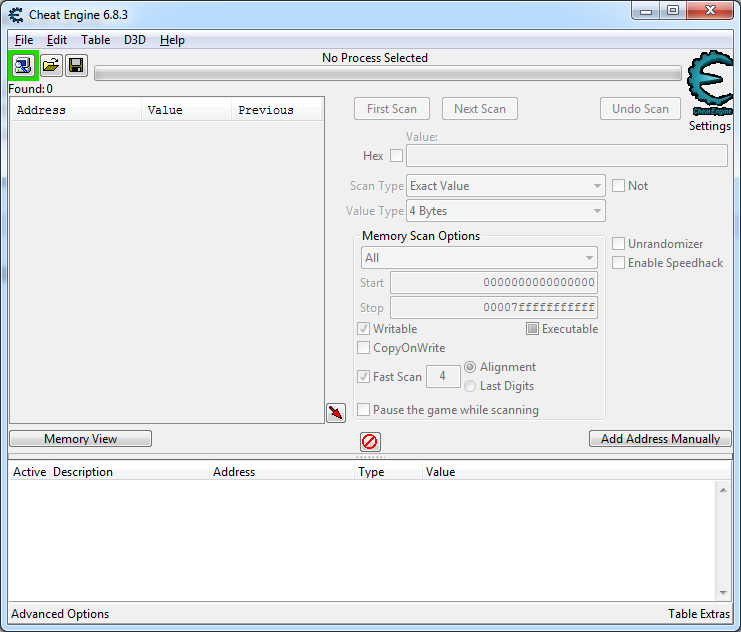

### Connect Cheat Engine to the Game

Start Final Fantasy XIV up and log in.

Then, open up Cheat Engine.
Click on **File**,
select **Open Process**,
and then pick Final Fantasy XIV.

The top bar should say **ffxiv_dx11.exe** at this point.

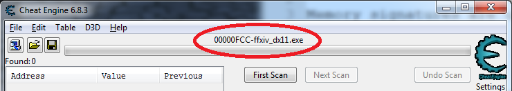

### Initial Memory Search

Let's say we're looking for your character's job gauge in memory.
For simplicity, say we're a warrior and we're just looking for beast gauge.
Because so many values in memory are zero,
let's start with a different initial value.

Switch to warrior in game,
and then hit a striking dummy until your beast gauge is 80.

Switch back to Cheat Engine.

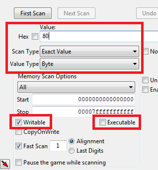

Put in a value (not hex) of 80.
The scan type should be `Exact Value` with a `Value Type` of byte.
At this point, we don't know how many bytes beast gauge takes in memory.
It would be nice if it took four bytes,
because there'd be a lot fewer options to sift through.
However, we can't make that assumption yet.
We're also looking for memory that is writable and not executable.

Then, click **First Scan**.

This will likely give you millions of memory locations with value 80.
A great start!

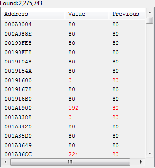

This is a live view into all of these memory locations.
They turn red when they have changed.
Some of these are flickering values that are changing even without doing something in game.
You can always mash **Next Scan**
a few times to repeat the scan and eliminate them.

### Repeated Scans

In game, use a fell cleave to get back to 30 beast gauge.

Go back to Cheat Engine.
Change the **Value** to 30.
Click **Next Scan**.
This should greatly cut down on the number of memory locations.

Repeat this process of changing the value in game
and then re-scanning for the new value
until you have a small number of addresses.

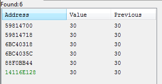

The black addresses are heap addresses.
The green addresses are [static addresses](https://medium.com/@nickteixeira/stack-vs-heap-whats-the-difference-and-why-should-i-care-5abc78da1a88).
In general, you're looking for static addresses
because it's easier to find code that refers to them
and they are permanent.

Keep scanning until you have a single green (static) address.

Right click on the address,
and select **Add selected addresses to the address list**.
This will put the address in the list at the bottom.
In this case, our static address is `14116E128`.

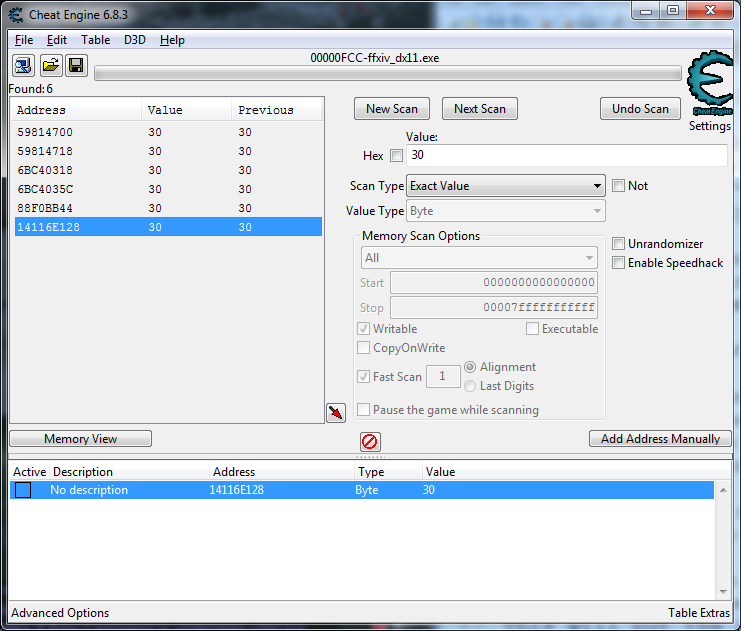

If you are following along with this example,
the static address you have will not match.
Moreover, it will be different each time you restart the game.
This is because Windows has [address space layout randomization](https://en.wikipedia.org/wiki/Address_space_layout_randomization) enabled,
largely to make it harder to do the exact sort of thing we are doing now.

This is also why we need to find a code signature.
If the executable and DLL addresses weren't randomized,
the static addresses would be the same from run to run.

### Browsing Memory

From the address list,
right click on the address that was just added
and select **Browse This Memory Region*.

That will bring up the Memory Viewer window.
This has a disassembly view at the top and a memory viewer at the bottom.
Confusingly, these are separate views and are *not* synced together even though they are in the same window.
They will sync to whatever the last address you have selected
**Disassemble This Memory Region**
or **Browse This Memory Region** on respectively.

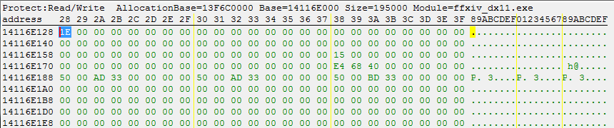

However, you can see that in the top left of this screenshot is the hex value `1E`,
which is [30 in decimal](https://www.google.com/search?q=0x1e+in+decimal).

Browsing memory can let you see what else is around it.
This is especially useful for things like entity or player data.

For job data, there's really not much interesting in nearby memory.

### Approach 1: Finding Writers

Now, we need to find some code that refers to this.
The easiest way to do this is to find what modifies this value.

Right click on the address in the address list,
and select **Find out what writes to this address**.
This will ask you to attach the debugger, say yes.
A new window will pop up.

(If your game has crashed at this point,
ensure "Try to prevent detection of the debugger"
is checked under Edit > Settings > Debugger Options!)

Go back to FFXIV, and modify the beast gauge.
In this case, we'll hit infuriate to go from 30 to 80.

Go back to Cheat Engine,
and the new debugger window should have some information.

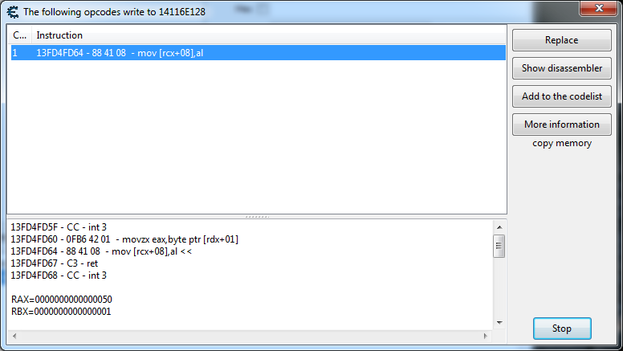

This is the assembly that wrote to the beast gauge memory location.

If you want,
you can click on the **Show disassembler** to see the surrounding code.


Unfortunately, in this case,
this is a two instruction function call.

The line that is changing the value is `mov [rcx+08], al`.
I don't really know assembly language,
but google tells me that `al` is the last 8 bits of the `eax` register
which was set on the previous `movzx eax, byte ptr [rdx+01]` line.
Given that this is the line that is writing memory,
`[rcx+08]` is the pointer we care about,
but we need to find the calling code that set `rcx`.
This code is likely somewhere very different in the executable.

We have a couple of different options here.
One option here is to [do a trace to find calling code](#approach-2-tracing).
The second option is to [consider what reads the address](#approach-3-finding-readers) and not just write.
A third option (not explored in this guide) is to find some other code path that modifies the value,
and see if that code path has an easier signature.
(For example, changing jobs likely modifies the value in a different way?)

### Approach 2: Tracing

If pure disassembly doesn't yield enough contextual information,
Cheat Engine has "break and trace" functionality.
Go back to the [browsing memory](#browsing-memory) view.
This functionality is not available from the address list directly.

Right click on that `1E` byte you care about.
Select **Data Breakpoint** and then **Break and trace**.
All the default options are fine.
Since we are still looking for a writer,
we will keep **Break on Write** selected.
Click **Ok**.

This brings you to a Tracer window.
Go back to Final Fantasy, and do something to modify your beast gauge.
The game will probably hiccup as Cheat Engine tries to record callstacks.
Go back to the Tracer window.

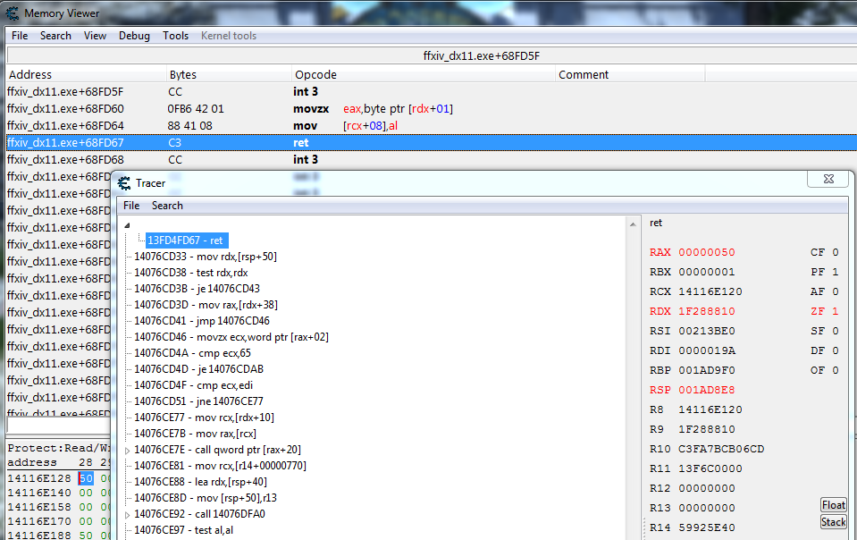

You can double click on the lines in the Tracer to
have the Memory Viewer disassembly window jump to that location.

In this case, expanding the arrow and double clicking the `ret`
return assembly instruction goes back to exactly what we were
looking at before in the disassembly window.

Double clicking on `mov rdx, [rsp+50]` brings us to the code
that called the code we were looking at before.

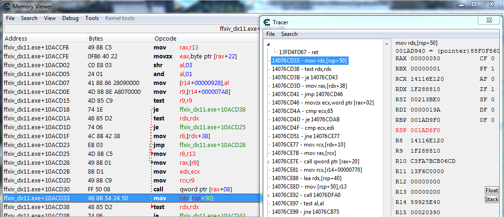

The `call` right before that line is the `call` into the code
we were looking at.
So, we would need to figure out what set `rcx`.
It looks like that's set from `r9`.
`r9` is set indirectly from a pointer in `r14`.
This is getting complicated.
It's possible to keep going back in the assembly to find
some code,
but maybe there's an easier approach.

### Approach 3: Finding Readers

Instead of finding code that modifies the value,
we could also find code that reads the value.

Right click on the address in the address list,
and select **Find out what accesses this address**.

Unlike writing,
the code is likely constantly accessing this address.
You will need to hit the **Stop** button to stop collecting locations.

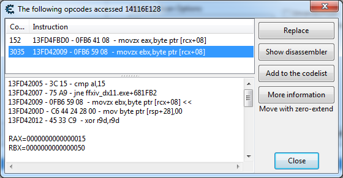

In this case, there are two places in code that are accessing this memory.
One is hit very frequently (3000 times) and the other infrequently (152).

Looking at the disassembly in the window,
the second one looks like a much more substantial function,
so let's disassemble that one.

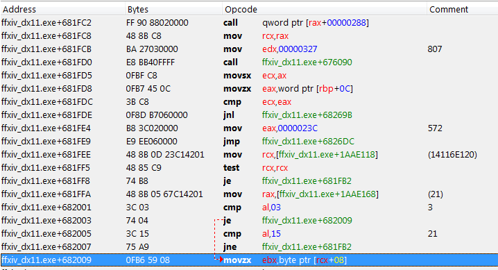

Perfect! This looks a bit simpler than the code we saw in tracing.

### Assembly Code and Pointers

Because we are looking for a static address,
this address will never change once the program has started.
The goal is to find some stable set of assembly code that
surrounds the address we're looking for.
We can then search for this code in memory to get back the address,
no matter where it is that particular run.

Reading this assembly code, the reading code is `movzx ebx, byte ptr [rcx+08]`.
In English, this looks at the memory location 8 bytes after what is in the
`rcx` register, takes the byte found there, and moves it into the `ebx` register.
(The movzx part means that it [zero extends](https://www.felixcloutier.com/x86/movzx) this value, which is not very relevant to what we're doing.)

Since it's looking at `rcx`, we need to look backwards in the assembly code
until we find the line that sets `rcx`.
You can see that `rcx` gets set on the `mov rcx,[ffxiv_dx11.exe+1AAE118]` line.
This means that `rcx` is set from whatever is stored in memory at that location.

```assembly
48 8B 0D 23C14201     - mov rcx,[ffxiv_dx11.exe+1AAE118] { (14116E120) }
48 85 C9              - test rcx,rcx
74 B8                 - je ffxiv_dx11.exe+681FB2
48 8B 05 67C14201     - mov rax,[ffxiv_dx11.exe+1AAE168] { (21) }
```

In particular, the `23C14201` value is what we are looking for.
Here's a brief digression on RIP relative addressing modes.
RIP relative addressing means that offsets are relative to the instruction pointer.
The `RIP` register is the instruction pointer register and contains
the address of the instruction immediately following this instruction.
You can find out what this address is by double clicking on the
next line (the `text rcx,rcx` line).
In my case, it says the address is `13FD41FF5`.
Because we are on a [little endian](https://en.wikipedia.org/wiki/Endianness)
system, the `23C14201` hex is the 4 byte integer `01 42 C1 23` (bytes reversed).
If you [add](https://www.google.com/search?q=0x0142C123+%2B+0x13FD41FF5) 0x0142C123 + 0x13FD41FF5, you get 0x14116E118.
Cheat Engine will also calculate this number for you if you just double click
on the instruction itself.
For instance, double clicking on the `mov rcx` line yields the text `mov rcx,[14116E118]`.
So, you don't have to do this math at all, but it's good to know how it works.

In the comment from Cheat Engine, that `mov rcx` line has the value `14116E120`.
This means that the memory address at `14116E118` has the value `14116E120`.
The memory address we found earlier when scanning was `14116E128`.
So it makes sense that `14116E120 + 08` is the value we want, as the reading
code adds 8 bytes to its address.

You can manually add `14116E118` to the memory region or just find it
relative to the beast gauge, as it's very close.

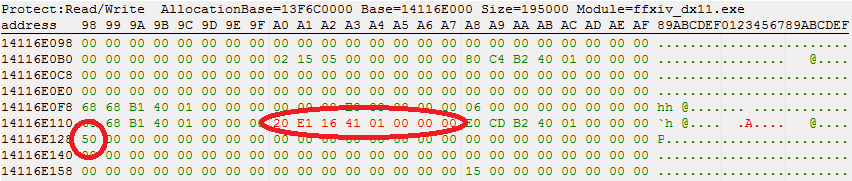

In the above screenshot,
the small circle is the beast gauge values at `14116E128`
and the longer circle is the pointer at `14116E118` that is
being used to load `rcx`.
This memory browsing confirms the comment earlier,
that the memory at `14116E118` contains the pointer `000000014116E120`.
(As always, little endian means reversing the bytes.)

### Extracting a Signature From Assembly

So, now we have some assembly code that contains a pointer to a pointer to the beast gauge.
We need to pick out some bytes from the assembly code to serve as the signature.

There's a little bit of an art to picking good signatures.
You want to always want to ignore relative pointer offsets,
like the `23C14201` value from before.
These offsets will be the same from run to run,
but change from patch to patch with great frequency.
Finding signatures is a huge pain,
so ideally you want to find something that will stand the test of time.

In this case, let's just start copying bytes out from the bytes column,
starting with the `mov rcx, ...` line.

```assembly
48 8B 0D 23C14201     - mov rcx,[ffxiv_dx11.exe+1AAE118] { (14116E120) }
48 85 C9              - test rcx,rcx
74 B8                 - je ffxiv_dx11.exe+681FB2
48 8B 05 67C14201     - mov rax,[ffxiv_dx11.exe+1AAE168] { (21) }
```

This gives us: `48 8B 0D 23C14201 48 85 C9 74 B8 48 8B 05 67C14201`

The two four byte patterns are both pointers,
so let's just drop the one on the end and make the internal one a wildcard.
You can make wildcards using question marks,
both in cactbot and in Cheat Engine.

Thus, our final signature is: `488B0D????????4885C974B8488B05`

The address that contains the pointer we care about is the four bytes in the question mark.

You can see this [in cactbot itself](https://github.com/OverlayPlugin/cactbot/blob/df176c4feff81bab356a8e5e6e6b453e94626320/CactbotOverlay/FFXIVProcess.cs#L189).

It's important to do a [scan for existing memory signatures](#scan-for-existing-memory-signatures) to make sure that this signature is unique.

Then, in your plugin, the process would be the following.

* search for this signature in memory
* convert the RIP relative addressing to a real pointer (e.g. `14116E118`)
* find the pointer at that memory location (e.g. `14116E120`)
* this pointer is the pointer to beast gauge

Because `14116E118` points 8 bytes forward to `14116E120`,
we could just also make the assumption that this is always true
and just add 16 bytes to what we find in the signature.
This has been true through all of Stormblood, at least.

Foof.

## Scan For Existing Memory Signatures

If you have an existing memory signature,
you can also use Cheat Engine to find it in memory.

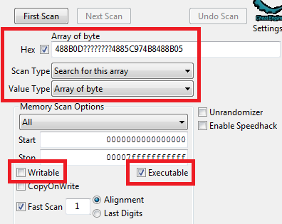

Start another scan.
This time, set the **Value Type** to **Array of byte**, and select **Search for this array**.
Click the **Hex** checkmark, and paste in the signature that we got previously.
Make sure to click the **Executable** checkmark, as we are searching for code.

If you click **First scan**, this should find a single result.
If you right click that address, and select **Disassemble this address**
it will bring you right back to the code that we found previously.
