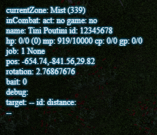

# Patch Update Checklist

This is a guide for steps to update cactbot when FFXIV has a patch.

## Game Data Resource Updates

Once the patch is downloadable,
there are some changes that can be made before the game is up.

### Update Saint Coinach

First, run Saint Coinach.
You can download this program from [the githup repo](https://github.com/xivapi/SaintCoinach).
It updates fairly quickly (on the order of a day),
but will usually not be updated if you are running it right when the patch is up.

If you are running this inside git bash, the command will look like this:
`./SaintCoinach.Cmd.exe "C:\\Program Files (x86)\\SquareEnix\\FINAL FANTASY XIV - A Realm Reborn"`

After a patch update, this will prompt you with something like this:

```text
Game version: 2023.09.28.0000.0000
Definition version: 2023.07.26.0000.0000
Update is available, perform update (Y/n)?
```

"Perform update" is not recommended.
This attempts to update Saint Coinach's definition files based on any changes it finds.
It almost never works, nearly always crashes, and also takes a long time.
Instead, we will just cross our fingers and hope that the old definitions work with the new data.
75% of the time, this is successful and the old version of Saint Coinach is "good enough"
to use for the data cactbot needs.

Instead of "perform update",
update the `Definitions/game.ver` file manually to have the correct game version.
In this example the content of the file should be `2023.09.28.0000.0000`,
but in practice use whatever the prompt says is the most current version.

Once done, re-run Saint Coinach and verify that an `exd Status` command works.
It should look something like this:

```text
Game version: 2023.09.28.0000.0000
Definition version: 2023.09.28.0000.0000
SaintCoinach.Cmd (Version 0.1.0.0)
> exd Status
1 files exported, 0 failed
> exit
```

If it crashes or the data looks very weird after running scripts (e.g. every zone id changes)
then wait until Saint Coinach updates.
You can copy any release from the github page over top of your Saint Coinach folder with the release,
and then re-run these steps.

### Run update scripts

Once Saint Coinach is locally running, you can run cactbot update scripts.
Run all of these scripts in any order and then commit the result.

```shell
python util/gen_zone_id_and_info.py
python util/gen_weather_rate.py
python util/gen_hunt_data.py

node --loader=ts-node/esm util/gen_effect_id.ts
node --loader=ts-node/esm util/gen_world_ids.ts
node --loader=ts-node/esm util/gen_pet_names.ts
```

Here's an example: <https://github.com/quisquous/cactbot/pull/5823/files>

### Manually handle zone script

The `gen_zone_id_and_info` script usually needs special handling.
`npm run test` will let you know about this when committing or uploading.

#### Removed zones

If any zone has been entirely removed from the game,
but we still want to keep the data around (e.g. an unreal)
then we need to manually add its data to the script.

For example, in 6.5 Zurvan unreal was removed and Thordan unreal was added.
See <https://github.com/quisquous/cactbot/pull/5823/files#diff-a275c2dbc2bd9076b132684367bf1ba27604a652b5c0e39c7449f6bd64b34a9f>

This needs to be added to the `synthetic_ids` list:

```python
"ContainmentBayZ1T9Unreal": 1157,
```

...and this needs to be added to the `synthetic_zone_info` array.

```python
    1157: {
        "contentType": 4,
        "exVersion": 4,
        "name": {
            "cn": "祖尔宛幻巧战",
            "de": "Traumprüfung - Zurvan",
            "en": "Containment Bay Z1T9 (Unreal)",
            "fr": "Unité de contention Z1P9 (irréel)",
            "ja": "幻鬼神ズルワーン討滅戦",
        },
        "offsetX": 0,
        "offsetY": 0,
        "sizeFactor": 400,
        "weatherRate": 75,
    },
```

This will allow the zone script to continue outputting this non-existent zone
so that zone files can use this id.

You'll also need to likely reformat the python file via `black **/*.py --line-length 100`.

#### Zone collisions

The zone id and info emitting script ignores any zones that have a name collision.
It will print these out to the console when running the script.

For example, when updating for 6.5, it emits these new lines (among others):

```text
collision TheBurn: {"territory_id": "789", "cfc_id": "585", "place_id": "2851", "name": "e3d7", "weather_rate": "97", "map_id": "480", "territory_intended_use": "3", "ex_version": "2"}
collision TheBurn: {"territory_id": "1173", "cfc_id": "585", "place_id": "2851", "name": "e3d7_re", "weather_rate": "97", "map_id": "480", "territory_intended_use": "3", "ex_version": "2"}
collision TheGhimlytDark: {"territory_id": "793", "cfc_id": "611", "place_id": "2586", "name": "g3d5", "weather_rate": "0", "map_id": "500", "territory_intended_use": "3", "ex_version": "2"}
collision TheGhimlytDark: {"territory_id": "1174", "cfc_id": "611", "place_id": "2586", "name": "g3d5_re", "weather_rate": "0", "map_id": "500", "territory_inte nded_use": "3", "ex_version": "2"}
```

Because these dungeons were updated for trusts in 6.5, there are two dungeons with the same name in the game.

To handle this we can rename the old dungeon's id to be `TheBurn64` in the `synthetic_ids` array
(i.e. The Burn in 6.4 and earlier)
so that there is no collision.
See: <https://github.com/quisquous/cactbot/pull/5823/files#diff-a275c2dbc2bd9076b132684367bf1ba27604a652b5c0e39c7449f6bd64b34a9fR59-R61>

Then, copy the raidboss triggers, raidboss timeline, and oopsy triggers into new files,
e.g. `the_burn64.ts` and `the_burn64.txt`.
You'll need to manually rename all the ids as well so they don't conflict.
See: <https://github.com/quisquous/cactbot/pull/5824/files>

The reason for this is so that the new files can be updated without breaking Chinese and Korean
users who are are still using the older dungeon.

Theoretically, once all regions are past a particular version we can delete the old files.

#### Formatting, sorry

Sorry, somebody should fix this to be ignored (or otherwise not happen)
but this always needs to be reformatted and this change should not be committed or lint will fail.

```diff
-      'fr':
-        'Entraînement<Indent/>: in<SoftHyphen/>fil<SoftHyphen/>tra<SoftHyphen/>tion en base ennemie',
+      'fr': 'Entraînement<Indent/>: in<SoftHyphen/>fil<SoftHyphen/>tra<SoftHyphen/>tion en base ennemie',
```

### Update Content List

`resources/content_list.ts` is a manually curated list of all content.
This is what appears on the [coverage page](https://overlayplugin.github.io/cactbot/util/coverage/coverage.html).
It is also the ordering in the cactbot config ui,
although that also sorts by expansion as well.

Manually add any dungeons, trials, raids, etc to this list.
The idea is to keep them in roughly the same sections and order as the duty finder ui
so that parts of cactbot using this for sorting puts content is a reasonable order.

See: <https://github.com/quisquous/cactbot/pull/5825/files>

### Create a meta-issue

Also consider making a meta github issue tracking new content to coordinate who is working on what.
For example, <https://github.com/quisquous/cactbot/issues/5712>.

## In Game Memory Verification

Once the game is back up, memory signatures can be checked.
You do not need a working FFXIV plugin to do this.
This could theoretically be done earlier on game data too with Ghidra etc.

### Check memory signatures

cactbot has a number of memory signatures that it uses.
(Maybe some day cactbot plugin will merge with OverlayPlugin?)

There are four signatures, which all live in [FFXIVProcessIntl.cs](https://github.com/OverlayPlugin/cactbot/blob/main/plugin/CactbotEventSource/FFXIVProcessIntl.cs).

- Charmap (information about your character)
- Job Data (gauge info for your job)
- In Combat (whether the game thinks you are in combat)

OverlayPlugin also duplicates the charmap and in combat signatures,
so if cactbot is broken please update those as well.

Look for errors in the OverlayPlugin log (ACT->Plugins->General->the scrolly textbox at the bottom).

There are two cactbot errors to look out for in the log.

1) `Charmap signature found 0 matches`
2) `Charmap signature found, but conflicting match`

The signature should match exactly one location in the executable.
If it finds zero or two in different places, then it will not work.
You will need to find a new signature.
See the [Memory Signatures](memory_signatures.md) documentation for more info.

OverlayPlugin will also print out lines like:

```text
[10/6/2023 5:13:18 PM] Info: Found in combat memory via InCombatMemory61.
[10/6/2023 5:13:18 PM] Info: Found combatant memory via CombatantMemory65.
[10/6/2023 5:13:19 PM] Info: Found target memory via TargetMemory63.
[10/6/2023 5:13:19 PM] Info: Found enmity memory via EnmityMemory60.
[10/6/2023 5:13:20 PM] Info: Found aggro memory via AggroMemory60.
[10/6/2023 5:13:20 PM] Info: Found enmity HUD memory via EnmityHudMemory62.
```

...and will print errors if it is not found.

### memtest overlay

Even if all the signatures are found,
the offsets might be incorrect.

If you add the [cactbot test overlay](https://github.com/OverlayPlugin/cactbot#test-module)
as an Overlay, it will give you a bunch of information from memory.

The most important values are: zone, name, and job id.

Here is a screenshot after the 6.5 patch where the job is broken.



If the signatures are correct, but the offsets are wrong they need to be updated in
[FFXIVProcessIntl.cs](https://github.com/OverlayPlugin/cactbot/blob/main/plugin/CactbotEventSource/FFXIVProcessIntl.cs).
See <https://github.com/quisquous/cactbot/pull/5826/files> as an example.

#### Verify basic info

Verify name and id (if you know your own id).
Job breaks more often than not,
but is usually only adjusted slightly.

Face south. Rotation should be ~0.
Face east. Rotation should be ~pi/2.
Walk east. The x position value should increase.
Walk south. The y position value should increase.
Jump. The z position value should increase.

The other thing that breaks a lot is the shield percentage.
It would be nice to add this to the test overlay.
You can see it as a yellow overlay on top of hp in the jobs overlay.

#### Verify In Combat

Hit a target dummy.
The `game: no` should switch to `game: yes`.
Reset your aggro, it should switch back to `game: no`.
If the FFXIV plugin hasn't been updated, it will likely say `act: no`.

### Verify Job data

Job data only infrequently changes (during a job rework or at each expansion).
It is not ~usually verified (as there are a lot of jobs) before doing a release.
Test at least one job with the cactbot jobs overlay and make sure boxes update.

## et voila, release

Once the resources are updated and the signatures and memory data look good,
do a cactbot release!

## Other things

It'd be nice to have a list of OverlayPlugin steps too, but that could live elsewhere.
