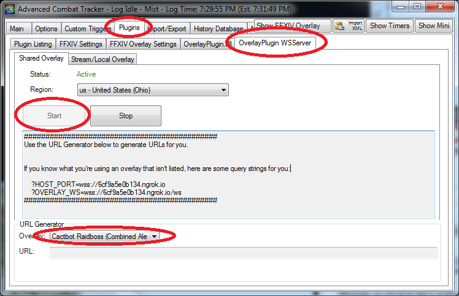
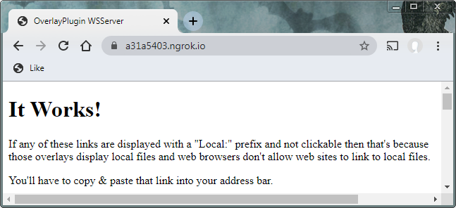
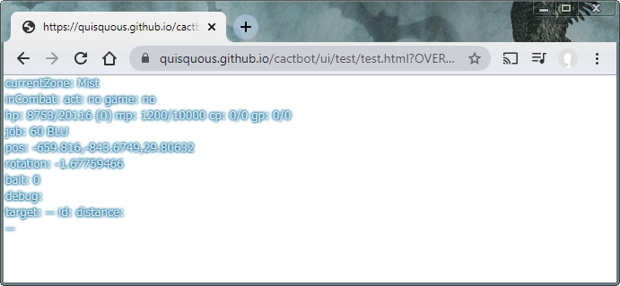
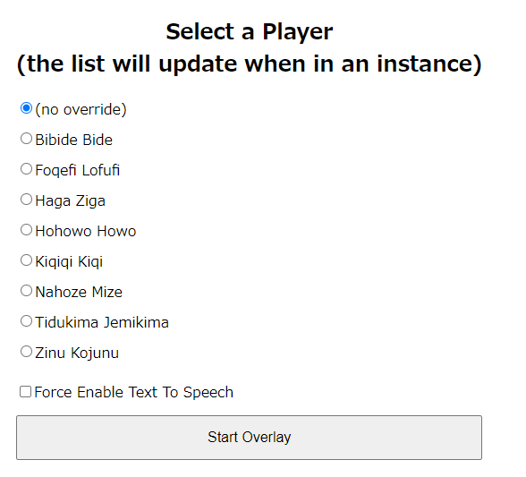
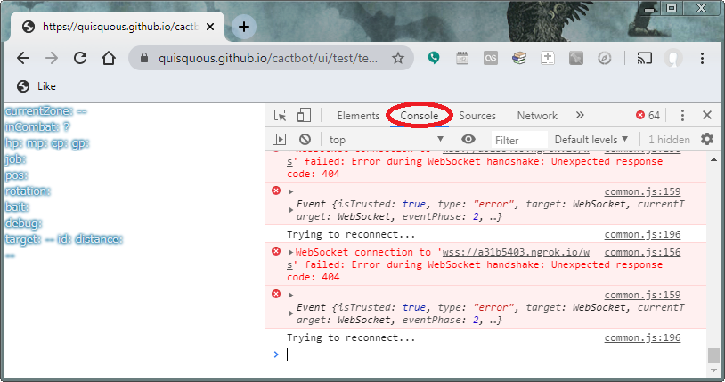

# Remote Cactbot

This is a guide for allowing others to get their own cactbot callouts and DPS numbers without running ACT themselves.
This is ideal for PS4 users who can't use ACT as well as DX9 users.

The recommended method is to use the port forwarding built into OverlayPlugin.
Port forwarding can give personalized triggers to each person connected.
This method also will allow others to view dps meters
or any other kind of overlay.

## Alternatives

Another way is to use the [discord bot plugin](https://github.com/Makar8000/ACT-Discord-Triggers/wiki/First-Time-Setup-Guide).
The discord bot will play all of the tts from cactbot that you would hear
and play it for the rest of the party.

For cactbot, this is less great
because many cactbot triggers are personalized
and it is not meant to be a generalized "raid caller"
even if it sort of works that way.
Currently, cactbot sounds do not play through the plugin.

If a single discord tts raidcaller is what you are really looking for,
[Triggernometry](https://github.com/Aho-Senpai/Aho-Triggers/blob/main/Triggernometry/Docs/FAQ.md#discord-callouts-ready)
will be a better fit than cactbot for what you are trying to do.

## Port Forwarding Overview

Here are the steps you need to follow as the person running ACT:

- [Setup OverlayPlugin WSServer](#setup-overlayplugin-wsserver)
- [Test Your Connection](#test-your-connection)
- [Connect to Remote ACT](#connect-to-remote-act)
- [Configure Raidboss](#configure-raidboss)

If you get lost, see the [HALP](#halp) section.

## Setup OverlayPlugin WSServer

OverlayPlugin runs a server which accepts [WebSocket](https://en.wikipedia.org/wiki/WebSocket) connections
that allows other applications to use ACT's data.
(This is different from ACTWebSocket which is no longer maintained
and cactbot does not support.)
It also has built in support for ngrok to enable port forwarding
so that others outside your local network can connect to that WebSocket server.

To enable this in ACT,
go to **Plugins** -> **OverlayPlugin WSServer** -> **Shared Overlay**

On this page, select your region.
Click `Start`.
Your screen should look like the above image with
`Launching ngrok...Done!`
and it should say
`Status: Active`
at the top of the screen.

### Test Your Connection

Now that you've established port forwarding, test your connection.
In all of these examples in the rest of the documentation,
replace the `a31a5403.ngrok.io` with the url shown in the log window.
Going to <https://a31a5403.ngrok.io/>
(substituting your server url) should give you the following "It Works" page.

If this is set up properly,
you can select an overlay preset like `Cactbot Test`
and it will give you a url to open in a browser, e.g.
<https://overlayplugin.github.io/cactbot/ui/test/test.html?OVERLAY_WS=wss://a31a5403.ngrok.io/ws>

That file is a web page being served by github,
but the query string tells the overlay web page to connect to your ACT instance.
With ACT and FFXIV open, you should see the test data update based on your actions in game.

If this is not working or you are not seeing any information, see the [HALP](#halp) section.

## Connect to Remote ACT

Now, friends can connect to your ACT remotely.
Unfortunately, all of the overlay html pages needs to be hosted remotely.
Rather than loading local urls from your filesystem like
`C:\Users\tinipoutini\cactbot\ui\raidboss\raidboss.html`
you need to use github urls like
`https://overlayplugin.github.io/cactbot/ui/raidboss/raidboss.html`.

In general, you can use the URL Generator at the bottom of the OverlayPlugin tab
to generate urls for any presets.

For example:

- cactbot raidboss overlay: <https://overlayplugin.github.io/cactbot/ui/raidboss/raidboss.html?OVERLAY_WS=wss://a31a5403.ngrok.io/ws>
- rdmty DPS overlay: <https://overlayplugin.github.io/cactbot/ui/dps/rdmty/dps.html?OVERLAY_WS=wss://a31a5403.ngrok.io/ws>
- cactbot oopsy: <https://overlayplugin.github.io/cactbot/ui/oopsyraidsy/oopsyraidsy.html?OVERLAY_WS=wss://a31a5403.ngrok.io/ws>

### Configure Raidboss

If you load raidboss remotely, you will see a player selection dialog.

The list of players will populate once you are in an instance.
Choose yourself in this list, and click `Start Overlay` to begin raidboss.

If you want TTS and the person hosting does not have TTS turned on,
you can enable this with the `Force Enable Text To Speech` checkbox.

Unfortunately at the moment,
all of the cactbot customization is local
and any remote player will inherit the customization of the host.
The only option you can override right now is to enable TTS.

In the future, it may be possible to append some additional parameters to
load your own user directory, but not currently.

### Other Overlays

Not all overlays are able to be run remotely.
cactbot, oopsy, pullcounter, and dps overlays are supported.

radar and jobs will not work
as they require more information about your player.

## HALP

If you get stuck or confused on any of these steps,
the best place to get help is the [FFXIV ACT discord](https://discord.gg/ahFKcmx) #troubleshooting channel.
There is no cactbot discord; you should go here.

Port forwarding is not really part of cactbot,
so please only file a cactbot github issue if your raidboss party override doesn't work.

### Troubleshooting Hints

If you are looking at url in the browser like
<https://overlayplugin.github.io/cactbot/ui/test/test.html?OVERLAY_WS=wss://127.0.0.1:10501/ws>
and you don't see any data, even though you are in game,
ACT is running,
and the ACT WSServer is running, then you should look at devtools.

In Chrome, right click on the page and go to `Inspect` (or hit Ctrl+Shift+I).
Then click on `Console` to show the console output:

This will give you more information to help diagnose your problem.
