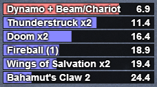
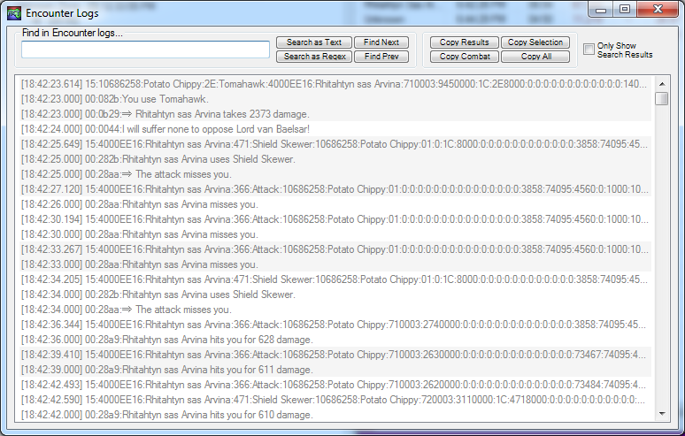

# Timeline Guide

This is a guide for people who want to write timelines,
primarily for cactbot.



cactbot uses the [raidboss module](https://github.com/OverlayPlugin/cactbot#raidboss-module)
for triggers and timelines.
These are combined together so that you can make triggers that are based on actions
or triggers that are based on timelines themselves.

## Table of Contents

* [Timeline Guide](#timeline-guide)
  * [Table of Contents](#table-of-contents)
  * [History](#history)
  * [How do Timelines Work](#how-do-timelines-work)
  * [Timeline File Syntax](#timeline-file-syntax)
    * [Comments](#comments)
    * [Entries](#entries)
    * [Commands](#commands)
    * [Basic Testing](#basic-testing)
  * [Cactbot Style Guide](#cactbot-style-guide)
    * [Guidelines](#guidelines)
    * [Trigger Filenames](#trigger-filenames)
    * [Pre-timeline combat, starts & resets, and multiple zones](#pre-timeline-combat--starts---resets--and-multiple-zones)
  * [Timeline Triggers](#timeline-triggers)
  * [Timeline Injection](#timeline-injection)
  * [Timeline Translation](#timeline-translation)
  * [Making a Timeline](#making-a-timeline)
    * [Run the fight a few times](#run-the-fight-a-few-times)
    * [Software prerequisites](#software-prerequisites)
    * [Timeline Skeleton](#timeline-skeleton)
    * [Using make_timeline.ts](#using-make-timelinets)
    * [Timeline Ability Tables](#timeline-ability-tables)
      * [One Hacky Workflow Suggestion](#one-hacky-workflow-suggestion)
    * [Using make_timeline.ts with fflogs](#using-make-timelinets-with-fflogs)
    * [Using test_timeline.ts](#using-test-timelinets)
    * [Using test_timeline.ts with fflogs](#using-test-timelinets-with-fflogs)
  * [Common Timeline Edits](#common-timeline-edits)
    * [`-ii` to ignore abilities](#--ii--to-ignore-abilities)
    * [`-p` for later phases](#--p--for-later-phases)
    * [Targetable Lines](#targetable-lines)
    * [Ignoring Combatants](#ignoring-combatants)
    * [Adjusting Blocks of Timelines](#adjusting-blocks-of-timelines)
    * [Variations vs Simultaneous Abilities](#variations-vs-simultaneous-abilities)
    * [Basic Loops](#basic-loops)
    * [Branches](#branches)
    * [HP% Pushes](#hp--pushes)
    * [Doubled Abilities](#doubled-abilities)
    * [Doubled Abilities with suffixes](#doubled-abilities-with-suffixes)
    * [Multi-hit Abilities](#multi-hit-abilities)
    * [Numbering Important Mechanics](#numbering-important-mechanics)
    * [Renaming Abilities to `--sync--`](#renaming-abilities-to----sync---)
  * [Future Work](#future-work)
    * [Smaller Fixes/Changes](#smaller-fixes-changes)
    * [Larger Features](#larger-features)
    * [Ability Table](#ability-table)

## History

Back in 2016, Shasta Kota on the Death and Taxes website made this
[guide](https://web.archive.org/web/20230426121530/https://dtguilds.enjin.com/forum/m/37032836/viewthread/26353492-act-timeline-plugin) to use with anoyetta's [ACT timeline plugin](https://github.com/anoyetta/ACT.Hojoring).
That plugin is now part of Hojoring.

There's also an older [kaizoban](https://github.com/090/act_timeline/releases) version of the plugin that some people have used that predates anoyetta's work.

cactbot timeline files were originally intended to be backwards compatible with these.
Eventually when it became clear that nobody else was using this format,
some breaking changes were added, including:

* `forcejump` keyword
* `label` keyword
* netregex sync syntax, e.g. `Ability { id: "1234", source: "That Mob" }` instead of `sync /etc/`

## How do Timelines Work

You can think about timelines as being a very simple state machine.
There are two states: whether it is paused or not, and the current timeline time.

They start paused at time=0.
As soon as any sync happens, it jumps to that time, then unpauses.
If it ever jumps to time=0, then it pauses again.

When playing, the timeline time advances in real time.
In other words, if the timeline time is currently `360.2`
and then exactly two seconds of real time pass,
then the timeline time will automatically move to `362.2`.

To keep the timeline on track, the timeline is full of syncs
which each have a window of time that they are active for.

Take the line:
`1350.7 "Melt" Ability { id: "5372", source: "Shiva" } window 20,10`

This line has a `window 20,10` and a time of `1350.7`.
This means that between the timeline times of `1330.7` and `1360.7` this sync is active.

Once the current timeline time is within that window of 30 seconds, then it can be synced to.
If the regex `Ability { id: "5372", source: "Shiva" }` matches any network log line,
then the current timeline will jump to `1350.7`.
After that the timeline will continue playing and moving forward in real time.
If that line occurs outside the valid window, it is ignored.

## Timeline File Syntax

Each line in a timeline file is considered its own timeline entry.
There is no ordering at all.
The fact that timeline files are ordered is as a convenience to the reader.
(Two lines with the same time do keep their relative ordering.)

### Comments

On any line, a hash character `#` signifies a comment.
Everything after that on the current line will be ignored.

### Entries

Here are some grammar examples of the timeline.
(The parentheses here indicate optionality and are not literal parentheses.)

There are only a few keywords: `hideall`, `jump`, `forcejump`, `duration`, `window`, `label`.

Note: `forcejump` and `label` were added during Endwalker and so
many previous timelines do not use these (but could and should).

```text
# hideall "[string]"
hideall "--sync--"
hideall "Reset"

# [number] label "[string]"
3631.7 label "oschon-p2-loop"
6508.1 label "statice-10-loop"

# [number] "[string]" (duration [number])
677.0 "Heavensfall Trio"
1044 "Enrage" # ???
35.2 "Flare Breath x3" duration 4

# [number] "[string]" [LogType] { [params] } (window [number],[number]) (jump [numberOrLabel]) (duration [number])
685.5 "Warder's Wrath" Ability { id: "662A", source: "Erichthonios" } jump 1077.3
267.5 "Resonance" Ability { id: "B6B", source: "Kaliya" } window 10,10 jump 217.5
28.0 "Damning Edict?" Ability { id: "3150", source: "Chaos" } window 30,10 jump 2028.0

# [number] "[string]" [LogType] { [params] } (window [number],[number]) (forcejump [numberOrLabel]) (duration [number])
5639.7 "Made Magic" Ability { id: "8B94", source: "Quaqua" } window 40,40 forcejump "quaqua-right-untouched-loop"
1258.6 "Immolating Shade (light parties)" Ability { id: "8496", source: "Golbez" } forcejump 1600.0
```

`[number]` can be an integer, e.g. `34`, or a float, e.g. `84.381`.

`[numberOrLabel]` can be a `[number]` (e.g. `42` or `12.8`)
or a label name with double quotes (e.g. `"loop"` or `"branch2"`).

`"[string]"` is a character string, e.g. `"Liftoff"` or `"Double Attack"`

`[LogType]` is a key from [netlog_defs.ts](../resources/netlog_defs.ts),
e.g. `Ability` or `StartsUsing` or `AddedCombatant`.
Any line with `[LogType]` and parameters is a "sync".

`[params]` are a [JSON5](https://json5.org/) object.
The keys are from the `fields` of the `LogType`.
See: the [Log Guide](LogGuide.md) for more explanation.
The values are either strings or arrays of strings.
Style-wise, prefer using bareword keys with double quotes.
(Even if quoted keys or single quotes are legal.)

These string param fields are interpreted as regular expressions,
so `"E.D.D."` means `E` followed by any character then `D` followed by any character (etc).
If you want escape a regular expression character, you need two backslashes, e.g.
`"E\\.D\\.D\\."` (i.e. matching the literal string `E.D.D.`).

Additionally, if you are using [sync_files.ts](RaidbossGuide.md#sync-files) for this timeline
you should spell out ability ids in full, e.g. `id: "(8B43|8B46)"` instead of `id: "8B4[36]"`,
so that the script can find and replace them properly.

The ability time and ability name always need to come first,
but `duration`, `forcejump`, `jump`, `[LogType]`, and `window`
do not have to be in any order with respect to each other.
Stylistically, usually the`[LogType]` sync is put first.

**duration** is a time in seconds to display the accompanying action.
Usually, timeline entries disappear immediately,
but sometimes an action is ongoing, like 5x Bahamut's Claw in a row.
You can use `duration` to show the action for that length of time.
It does not need a sync to do this.

The syntax for **duration** is `duration [number]`,
as `duration 5.5`.

**forcejump** tells the timeline playback to jump to a particular time
if the sync is encountered *or* if the line containing the **forcejump**
is reached without syncing.
This is intended for loops that will always be taken in an encounter.

When this is used, no "lookahead" loop unrolling is needed,
and the timeline will use the **forcejump** destination to list events in the future,
because it knows that it will always jump there.
If this line syncs prior to time passing it by,
it will behave exactly like a normal **jump**.
If the time passes this line,
then it will jump as if it had synced exactly on time.
This is not handled specially in `test_timeline`, which expects the sync to be correct.
If there is a **window** parameter on the same line,
and its second value extends past the **forcejump** time,
this "overhang window" will still be respected even after force jumping
until the next sync or jump occurs.

The syntax for **forcejump** is `forcejump [number]` (e.g. `forcejump 204.2`)
or `forcejump [label]` (e.g. `forcejump "quaqua-middle-poison-loop"`).

**jump** tells the timeline playback to jump to a particular time
if and only if the sync is encountered.
This is usually used for phase pushes and loops that involve multiple blocks.
The timeline controller does not require a timeline entry at the time you jump to,
but common practice is to ensure there there is one for readability and sanity-check purposes.
If you jump to time 0, the timeline will stop playback.

The syntax for **jump** is `jump [number]` (e.g. `jump 204.2`)
or `jump [label]` (e.g. `jump "Hieroglyphika"`).

**window** is the time frame in which to consider the sync.
By default, if **window** is not specified, cactbot considers it the
same as specifying `window 2.5,2.5`.
In other words,
2.5 seconds before the ability time and 2.5 seconds after.
As an example, for the line `3118.9 "Lancing Bolt" Ability { id: "3876", source: "Raiden" }`,
if the log line for this ability is encountered anywhere between `3116.4` and `3121.4`
then it will resync the timeline playback to `3118.9`.
Often timelines will use very large windows for unique abilities,
to make sure that timelines sync to the right place even if started mid-fight
or if hp pushes are discovered when the content is no longer current.

The syntax for **window** is `window [number],[number]` (e.g `window 10,30`).
There is no space after the comma.

### Commands

To hide all instances of an ability, you can use the `hideall` command.
Most timelines start with the line `hideall "--sync--"`
to hide syncs that are just used to keep the timeline on track but should not be shown to the player.
Timeline triggers can still match hidden entries.

There are a number of other commands for generating alerts based on timeline entries.
These are still supported but are not documented.
Instead, alerts based on timelines in cactbot should use [timeline triggers](#timeline-triggers).

### Basic Testing

In cactbot, running `npm run test` will run tests to verify that there are no errors.

## Cactbot Style Guide

Timelines are extremely subjective.
The goal is to be clear and useful to people using it.
This means cleaning up things that feel "noisy" but leaving in as much as possible.
It requires a good bit of manual work to create a nice feeling and correct timeline.

In general, cactbot has decided to use actual ability names instead of things like "raidwide".
It's easier to translate, but it is hard to talk about abilities with others if
"raidwide" could mean "Ultima" or "Gaiochos" or "Caloric Theory".

### Guidelines

* add syncs for every ability possible.
* if there is only one boss in a zone, the timeline should start on entering combat.
(The timeline utility will usually add the correct line automatically for you.)
* add a sync for the first cast that will start the timeline so that testing with fflogs will sync properly.
* it is generally unnecessary to sync to the first auto-attack.
(In special cases such as raid bosses with checkpoints,
it may be acceptable to sync an auto for the second part of the encounter.)
* remove all other auto attack syncs, as these are often inconsistent.
* include any special command line flags used to generate the timeline in a comment at the top.
(The ignore-combatant and ignore-ability flags
are automatically added by the timeline utility for your convenience.)
* prefer actions for syncs over game log lines, but sync to game log lines if that's the only option.
* if you do sync a phase with game log lines,
add a large window sync for an action after that line for safety.
* if a boss has multiple phases,
and one or more of those phases begins with a to-that-point unique ability,
add a wide sync from the start of the encounter to each phase-opening line.
If this is not possible, still try to add wide syncs to the beginning of each phase.
* use original names for ability text as much as possible.
(If an ability name is uncomfortably long,
or if it otherwise makes sense to modify how it's displayed,
handle that modification in the timeline replacement section of the trigger file.)
* loops should use `jump` or `forcejump` to return to an earlier point in the timeline,
rather than using a wide window sync at the beginning of the loop for readability.
* liberally use whitespace and comments to make the timeline readable.
* do not put any triggers, tts, or any other form of alerts in the timeline file itself.
* use [timeline triggers](#timeline-triggers) from within a trigger file for any alerts.
* prefer using `label` for all jumps rather than jumping to a number.
* for any loop that is always taken, use `forcejump` to automatically provide lookahead.
* for any loop or branch that is conditionally taken, add a lookahead window of at least 30 seconds *and* 6 abilities.
* for any `jump` or `forcejump`, prefer to jump via `StartsUsing` instead of `Ability` where possible to jump sooner.
* comment out syncs from any displayed abilities that are within 3 seconds of each other,
but do not remove them. (This preserves the ability ID for future maintainers.)
* prefer to use `npcNameId` instead of `name` on `AddedCombatant` lines.
* use `-la` with `make_timeline` to print an [ability table](../ui/raidboss/data/06-ew/dungeon/another_aloalo_island.txt#L92-L142) and fill it out.
* As always, be consistent with other timelines.

### Trigger Filenames

The general goal of filenames is to be consistent
with what the community calls these fights.
Trials get called by the name of the boss,
raids get abbreviated and numbered,
dungeons are called by their zone.

For filenames, use underscores to separate words.
For trials like `nm` (normal mode), `hm` (hard mode), `ex` (extreme mode), `un` (unreal mode)
separate with a hyphen.
Dungeons with hard in the name can spell out "Hard" as a full word.
Articles like `The` can be dropped.
Raids are numbered through the tier,
e.g. `t1` through `t13` and `a1s` through `a12s`.
Savage fights should have an `s` suffix
while normal fights have an `n` suffix.
(However, this does not apply to coil raids.)

Examples:

* The Grand Cosmos: `grand_cosmos`
* Titan Extreme: `titan-ex`
* Ruby Weapon Extreme: `ruby_weapon-ex`
* Thordan Unreal: `thordan-un`
* The Great Gubal Library (Hard): `great_gubal_library_hard`
* Sigmascape V2.0 (Savage): `o6s`
* Alexander - The Arm of the Father: `a3n`
* The Final Coil of Bahamut: `t13`

### Pre-timeline combat, starts & resets, and multiple zones

There is no one-size-fits-all approach for starting and resetting timelines.

In single-boss, single-zone content (e.g., most trials),
the timeline should start when combat begins,
and should reset on a wipe or when the player is out of combat.

However, in dungeons for example, the player is often in combat
with mobs before the timeline should begin for the first boss encounter.
For that matter, there are also several boss encounters in each dungeon.
In those situations, we need discrete timelines for each boss encounter,
and each boss's timeline should start only once that boss encounter begins.

There are a number of ways we can handle this.

First, by default, cacbot will reset the timeline to time=0
whenever a player is out of combat.
This default can be overriden in particular fight's trigger set
with the following property:

```typescript
resetWhenOutOfCombat: false
```

This property is only used in selective circumstances (e.g. zones like Eureka),
so we'll approach timeline creation here assuming default behavior.

The first step is determining how the timeline should begin running.

If the timeline should begin when the player first begins combat,
we can use OverlayPlugin's 0x104 InCombat line
to detect when the player enters combat:

```text
0.0 "--sync--" InCombat { inGameCombat: "1" } window 0,1
```

(`make_timeline` generates this line by default where appropriate.)

However, if there will be pre-timeline combat (e.g., pre-boss mobs),
this would incorrectly start combat during the pre-boss phase,
so we need a different approach.

In these situations, boss encounters (and timelines) are often tied
to a specific zone within the instance,
which means we can start the timeline when that zone is sealed off.
For example:

```text
# Landfast Floe will be sealed off
100.0 "--sync--" SystemLogMessage { id: "7DC", param1: "10CD" } window 100000,0
```

(`make_timeline` generates this by default if the encounter begins with a zone seal.)

This `SystemLogMessage` is the equivalent of the `GameLog` that looks like
`00|2023-12-14T21:02:36.0000000-08:00|0839||The Landfast Floe will be sealed off in 15 seconds!|419a62a812652b97`.
However, by using `SystemLogMessage` with an id, it will work without chat log lines turned on
and it does not require any translations and thus is more robust.

For multi-zone instances like dungeons, we can effectively create
separate timelines for each encounter in the same timeline file
by using large gaps between the timelines, coupled with large sync windows.

For example, in [Alzadaal's Legacy](../ui/raidboss/data/06-ew/dungeon/alzadaals_legacy.txt),
we effectively have three separate timelines,
one for each boss encounter, each spaced 1000 seconds apart.
Because the timeline resets to 0 each time the player is out of combat,
we use large sync windows on each zone-seal message to 'jump' the timeline
to the right place for each encounter:

```bash
# Undersea Entrance will be sealed off
0.0 "--sync--" SystemLogMessage { id: "7DC", param1: "103E" } window 0,1
# etc etc
# The Threshold of Bounty will be sealed off
1000.0 "--sync--" SystemLogMessage { id: "7DC", param1: "103F" } window 1000,1
# etc etc
# Weaver's Warding will be sealed off
2000.0 "--sync--" SystemLogMessage { id: "7DC", param1: "1040" } window 2000,1
```

Finally, because cactbot automatically resets the timeline when the player is out of combat,
there is no need to include specific reset lines in most timeline files by default.

However, if a trigger set contains the property to NOT reset the timeline
when out of combat, there are several options for manualy triggering a reset.

On fights where the entire zone resets (e.g. all of omegascape, a4s, a8s, a12s, t9, t13),
you can use the ActorControl line that is sent on a wipe:

```bash
0.0 "--Reset--" ActorControl { command: "4000000F" } window 100000 jump 0
```

On fights with zones that seal and unseal, (e.g. a1s, t1-8)
you can use the zone unsealing message itself to reset:

```bash
0.0 "--Reset--" SystemLogMessage { id: "7DE" } window 100000 jump 0
```

This `SystemLogMessage` is the equivalent to the `GameLog` line for something like
`00|2023-12-14T21:06:37.0000000-08:00|0839||The Landfast Floe is no longer sealed!|7505dac81c639ea5`.

## Timeline Triggers

Trigger files in cactbot support adding timeline triggers.
Because people may have preferences about what triggers they want enabled by default,
and because cactbot timeline syntax extensions are not compatible with other timeline plugins,
cactbot adds all of its timeline triggers from the timeline file.

This is done by adding a `timelineTriggers` section to the triggers file.

Examples:

* [Orbonne Monastery](https://github.com/OverlayPlugin/cactbot/blob/main/ui/raidboss/data/04-sb/alliance/orbonne_monastery.ts)
* [T9](https://github.com/OverlayPlugin/cactbot/blob/main/ui/raidboss/data/02-arr/raid/t9.ts)
* [O12 normal](https://github.com/OverlayPlugin/cactbot/blob/main/ui/raidboss/data/04-sb/raid/o12n.ts)

These triggers have the [same syntax](https://github.com/OverlayPlugin/cactbot/blob/main/ui/raidboss/data/README.txt) as normal triggers.
They still allow you to use functions if you want to return something.
You can use a [condition](https://github.com/OverlayPlugin/cactbot/blob/5a7011c662d65f44c12c2fbff255484f2d31b8ef/ui/raidboss/data/02-arr/raid/t9.js#L10) to have it only trigger for a particular job or role.

However there are a few differences:

The `regex` should not be translated and should be based off of whatever is exactly in the timeline file.
It matches against the ability name in quotes on the timeline line.
The `matches` parameter to functions will return this.

They support a `beforeSeconds` parameter,
that allows you to specify how long before the ability to show the trigger.

## Timeline Injection

The timeline files themselves are constructed in a way that should be useful for everybody.
However, sometimes people want to hide parts of timelines or add other things to timelines.

This is not something that cactbot does by default anywhere, and so it is more a user configuration feature.

The triggers file supports a `timeline` entry which is an array of things to add to the timeline.
If those things are strings, it will add them directly.
If those things are functions, it will call the function and add the return value.
(The `data` parameter passed only contains a player's role and job and not other things.)

The test timeline in Summerford Farms that you can start by doing a /countdown or /bow-ing to a Striking Dummy has examples of this.
See: [test.ts](../ui/raidboss/data/00-misc/test.ts).

You can also add timeline entries to your **cactbot/user/raidboss.js** file for personalized timeline entries and triggers.
See: [user/raidboss.js](https://github.com/quisquous/cactbot-user/blob/641488590e3ea499cc3b54cc9f2f2f856dee4ad8/raidboss.js#L28)

## Timeline Translation

To support multiple languages, cactbot trigger files support a `timelineReplace` section.
You can see an example in [o12s.js](https://github.com/OverlayPlugin/cactbot/blob/ecbb723f097328c7bd0476352e5135bd5f776248/ui/raidboss/data/triggers/o12s.js#L608).
This section contains a bunch of regular expressions to replace in syncs, texts, and effects.
This has two purposes.

The first purpose is for tools, to autogenerate regular expression translations for triggers.

The second purpose is for timelines at runtime.
cactbot will use the `replaceSync` section to auto-replace anything inside curly braces on
a timeline line (e.g. `Ability { id: "1234", source: "Ultima" })`)
and the `replaceText` section to auto-replace anything inside the ability text.

Each `replaceSync` entry is applied against each parameter individually.
Only some parameters are translated (e.g. never `id`, but always `source` or `name`).
Care is needed to make sure that replacements are not overzealous.

See also: [Trigger Translation Overview](RaidbossGuide.md#translation-overview)

## Making a Timeline

### Run the fight a few times

The first step in making a timeline is generating a few ACT logs.

cactbot will also let you make timelines from fflogs clears, but this drops many log lines.
In particular, you can't get rp text lines, the text for the zone sealing/unsealing, and new combatants.

Once you've run the combat, you'll have generated a couple of [network log files](LogGuide.md#network-log-lines).

Follow those links, click **Raw**, then right click and **Save As** to save them to disk.

Good guidelines for getting good logs are:

1. run long enough to see the enrage
1. have enough people to see all the mechanics (e.g. t11 tethers don't appear without two people)
1. per phase, run long enough to see the mechanics loop
1. run several times so you can test it, especially if there are mechanic variations or hp pushes

It's also recommended that you record video at the same time.
If you don't want to stream publicly, unlisted youtube videos are a good option.

### Software prerequisites

* [Node.js](https://nodejs.org/en/)
* A copy of cactbot's [source code](https://github.com/OverlayPlugin/cactbot/archive/main.zip)
* See: [CONTRIBUTING.md](../CONTRIBUTING.md#development-workflow)

### Timeline Skeleton

There are three things you need to add a new timeline to cactbot.

Let's say you are creating a log file for the final extreme of Endwalker.

(1) Create a blank timeline file.

Add a new file called **ui/raidboss/data/06-ew/raid/zeromus-ex.txt**.
You can leave it blank.

(2) Add a new triggers file, if it doesn't exist.

Create **ui/raidboss/data/06-ew/raid/zeromus-ex.ts**.
Timeline files can only be loaded via trigger files,
so the trigger file is always required.

(Note that these steps are typically already done by repository contributors around patch release.)

An initial trigger file should look like the following:

```typescript
import { RaidbossData } from '../../../../../types/data';
import { TriggerSet } from '../../../../../types/trigger';

export type Data = RaidbossData;

const triggerSet: TriggerSet<Data> = {
  id: 'TheAbyssalFractureExtreme',
  zoneId: ZoneId.TheAbyssalFractureExtreme,
  timelineFile: 'zeromus-ex.txt',
  triggers: [],
};

export default triggerSet;
```

(3) Build cactbot.

Run `npm run build` in the cactbot source directory.
If you never run `npm install` before, you'll need to do that first.

(4) Reload raidboss

Make sure the raidboss URL is pointed to `dist/ui/raidboss/raidboss.html`.
If you've changed any of these files, reload your cactbot raidboss
plugin to pick up the changes.

If you are using `webpack-dev-server`, it will automatically reload whenever you change the source files.

### Using make_timeline.ts

For this example, we'll be using the [TheAbyssalFractureExtreme.log](logs/TheAbyssalFractureExtreme.log) file.
Feel free to play along at home.

From your cactbot directory, use the command:
`node --loader=ts-node/esm util/logtools/make_timeline.ts -f docs/logs/TheAbyssalFractureExtreme.log -lf`

```shell
$ node --loader=ts-node/esm util/logtools/make_timeline.ts -f docs/logs/TheAbyssalFractureExtreme.log -lf
(node:19900) ExperimentalWarning: Custom ESM Loaders is an experimental feature. This feature could change at any time
(Use `node --trace-warnings ...` to show where the warning was created)
┌───────┬──────────────┬────────────────┬──────────┬──────────────────────────────────┬──────────────────────────────────┬──────────┐
│ Index │  Start Date  │   Start Time   │ Duration │            Zone Name             │          Encounter Name          │ End Type │
├───────┼──────────────┼────────────────┼──────────┼──────────────────────────────────┼──────────────────────────────────┼──────────┤
│   1   │  2023-10-06  │  20:20:08.265  │   10m    │  The Abyssal Fracture (Extreme)  │  The Abyssal Fracture (Extreme)  │   Win    │
│   2   │  2023-10-06  │  21:09:43.014  │   12m    │  The Abyssal Fracture (Extreme)  │  The Abyssal Fracture (Extreme)  │   Win    │
│   3   │  2023-10-06  │  21:55:12.239  │    9m    │  The Abyssal Fracture (Extreme)  │  The Abyssal Fracture (Extreme)  │   Win    │
└───────┴──────────────┴────────────────┴──────────┴──────────────────────────────────┴──────────────────────────────────┴──────────┘
```

`-lf` lists all of the fights and their zones.
This log file has been run through the [log splitter](https://overlayplugin.github.io/cactbot/util/logtools/splitter.html)
and anonymized, and so there are only three fights.

You can make a timeline for a particular fight by using `-lf` with the index, e.g. `-lf 1`.
If you run the command, it should look something like this.

```shell
$ node --loader=ts-node/esm util/logtools/make_timeline.ts -f docs/logs/TheAbyssalFractureExtreme.log -lf 1
(node:24172) ExperimentalWarning: Custom ESM Loaders is an experimental feature. This
 feature could change at any time
(Use `node --trace-warnings ...` to show where the warning was created)
### THE ABYSSAL FRACTURE (EXTREME)
# ZoneId: 491

hideall "--Reset--"
hideall "--sync--"

0.0 "--sync--" InCombat { inGameCombat: "1" } window 0,1
72.8 "--sync--" Ability { id: "8C49", source: "Zeromus" }
75.8 "--sync--" Ability { id: "8C49", source: "Zeromus" }
83.9 "Abyssal Nox" Ability { id: "8B3F", source: "Zeromus" }
92.9 "--sync--" Ability { id: "8B41", source: "Zeromus" }
92.9 "--sync--" #Ability { id: "8B40", source: "Zeromus" }
92.9 "--sync--" #Ability { id: "8B40", source: "Zeromus" }
92.9 "--sync--" Ability { id: "8D2B", source: "Zeromus" }
97.9 "--sync--" Ability { id: "8B41", source: "Zeromus" }
97.9 "--sync--" Ability { id: "8B40", source: "Zeromus" }
99.9 "Abyssal Echoes" Ability { id: "8B42", source: "Zeromus" }
# etc etc etc
```

TODO: for some reason, `make_timeline.ts` is confused here and thinks the first
real ability (Abyssal Nox 8B3F) occurs at time=83.9.
It's clear from the log that it should be t=11.1.
See: <https://github.com/quisquous/cactbot/issues/6048>

```text
260|2023-10-06T20:21:19.9510000-07:00|1|0|
20|2023-10-06T20:21:27.1110000-07:00|40022550|Zeromus|8B3F|Abyssal Nox|40022550|Zeromus|4.700|100.00|80.10|0.00|0.00|
22|2023-10-06T20:21:32.1010000-07:00|40022550|Zeromus|8B3F|Abyssal Nox|10FF0007|Kehabiqo Febiqo|4A|10000|E|6E90000|1B|8B3F8000|0|0|0|0|0|0|0|0|0|0|126650|128564|10000|10000|||99.95|97.53|0.00|3.14|39444801|40478540|10000|10000|||100.00|80.10|0.00|0.00|0001A48D|0|8|
```

You can fix this by running with `-p 8B3F:11.1` which will set the first use of `8B3F` to be time `11.`1.

From here, it's a question of massaging this timeline into something that's usable.

It may be tedious, but the best place to start when making a timeline is by filling out the
[timeline ability table](#timeline-ability-tables).

After that, you should follow these guidelines and your own subjective opinions to finish the timeline:

* [cactbot timeline style guide](#cactbot-style-guide)
* [common timeline edits](#common-timeline-edits)

You can look at [zeromus-ex.txt](../ui/raidboss/data/06-ew/trial/zeromus-ex.txt) to see a final version.

### Timeline Ability Tables

If you run `make_timeline.ts` with the `-la` (list abilities) parameter,
it will build a table for you of encounter abilities that it's seen
and print it at the end of the timeline.

It looks like this:

```shell
$ node --loader=ts-node/esm util/logtools/make_timeline.ts -f docs/logs/TheAbyssalFractureExtreme.log -lf 1 -la
# (elided normal timeline output here for many lines)

# ALL ENCOUNTER ABILITIES
# 8AEF --sync--
# 8B27 --sync--
# 8B28 --sync--
# 8B29 --sync--
# 8B2A --sync--
# 8B2B --sync--
# 8B38 Sable Thread
# 8B39 Sable Thread
# 8B3A Sable Thread
# 8B3B Sable Thread
# 8B3D Fractured Eventide
# etc
```

The best way to make sense of all of the abilities is to write down some information
about each of the abilities.
Why are there four `Sable Thread` abilities here? What do they all do?

Things to look at:

* is there a cast for this ability or is it an immediate ability?
* is this cast on players or a self-targeted cast on the boss?
* does the ability hit players?
* does the ability do damage? (or just give debuffs)
* is this id associated with a version of an attack (e.g. left cleave or right cleave)?

The reason to build the ability table is:

* easier to understand what abilities to ignore in timeline
* trivial to build [Oopsy](OopsyraidsyGuide.md) once you know what damage ids are
* easier to find ids when filling out [sync_files.ts](RaidbossGuide.md#sync-files)
* helpful to have ids to write triggers from

Personally, starting from the ability table and then working out from there
is the best way to attack most new content.

#### One Hacky Workflow Suggestion

This is a bit of a hacky workflow, but one way to build the ability table is to filter log lines
down to the useful log lines.

If you load the log into ACT, [view the logs](LogGuide.md#viewing-logs-after-a-fight), and then search by the following regex,
you will get most of the "interesting" lines for a fight.



This includes boss abilities and casts, added combatants, tethers, map effects, head markers, and debuffs on players.
It's not perfect, but it's a place to start.

You can then walk through a log with video, and look at which abilities hit players and do damage
and which are castbars on the boss (not all `StartsUsing` are castbars) and then fill out the ability table
and understand what everything is.

```text
( 1A:[^:]*:([^:]|: )*:[^:]*:[E4][^:]*:[^:]*:1| 1A:(B9A|808):| 03:| 23:| 101:| 1B:| 1[456]:4.......:(?!\w*-Egi|Liturgic Bell|Thancred|Moonstone Carbuncle|Zero(?!mus)|Alphinaud|Alisaie|Topaz Titan|Emerald Carbuncle|Eos|Rook Autoturret|Seraph|Bishop Autoturret|Ruby Carbuncle|Esteem|Demi-\w*|Earthly Star|Automaton Queen|Bunshin|Selene|Hien|Lyse|Pipin Of The Steel Heart|Yugiri Mistwalker|2B|Topaz Carbuncle|Y'shtola|Hythlodaeus|Emet-Selch|Venat|Krile|Estinien|Urianger|G'raha Tia|Carbuncle|Varshahn|Emerald Garuda|Ruby Ifrit|Bunshin|Earthly Star)[^:]*:(?!IGNOREIDSHERE)[^:]*:(?!Attack|attack))
```

TODO: This could be a lot better. We could add an option in the log splitter to output "interesting" lines.

### Using make_timeline.ts with fflogs

Usually you want a network log file for the bulk of timeline work,
but in desperate situations where your fights end too quickly
it can be helpful to look through fflogs and find the longest fight possible.
This may help you find loops or enrages.

However, fflogs does not include all of the abilities or line types
and so this is a backup method to find extended versions of timelines
once you have already worked on the bulk of it.

You need your fflogs api v1 key.
Go to <https://www.fflogs.com/profile> and scroll down to `Web API`.

Add a `V1 Client Name` like "manual" and make a note of your `V1 Client Key`.

Find any log for the fight you want.
Here's a random one for Zeromus:
<https://www.fflogs.com/reports/Ktm6hbrTjZAYpQB1#fight=34&type=damage-done>

Then run this command, substituting your `V1 Client Key` for `YourClientKeyHere` below:

```shell
$ node --loader=ts-node/esm util/logtools/make_timeline.ts -k YourClientKeyHere -r Ktm6hbrTjZAYpQB1 -rf 34`
(node:7972) ExperimentalWarning: Custom ESM Loaders is an experimental feature.
This feature could change at any time
(Use `node --trace-warnings ...` to show where the warning was created)
hideall "--Reset--"
hideall "--sync--"

0.0 "--sync--" InCombat { inGameCombat: "1" } window 0,1
11.1 "Abyssal Nox" Ability { id: "8B3F", source: "Zeromus" }
20.1 "--sync--" Ability { id: "8B41", source: "Zeromus" }
20.1 "--sync--" Ability { id: "8D2B", source: "Zeromus" }
# etc
```

### Using test_timeline.ts

Once you have made a timeline, it's now time to verify it works against various logs.

`test_timeline.ts` uses all the same parameters as `make_timeline.ts`,
but you also need to specify the timeline file (no `.txt` or directory) via `-t`.

```shell
$ node --loader=ts-node/esm util/logtools/test_timeline.ts -f docs/logs/TheAbyssalFractureExtreme.log -lf 1 -t zeromus-ex
(node:840) ExperimentalWarning: Custom ESM Loaders is an experimental feature. This feature could change at any time
(Use `node --trace-warnings ...` to show where the warning was created)
Timeline:
      +0.000 |   14 | 0.0 "--sync--" InCombat { inGameCombat: "1" } window 0,1
      -0.555 |   15 | 6.1 "--sync--" StartsUsing { id: "8B3F", source: "Zeromus" } window 10,10
      +0.010 |   16 | 11.1 "Abyssal Nox" Ability { id: "8B3F", source: "Zeromus" }
      -0.078 |   17 | 27.1 "Abyssal Echoes 1" Ability { id: "8B42", source: "Zeromus" }
      -0.035 |   18 | 32.1 "Abyssal Echoes 2" Ability { id: "8B42", source: "Zeromus" }
      -0.068 |   19 | 42.1 "Sable Thread x6" Ability { id: "8B38", source: "Zeromus" } duration 6.9
      -0.230 |   24 | 49.0 "--sync--" Ability { id: "8B3A", source: "Zeromus" }
      +0.275 |   26 | 61.7 "Dark Matter x3" Ability { id: "8B83", source: "Zeromus" } duration 4.1
      -0.062 |   28 | 78.8 "Visceral Whirl" Ability { id: "8B4[36]", source: "Zeromus" }
      -0.102 |   29 | 87.8 "Miasmic Blast" Ability { id: "8B49", source: "Zeromus" }
      -0.076 |   31 | 101.8 "Flare" Ability { id: "8B5D", source: "Zeromus" }
      -0.018 |   32 | 109.9 "Prominence Spine" Ability { id: "8B63", source: "Zeromus" }
      -0.030 |   33 | 119.9 "Void Bio" Ability { id: "8B66", source: "Zeromus" }
      +0.081 |   34 | 134.1 "Visceral Whirl" Ability { id: "8B4[36]", source: "Zeromus" }
      -0.088 |   35 | 143.1 "Miasmic Blast" Ability { id: "8B49", source: "Zeromus" }
```

This runs the timeline file against hte network log and the given pull
and then prints out the results of all the syncs to verify that they are
close in time.

This will catch things like:

* ability variations (e.g. `Visceral Whirl` being `8B43` vs `8B46` when it can be both)
* hp% phase pushes (e.g. `Rend the Rift` in this fight)
* slight timeline drifts (maybe one ability is +/- 1 second and so needs a large window for safety)
* your own mistakes

Each line looks like this:

`-0.555 |   15 | 6.1 "--sync--" StartsUsing { id: "8B3F", source: "Zeromus" } window 10,10`

This means:

* `15`: the line in the file
* `6.1`: the original time
* `-0.555`: the time adjustment the timeline made when it did this sync

`-0.555` means that the original time was `6.1 + 0.555 = 6.655`
and so when this sync occurred it had to do a `-0.555` adjustment to correct for that.
Similarly, it means that if you wanted to fix the timeline
to match the log file, you would add `0.555` to the timeline time to be `6.6`.

See also: [Adjusting Blocks of Timelines](#adjusting-blocks-of-timelines)

In general:

* 1 second or more is a very large discrepancy; 0.5s is ~ok but not ideal, <0.3 is best
* `InCombat` / `SystemLogMessage` to the first ability might have some slop, but ~0.5 is fine in this case
* if you can adjust the timeline to be <0.1 or <0.3 at worst, that's ideal especially if you see this discrepancy in multiple logs
* sometimes a large discrepancy on later abilities in loops means you have the loop wrong
* when there is a jump, it will "miss" abilities until the jump location (this is ok)

### Using test_timeline.ts with fflogs

You can do the same thing as [make_timeline.ts with fflogs](#using-make_timelinets-with-fflogs) but with `test_timeline.ts.

```shell
node --loader=ts-node/esm util/logtools/test_timeline.ts -k YourClientKeyHere -r Ktm6hbrTjZAYpQB1 -rf 34 -t zeromus-ex
(node:18264) ExperimentalWarning: Custom ESM Loaders is an experimental feature. This feature could change at any time
(Use `node --trace-warnings ...` to show where the warning was created)
Timeline:
      -0.074 |   15 | 6.1 "--sync--" StartsUsing { id: "8B3F", source: "Zeromus" } window 10,10
      +0.011 |   16 | 11.1 "Abyssal Nox" Ability { id: "8B3F", source: "Zeromus" }
      -0.077 |   17 | 27.1 "Abyssal Echoes 1" Ability { id: "8B42", source: "Zeromus" }
      -0.031 |   18 | 32.1 "Abyssal Echoes 2" Ability { id: "8B42", source: "Zeromus" }
# etc
```

This is a good way to test a variety of logs against your timeline to verify that it works.
Note that fflogs does not always include all of the abilities and line types
and so "missing" abilities may be false positives.

## Common Timeline Edits

Here's a playbook of "common operations" when making a timeline.

Please add to this list as necessary to collect "folk wisdom" and "common practices".

### `-ii` to ignore abilities

In order to make it easier to come back later to a timeline that's been heavily edited,
timeline authors try to encode as much as possible into parameters for running `make_timeline.ts`.
(TODO: We could probably add more!)

`-ii` ignores abilities and drops them from the timeline.

For example, with the [TheAbyssalFractureExtreme.log](logs/TheAbyssalFractureExtreme.log) example log,
you can see `8C49` is most likely an auto attack.
(It hits one person, it happens roughly every three seconds when the boss is not casting.)
Many auto-attacks are called `Attack` by name and are auto-ignored but this is not always true.
Auto-attacks are also often inconsistent in timing and so should always be ignored in timelines
(unless they are "special" autoattacks like DSR p7 "autos" or Diamond Extreme laser cleave "autos".)

In this case, you would want to pass `-ii 8C49` to `make_timeline.ts` to ignore this auto.
You can list multiple abilities, e.g. `-ii 8C49 8CB9 8B55 8B5B` etc.

Note: timeline times are relative to the previous entry to the precision of tenths of seconds.
That means that ignoring abilities may change the times of later non-ignored abilities
and cause some timeline drift.
It's always best to rerun `make_timeline.ts` again to get new times after ignoring abilities.

### `-p` for later phases

If there's later phases, use `-p` to specify an ability that marks that phase.
For `zeromus-ex`, you can see the comment `-p 8B3F:11.1 8C0D:1006`.
The first instance of `8B3F` will be set to time=11.1 and the first instead of `8C0D` is set to `1006`.
`1006` is arbitrary here, and is just "very far" from the previous ability.
`1000` is used for `StartsUsing` with a large sync (which `make_timeline.ts` doesn't generate)
and so `1006` is used for the `Ability`.

### Targetable Lines

You can pass the parameter `-it` with a mob name, e.g. `-it "Rubicante"`
to automatically generate `--targetable--` and `--untargetable--` lines in a timeline.

Currently, if there are multiple mobs that you want to track,
you need to run `make_timeline.ts` several times with different `-it` values.

### Ignoring Combatants

Sometimes there are NPC combatants who do abilities that you do not want to appear in the timeline..
For example, `2B` appears in the Shadowbringers alliance raids.
You can remove combatants by name via `-ic 2B`.

### Adjusting Blocks of Timelines

It's highly recommended that you use VSCode and the
[Cactbot Highlight](https://marketplace.visualstudio.com/items?itemName=MaikoTan.cactbot-highlight)
extension when adjusting timelines.

Apart from just syntax formatting,
the most useful part is that you select a block of timeline entries,
right click,
and then select `Set Time of Selection`.
Type in a new time.
This will change the first listed time in the selection to the time you typed in,
and then adjust all following times relative to that.

It's a great way to handle drift issues that you see in `test_timeline.ts.
If one sync is consistently off by -0.5 and then the rest of the timeline is fine,
you can select that line and all following and then set its time to be 0.5 more
that its original time.

### Variations vs Simultaneous Abilities

This is more of a timeline style thing,
but if there are two abilities that are alternatives for each other,
then it is common to put them on the same line with `/` between them.
Abilities that always happen should be on separate timeline lines.
(If there are too many lines for abilities or players don't care about some of them,
ignore as many as make sense to make the timeline more readable.)
Abilities that might or might not happen (e.g. Phantom Edge in [delubrum_reginae.txt](../ui/raidboss/data/05-shb/eureka/delubrum_reginae.txt))
should be listed with a question mark, e.g. `Phantom Edge?`.

```text
438.6 "Branding Flare/Sparking Flare" Ability { id: "8B6[45]", source: "Zeromus" }
438.6 "Prominence Spine" Ability { id: "8B63", source: "Zeromus" }
```

These two lines means *either* Branding Flare or Sparking Flare (spread or partner stack) will happen,
and then Prominence Spine (fireball explosion lines) also happens at the same time.
Note: some older timelines don't follow this rule, but ~most do and newer ones should for consistency.

The following are the log entries.
Note: these are ~0.1s apart but sometimes are closer
and so the timeline author chose to put them at the same `438.6` time.

```text
[21:19:05.359] AOEActionEffect 16:4002248D:Zeromus:8B65:Branding Flare:10FF0003:Gegehi Gehi:150003:A44A0000:180E:8320000:1B:8B658000:0:0:0:0:0:0:0:0:0:0:73814:73814:4950:10000:::117.80:118.35:0.00:-2.98:44:44:0:10000:::105.00:100.00:0.00:0.00:00019F83:0:2
[21:19:05.447] ActionEffect 15:40022482:Zeromus:8B63:Prominence Spine:E0000000::0:0:0:0:0:0:0:0:0:0:0:0:0:0:0:0:::::::::::44:44:0:10000:::95.00:100.00:0.00:0.00:00019F88:0:0
```

### Basic Loops

In content without enrages, often a boss will loop its abilities forever.

Here's one example: [thaleia.txt](../ui/raidboss/data/06-ew/alliance/thaleia.txt)

For the first boss Thaliak, there's this loop:

```text
1272.9 label "thaliak-loop"
1272.9 "Tetraktys (cast)" Ability { id: "88C9", source: "Thaliak" }
1280.9 "Tetraktys 1" Ability { id: "88CA", source: "Thaliak" }

# many abilities in between

1442.1 "Tetraktys (cast)" Ability { id: "88C9", source: "Thaliak" } window 40,40 forcejump "thaliak-loop"
```

In other words:

* a `label`, usually named "loop" of some kind
* a `forcejump` to that label with a large window
* both source and destination of the jump are identical

Note: `label` and `forcejump` were added late in 6.x to cactbot and so many old timelines don't use them.
Feel free to edit old timelines to use them, but please always use them in newer timelines.

The author of the timeline has also verified that everything after `1442.1` is the same as after `1272.9`
and has run this timeline through `test_timeline.ts` with multiply looping timelines to verify this.
Sometimes things *look* like loops from ability names, but have slightly different timings so it's good to test.

`forcejump` not only always jumps (as the name implies), but because the timeline knows there will always be a jump,
it can preview abilities ahead.

In other words, when the timeline is at time `1440.1`,
with 2 seconds until `Tetraktys (cast)`,
it will automatically show 10 seconds until `Tetraktys 1` at `1280.9`.

### Branches

[p8s.txt](../ui/raidboss/data/06-ew/raid/p8s.txt) has a classic branch that everybody hates.
Here's what the timeline looks like.

```text
# => Snake first branch
58.7 "--sync--" #Ability { id: "7108", source: "Hephaistos" }
63.9 "--sync--" Ability { id: "794C", source: "Hephaistos" } window 100,100 jump 163.9
71.2 "Snaking Kick?" #Ability { id: "7929", source: "Hephaistos" }
77.3 "Gorgomanteia?" #Ability { id: "791A", source: "Hephaistos" }
83.4 "Into the Shadows?" #Ability { id: "792A", source: "Hephaistos" }

# => Beast first branch
58.7 "--sync--" Ability { id: "7108", source: "Hephaistos" }
63.9 "--sync--" Ability { id: "794B", source: "Hephaistos" } window 100,100 jump 1163.9
70.3 "Footprint?" #Ability { id: "7109", source: "Hephaistos" }
77.2 "Uplift 1?" #Ability { id: "7935", source: "Hephaistos" }
79.3 "Uplift 2?" #Ability { id: "7935", source: "Hephaistos" }
81.5 "Uplift 3?" #Ability { id: "7935", source: "Hephaistos" }
83.6 "Uplift 4?" #Ability { id: "7935", source: "Hephaistos" }
```

Note: this old timeline does not use `forcejump` or `label` but should!

`794C` and `794B` are the first abilities that differ between the two branches
and so are used as the jumping point with a large `window` (just in case)
Every entry after that gets a `?` in the name, with a commented out `Ability` sync.

This provides a timeline "preview" of upcoming abilities that might be coming,
and when the jump finally happens to either snake or beast branch,
the question marks will be "removed" when the real entries appear.

They should match the relative timing exactly.
See [adjusting blocks](#adjusting-blocks-of-timelines) for shortcuts on how to do this easily.

TODO: This might be a good opportunity for `maybejump` keyword that could show timeline abilities along each branch
with a `?` automatically without having to list them out manually or adjust blocks.

### HP% Pushes

Zeromus extreme has an hp percentage push at 25% to phase 2.
In its case, it loops forever in phase one until you get to 25%.
Timeline authors usually start new blocks at a round number far away in this case.

```text
# Note that this enrage can happen at any time in P2, because it always happens at roughly 11m into the pull regardless of when you hit P2
658.2 "--sync--" StartsUsing { id: "8C1E", source: "Zeromus" } window 1000,1000
668.2 "Big Bang (Enrage)" Ability { id: "8C1E", source: "Zeromus" }

# Phase 2: ~25% push
1000.0 "--sync--" StartsUsing { id: "8C0D", source: "Zeromus" } window 1000,0
1006.0 "Rend the Rift" Ability { id: "8C0D", source: "Zeromus" }
```

Another example is an hp% push where the boss will naturally do all of the abilities in order,
but if pushed low enough will "skip ahead".
In this case, it's best to keep all the ability times for the "non push" case
and then add a large `window` at the hp push.

This is an example from [delubrum_reginae.txt](../ui/raidboss/data/05-shb/eureka/delubrum_reginae.txt).
The Queen will naturally do all of these abilities in order,
but if its gets low enough it will skip to `9613.9`.

```text
9132.1 "Queen's Will" Ability { id: "59B9", source: "The Queen" }
9140.2 "Beck And Call To Arms" Ability { id: "5B99", source: "The Queen" }
9143.3 "--untargetable--"
9144.5 "The Means" Ability { id: "59B[BD]", source: ["Queen's Gunner", "Queen's Warrior"] }
9144.5 "The Ends" Ability { id: "59B[AC]", source: ["Queen's Soldier", "Queen's Knight"] }
9151.5 "Judgment Blade" Ability { id: "59C[12]", source: "The Queen" }
9156.2 "--targetable--"

# HP% push here.
9160.5 "--middle--" Ability { id: "5BCB", source: "The Queen" }
9163.9 "--sync--" Ability { id: "55A8", source: "The Queen" } window 200,10
9171.0 "Gods Save The Queen" Ability { id: "59C9", source: "The Queen" }
```

### Doubled Abilities

An extremely common pattern in content is to see "doubled" abilities in the timeline.
Here's an example set of loglines from Zeromus.

```text
[20:22:56.186] StartsCasting 14:40022550:Zeromus:8B5D:Flare:40022550:Zeromus:6.700:100.00:80.10:0.00:0.00
[20:22:56.186] StartsCasting 14:4002256D:Zeromus:8B60:Flare:4002256D:Zeromus:7.700:110.00:115.00:0.00:0.00
[20:23:03.177] ActionEffect 15:40022550:Zeromus:8B5D:Flare:40022550:Zeromus:1B:8B5D8000:0:0:0:0:0:0:0:0:0:0:0:0:0:0:32191814:40478540:10000:10000:::100.00:80.10:0.00:0.00:32191814:40478540:10000:10000:::100.00:80.10:0.00:0.00:0001A75D:0:1
[20:23:04.160] AOEActionEffect 16:4002256D:Zeromus:8B60:Flare:10FF0003:Gegehi Gehi:150003:D55E0000:1B:8B608000:0:0:0:0:0:0:0:0:0:0:0:0:73085:73085:6700:10000:::110.09:114.18:0.00:-2.85:44:44:0:10000:::110.00:115.00:0.00:0.00:0001A763:0:4
```

This turns into this timeline:

```text
# 8B60 has been ignored
101.8 "Flare" Ability { id: "8B5D", source: "Zeromus" }
```

Zeromus has a self-targeted `8B5D` cast and also a player-targeted `8560` cast slightly later.
Often the time disrepancy here is ~0.3s or so but in this case it's 1s which is very large.

In *general*, cactbot timelines prefer to use the self-targeted castbar time,
as that's when the mitigation usually locks in and timelines are good for mitigation planning.
The damage itself is locked in silently during the `8B60` ability line on players.
(The damage itself doesn't actually happen until the corresponding 0x25 [NetworkActionSync](LogGuide.md#line-37-0x25-networkactionsync) line,
which timelines haven't ever concerned themselves with.)

However, this is subjective and is really just an author convention and not a hard and fast rule.

See also the next section about `(cast)`.

### Doubled Abilities with suffixes

Often players expect to see castbars show up in the timeline,
and having the timeline say that some ability ends 1s later then the cast bar ends
makes it feel like the timeline is desynced.

Sometimes when self-targeted and damage are very far away from each other,
they get labelled with a `(cast)` suffix to indicate that this is the boss
casting some prepared move which will resolve a good bit later.

For instance, in [thaleia.txt](../ui/raidboss/data/06-ew/alliance/thaleia.txt)
there's a Rheognosis castbar and then TWENTY SECONDS LATER there's a knockback.
Because these are so far apart, the original castbar gets a `(cast)`.

```text
1016.1 "--middle--" Ability { id: "88DB", source: "Thaliak" }
1023.4 "Rheognosis (cast)" Ability { id: "88C4", source: "Thaliak" }
1029.5 "--sync--" Ability { id: "88C6", source: "Thaliak" }
1043.6 "Rheognosis" Ability { id: "88C7", source: "Thaliak" }
```

This also differentiates that there are not two Rheognosis abilities, just one extended one.

### Multi-hit Abilities

Multihit abilities usually get a `duration` and an `x#` suffix, e.g. `x6` below for "six hits".

```text
42.1 "Sable Thread x6" Ability { id: "8B38", source: "Zeromus" } duration 6.9
#43.8 "Sable Thread" #Ability { id: "8B39", source: "Zeromus" }
#45.1 "Sable Thread" #Ability { id: "8B39", source: "Zeromus" }
#46.4 "Sable Thread" #Ability { id: "8B39", source: "Zeromus" }
#47.7 "Sable Thread" #Ability { id: "8B39", source: "Zeromus" }
49.0 "--sync--" Ability { id: "8B3A", source: "Zeromus" }
```

There's a couple of reasons for this:

* it's not that useful to know when the other hits are happening exactly
* having 6 or 7 timeline things that all say "Sable Thread" is noisy
* we can't sync things anyway because the same ability id is too close in time (and so they're commented out)

Note that `8B39` is just listed out as a convenience to the timeline author to know how many hits there are.
It could be ignored. The actual `8B3B` damage after `8B38`/`8B39`/`8B3A` *is* entirely ignored via `-ii`.

Another alternative is to list them all and number them, e.g.

```text
27.1 "Abyssal Echoes 1" Ability { id: "8B42", source: "Zeromus" }
32.1 "Abyssal Echoes 2" Ability { id: "8B42", source: "Zeromus" }
```

These are ~5s apart and so don't need a comment.
Numbering makes it clear that there are multiple abilities that need to be dodged.

Sometimes, if there's nothing else going on and timing is tight
(and especially when there is a set number of abilities that people are counting)
it can be useful to list out everything explicitly.
See this example from [p12s.txt](../ui/raidboss/data/06-ew/raid/p12s.txt):

```text
# Laser/Cleave order is random here so we can only really timeline the Palladion dashes.
290.6 "Palladion 1" Ability { id: "82F6", source: "Athena" } window 1.5,0.5
293.7 "Palladion 2" Ability { id: "82F6", source: "Athena" } window 1.5,0.5
296.8 "Palladion 3" Ability { id: "82F6", source: "Athena" } window 1.5,0.5
299.9 "Palladion 4" Ability { id: "82F6", source: "Athena" } window 1.5,0.5
303.0 "Palladion 5" Ability { id: "82F6", source: "Athena" } window 1.5,0.5
306.1 "Palladion 6" Ability { id: "82F6", source: "Athena" } window 1.5,0.5
309.2 "Palladion 7" Ability { id: "82F6", source: "Athena" } window 1.5,0.5
312.4 "Palladion 8" Ability { id: "82F6", source: "Athena" } window 1.5,0.5
```

This is just subjective, so let readability and clarity guide you.

### Numbering Important Mechanics

Often players remember things by which instance of a big mechanic it is.
For instance, [rubicante-ex.txt](../ui/raidboss/data/06-ew/trial/rubicante-ex.txt)
has something like `Ordeal of Purgation 4` so that players remember
that this is the one where they have to find the cat ears.

Similarly, on fights where people do a lot of mit planning (ultimates, fourth floors)
often people will remember "I'm addling the 4th ultima" and so
[p12s.txt](../ui/raidboss/data/06-ew/raid/p12s.txt) has things like `"Ultima 6"` or `"Gaiaochos 2"`.

This is also subjective, so do what seems useful.

### Renaming Abilities to `--sync--`

From [delubrum_reginae_savage.txt](../ui/raidboss/data/05-shb/eureka/delubrum_reginae_savage.txt):

```text
# Similarly, 57C4 is the cast for Devastating Bolt, but 57C5/57C6 is the delayed damage.
# Both of these casts are renamed as --sync-- to clean up the timeline.

18247.2 "--sync--" Ability { id: "57C4", source: "Stygimoloch Lord" }
18251.3 "Mana Flame" Ability { id: "57DE", source: "Ball Of Fire" }
18251.7 "Devastating Bolt" Ability { id: "57C5", source: "Stygimoloch Lord" }
```

This is an alternative to [doubled abilities with suffixes](#doubled-abilities-with-suffixes).

See also: <https://github.com/quisquous/cactbot/issues/5510>

## Future Work

There's plenty of feature work and fixes for timelines if you are interested in working on making this code better:

### Smaller Fixes/Changes

* update [Cactbot Highlight](https://marketplace.visualstudio.com/items?itemName=MaikoTan.cactbot-highlight) to include `forcejump`, `label`, and new `Ability { params }` style syncs
* make it so you can pass multiple mob names to `-it`
* `test_timeline.ts` could know which file to use without `-t` (it could use `ZoneChange` lines to look up the correct timeline)
* `make_timeline.ts` has issues with empty names: <https://github.com/quisquous/cactbot/issues/5943>
* `test_timeline.ts` sometimes misses seal lines that are in the log: <https://github.com/quisquous/cactbot/issues/5716>
* investigate this drift issue: <https://github.com/quisquous/cactbot/issues/5635>
* make it possible to pass a set of ids that should be named `--sync--`: <https://github.com/quisquous/cactbot/issues/5510>
* fix the log splitter so that when importing into ACT separate fights stay separate (maybe need to keep one new zone line? or just insert a fake `/echo end`?)
* fix the offset issue with make/test timeline on zeromus log file: <https://github.com/quisquous/cactbot/issues/6048>

### Larger Features

* general timeline improvement thread (many ideas, see especially first comment): <https://github.com/quisquous/cactbot/issues/5619>
* add a `maybejump` similar to `forcejump` that does "loop lookahead" instead of manually writing out the loop
* named blocks to separate out phases / fights: <https://github.com/quisquous/cactbot/issues/5619#issuecomment-1672589487>
* consider moving all "huge syncs" to the beginning (rather than a huge sync for t=2000 for a seal line, maybe all the seal lines only sync `window 0,1` and are listed at the beginning) to reduce active syncs and improve readability
* `testsync` instead of comments (we use `#Ability { params }` to avoid sync issues, but it'd be nice to add a `testsync` command that verifies that the sync was hit in the window but does not resync for testing purposes)
* handle multiple syncs at the same time: <https://github.com/quisquous/cactbot/issues/5479>
* clean up old timelines to use `label` and `forcejump`
* add some checkbox to the splitter code to only print out "interesting" lines (see: [hacky workflow](#one-hacky-workflow-suggestion))

### Ability Table

The [ability table](#timeline-ability-tables) was added during the 6.x timeframe
and has become an important part of making timelines, triggers, and oopsy.

In some ways, having it be just text comments in a timeline only goes so far.

It could become its own json(?) file of ability mappings (auto-generated? partially auto-generated?) that says

* damage / no damage
* is avoidable / unavoidable damage
* has cast / has castbar in game / just ability
* self-targeted on caster / hits N players / hits all players

Oopsy could use this to print out extra information (mouseover for what an ability is that somebody died from).
We wouldn't need to duplicate this information in oopsy comments or `sync_files.ts` comments.
You could make a "log viewer" that pulls out interesting lines and annotates them with this information,
or attempts to infer this information to fill out a json file.
[Cactbot Highlight](https://marketplace.visualstudio.com/items?itemName=MaikoTan.cactbot-highlight) could somehow use this information when looking at timeline?

I think it could be possible to enshrine this in a little bit more formal way
and then it'd be useful in multiple cactbot contexts.
Probably other non-cactbot trigger makers would find this useful too.
