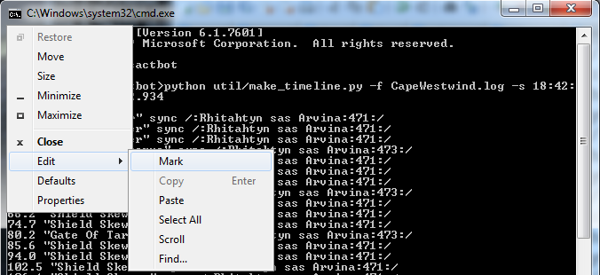

# Timeline Guide

This is a guide for people who want to write timelines,
primarily for cactbot.


cactbot uses the [raidboss module](https://github.com/quisquous/cactbot#raidboss-module)
for triggers and timelines.
These are combined together so that you can make triggers that are based on actions
or triggers that are based on timelines themselves.

## Table of Contents

* [History](#history)
* [Timeline File Syntax](#timeline-file-syntax)
  * [Comments](#comments)
  * [Entries](#entries)
  * [Commands](#commands)
  * [Examples](#examples)
  * [Testing](#testing)
  * [Shasta Kota Guide](#shasta-kota-guide)
* [Cactbot Style Guide](#cactbot-style-guide)
* [Timeline Triggers](#timeline-triggers)
* [Timeline Injection](#timeline-injection)
* [Timeline Translation](#timeline-translation)
* [Example Timeline Creation](#example-timeline-creation)
  * [Run the fight a few times](#run-the-fight-a-few-times)
  * [Software prerequisites](#software-prerequisites)
  * [Timeline Skeleton](#timeline-skeleton)
  * [Generating an initial timeline file](#generating-an-initial-timeline-file)
  * [Building Loops](#building-loops)
  * [Adding Phases](#adding-phases)
  * [Next phase](#next-phase)
  * [Final Phase](#final-phase)
  * [Boilerplate glue](#boilerplate-glue)
  * [Making loops loop](#making-loops-loop)
  * [Putting it all together](#putting-it-all-together)
  * [Testing Timelines](#testing-timelines)
  * [Test against other timelines](#test-against-other-timelines)

## History

Back in 2016, Shasta Kota on the Death and Taxes website made this [guide](https://dtguilds.enjin.com/forum/m/37032836/viewthread/26353492-act-timeline-plugin) to use with  anoyetta's [ACT timeline plugin](https://github.com/anoyetta/ACT.Hojoring).
That plugin is now part of Hojoring.

There's also an older [kaizoban](https://github.com/090/act_timeline/releases) version of the plugin that some people have used that predates anoyetta's work.

cactbot timeline files were originally intended to be backwards compatible with these,
and so cactbot-specific extensions are injected later from the triggers file.

## Timeline File Syntax

Each line in a timeline file is considered its own timeline entry.
There is no ordering at all.
The fact that timeline files are ordered is as a convenience to the reader.

### Comments

On any line, a hash character `#` signifies a comment.
Everything after that on the current line will be ignored.

### Entries

Here is some grammar examples of timeline entries.
Every timeline entry begins with the ability time and the ability name.

`Number "String" (duration Number)`

`Number "String" sync /Regex/ (window Number,Number) (jump Number) (duration Number)`

The parentheses here indicate optionality and are not literal parentheses.

Number can be an integer, e.g. `34`, or a float, e.g. `84.381`.

String is a character string, e.g. `"Liftoff"` or `"Double Attack"`

Regex is a [Javascript regular expression](https://developer.mozilla.org/en-US/docs/Web/JavaScript/Guide/Regular_Expressions).

The ability time and ability name always need to come first, but `window`, `jump`, `duration`, and `sync` do not have to be in any order with respect to each other.
Stylistically, usually sync is put first.

`duration Number` is a time in seconds to show the action.
Usually, timeline entries disappear immediately,
but sometimes an action is ongoing, like 5x Bahamut's Claw in a row.
You can use `duration` to show the action for that length of time.
It does not need a sync to do this.

`window Number,Number` is the time frame in which to consider the sync.
By default, if `window` is not specified, cactbot considers it the
same as specifying `window 2.5,2.5`.  In other words,
2.5 seconds before the ability time and 2.5 seconds after.
As an example, for the line `3118.9 "Lancing Bolt" sync /:Raiden:3876:/`,
if the regular expression `/:Raiden:3876:/` is encountered anywhere between 3116.4 and 3121.4
then it will resync the timeline playback to 3118.9.
Often timelines will use very large windows for unique abilities,
to make sure that timelines sync to the right place even if started mid-fight.

`jump Number` tells the timeline playback to jump to a particular time
if the sync is encountered.
If you jump to time 0, the timeline will stop playback.
This is usually used for phase pushes and loops.
There does not need to be a timeline entry for the time you jump to,
although it is very common to have one.

### Commands

To hide all instances of an ability, you can use the `hideall` command.
Most timelines start with the line `hideall "--sync--"`
to hide syncs that are just used to keep the timeline on track but should not be shown to the player.

There are a number of other commands for generating alerts based on timeline entries.
These are still supported but are not documented.
Instead, alerts based on timelines in cactbot should use [timeline triggers](#timeline-triggers).

### Examples

```bash
677.0 "Heavensfall Trio"
1044 "Enrage" # ???
35.2 "Flare Breath x3" duration 4
1608.1 "Petrifaction" sync /:Melusine:7B1:/ window 1610,5
1141.4 "Leg Shot" sync /:Mustadio:3738:/ duration 20
# I am just a comment
hideall "--sync--"

28.0 "Damning Edict?" sync /:Chaos:3150:/ window 30,10 jump 2028.0
524.9 "Allagan Field" sync /:The Avatar:7C4:/ duration 31 jump 444.9
1032.0 "Control Tower" duration 13.5 sync /:Hashmal, Bringer Of Order starts using Control Tower on Hashmal/ window 20,20 # start of cast -> tower fall
```

### Testing

In cactbot, running `npm run test` will run **test/check_timelines.js** in node to verify syntax.

### Shasta Kota Guide

It is also worth reading Shasta Kota's original [guide](https://dtguilds.enjin.com/forum/m/37032836/viewthread/26353492-act-timeline-plugin)
which is still excellent.

## Cactbot Style Guide

These are guidelines that cactbot tries to follow for timelines.

* add syncs for everything possible
* always add an Engage! entry, but add syncs in case there's no /countdown
* if the first boss action is an auto-attack, add a sync to start the timeline asap.
(Note that sometimes boss auto-attacks are not literally "Attack"!)
* include the command line used to generate the timeline in a comment at the top
* prefer actions for syncs over rp text, but rp text syncs if that's the only option
* if you do sync a phase with rp text, add a large window sync for an action
* sync regexes should be short
* use original names as much as possible
* loops should use `jump` instead of having previous abilities have large windows
* liberally use whitespace and comments to make the timeline readable
* do not put any triggers or tts or alerts in the timeline file itself
* use [timeline triggers](#timeline-triggers) for any alerts
* add at least a 30 second lookahead window for loops
* comment out syncs from any abilities that are within 7 seconds of each other
(This preserves the ability ID for future maintainers.)

### Trigger Filenames

The general goal of filenames is to be consistent
with what the community calls these fights.
Trials get called by the name of the boss,
raids get abbreviated and numbered,
dungeons are called by their zone.

For filenames, use underscores to separate words.
For trials like `nm` (normal mode), `hm` (hard mode), and `ex` (extreme mode),
separate with a hyphen.
Dungeons with hard in the name can spell out "Hard" as a full word.
Articles like `The` can be dropped.
Raids are numbered through the tier,
e.g. `t1` through `t13` and `a1s` through `a12s`.
Savage fights should have an `s` suffix
while normal fights have an 'n' suffix.
(However, this does not apply to coil raids.)

Examples:

* The Grand Cosmos: `grand_cosmos`
* Titan Extreme: `titan-ex`
* Ruby Weapon Extreme: `ruby_weapon-ex`
* The Great Gubal Library (Hard): `great_gubal_library_hard`
* Sigmascape V2.0 (Savage): `o6s`
* Alexander - The Arm of the Father: `a3n`
* The Final Coil of Bahamut: `t13`

## Timeline Triggers

Trigger files in cactbot support adding timeline triggers.
Because people may have preferences about what triggers they want enabled by default,
and because cactbot timeline syntax extensions are not compatible with other timeline plugins,
cactbot adds all of its timeline triggers from the timeline file.

This is done by adding a `timelineTriggers` section to the triggers file.

Examples:

* [Orbonne Monastery](https://github.com/quisquous/cactbot/blob/main/ui/raidboss/data/04-sb/alliance/orbonne_monastery.js)
* [T9](https://github.com/quisquous/cactbot/blob/main/ui/raidboss/data/02-arr/raid/t9.js)
* [O12 normal](https://github.com/quisquous/cactbot/blob/main/ui/raidboss/data/04-sb/raid/o12n.js)

These triggers have the [same syntax](https://github.com/quisquous/cactbot/blob/main/ui/raidboss/data/README.txt) as normal triggers.
They still allow you to use functions if you want to return something.
You can use a [condition](https://github.com/quisquous/cactbot/blob/5a7011c662d65f44c12c2fbff255484f2d31b8ef/ui/raidboss/data/02-arr/raid/t9.js#L10) to have it only trigger for a particular job or role.

However there are a few differences:

The `regex` should not be translated and should be based off of whatever is exactly in the timeline file.
It matches against the ability name in quotes on the timeline line.
The `matches` parameter to functions will return this.

They support a `beforeSeconds` parameter,
that allows you to specify how long before the ability to show the trigger.

## Timeline Injection

The timeline files themselves are constructed in a way that should be useful for everybody.
However, sometimes people want to hide parts of timelines or add other things to timelines.

This is not something that cactbot does by default anywhere, and so it is more a user configuration feature.

The triggers file supports a `timeline` entry which is an array of things to add to the timeline.
If those things are strings, it will add them directly.
If those things are functions, it will call the function and add the return value.
(The `data` parameter passed only contains a player's role and job and not other things.)

The test timeline in Summerford Farms that you can start by doing a /countdown or /bow-ing to a Striking Dummy has examples of this.  See: [test.js](https://github.com/quisquous/cactbot/blob/79239abda888dd7a277da0501a7d4ac60d8cf963/ui/raidboss/data/triggers/test.js#L10).

You can also add timeline entries to your **cactbot/user/raidboss.js** file for personalized timeline entries and triggers.  See: [user/raidboss.js](https://github.com/quisquous/cactbot-user/blob/641488590e3ea499cc3b54cc9f2f2f856dee4ad8/raidboss.js#L28)

## Timeline Translation

To support multiple languages, cactbot trigger files support a `timelineReplace` section.
You can see an example in [o12s.js](https://github.com/quisquous/cactbot/blob/ecbb723f097328c7bd0476352e5135bd5f776248/ui/raidboss/data/triggers/o12s.js#L608).
This section contains a bunch of regular expressions to replace in syncs, texts, and effects.
This has two purposes.

The first purpose is for tools, to autogenerate regular expression translations for triggers.

The second purpose is for timelines at runtime.
cactbot will use the `replaceSync` section to auto-replace anything inside a `sync /text`/ on a timeline line,
and the `replaceText` section to auto-replace anything inside the ability text.

These match only the exact text of the regex within the line, not the entire line.
Care is needed to make sure that replacements are not overzealous.

## Example Timeline Creation

Here's an example of using cactbot's tools to make a timeline file for Cape Westwind.
This is pretty straightforward and only requires one person to test, so is a good first example.

### Run the fight a few times

The first step in making a timeline is generating a few ACT logs.

cactbot will also let you make timelines from fflogs clears, but this drops many log lines.
In particular, you can't get rp text lines, the text for the zone sealing/unsealing, and new combatants.

Once you've run the combat, you'll have generated a couple of [network log files](LogGuide.md#network-log-lines).

Follow those links, click **Raw**, then right click and **Save As** to save them to disk.

Good guidelines for getting good logs are:

1. run long enough to see the enrage
1. have enough people to see all the mechanics (e.g. t11 tethers don't appear without two people)
1. per phase, run long enough to see the mechanics loop
1. run several times so you can test it

### Software prerequisites

* [Python 3](https://www.python.org/downloads/release/python-373/)
* A copy of cactbot's [source code](https://github.com/quisquous/cactbot/archive/main.zip)

You should do a system-wide installation of Python 3 if you can,
as this will put Python into your Windows PATH so that you can easily run it from the command line.

### Timeline Skeleton

There are three things you need to add a new timeline to cactbot.

(1) Create a blank timeline file.

Add a new file called **ui/raidboss/data/timelines/cape_westwind.txt**.
You can leave it blank.

(2) Add a new triggers file, if it doesn't exist.

Create **ui/raidboss/data/02-arr/trial/cape_westwind.js**.
This can be named whatever you want.
Timeline files can only be loaded via triggers files,
so the triggers file is always required.

An initial triggers file should look like the following:

```javascript
[{
  zoneId: ZoneId.CapeWestwind,
  timelineFile: 'cape_westwind.txt',
  triggers: [
  ],
}];
```

(3) Update the manifest file.

Update **ui/raidboss/data/manifest.txt** with both the name of the
new triggers file and the new timeline file.

(4) Reload raidboss

If you've changed any of these files, reload your cactbot raidboss
plugin to pick up the changes.

### Generating an initial timeline file

Once you have a network log file, you need to find the start and the finish.

[View the logs in ACT](LogGuide.md#viewing-logs-after-a-fight) and find the start and the end.


For example, in this fight, these are the relevant log lines and times:

```log
[18:42:23.614] 15:105E5703:Potato Chippy:2E:Tomahawk:4000EE16:Rhitahtyn sas Arvina:710003:9450000:1C:2E8000:0:0:0:0:0:0:0:0:0:0:0:0:140279:140279:8010:8010:1000:1000:-707.8608:-822.4221:67.74045:3858:74095:4560:0:1000:1000:-693.7162:-816.4633:65.55687:
[18:49:22.934] 19:Rhitahtyn Sas Arvina was defeated by Potato Chippy.
```

(Known bug: sometimes network logs from other people's timezones require converting the time from what the act log lines.  Patches welcome.)

You can then make a timeline from those times by running the following command.

```bash
python util/make_timeline.py -f CapeWestwind.log -s 18:42:23.614 -e 18:49:22.934

0 "Start"
2.0 "Shield Skewer" sync /:Rhitahtyn sas Arvina:471:/
10.6 "Shield Skewer" sync /:Rhitahtyn sas Arvina:471:/
19.0 "Shield Skewer" sync /:Rhitahtyn sas Arvina:471:/
24.4 "Gate Of Tartarus" sync /:Rhitahtyn sas Arvina:473:/
29.8 "Shield Skewer" sync /:Rhitahtyn sas Arvina:471:/
38.4 "Shield Skewer" sync /:Rhitahtyn sas Arvina:471:/
46.8 "Shield Skewer" sync /:Rhitahtyn sas Arvina:471:/
52.2 "Gate Of Tartarus" sync /:Rhitahtyn sas Arvina:473:/
57.7 "Shield Skewer" sync /:Rhitahtyn sas Arvina:471:/
66.2 "Shield Skewer" sync /:Rhitahtyn sas Arvina:471:/
74.7 "Shield Skewer" sync /:Rhitahtyn sas Arvina:471:/
80.2 "Gate Of Tartarus" sync /:Rhitahtyn sas Arvina:473:/
85.6 "Shield Skewer" sync /:Rhitahtyn sas Arvina:471:/
94.0 "Shield Skewer" sync /:Rhitahtyn sas Arvina:471:/
102.5 "Shield Skewer" sync /:Rhitahtyn sas Arvina:471:/
106.1 "Shield Skewer" sync /:Rhitahtyn sas Arvina:471:/
110.4 "Shrapnel Shell" sync /:Rhitahtyn sas Arvina:474:/
114.9 "Winds Of Tartarus" sync /:Rhitahtyn sas Arvina:472:/
119.2 "Firebomb" sync /:Rhitahtyn sas Arvina:476:/
123.5 "Shield Skewer" sync /:Rhitahtyn sas Arvina:471:/
127.8 "Drill Shot" sync /:Rhitahtyn sas Arvina:475:/
132.1 "Winds Of Tartarus" sync /:Rhitahtyn sas Arvina:472:/
136.4 "Firebomb" sync /:Rhitahtyn sas Arvina:476:/
140.7 "Shield Skewer" sync /:Rhitahtyn sas Arvina:471:/
145.2 "Shrapnel Shell" sync /:Rhitahtyn sas Arvina:474:/
149.8 "Winds Of Tartarus" sync /:Rhitahtyn sas Arvina:472:/
154.3 "Firebomb" sync /:Rhitahtyn sas Arvina:476:/
158.8 "Shield Skewer" sync /:Rhitahtyn sas Arvina:471:/
163.3 "Drill Shot" sync /:Rhitahtyn sas Arvina:475:/
167.8 "Winds Of Tartarus" sync /:Rhitahtyn sas Arvina:472:/
172.3 "Firebomb" sync /:Rhitahtyn sas Arvina:476:/
175.8 "Gate Of Tartarus" sync /:Rhitahtyn sas Arvina:473:/
179.3 "Shield Skewer" sync /:Rhitahtyn sas Arvina:471:/
184.5 "Shield Skewer" sync /:Rhitahtyn sas Arvina:471:/
189.0 "Shrapnel Shell" sync /:Rhitahtyn sas Arvina:474:/
193.7 "Winds Of Tartarus" sync /:Rhitahtyn sas Arvina:472:/
195.9 "Fast Blade" sync /:7th Cohort Optio:2CD:/
196.1 "Fast Blade" sync /:7th Cohort Optio:2CD:/
198.2 "Firebomb" sync /:Rhitahtyn sas Arvina:476:/
202.7 "Shield Skewer" sync /:Rhitahtyn sas Arvina:471:/
202.9 "Fast Blade" sync /:7th Cohort Optio:2CD:/
203.3 "Fast Blade" sync /:7th Cohort Optio:2CD:/
207.2 "Drill Shot" sync /:Rhitahtyn sas Arvina:475:/
207.6 "Rampart" sync /:7th Cohort Optio:0A:/
210.0 "Fast Blade" sync /:7th Cohort Optio:2CD:/
211.7 "Winds Of Tartarus" sync /:Rhitahtyn sas Arvina:472:/
212.6 "Shield Bash" sync /:7th Cohort Optio:2CE:/
214.3 "Fast Blade" sync /:7th Cohort Optio:2CD:/
214.9 "Fight Or Flight" sync /:7th Cohort Optio:14:/
216.2 "Firebomb" sync /:Rhitahtyn sas Arvina:476:/
217.3 "Rampart" sync /:7th Cohort Optio:0A:/
218.0 "Celeris" sync /:7th Cohort Optio:194:/
220.8 "Shield Skewer" sync /:Rhitahtyn sas Arvina:471:/
222.0 "Fight Or Flight" sync /:7th Cohort Optio:14:/
225.2 "Shrapnel Shell" sync /:Rhitahtyn sas Arvina:474:/
226.3 "Fast Blade" sync /:7th Cohort Optio:2CD:/
229.9 "Winds Of Tartarus" sync /:Rhitahtyn sas Arvina:472:/
234.4 "Firebomb" sync /:Rhitahtyn sas Arvina:476:/
239.0 "Shield Skewer" sync /:Rhitahtyn sas Arvina:471:/
243.4 "Drill Shot" sync /:Rhitahtyn sas Arvina:475:/
259.1 "Shrapnel Shell" sync /:Rhitahtyn sas Arvina:474:/
263.6 "Firebomb" sync /:Rhitahtyn sas Arvina:476:/
267.9 "Winds Of Tartarus" sync /:Rhitahtyn sas Arvina:472:/
269.1 "Magitek Missiles" sync /:Rhitahtyn sas Arvina:478:/
274.2 "Drill Shot" sync /:Rhitahtyn sas Arvina:475:/
278.5 "Firebomb" sync /:Rhitahtyn sas Arvina:476:/
282.8 "Winds Of Tartarus" sync /:Rhitahtyn sas Arvina:472:/
299.3 "Shrapnel Shell" sync /:Rhitahtyn sas Arvina:474:/
303.8 "Firebomb" sync /:Rhitahtyn sas Arvina:476:/
308.1 "Winds Of Tartarus" sync /:Rhitahtyn sas Arvina:472:/
309.3 "Magitek Missiles" sync /:Rhitahtyn sas Arvina:478:/
314.4 "Drill Shot" sync /:Rhitahtyn sas Arvina:475:/
318.7 "Firebomb" sync /:Rhitahtyn sas Arvina:476:/
323.0 "Winds Of Tartarus" sync /:Rhitahtyn sas Arvina:472:/
339.5 "Shrapnel Shell" sync /:Rhitahtyn sas Arvina:474:/
344.0 "Firebomb" sync /:Rhitahtyn sas Arvina:476:/
348.3 "Winds Of Tartarus" sync /:Rhitahtyn sas Arvina:472:/
349.5 "Magitek Missiles" sync /:Rhitahtyn sas Arvina:478:/
354.6 "Drill Shot" sync /:Rhitahtyn sas Arvina:475:/
358.9 "Firebomb" sync /:Rhitahtyn sas Arvina:476:/
363.2 "Winds Of Tartarus" sync /:Rhitahtyn sas Arvina:472:/
378.7 "Shrapnel Shell" sync /:Rhitahtyn sas Arvina:474:/
383.2 "Firebomb" sync /:Rhitahtyn sas Arvina:476:/
387.5 "Winds Of Tartarus" sync /:Rhitahtyn sas Arvina:472:/
388.7 "Magitek Missiles" sync /:Rhitahtyn sas Arvina:478:/
393.8 "Drill Shot" sync /:Rhitahtyn sas Arvina:475:/
398.1 "Firebomb" sync /:Rhitahtyn sas Arvina:476:/
402.4 "Winds Of Tartarus" sync /:Rhitahtyn sas Arvina:472:/
```

(Note that you can also use the `-lf` parameter to list the encounters in the combat log.

```bash
python make_timeline.py -f CapeWestwind.log -lf
1. 02:03:44.018 02:16:53.632 Cape Westwind
2. 18:32:52.981 18:36:14.086 Cape Westwind
3. 18:42:23.614 18:49:22.934 Cape Westwind
4. 18:57:09.114 19:10:13.200 Cape Westwind
5. 19:29:42.265 19:36:22.437 Cape Westwind
6. 19:40:20.606 19:46:44.342 Cape Westwind
```

From here, you can then rerun the command with the number of the encounter you want to use,
as `-lf 3`.)

This isn't really a workable timeline yet, but it's a start.
Paste this into **ui/raidboss/data/timelines/cape_westwind.txt**.

If you are using Windows cmd.exe or MINGW32 as your terminal,
you can copy this by clicking the upper left hand corner icon,
selecting **Edit**, and then **Mark**.
You can highlight what you want with your mouse, and then hit
the Enter key, and that will copy that so you can paste it
elsewhere.



The first thing to note from this log is that there's a bunch
of junk from adds.
Most of the time, you can't count on adds to have reliable
timing relative to the main boss, so it's usually better to
remove them.

The make_timeline.py script has two options to do this.
One is "ignore combatants" and the other is "ignore id".
Either `-ic "7Th Cohort Optio"` or `-ii 0A 2CD 2CE 194 14`
will remove all of these abilities.
We'll go with ids.

Run the command again with this ignore to have a cleaned up version:
`python util/make_timeline.py -f CapeWestwind.log -s 18:42:23.614 -e 18:49:22.934 -ii 0A 2CD 2CE 194 14`

At this point, it may also be worth going through and finding other lines to add.
Usually, these are [added combatant](LogGuide.md#03-addcombatant) lines
or [game log lines](LogGuide.md#00-logline) for rp text.
You can look at the time and figure out where they go yourself.
(Patches welcome to add either of these into **make_timeline.py** automatically.)

The relevant lines here are:

```log
[18:45:27.041] 03:Added new combatant 7Th Cohort Optio.  Job: 0 Level: 49 Max HP: 24057 Max MP: 8010 Pos: (-665.5159,-804.6631,62.33055).
[18:45:27.041] 03:Added new combatant 7Th Cohort Optio.  Job: 0 Level: 49 Max HP: 24057 Max MP: 8010 Pos: (-665.5013,-807.1013,62.45256).
[18:42:24.000] 00:0044:Rhitahtyn sas Arvina:I will suffer none to oppose Lord van Baelsar!
[18:44:08.000] 00:0044:Rhitahtyn sas Arvina:My shields are impregnable! Join the countless challengers who have dashed themselves against them!
[18:46:27.000] 00:0044:Rhitahtyn sas Arvina:Your defeat will bring Lord van Baelsar's noble conquest one step closer to fruition!
[18:48:27.000] 00:0044:Rhitahtyn sas Arvina:Ungh... Though it cost me my life...I will strike you down!
```

You can subtract the times from the start time to figure out about where they are.
For instance, the adds pop at t=183.5 (which is 18:45:27.041 - 18:42:23.614).

### Building Loops

The next step is to build some loops around the phases.
From observation, it looks like there's a number of phase pushes.

Here's what the initial phase looks like, with some extra line breaks
for clarity.

```bash
2.0 "Shield Skewer" sync /:Rhitahtyn sas Arvina:471:/
10.6 "Shield Skewer" sync /:Rhitahtyn sas Arvina:471:/
19.0 "Shield Skewer" sync /:Rhitahtyn sas Arvina:471:/
24.4 "Gate Of Tartarus" sync /:Rhitahtyn sas Arvina:473:/

29.8 "Shield Skewer" sync /:Rhitahtyn sas Arvina:471:/
38.4 "Shield Skewer" sync /:Rhitahtyn sas Arvina:471:/
46.8 "Shield Skewer" sync /:Rhitahtyn sas Arvina:471:/
52.2 "Gate Of Tartarus" sync /:Rhitahtyn sas Arvina:473:/

57.7 "Shield Skewer" sync /:Rhitahtyn sas Arvina:471:/
66.2 "Shield Skewer" sync /:Rhitahtyn sas Arvina:471:/
74.7 "Shield Skewer" sync /:Rhitahtyn sas Arvina:471:/
80.2 "Gate Of Tartarus" sync /:Rhitahtyn sas Arvina:473:/
```

It's pretty clear that there's a loop of roughly 27.8 or 27.9 seconds.
Let's just assume it's 27.8

The best tool for making perfect loops is **util/timeline_adjust.py**.
This script will walk through a timeline file and print out the same
timeline file, adjusted by any amount, positive or negative.

If you are using VSCode, you can also use the [adjust time feature](https://github.com/MaikoTan/cactbot-highlight#adjust-time) from the [cactbot-highlight](https://marketplace.visualstudio.com/items?itemName=MaikoTan.cactbot-highlight) extension,
which offer a simple way to adjust time in one-click.

(Note: they both will not adjust jumps.)

Here's an abbreviated version of the output from running this command:

```bash
python util/timeline_adjust.py --file=ui/raidboss/data/timelines/cape_westwind.txt --adjust=27.8

29.8 "Shield Skewer" sync /:Rhitahtyn sas Arvina:471:/
38.4 "Shield Skewer" sync /:Rhitahtyn sas Arvina:471:/
46.8 "Shield Skewer" sync /:Rhitahtyn sas Arvina:471:/
52.2 "Gate Of Tartarus" sync /:Rhitahtyn sas Arvina:473:/

57.6 "Shield Skewer" sync /:Rhitahtyn sas Arvina:471:/
66.2 "Shield Skewer" sync /:Rhitahtyn sas Arvina:471:/
74.6 "Shield Skewer" sync /:Rhitahtyn sas Arvina:471:/
80.0 "Gate Of Tartarus" sync /:Rhitahtyn sas Arvina:473:/

85.5 "Shield Skewer" sync /:Rhitahtyn sas Arvina:471:/
94.0 "Shield Skewer" sync /:Rhitahtyn sas Arvina:471:/
102.5 "Shield Skewer" sync /:Rhitahtyn sas Arvina:471:/
108.0 "Gate Of Tartarus" sync /:Rhitahtyn sas Arvina:473:/
```

Comparing to the original, it looks like this loops fairly perfectly.
The first loop is perfect and the second loop is off by a little,
as this adjusted loop has 57.6, 74.6, 80.0 but the original
is 57.7, 74.7, 80.2.  Close enough.

In cactbot, there's a configurable window of time for how far ahead
to show in the timeline.  By default it is 30 seconds, so you should
at least make a loop that goes 30 seconds ahead.

Here's what a completed version of the first phase loop looks like.

Note that we've used the times from **timeline_adjust.py** rather
than the original times. (You could also use `cactbot-highlight` if you prefer that.)
This is so that when we jump from 52.2 to 24.4 that all of the
relative times stay the same.  In both cases when `Gate Of Tartarus`
occurs, there's a `Shield Skewer` in 5.4 seconds after it.

We'll add the jumps in later.

```bash
2.0 "Shield Skewer" sync /:Rhitahtyn sas Arvina:471:/
10.6 "Shield Skewer" sync /:Rhitahtyn sas Arvina:471:/
19.0 "Shield Skewer" sync /:Rhitahtyn sas Arvina:471:/
24.4 "Gate Of Tartarus" sync /:Rhitahtyn sas Arvina:473:/

29.8 "Shield Skewer" sync /:Rhitahtyn sas Arvina:471:/
38.4 "Shield Skewer" sync /:Rhitahtyn sas Arvina:471:/
46.8 "Shield Skewer" sync /:Rhitahtyn sas Arvina:471:/
52.2 "Gate Of Tartarus" sync /:Rhitahtyn sas Arvina:473:/

57.6 "Shield Skewer" sync /:Rhitahtyn sas Arvina:471:/
66.2 "Shield Skewer" sync /:Rhitahtyn sas Arvina:471:/
74.6 "Shield Skewer" sync /:Rhitahtyn sas Arvina:471:/
80.0 "Gate Of Tartarus" sync /:Rhitahtyn sas Arvina:471:/
```

### Adding Phases

Now on to the second phase.
From observation, it's clear that at 80% the boss does some rp
text and then starts doing some different abilities.

Unfortunately for us, it looks like the boss starts phase 2
by doing another `Shield Skewer` which it does a lot of in
phase 1, so it won't be easy to sync to that.

**make_timeline.py** has an option to move the first usage
of an ability to a particular time.
As cactbot usually has a window of 30 seconds ahead,
feel free to generously move phases ahead in time.

Let's move phase 2 to start its first ability at time=200.
Since `Shrapnel Shell` starts 4.3 seconds after that,
let's adjust the first usage of `Shrapnel Shell`
(ability id 474) to time=204.3.

Here's the new command line we've built up to:
`python util/make_timeline.py -f CapeWestwind.log -s 18:42:23.614 -e 18:49:22.934 -ii 0A 2CD 2CE 194 14 -p 474:204.3`

This gets us the following output for phase 2,
with manually added blank lines to break out the loops.

```bash
# manually added in
199.0 "--sync--" sync /00:0044:[^:]*:My shields are impregnable/
200.0 "Shield Skewer" sync /:Rhitahtyn sas Arvina:471:/

# output of make_timeline
204.3 "Shrapnel Shell" sync /:Rhitahtyn sas Arvina:474:/
208.8 "Winds Of Tartarus" sync /:Rhitahtyn sas Arvina:472:/
213.1 "Firebomb" sync /:Rhitahtyn sas Arvina:476:/

217.4 "Shield Skewer" sync /:Rhitahtyn sas Arvina:471:/
221.7 "Drill Shot" sync /:Rhitahtyn sas Arvina:475:/
226.0 "Winds Of Tartarus" sync /:Rhitahtyn sas Arvina:472:/
230.3 "Firebomb" sync /:Rhitahtyn sas Arvina:476:/

234.6 "Shield Skewer" sync /:Rhitahtyn sas Arvina:471:/
239.1 "Shrapnel Shell" sync /:Rhitahtyn sas Arvina:474:/
243.7 "Winds Of Tartarus" sync /:Rhitahtyn sas Arvina:472:/
248.2 "Firebomb" sync /:Rhitahtyn sas Arvina:476:/

252.7 "Shield Skewer" sync /:Rhitahtyn sas Arvina:471:/
257.2 "Drill Shot" sync /:Rhitahtyn sas Arvina:475:/
261.7 "Winds Of Tartarus" sync /:Rhitahtyn sas Arvina:472:/
266.2 "Firebomb" sync /:Rhitahtyn sas Arvina:476:/
```

It looks like there's a clear loop here,
where every iteration of the loop has 2x `Firebomb` and 2x `Shield Skewer`.
The loop time is 34.6.  Time to break out **timeline_adjust.py** again.

Running `python util/timeline_adjust.py --file=ui/raidboss/data/timelines/cape_westwind.txt --adjust=27.8`,
the relevant output is:

```bash
234.6 "Shield Skewer" sync /:Rhitahtyn sas Arvina:471:/
238.9 "Shrapnel Shell" sync /:Rhitahtyn sas Arvina:474:/
243.4 "Winds Of Tartarus" sync /:Rhitahtyn sas Arvina:472:/
247.7 "Firebomb" sync /:Rhitahtyn sas Arvina:476:/

252.0 "Shield Skewer" sync /:Rhitahtyn sas Arvina:471:/
256.3 "Drill Shot" sync /:Rhitahtyn sas Arvina:475:/
260.6 "Winds Of Tartarus" sync /:Rhitahtyn sas Arvina:472:/
264.9 "Firebomb" sync /:Rhitahtyn sas Arvina:476:/
```

This has diverged a fair bit from the original times,
with the last Firebomb being 264.9 vs 266.2.
If you want to be more precise,
this is where you would compare against some other runs.

However, this is good enough for Cape Westwind,
so we will replace the second loop with this output
from **timeline_adjust.py**.

The current state of our timeline is now:

```bash
0 "Start"
2.0 "Shield Skewer" sync /:Rhitahtyn sas Arvina:471:/
10.6 "Shield Skewer" sync /:Rhitahtyn sas Arvina:471:/
19.0 "Shield Skewer" sync /:Rhitahtyn sas Arvina:471:/
24.4 "Gate Of Tartarus" sync /:Rhitahtyn sas Arvina:473:/

29.8 "Shield Skewer" sync /:Rhitahtyn sas Arvina:471:/
38.4 "Shield Skewer" sync /:Rhitahtyn sas Arvina:471:/
46.8 "Shield Skewer" sync /:Rhitahtyn sas Arvina:471:/
52.2 "Gate Of Tartarus" sync /:Rhitahtyn sas Arvina:473:/

57.6 "Shield Skewer" sync /:Rhitahtyn sas Arvina:471:/
66.2 "Shield Skewer" sync /:Rhitahtyn sas Arvina:471:/
74.6 "Shield Skewer" sync /:Rhitahtyn sas Arvina:471:/
80.0 "Gate Of Tartarus" sync /:Rhitahtyn sas Arvina:473:/

# 80%
199.0 "--sync--" sync /00:0044:[^:]*:My shields are impregnable/
200.0 "Shield Skewer" sync /:Rhitahtyn sas Arvina:471:/
204.3 "Shrapnel Shell" sync /:Rhitahtyn sas Arvina:474:/
208.8 "Winds Of Tartarus" sync /:Rhitahtyn sas Arvina:472:/
213.1 "Firebomb" sync /:Rhitahtyn sas Arvina:476:/

217.4 "Shield Skewer" sync /:Rhitahtyn sas Arvina:471:/
221.7 "Drill Shot" sync /:Rhitahtyn sas Arvina:475:/
226.0 "Winds Of Tartarus" sync /:Rhitahtyn sas Arvina:472:/
230.3 "Firebomb" sync /:Rhitahtyn sas Arvina:476:/

234.6 "Shield Skewer" sync /:Rhitahtyn sas Arvina:471:/
238.9 "Shrapnel Shell" sync /:Rhitahtyn sas Arvina:474:/
243.4 "Winds Of Tartarus" sync /:Rhitahtyn sas Arvina:472:/
247.7 "Firebomb" sync /:Rhitahtyn sas Arvina:476:/

252.0 "Shield Skewer" sync /:Rhitahtyn sas Arvina:471:/
256.3 "Drill Shot" sync /:Rhitahtyn sas Arvina:475:/
260.6 "Winds Of Tartarus" sync /:Rhitahtyn sas Arvina:472:/
264.9 "Firebomb" sync /:Rhitahtyn sas Arvina:476:/

# 60%
```

### Next phase

From observation, I know that the next phase starts
at 60% and there's two adds.

From reading the timeline, there's a random
"Gate of Tartarus" around the time the adds show up.

This is the original timeline, before any phases were adjusted:

```bash
175.8 "Gate Of Tartarus" sync /:Rhitahtyn sas Arvina:473:/
183.5 "Adds"
```

Unfortunately, the boss uses `Gate of Tartarus` in phase 1,
so we can't add it using `-p` like we did for phase 2.
(Patches welcome to add more options to make this possible?)

Instead, we can just use **timeline_adjust.py** to just
shift the timeline forward automatically.
If we adjust the original timeline by 400-175.8=224.2
then we can start phase 3 at t=400.

Here's the adjusted output, with the adds manually
added back in:

```bash
400.0 "Gate Of Tartarus" sync /:Rhitahtyn sas Arvina:473:/
403.5 "Shield Skewer" sync /:Rhitahtyn sas Arvina:471:/

407.7 "Adds"
408.7 "Shield Skewer" sync /:Rhitahtyn sas Arvina:471:/
413.2 "Shrapnel Shell" sync /:Rhitahtyn sas Arvina:474:/
417.9 "Winds Of Tartarus" sync /:Rhitahtyn sas Arvina:472:/
422.4 "Firebomb" sync /:Rhitahtyn sas Arvina:476:/

426.9 "Shield Skewer" sync /:Rhitahtyn sas Arvina:471:/
431.4 "Drill Shot" sync /:Rhitahtyn sas Arvina:475:/
435.9 "Winds Of Tartarus" sync /:Rhitahtyn sas Arvina:472:/
440.4 "Firebomb" sync /:Rhitahtyn sas Arvina:476:/

445.0 "Shield Skewer" sync /:Rhitahtyn sas Arvina:471:/
449.4 "Shrapnel Shell" sync /:Rhitahtyn sas Arvina:474:/
454.1 "Winds Of Tartarus" sync /:Rhitahtyn sas Arvina:472:/
458.6 "Firebomb" sync /:Rhitahtyn sas Arvina:476:/

463.2 "Shield Skewer" sync /:Rhitahtyn sas Arvina:471:/
467.6 "Drill Shot" sync /:Rhitahtyn sas Arvina:475:/

# 40% phase push??
483.3 "Shrapnel Shell" sync /:Rhitahtyn sas Arvina:474:/
487.8 "Firebomb" sync /:Rhitahtyn sas Arvina:476:/
492.1 "Winds Of Tartarus" sync /:Rhitahtyn sas Arvina:472:/

493.3 "Magitek Missiles" sync /:Rhitahtyn sas Arvina:478:/
407.7 "Adds"
```

Without recorded video, it's not 100% clear from the logs
whether the `Shrapnel Shell` is part of phase 3 or phase 4.
I know from observation that `Magitek Missiles` is the last phase,
so because the Shrapnel Shell breaks the pattern let's assume
it starts phase 4.
We'll test this later.

It looks a bit like there's another loop just like phase 2.

One consideration is to see if it's exactly the same as phase 2.
You can use **timeline_adjust.py** with an adjustment of 208.7
to move phase 2's `Shield Skewer` on top of phase 3.
However, you can see from that output that it's not quite the same.
Therefore, we'll need to build phase 3 separately.

It's pretty clear that this loop is also a 36.2 second loop.
Using **timeline_adjust.py** with a 36.2 adjustment gets
this output:

```bash
445.0 "Shield Skewer" sync /:Rhitahtyn sas Arvina:471:/
449.5 "Shrapnel Shell" sync /:Rhitahtyn sas Arvina:474:/
454.2 "Winds Of Tartarus" sync /:Rhitahtyn sas Arvina:472:/
458.7 "Firebomb" sync /:Rhitahtyn sas Arvina:476:/

463.2 "Shield Skewer" sync /:Rhitahtyn sas Arvina:471:/
467.7 "Drill Shot" sync /:Rhitahtyn sas Arvina:475:/
472.2 "Winds Of Tartarus" sync /:Rhitahtyn sas Arvina:472:/
476.7 "Firebomb" sync /:Rhitahtyn sas Arvina:476:/
```

This is really close to the original times, so let's consider
that our loop.

### Final Phase

Finally, we need the phase that starts at 40%.
We assumed that the `Shrapnel Shell` started this phase.
However, this isn't a unique skill.
`Magitek Missiles` is the first unique skill in this phase
and that starts 10 seconds after "Shrapnel Shell".
Let's start phase 4 at 600 seconds, so we'll adjust the
first use of `Magitek Missile` (ability id 478) to be t=610.

Here's the final command line, including this second phase:
`python util/make_timeline.py -f CapeWestwind.log -s 18:42:23.614 -e 18:49:22.934 -ii 0A 2CD 2CE 194 14 -p 474:204.3 478:610`

```bash
# manually added in
595.0 "--sync--" sync /00:0044:[^:]*:Your defeat will bring/ window 600,0
600.0 "Shrapnel Shell" sync /:Rhitahtyn sas Arvina:474:/
604.5 "Firebomb" sync /:Rhitahtyn sas Arvina:476:/
608.8 "Winds Of Tartarus" sync /:Rhitahtyn sas Arvina:472:/

# partial output from make_timeline
610.0 "Magitek Missiles" sync /:Rhitahtyn sas Arvina:478:/
615.1 "Drill Shot" sync /:Rhitahtyn sas Arvina:475:/
619.4 "Firebomb" sync /:Rhitahtyn sas Arvina:476:/
623.7 "Winds Of Tartarus" sync /:Rhitahtyn sas Arvina:472:/
640.2 "Shrapnel Shell" sync /:Rhitahtyn sas Arvina:474:/
644.7 "Firebomb" sync /:Rhitahtyn sas Arvina:476:/
649.0 "Winds Of Tartarus" sync /:Rhitahtyn sas Arvina:472:/

650.2 "Magitek Missiles" sync /:Rhitahtyn sas Arvina:478:/
655.3 "Drill Shot" sync /:Rhitahtyn sas Arvina:475:/
659.6 "Firebomb" sync /:Rhitahtyn sas Arvina:476:/
663.9 "Winds Of Tartarus" sync /:Rhitahtyn sas Arvina:472:/
680.4 "Shrapnel Shell" sync /:Rhitahtyn sas Arvina:474:/
684.9 "Firebomb" sync /:Rhitahtyn sas Arvina:476:/
689.2 "Winds Of Tartarus" sync /:Rhitahtyn sas Arvina:472:/

690.4 "Magitek Missiles" sync /:Rhitahtyn sas Arvina:478:/
695.5 "Drill Shot" sync /:Rhitahtyn sas Arvina:475:/
699.8 "Firebomb" sync /:Rhitahtyn sas Arvina:476:/
704.1 "Winds Of Tartarus" sync /:Rhitahtyn sas Arvina:472:/
719.6 "Shrapnel Shell" sync /:Rhitahtyn sas Arvina:474:/
724.1 "Firebomb" sync /:Rhitahtyn sas Arvina:476:/
728.4 "Winds Of Tartarus" sync /:Rhitahtyn sas Arvina:472:/

729.6 "Magitek Missiles" sync /:Rhitahtyn sas Arvina:478:/
734.7 "Drill Shot" sync /:Rhitahtyn sas Arvina:475:/
739.0 "Firebomb" sync /:Rhitahtyn sas Arvina:476:/
743.3 "Winds Of Tartarus" sync /:Rhitahtyn sas Arvina:472:/
```

This sure looks like a 40.2 second loop.
Using **timeline_adjust.py**, with a 40.2 second adjustment,
we get the following output:

```bash
650.2 "Magitek Missiles" sync /:Rhitahtyn sas Arvina:478:/
655.3 "Drill Shot" sync /:Rhitahtyn sas Arvina:475:/
659.6 "Firebomb" sync /:Rhitahtyn sas Arvina:476:/
663.9 "Winds Of Tartarus" sync /:Rhitahtyn sas Arvina:472:/
680.4 "Shrapnel Shell" sync /:Rhitahtyn sas Arvina:474:/
684.9 "Firebomb" sync /:Rhitahtyn sas Arvina:476:/
689.2 "Winds Of Tartarus" sync /:Rhitahtyn sas Arvina:472:/
```

This is a perfect match for the original times, so there's our loop.

### Boilerplate glue

In general, most timelines should include some boilerplate at the top like this:

```bash
# Cape Westwind
# -ii 0A 2CD 2CE 194 14 -p 474:204 478:610

hideall "--Reset--"
hideall "--sync--"

0.0 "--Reset--" sync / 21:........:40000010:/ window 10000 jump 0

0 "Start"
0.0 "--sync--" sync /:Engage!/ window 0,1
2.0 "Shield Skewer" sync /:Rhitahtyn sas Arvina:471:/
```

It's good practice to include the command line you used to generate this so that
other people can come back and see what you skipped.

`hideall` hides all instances of a line, so that players don't see `--sync--` show up visually,
but the timeline itself will still sync to those lines.
There can be anything in the text, it is just called `--sync--` for convenience.

It's good practice to have a Reset line to stop the timeline when there's a wipe.
On fights where the entire zone resets (e.g. all of omegascape, a4s, a8s, a12s, t9, t13),
`sync / 21:........:40000010:/` is a good sync to use.
On fights with zones that seal and unseal, (e.g. a1s,  t1-8)
you should use the zone sealing message itself to reset.

Finally, to start a fight, you should always include an Engage! sync for countdowns.
If the first boss ability is slow to happen, you should also include the first
auto so that the timeline starts.

For instances, on o11s, the first two lines are:

```bash
0.0 "--sync--" sync /:Engage!/ window 0,1
2.5 "--sync--" sync /:Omega:368:/ window 3,0
```

### Making loops loop

Here's the phase 1 loop, again.
We're going to edit this so that whenever we get to 52.2 seconds
it will jump back to 24.4 seconds seamlessly.

```bash
2.0 "Shield Skewer" sync /:Rhitahtyn sas Arvina:471:/
10.6 "Shield Skewer" sync /:Rhitahtyn sas Arvina:471:/
19.0 "Shield Skewer" sync /:Rhitahtyn sas Arvina:471:/
24.4 "Gate Of Tartarus" sync /:Rhitahtyn sas Arvina:473:/

29.8 "Shield Skewer" sync /:Rhitahtyn sas Arvina:471:/
38.4 "Shield Skewer" sync /:Rhitahtyn sas Arvina:471:/
46.8 "Shield Skewer" sync /:Rhitahtyn sas Arvina:471:/
52.2 "Gate Of Tartarus" sync /:Rhitahtyn sas Arvina:473:/

57.6 "Shield Skewer" sync /:Rhitahtyn sas Arvina:471:/
66.2 "Shield Skewer" sync /:Rhitahtyn sas Arvina:471:/
74.6 "Shield Skewer" sync /:Rhitahtyn sas Arvina:471:/
80.0 "Gate Of Tartarus" sync /:Rhitahtyn sas Arvina:473:/
```

On the 52.2 line, add the following `window 10,100 jump 24.4`.
This means, if you see this ability 10 seconds in the past
or 100 seconds in the future, jump to t=24.4.
By default, all syncs are `window 5,5` unless otherwise specified,
meaning they sync against the ability any time within the last
5 seconds or 5 seconds in the future.

The abilities from 57.6 to 80.0 will never be synced against
because as soon as the ability at 52.2 is seen, we will
want to jump back.  So, we will remove those syncs.

Finally, because sometimes log lines get dropped
or ACT starts mid-combat, it can be good to put large syncs
on infrequent or important abilities so that the timeline
can sync there.

This leaves us with this final version of the initial loop.

```bash
2.0 "Shield Skewer" sync /:Rhitahtyn sas Arvina:471:/
10.6 "Shield Skewer" sync /:Rhitahtyn sas Arvina:471:/
19.0 "Shield Skewer" sync /:Rhitahtyn sas Arvina:471:/
24.4 "Gate Of Tartarus" sync /:Rhitahtyn sas Arvina:473:/ window 30,10

29.8 "Shield Skewer" sync /:Rhitahtyn sas Arvina:471:/
38.4 "Shield Skewer" sync /:Rhitahtyn sas Arvina:471:/
46.8 "Shield Skewer" sync /:Rhitahtyn sas Arvina:471:/
52.2 "Gate Of Tartarus" sync /:Rhitahtyn sas Arvina:473:/ window 10,100 jump 24.4

# fake loop
57.6 "Shield Skewer"
66.2 "Shield Skewer"
74.6 "Shield Skewer"
80.0 "Gate Of Tartarus"
```

This is done on all the following loops as well.

### Putting it all together

Putting all the loops that we have created together leaves
us with the following timeline.

Because there are so many `Shield Skewer` abilities, any
loops are on less frequent abilities just to be more careful.

```bash
# Cape Westwind
# -ii 0A 2CD 2CE 194 14 -p 474:204 478:610

hideall "--Reset--"
hideall "--sync--"

0.0 "--Reset--" sync / 21:........:40000010:/ window 10000 jump 0

### Phase 1: skewers and stuns
0 "Start"
0.0 "--sync--" sync /:Engage!/ window 0,1
2.0 "Shield Skewer" sync /:Rhitahtyn sas Arvina:471:/
10.6 "Shield Skewer" sync /:Rhitahtyn sas Arvina:471:/
19.0 "Shield Skewer" sync /:Rhitahtyn sas Arvina:471:/
24.4 "Gate Of Tartarus" sync /:Rhitahtyn sas Arvina:473:/ window 30,10

29.8 "Shield Skewer" sync /:Rhitahtyn sas Arvina:471:/
38.4 "Shield Skewer" sync /:Rhitahtyn sas Arvina:471:/
46.8 "Shield Skewer" sync /:Rhitahtyn sas Arvina:471:/
52.2 "Gate Of Tartarus" sync /:Rhitahtyn sas Arvina:473:/ window 10,100 jump 24.4

57.6 "Shield Skewer"
66.2 "Shield Skewer"
74.6 "Shield Skewer"
80.0 "Gate Of Tartarus"


### Phase 2 (80%): firebombs
199.0 "--sync--" sync /00:0044:[^:]*:My shields are impregnable/ window 200,0
200.0 "Shield Skewer" sync /:Rhitahtyn sas Arvina:471:/
204.3 "Shrapnel Shell" sync /:Rhitahtyn sas Arvina:474:/ window 205,10
208.8 "Winds Of Tartarus" sync /:Rhitahtyn sas Arvina:472:/
213.1 "Firebomb" sync /:Rhitahtyn sas Arvina:476:/

217.4 "Shield Skewer" sync /:Rhitahtyn sas Arvina:471:/
221.7 "Drill Shot" sync /:Rhitahtyn sas Arvina:475:/
226.0 "Winds Of Tartarus" sync /:Rhitahtyn sas Arvina:472:/
230.3 "Firebomb" sync /:Rhitahtyn sas Arvina:476:/

234.6 "Shield Skewer" sync /:Rhitahtyn sas Arvina:471:/
238.9 "Shrapnel Shell" sync /:Rhitahtyn sas Arvina:474:/ window 20,100 jump 204.3
243.4 "Winds Of Tartarus"
247.7 "Firebomb"

252.0 "Shield Skewer"
256.3 "Drill Shot"
260.6 "Winds Of Tartarus"
264.9 "Firebomb"


### Phase 3 (60%): Adds
400.0 "Gate Of Tartarus" sync /:Rhitahtyn sas Arvina:473:/ window 200,20
403.5 "Shield Skewer" sync /:Rhitahtyn sas Arvina:471:/

407.7 "Adds"
408.7 "Shield Skewer" sync /:Rhitahtyn sas Arvina:471:/
413.2 "Shrapnel Shell" sync /:Rhitahtyn sas Arvina:474:/ window 20,20
417.9 "Winds Of Tartarus" sync /:Rhitahtyn sas Arvina:472:/
422.4 "Firebomb" sync /:Rhitahtyn sas Arvina:476:/

426.9 "Shield Skewer" sync /:Rhitahtyn sas Arvina:471:/
431.4 "Drill Shot" sync /:Rhitahtyn sas Arvina:475:/
435.9 "Winds Of Tartarus" sync /:Rhitahtyn sas Arvina:472:/
440.4 "Firebomb" sync /:Rhitahtyn sas Arvina:476:/

445.0 "Shield Skewer" sync /:Rhitahtyn sas Arvina:471:/
449.5 "Shrapnel Shell" sync /:Rhitahtyn sas Arvina:474:/ window 20,100 jump 413.2
454.2 "Winds Of Tartarus"
458.7 "Firebomb"

463.2 "Shield Skewer"
467.7 "Drill Shot"
472.2 "Winds Of Tartarus"
476.7 "Firebomb"


### Phase 4 (40%): magitek missiles
595.0 "--sync--" sync /00:0044:[^:]*:Your defeat will bring/ window 600,0

600.0 "Shrapnel Shell" sync /:Rhitahtyn sas Arvina:474:/
604.5 "Firebomb" sync /:Rhitahtyn sas Arvina:476:/
608.8 "Winds Of Tartarus" sync /:Rhitahtyn sas Arvina:472:/

610.0 "Magitek Missiles" sync /:Rhitahtyn sas Arvina:478:/ window 610,30
615.1 "Drill Shot" sync /:Rhitahtyn sas Arvina:475:/
619.4 "Firebomb" sync /:Rhitahtyn sas Arvina:476:/
623.7 "Winds Of Tartarus" sync /:Rhitahtyn sas Arvina:472:/
640.2 "Shrapnel Shell" sync /:Rhitahtyn sas Arvina:474:/
644.7 "Firebomb" sync /:Rhitahtyn sas Arvina:476:/
649.0 "Winds Of Tartarus" sync /:Rhitahtyn sas Arvina:472:/

650.2 "Magitek Missiles" sync /:Rhitahtyn sas Arvina:478:/ window 20,100 jump 610.0
655.3 "Drill Shot"
659.6 "Firebomb"
663.9 "Winds Of Tartarus"
680.4 "Shrapnel Shell"
684.9 "Firebomb"
689.2 "Winds Of Tartarus"
```

### Testing Timelines

cactbot has a testing tool called **util/test_timeline.py** that can
test a network log file or an fflogs fight against an existing timeline.

The test tool will tell you when a sync in your timeline is not matched against the fight,
and if a future sync is hit, it will let you know that some were skipped over.
It will not do the reverse,
and tell you about abilities in the fight that have no timeline entries.

It will also tell you about how far off the sync was, which can help with
adjusting timelines to be more accurate.

Here's an example.
The `-t` parameter here refers to the file name of the timeline you want to test against
in the **ui/raidboss/data/timelines** folder, minus the .txt extension.
(As with `make_timeline`, you can use the `-lf` parameter to list encounters.)

```bash
$ python util/test_timeline.py -f CapeWestwind.log -s 18:42:23.614 -e 18:49:22.
934 -t cape_westwind
0.000: Matched entry: 2.0 Shield Skewer (+2.000s)
10.556: Matched entry: 10.6 Shield Skewer (+0.044s)
18.985: Matched entry: 19.0 Shield Skewer (+0.015s)
24.411: Matched entry: 24.4 Gate Of Tartarus (-0.011s)
29.810: Matched entry: 29.8 Shield Skewer (-0.010s)
38.372: Matched entry: 38.4 Shield Skewer (+0.028s)
46.835: Matched entry: 46.8 Shield Skewer (-0.035s)
52.239: Matched entry: 52.2 Gate Of Tartarus (-0.039s)
    Jumping to 24.400
29.897: Matched entry: 29.8 Shield Skewer (-0.097s)
38.286: Matched entry: 38.4 Shield Skewer (+0.114s)
46.851: Matched entry: 46.8 Shield Skewer (-0.051s)
52.291: Matched entry: 52.2 Gate Of Tartarus (-0.091s)
    Jumping to 24.400
29.831: Matched entry: 29.8 Shield Skewer (-0.031s)
38.204: Matched entry: 38.4 Shield Skewer (+0.196s)
46.888: Matched entry: 46.8 Shield Skewer (-0.088s)
48.695: Matched entry: 199.0 --sync-- (+150.305s)
    Missed sync: Gate Of Tartarus at 52.2 (last seen at 24.411)
200.693: Matched entry: 200.0 Shield Skewer (-0.693s)
204.273: Matched entry: 204.3 Shrapnel Shell (+0.027s)
208.809: Matched entry: 208.8 Winds Of Tartarus (-0.009s)
213.111: Matched entry: 213.1 Firebomb (-0.011s)
217.417: Matched entry: 217.4 Shield Skewer (-0.017s)
221.711: Matched entry: 221.7 Drill Shot (-0.011s)
226.017: Matched entry: 226.0 Winds Of Tartarus (-0.017s)
230.313: Matched entry: 230.3 Firebomb (-0.013s)
234.642: Matched entry: 234.6 Shield Skewer (-0.042s)
239.144: Matched entry: 238.9 Shrapnel Shell (-0.244s)
    Jumping to 204.300
208.885: Matched entry: 208.8 Winds Of Tartarus (-0.085s)
213.304: Matched entry: 213.1 Firebomb (-0.204s)
217.623: Matched entry: 217.4 Shield Skewer (-0.223s)
221.857: Matched entry: 221.7 Drill Shot (-0.157s)
226.191: Matched entry: 226.0 Winds Of Tartarus (-0.191s)
230.480: Matched entry: 230.3 Firebomb (-0.180s)
233.846: Matched entry: 400.0 Gate Of Tartarus (+166.154s)
    Missed sync: Shield Skewer at 234.6 (last seen at 217.623)
    Missed sync: Shrapnel Shell at 238.9 (last seen at 204.273)
403.546: Matched entry: 403.5 Shield Skewer (-0.046s)
408.741: Matched entry: 408.7 Shield Skewer (-0.041s)
413.195: Matched entry: 413.2 Shrapnel Shell (+0.005s)
417.897: Matched entry: 417.9 Winds Of Tartarus (+0.003s)
422.385: Matched entry: 422.4 Firebomb (+0.015s)
426.890: Matched entry: 426.9 Shield Skewer (+0.010s)
431.389: Matched entry: 431.4 Drill Shot (+0.011s)
435.882: Matched entry: 435.9 Winds Of Tartarus (+0.018s)
440.393: Matched entry: 440.4 Firebomb (+0.007s)
444.969: Matched entry: 445.0 Shield Skewer (+0.031s)
449.380: Matched entry: 449.5 Shrapnel Shell (+0.120s)
    Jumping to 413.200
417.884: Matched entry: 417.9 Winds Of Tartarus (+0.016s)
422.366: Matched entry: 422.4 Firebomb (+0.034s)
426.975: Matched entry: 426.9 Shield Skewer (-0.075s)
431.292: Matched entry: 431.4 Drill Shot (+0.108s)
431.400: Matched entry: 595.0 --sync-- (+163.600s)
    Missed sync: Winds Of Tartarus at 435.9 (last seen at 417.884)
    Missed sync: Firebomb at 440.4 (last seen at 422.366)
    Missed sync: Shield Skewer at 445.0 (last seen at 426.97499999999997)
    Missed sync: Shrapnel Shell at 449.5 (last seen at 413.195)
620.783: Matched entry: 610.0 Magitek Missiles (-10.783s)
    Missed sync: Shrapnel Shell at 600.0 (last seen at 610.739)
    Missed sync: Firebomb at 604.5 (last seen at 615.247)
    Missed sync: Winds Of Tartarus at 608.8 (last seen at 619.564)
615.098: Matched entry: 615.1 Drill Shot (+0.002s)
619.409: Matched entry: 619.4 Firebomb (-0.009s)
623.711: Matched entry: 623.7 Winds Of Tartarus (-0.011s)
640.166: Matched entry: 640.2 Shrapnel Shell (+0.034s)
644.715: Matched entry: 644.7 Firebomb (-0.015s)
649.012: Matched entry: 649.0 Winds Of Tartarus (-0.012s)
650.179: Matched entry: 650.2 Magitek Missiles (+0.021s)
    Jumping to 610.000
615.137: Matched entry: 615.1 Drill Shot (-0.037s)
619.413: Matched entry: 619.4 Firebomb (-0.013s)
623.709: Matched entry: 623.7 Winds Of Tartarus (-0.009s)
640.170: Matched entry: 640.2 Shrapnel Shell (+0.030s)
644.712: Matched entry: 644.7 Firebomb (-0.012s)
649.013: Matched entry: 649.0 Winds Of Tartarus (-0.013s)
650.177: Matched entry: 650.2 Magitek Missiles (+0.023s)
    Jumping to 610.000
615.135: Matched entry: 615.1 Drill Shot (-0.035s)
619.418: Matched entry: 619.4 Firebomb (-0.018s)
623.709: Matched entry: 623.7 Winds Of Tartarus (-0.009s)
639.166: Matched entry: 640.2 Shrapnel Shell (+1.034s)
644.713: Matched entry: 644.7 Firebomb (-0.013s)
649.014: Matched entry: 649.0 Winds Of Tartarus (-0.014s)
650.175: Matched entry: 650.2 Magitek Missiles (+0.025s)
    Jumping to 610.000
615.131: Matched entry: 615.1 Drill Shot (-0.031s)
619.413: Matched entry: 619.4 Firebomb (-0.013s)
623.709: Matched entry: 623.7 Winds Of Tartarus (-0.009s)
```

As this timeline was generated against this network log,
it's not surprising that most of these timings are very accurate.

The `Missed sync` lines are the ones to look at more closely.

These three examples aren't worrisome because they are just the end of the loop
and we've skipped forward in time to the next phase.
(Patches welcome to figure out how to not warn on this sort of jump.)

```text
48.695: Matched entry: 199.0 --sync-- (+150.305s)
    Missed sync: Gate Of Tartarus at 52.2 (last seen at 24.411)

233.846: Matched entry: 400.0 Gate Of Tartarus (+166.154s)
    Missed sync: Shield Skewer at 234.6 (last seen at 217.623)
    Missed sync: Shrapnel Shell at 238.9 (last seen at 204.273)

431.400: Matched entry: 595.0 --sync-- (+163.600s)
    Missed sync: Winds Of Tartarus at 435.9 (last seen at 417.884)
    Missed sync: Firebomb at 440.4 (last seen at 422.366)
    Missed sync: Shield Skewer at 445.0 (last seen at 426.97499999999997)
    Missed sync: Shrapnel Shell at 449.5 (last seen at 413.195)
```

However, this looks like a problem:

```text
620.783: Matched entry: 610.0 Magitek Missiles (-10.783s)
    Missed sync: Shrapnel Shell at 600.0 (last seen at 610.739)
    Missed sync: Firebomb at 604.5 (last seen at 615.247)
    Missed sync: Winds Of Tartarus at 608.8 (last seen at 619.564)
```

It seems pretty likely that we've put the rp text sync in the wrong place.
Because we added such a large window on `Magitek Missile` the timeline
resynced (thank goodness), but some of the abilities before that were wrong.

The original timeline is:

```bash
595.0 "--sync--" sync /00:0044:[^:]*:Your defeat will bring/ window 600,0
600.0 "Shrapnel Shell" sync /:Rhitahtyn sas Arvina:474:/
```

However, Shrapnel Shell is off by 10.7 seconds,
as the tester output mentioned `(last seen at 610.739)`.
The fix is to move the rp text sync back in time by that amount.
The new time will be 595 - 10.7 = 584.3.

```bash
584.3 "--sync--" sync /00:0044:[^:]*:Your defeat will bring/ window 600,0
600.0 "Shrapnel Shell" sync /:Rhitahtyn sas Arvina:474:/
```

Rerunning the tester (most output omitted)

```bash
$ python util/test_timeline.py -f CapeWestwind.log -s 18:42:23.614 -e 18:49:22.
934 -t cape_westwind

431.400: Matched entry: 584.3 --sync-- (+152.900s)
    Missed sync: Winds Of Tartarus at 435.9 (last seen at 417.884)
    Missed sync: Firebomb at 440.4 (last seen at 422.366)
    Missed sync: Shield Skewer at 445.0 (last seen at 426.97499999999997)
    Missed sync: Shrapnel Shell at 449.5 (last seen at 413.195)
600.039: Matched entry: 600.0 Shrapnel Shell (-0.039s)
604.508: Matched entry: 604.5 Firebomb (-0.008s)
608.817: Matched entry: 608.8 Winds Of Tartarus (-0.017s)
610.019: Matched entry: 610.0 Magitek Missiles (-0.019s)
```

This is what we want to see.
As before, these missed syncs are just from the phase push,
but `Shrapnel Shell` is now in the right spot.

### Test against other timelines

It's important to test against multiple fight instances to make sure that the timeline is good.
Here's an example of running against the **CapeWestwind2.log** file.

If you run `python util/test_timeline.py -f CapeWestwind2.log -s 13:21:00.688 -e 13:29:36.976 -t cape_westwind` yourself, you can spot at least two problems.

One minor problem is that this boss is inconsistent:

```text
447.329: Matched entry: 445.0 Shield Skewer (-2.329s)
443.789: Matched entry: 445.0 Shield Skewer (+1.211s)
444.792: Matched entry: 445.0 Shield Skewer (+0.208s)
447.361: Matched entry: 445.0 Shield Skewer (-2.361s)
```

This `Shield Skewer` in phase 3 comes at wildly different times.
However, the abilities before and after seem to be just fine.
Often if there are inconsistencies like this,
the best thing to do is make sure there are larger windows around surrounding abilities
to make sure that even if one ability is inconsistent the entire timeline doesn't get derailed.

However, one major problem is that there's a missing `Shield Skewer`:

```text
403.454: Matched entry: 403.5 Shield Skewer (+0.046s)
407.876: Matched entry: 413.2 Shrapnel Shell (+5.324s)
    Missed sync: Shield Skewer at 408.7 (last seen at 403.454)
417.748: Matched entry: 417.9 Winds Of Tartarus (+0.152s)
```

One timeline has two `Shield Skewer`s and one only has one.
And the `Shrapnel Shell` is horribly mistimed here.

What to do in this case is subjective.
Here are some options:

* get more data, and make a timeline for the most common case
* leave a comment in the timeline
* if this is an important ability (e.g. tankbuster) put a question mark on it so players know it's not guaranteed
