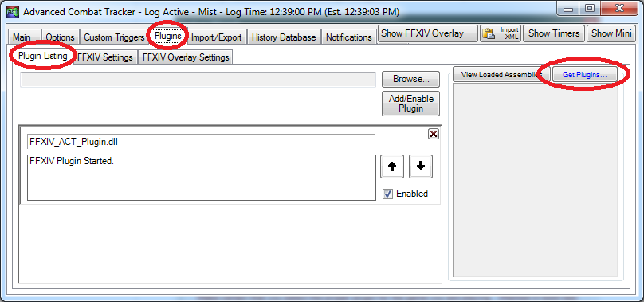
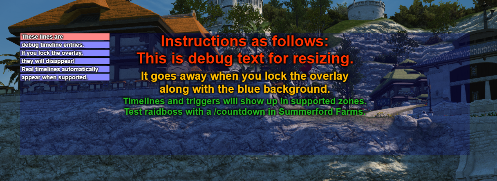

# cactbot (ffxiv raiding overlay)


[](https://github.com/quisquous/cactbot/actions?query=workflow%3ATest+branch%3Amain)
[](https://github.com/quisquous/cactbot/releases/latest)

🌎 [[English](../../README.md)] [**한국어**]

1. [정보](#정보)
1. [설치하기](#설치하기)
1. [소스코드 빌드하기](#소스코드-빌드하기)
1. [UI 모듈 개요](#ui-모듈-개요)
1. [문제 해결](#문제-해결)
1. [Cactbot 사용자 설정](#cactbot-사용자-설정)
1. [지원 언어](#지원-언어)

## 정보

cactbot은 [파이널 판타지 14](http://www.ff14.co.kr/)를 위한 레이드 툴을 제공하는 ACT 오버레이 입니다. 이 프로젝트는
[Advanced Combat Tracker](http://advancedcombattracker.com/)의 플러그인인
[ngld의 OverlayPlugin](https://github.com/ngld/OverlayPlugin)에서 작동하는
오버레이 플러그인 입니다.

cactbot은 다음 모듈을 지원합니다:

* raidboss: 미리 설정된 타임라인과 트리거:


* oopsyraidsy: 실수와 데스 리포트


* jobs: 간결한 게이지와 버프와 프록 트래킹


* eureka: 에우레카 NM 트래커 지도


* fisher: 낚시 캐스팅 시간 트래커


* radar: 마물 방향, 첫 어글자 알림


* dps: DPS 미터기 추가 기능


### 동영상 예시

* [O4S raidboss + 몽크 jobs](https://www.twitch.tv/videos/209562337)
* [O3S spellblade callouts](https://clips.twitch.tv/StrangeHungryGarageShadyLulu)

## 설치하기

**참고**: 해루봇을 사용하는 경우에는 이 문단을 읽지 말고 해루봇에서 다운로드하면 됩니다.

### 의존성 프로그램 설치

[.NET Framework](https://www.microsoft.com/net/download/framework) 4.6.1 버전 이상을 설치하세요.

반드시 파이널 판타지 14를 [DirectX 11](http://imgur.com/TjcnjmG)로 실행해야 합니다.

아직 [Advanced Combat Tracker](http://advancedcombattracker.com/)를 설치하지 않았다면, 64비트 버전을 설치하세요.

### FFXIV ACT Plugin 설치

만약 방금 ACT를 설치했다면,
Startup Wizard가 나타날 것 입니다.
Startup Wizard를 다른 방법으로 실행하려면,
`Options`를 클릭하고, `Show Startup Wizard`를 클릭하세요.


Startup Wizard에서,
`FFXIV Parsing Plugin`을 선택하고 `Download/Enable Plugin` 버튼을 클릭하세요.
이렇게 해서 `%APPDATA%Advanced Combat Tracker\Plugins\FFXIV_ACT_Plugin.dll`를 다운로드하고
플러그인 리스트에서 활성화시킵니다.


더해서, 네트워크를 통해 파싱해야 하기 때문에 ACT가 방화벽에서 차단되어 있지 않도록 하세요.
FFXIV plugin 설정에 "Include HP for Triggers" 버튼이 체크되어 있는지 확인하세요.
이 설정은 `Plugins` ->`FFXIV Settings` -> `Options`에 있습니다.

다른 FFXIV Plugin 가이드:

* [fflogs 동영상 가이드](https://www.fflogs.com/help/start/)
* [TomRichter 가이드](https://gist.github.com/TomRichter/e044a3dff5c50024cf514ffb20a201a9#installing-act--ffxiv-plugin)

### ngld OverlayPlugin 설치

이제, `Plugins` 탭을 선택하고 `Plugin Listing`을 클릭해보면,
플러그인 리스트가 다음과 같이 보여야 합니다.



`Get Plugins`을 클릭해서 ACT plugin 설치 도우미를 여세요.

`Overlay Plugin`을 선택하고 `Download and Enable`을 클릭하세요.


이렇게 해서 ngld OverlayPlugin을
`%APPDATA%Advanced Combat Tracker\Plugins\OverlayPlugin`에 다운로드하고
`OverlayPlugin.dll`을 플러그인 리스트에서 활성화합니다.

참고로, RainbowMage 버전이나 hibiyasleep 버전이 아니라
반드시 [ngld](https://github.com/ngld) 버전 OverlayPlugin을 사용해야 합니다.

### cactbot 설치

다시, `Plugins` 탭을 선택하고 `Plugin Listing`을 클릭한 다음,
`Get Plugins`를 클릭하세요.

`Cactbot`을 선택하고 `Download and Enable`을 클릭하세요.


이렇게 해서 cactbot을
`%APPDATA%Advanced Combat Tracker\Plugins\cactbot-version\cactbot`에 다운로드하고
`CactbotOverlay.dll`을 플러그인 리스트에서 활성화합니다.

**참고**: ACT가 기대하는 압축 파일 구조와
cactbot이 zip 파일을 생성하는 구조와의 차이점 때문에
처음 cactbot을 받았던 버전을 포함한
`cactbot-0.15.2`과 같은 폴더가 생성될 것입니다.
이 폴더명은 상관이 없고 딱히 의미가 없습니다.

플러그인이 올바른 순서로 배치되었는지 확인하세요.
순서는 반드시 FFXIV Plugin가 가장 먼저, 그 다음 OverlayPlugin, 그 다음으로 cactbot 순서여야 합니다.
만약 위 절차를 그대로 따랐다면, 다음과 같이 보일겁니다.


마지막으로, ACT를 재시작하세요.

## 오버레이 모듈 추가하기

이하 내용은 raidboss 오버레이 모듈을 설치하는 예제입니다.
다른 cactbot 오버레이를 설정하는 방법 또한 모두 동일합니다.

1. ACT를 여세요.
1. cactbot 플러그인을 추가한 후에 반드시 ACT를 재시작했는지 확인하세요.
1. `Plugins` 탭 안의 `OverlayPlugin.dll` 탭으로 이동하세요.
1. "추가" 버튼을 클릭하고 리스트 안에 있는 `Cactbot Raidboss`을 선택하세요.

    

1. 이제, 화면에 어떤 테스트 UI가 보일겁니다.
cactbot은 test UI를 기본으로 제공합니다.
두꺼운 빨간색 경계선과
파란색 배경화면은 오버레이를 화면에서 크기를 조절하고 위치를 정하는데 도움을 줍니다.
이것들은 오버레이 설정 패널에서 위치 잠금을 설정하면 사라집니다.
크기를 조정하고 위치를 정하는 것이 끝나면 반드시 오버레이 위치를 잠가야 합니다.

    

1. 이 오버레이의 이름을 짓고 싶은 대로 입력하세요. 예시) `raidbossy`
1. `OK` 버튼을 클릭해서 오버레이를 추가하세요.
이제 `Plugins` -> `OverlayPlugin.dll` 탭에 있는 오버레이 리스트에 나타날 것입니다.

1. 드래그하고 크기를 조절해서 오버레이를 원하는대로 위치시키세요.

1. `Raidboss` 오버레이의 `General` 탭에서, `위치 잠금`와 `클릭 무시`체크 박스를 선택하세요.
테스트 타임라인 바, 디버그 텍스트, 빨간색 경계선과 옅은 파란색 배경은 오버레이가 잠기면 사라집니다.

    

1. raidboss 플러그인을 테스트하고 싶다면, 중부 라노시아 여름여울 농장으로 텔레포한 다음, `/초읽기 5`를 실행하세요.

1. 다른 cactbot 오버레이를 추가하는 것도 비슷한 과정을 거칩니다.
같은 방법을 따라하고 cactbot 프리셋만 다른 것을 선택하세요.

## 소스코드 빌드하기

먼저 상기 안내에 따라 cactbot을 설치하세요.
의존성 파일들을 설치하기 위해서는 **스크립트 방식** 또는 **수동**, 두 가지 방법이 있습니다.

### 의존성 설치: 스크립트 방식

1. `curl`이 반드시 설치되어 있어야 합니다. (의존성 파일들을 다운로드하기 위해 사용됩니다.)
1. `./utils/fetch_deps.py` 스크립트를 실행하세요.
1. **빌드하는 단계**로 이동하세요.

### 의존성 설치: 수동

1. <https://github.com/EQAditu/AdvancedCombatTracker/releases/>에서 최신 Zip 파일을 다운로드 하세요.
1. `Advanced Combat Tracker.exe`를 `cactbot/plugin/ThirdParty/ACT/`에 압축 해제하세요.
1. <https://github.com/ravahn/FFXIV_ACT_Plugin/>에서 최신 SDK Zip 파일을 받으세요. (파일 이름에 SDK라는 문구가 포함되어 있는지 반드시 확인하세요)
1. `FFXIV_ACT_Plugin.dll`를 포함해서 `SDK folder`를 `cactbot/plugin/ThirdParty/FFXIV_ACT/`에 압축 해제하세요.
1. <https://github.com/ngld/OverlayPlugin/releases/>에서 최신 Zip 파일을 다운로드 하세요.
1. `OverlayPlugin.dll`를 포함해서 `libs folder`를 `cactbot/plugin/ThirdParty/OverlayPlugin/`에 압축 해제하세요.
1. **빌드하는 단계**로 이동하세요.

폴더 구조가 다음과 유사해야 합니다. (파일 목록은 추후 업데이트로 변경될 수 있음에 주의):

```plaintext
ThirdParty
|- ACT
|  |- Advanced Combat Tracker.exe
|- FFXIV_ACT
|  |- SDK
|  |  |- FFXIV_ACT_Plugin.Common.dll
|  |  |- FFXIV_ACT_Plugin.Config.dll
|  |  |- FFXIV_ACT_Plugin.LogFile.dll
|  |  |- FFXIV_ACT_Plugin.Memory.dll
|  |  |- FFXIV_ACT_Plugin.Network.dll
|  |  |- FFXIV_ACT_Plugin.Overlay.dll
|  |  |- FFXIV_ACT_Plugin.Parse.dll
|  |  |- FFXIV_ACT_Plugin.Resource.dll
|  |- FFXIV_ACT_Plugin.dll
|- OverlayPlugin
   |- libs
   |  |- HtmlRenderer.dll
   |  |- Markdig.Signed.dll
   |  |- Newtonsoft.Json.dll
   |  |- OverlayPlugin.Common.dll
   |  |- OverlayPlugin.Core.dll
   |  |- OverlayPlugin.Updater.dll
   |  |- SharpCompress.dll
   |  |- System.ValueTuple.dll
   |  |- websocket-sharp.dll
   |- OverlayPlugin.dll
```

### 빌드하는 단계

1. 솔루션을 Visual Studio로 여세요. (Visual Studio 2017에서 작동을 테스트하고 있습니다).
1. "Release"와 "x64" 설정으로 빌드하세요.
1. 플러그인은 **bin/x64/Release/CactbotOverlay.dll**에 빌드될 겁니다.
1. 빌드된 플러그인을 ACT에 플러그인으로 직접 추가하세요.  
ACT -> Plugins -> Plugin Listing 탭에서, `Browse` 버튼을 클릭하고 이 파일이 빌드된 **bin/x64/Release/CactbotOverlay.dll**을 찾으세요.  그리고 `Add/Enable Plugin`을 클릭하세요.

## UI 모듈 개요

[ui/](../../ui/) 디렉토리는 cactbot의 ui 모듈을 가지고 있습니다.
만약 cactbot을 상기 설명에 따라 설치했다면,
이 디렉토리는 `%APPDATA%Advanced Combat Tracker\Plugins\cactbot-version\cactbot\ui\`에 있을 것입니다.

각각의 cactbot ui 모듈은 분리된 오버레이로 따로 추가되어야 합니다.
더욱 자세한 오버레이 설치 방법을 확인하려면 [오버레이 모듈 추가하기](#오버레이-모듈-추가하기) 문단을 확인하세요.

### [raidboss](../../ui/raidboss) 모듈

To use this module,
point cactbot at **ui/raidboss/raidboss.html** or use the `Cactbot Raidboss` preset.

This module provides a visual timeline of upcoming events in a fight, as well as text and audio
notifications to help increase raid awareness. Text and sound alerts can be based on the fight
timeline, or come from log messages that occur in the game, similar to ACT's "Custom Triggers".
The module is designed to look and feel similar to the
[BigWigs Bossmods](https://mods.curse.com/addons/wow/big-wigs) addon for World of Warcraft.

Fight timelines are provided in files designed for the [ACT Timeline](https://github.com/grindingcoil/act_timeline)
plugin, [documented here](http://dtguilds.enjin.com/forum/m/37032836/viewthread/26353492-act-timeline-plugin)
with [some extensions](docs/TimelineGuide.md).

There are three levels of text alerts, in order of escalating importance: `info`, `alert`, and `alarm`.
Text messages will be in one of these, and more important levels are larger and more eye grabbing colors.  Text-to-speech can be configured if you prefer that over on screen text.

Timeline files are found in [ui/raidboss/data/timelines](../../ui/raidboss/data/timelines). Triggers
for text and sound alerts are found in [ui/raidboss/data/triggers](../../ui/raidboss/data/triggers).

In this screenshot, the raidboss module is highlighted, with the timeline circled in red, and the
text alerts circled in yellow, with an `alert`-level text message visible.


### raidboss emulator

If you are writing triggers or timelines and want to test them, you can use the raidboss emulator:
**ui/raidboss/raidemulator.html**.

This currently can only be loaded in a browser and not as an overlay.
This will work in current version of Chrome,
and should work in other browsers as well but this is less tested.

Instructions:

1. Start ACT.
1. Make sure the WS Server is started via Plugins -> OverlayPlugin WSServer -> Stream/Local Overlay.
1. Select `Cactbot Raidboss (Combined Alerts and Timelines)` from the URL Generator list.
1. Edit the url to say `raidemulator.html` instead of `raidboss.html`.
1. Copy and paste this edited url into Chrome.
1. Drag and drop a [network log](/docs/FAQ-Troubleshooting.md#how-to-find-a-network-log) onto the page.
1. Select the zone and encounter, and then click `Load Encounter`.

If the emulator is not working, check the console log in the inspector for errors.
No buttons will work until it is connected to ACT via websocket.


### [oopsyraidsy](../../ui/oopsyraidsy) 모듈

To use this module,
point cactbot at **ui/oopsyraidsy/oopsyraidsy.html** or use the `Cactbot OopsyRaidsy` preset.

This module provides mistake tracking and death reporting.  Oopsy raidsy is meant to reduce the time wasted understanding what went wrong on fights and how people died.  During the fight, only a limited number of mistakes are shown (to avoid clutter), but afterwards a full scrollable list is displayed.

When somebody dies, the last thing they took damage from is listed in the log.  For example, if the log specifies: ":skull: Poutine: Iron Chariot (82173/23703)" this means that Poutine most likely died to Iron Chariot, taking 82173 damage and having 23703 health at the time.  The health value itself is not perfect and may be slightly out of date by a ~second due to a hot tick or multiple simultaneous damage sources.

When mistakes are made that are avoidable, oopsy logs warning (:warning:) and failure (:no_entry_sign:) messages, explaining what went wrong.

Mistake triggers are specified for individual fights in the [ui/oopsyraidsy/data](../../ui/oopsyraidsy/data) folder.


### [jobs](../../ui/jobs) 모듈

To use this module,
point cactbot at **ui/jobs/jobs.html** or use the `Cactbot Jobs` preset.

This module provides health, mana, and tp bars, as well as icons and timer bars for big raid buffs such as
The Balance and Trick Attack. It also features a food buff warning to keep up your food buff when leveling
or raiding, and a visual pull countdown.

It has more fleshed out support for some jobs but is *strongly* a Work In Progress for others.

* Red Mage: Shows white/black mana, tracks procs for Verstone, Verfire and Impact, and shows the state of the melee combo in progress.
* Warrior: Shows the beast amount, and tracks the remaining Storm's Eye buff time in gcds.
* Monk: Shows chakra count, remaining greased lightning time, and tracks monk buffs and debuffs.

In this screenshot, the jobs module is highlighted for the Red Mage job. The health and mana bars, as well
as Red Mage white/black mana tracking is circled in purple, with the large raid buff tracking pointed to
beside it in orange. The first step of the melee combo has been executed, which is displayed as the yellow
box above the health bar. The proc tracking is circled below in green.


### [eureka](../../ui/eureka) 모듈

To use this module,
point cactbot at **ui/eureka/eureka.html** or use the `Cactbot Eureka` preset.

This module provides automatic tracking of NMs that are popped or have
been killed.  It shows gales/night timers and any local tracker link
that has been pasted in chat.  Any flags in chat are also temporarily
included on the map.

It currently does not read the tracker information directly.  However,
if you click on the left/red "Copy killed NMs" button in the tracker to
copy the list of currently dead NMs, you can paste it in game, e.g.
`/echo ? NMs on cooldown: Serket (7m) > Julika (24m) > Poly (54m)`

If you do not see the emoji, make sure you have installed [this Windows update](https://support.microsoft.com/en-us/help/2729094/an-update-for-the-segoe-ui-symbol-font-in-windows-7-and-in-windows-ser).


### [radar](../../ui/radar) 모듈

To use this module,
point cactbot at **ui/radar/radar.html** or use the `Cactbot Radar` preset.

This module lets you know about nearby hunt mobs (S-rank, A-rank, etc).
When one pops, it gives you an arrow (based on your character's heading)
and a distance to the mob.

There are options to show who pulled the mob,
as well as to configure the display of the radar.
You can also set up custom options for different ranks
(e.g. make noises for S rank, but be silent for B ranks),
or set up custom triggers for any mob name you would like.

See the `cactbot/user/radar-example.js` for more options.


### [fisher](../../ui/fisher) 모듈

To use this module,
point cactbot at **ui/fisher/fisher.html** or use the `Cactbot Fisher` preset.

When you cast your line at a fishing hole, this module keeps track of when you reel in particular fish so that you know what you might be getting when you hook it.


Cast times are currently only logged as you fish, so there won't be any data until you've caught each fish. Green bars represent light tugs, yellow is a medium tug and red bars are legendary/heavy tugs.

[See here](https://www.youtube.com/watch?v=GHgWIA-Zhug) for examples of the different tug types.

Check [here](docs/FAQ-Troubleshooting.md#fisher-module) for common troubleshooting tips.

### [dps](../../ui/dps) 미터기

cactbot can be used with any dps meter overlay designed for OverlayPlugin's miniparse
addon, with the option to build out more features through cactbot's additional Javascript
APIs.  cactbot also auto-stops fights on wipes, so you can configure ACT's fight time to
infinity.

The [xephero](../../ui/dps/xephero) dps meter is based on the same dps meter built for miniparse,
with the additional ability to do per-phase dps tracking, displayed in additional columns.
In the screenshot below the phases are named B1, B2, B3.  These autogenerate from dungeon bosses, but could be used to differentiate raid fight phases.


The [rdmty](../../ui/dps/rdmty) dps meter is based on the same dps meter for miniparse, and updated
for Stormblood jobs and recolored to match [fflogs](http://fflogs.com).


### [pull counter](../../ui/pullcounter) 모듈

This small module sticks the current pull count for raiding bosses on screen.
This is primarily for folks who stream a lot and want to review video footage.
Having a number on screen makes it easy to scrub through video and find
particular pulls to review.

In most cases, you can reset the count for the current boss/zone by typing
`/echo pullcounter reset`.
You can also edit the counts directly in your
`%APPDATA%\Advanced Combat Tracker\Config\RainbowMage.OverlayPlugin.config.json`
file.


### [test](../../ui/test) 모듈

To use this module,
point cactbot at **ui/test/test.html** or use the `Cactbot Test` preset.

This module is just an onscreen test of cactbot variables and is not meant to be used while playing.
It can be useful to try out to make sure everything is working as expected or to use to help debug overlay issues.


## 문제 해결

자주 나타나는 Cactbot 문제를 포함한 일반적인 FAQ는 [여기](docs/FAQ-Troubleshooting.md)에서 확인할 수 있습니다.

## Cactbot 사용자 설정

대부분의 cactbot 사용자 설정은 ACT 안에 있는 설정 패널을 통해 할 수 있습니다.


이 화면은
Plugins -> OverlayPlugin.dll -> Cactbot으로 이동하면 확인할 수 있습니다.

특히,
만약 raidboss 알림에 TTS를 사용하고 싶다면,
"기본 알람 출력 방식"을
"TTS만" 또는 "텍스트와 TTS"으로 바꿀 수 있습니다.
이 설정을 각 트리거마다 따로 적용시킬 수도 있습니다.

또는, 어떤 이유 때문에 (???) 준비 확인 소리 알림을 원치 않을 수도 있습니다.
이 소리는 설정 패널에서 비활성화할 수 있습니다.
Raidboss -> 공용 트리거 -> General -> General Ready Check로 가서,
`기본` 대신 `비활성화`로 설정하세요.

이 옵션들은
`%APPDATA%\Advanced Combat Tracker\Config\RainbowMage.OverlayPlugin.config.json`
파일에 저장됩니다.
이 파일을 직접 수정하는 것은 권장하지 않습니다.
이 파일은 [엄격한 json](https://jsonlint.com/) 문법으로 작성되어야 하고
파일이 잘못 작성되면 ACT에서 불러오지 못할 수 있기 때문입니다.

user 파일을 사용하기 보다는
대부분의 설정들은 이 설정 패널을 통해서 하기를 권장합니다.
`cactbot/user/`에 있는 파일들은 더 강력하며
설정 패널에 있는 모든 것들을 덮어쓸 수 있습니다.
하지만, `cactbot/user/` 파일이 조용히 덮어쓰고 있고
설정 패널이 제대로 적용되지 않을 때 혼란스러울 수 있습니다.

사용자 Javascript와 css 파일에 대해 더 자세히 알고 싶다면
[이 문서](CactbotCustomization.md)를 확인하세요.

## 지원 언어

cactbot은 현재 서비스 중인 글로벌 서버 버전 (영어, 독일어, 프랑스어, 일본어)
중국 서버 버전(중국어),
그리고 한국 서버 버전(한국어)에서
테스트되고 작동합니다.
일부 번역은 계속 진행 중입니다.

유니코드 문자는
[resources/regexes.js](../../resources/regexes.js) 파일의 도우미를 통해서 지원됩니다.
하지만 [타임라인](../../ui/raidboss/data/timelines)과 로그 이벤트 [트리거](../../ui/raidboss/data/triggers)는
ACT 로그 이벤트에 나타나는 이름이 다를 경우에 틀릴 수도 있습니다.
