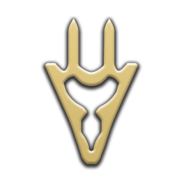
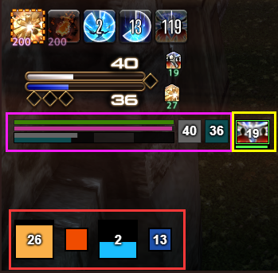

# cactbot (ffxiv raiding overlay)


[](https://github.com/quisquous/cactbot/actions?query=workflow%3ATest+branch%3Amain)
[](https://github.com/quisquous/cactbot/releases/latest)

🌎 [[English](../../README.md)] [[简体中文](../zh-CN/README.md)] [**한국어**]

1. [정보](#정보)
1. [설치하기](#설치하기)
1. [소스코드 빌드하기](#소스코드-빌드하기)
1. [UI 모듈 개요](#ui-모듈-개요)
1. [문제 해결](#문제-해결)
1. [Cactbot 사용자 설정](#cactbot-사용자-설정)
1. [지원 언어](#지원-언어)

## 정보

cactbot은 [파이널 판타지 14](http://www.ff14.co.kr/)를 위한 레이드 툴을 제공하는 ACT 오버레이 입니다. 이 프로젝트는
[Advanced Combat Tracker](http://advancedcombattracker.com/)의 플러그인인
[ngld의 OverlayPlugin](https://github.com/ngld/OverlayPlugin)에서 작동하는
오버레이 플러그인 입니다.

cactbot은 다음 모듈을 지원합니다:

* raidboss: 미리 설정된 타임라인과 트리거:


* oopsyraidsy: 실수와 데스 리포트


* jobs: 간결한 게이지와 버프와 프록 트래킹


* eureka: 에우레카 NM 트래커 지도


* fisher: 낚시 캐스팅 시간 트래커


* radar: 마물 방향, 첫 어글자 알림


* dps: DPS 미터기 추가 기능


### 동영상 예시

* [O4S raidboss + 몽크 jobs](https://www.twitch.tv/videos/209562337)
* [O3S spellblade callouts](https://clips.twitch.tv/StrangeHungryGarageShadyLulu)

## 설치하기

**참고**: 해루봇을 사용하는 경우에는 이 문단을 읽지 말고 해루봇에서 다운로드하면 됩니다.

### 의존성 프로그램 설치

[.NET Framework](https://www.microsoft.com/net/download/framework) 4.6.1 버전 이상을 설치하세요.

반드시 파이널 판타지 14를 [DirectX 11](http://imgur.com/TjcnjmG)로 실행해야 합니다.

아직 [Advanced Combat Tracker](http://advancedcombattracker.com/)를 설치하지 않았다면, 64비트 버전을 설치하세요.

### FFXIV ACT Plugin 설치

만약 방금 ACT를 설치했다면,
Startup Wizard가 나타날 것 입니다.
Startup Wizard를 다른 방법으로 실행하려면,
`Options`를 클릭하고, `Show Startup Wizard`를 클릭하세요.


Startup Wizard에서,
`FFXIV Parsing Plugin`을 선택하고 `Download/Enable Plugin` 버튼을 클릭하세요.
이렇게 해서 `%APPDATA%Advanced Combat Tracker\Plugins\FFXIV_ACT_Plugin.dll`를 다운로드하고
플러그인 리스트에서 활성화시킵니다.


더해서, 네트워크를 통해 파싱해야 하기 때문에 ACT가 방화벽에서 차단되어 있지 않도록 하세요.
FFXIV plugin 설정에 "Include HP for Triggers" 버튼이 체크되어 있는지 확인하세요.
이 설정은 `Plugins` ->`FFXIV Settings` -> `Options`에 있습니다.

다른 FFXIV Plugin 가이드:

* [fflogs 동영상 가이드](https://www.fflogs.com/help/start/)
* [TomRichter 가이드](https://gist.github.com/TomRichter/e044a3dff5c50024cf514ffb20a201a9#installing-act--ffxiv-plugin)

### ngld OverlayPlugin 설치

이제, `Plugins` 탭을 선택하고 `Plugin Listing`을 클릭해보면,
플러그인 리스트가 다음과 같이 보여야 합니다.


`Get Plugins`을 클릭해서 ACT plugin 설치 도우미를 여세요.

`Overlay Plugin`을 선택하고 `Download and Enable`을 클릭하세요.


이렇게 해서 ngld OverlayPlugin을
`%APPDATA%Advanced Combat Tracker\Plugins\OverlayPlugin`에 다운로드하고
`OverlayPlugin.dll`을 플러그인 리스트에서 활성화합니다.

참고로, RainbowMage 버전이나 hibiyasleep 버전이 아니라
반드시 [ngld](https://github.com/ngld) 버전 OverlayPlugin을 사용해야 합니다.

### cactbot 설치

다시, `Plugins` 탭을 선택하고 `Plugin Listing`을 클릭한 다음,
`Get Plugins`를 클릭하세요.

`Cactbot`을 선택하고 `Download and Enable`을 클릭하세요.


이렇게 해서 cactbot을
`%APPDATA%Advanced Combat Tracker\Plugins\cactbot-version\cactbot`에 다운로드하고
`CactbotOverlay.dll`을 플러그인 리스트에서 활성화합니다.

**참고**: ACT가 기대하는 압축 파일 구조와
cactbot이 zip 파일을 생성하는 구조와의 차이점 때문에
처음 cactbot을 받았던 버전을 포함한
`cactbot-0.15.2`과 같은 폴더가 생성될 것입니다.
이 폴더명은 상관이 없고 딱히 의미가 없습니다.

플러그인이 올바른 순서로 배치되었는지 확인하세요.
순서는 반드시 FFXIV Plugin가 가장 먼저, 그 다음 OverlayPlugin, 그 다음으로 cactbot 순서여야 합니다.
만약 위 절차를 그대로 따랐다면, 다음과 같이 보일겁니다.


마지막으로, ACT를 재시작하세요.

## 오버레이 모듈 추가하기

이하 내용은 raidboss 오버레이 모듈을 설치하는 예제입니다.
다른 cactbot 오버레이를 설정하는 방법 또한 모두 동일합니다.

1. ACT를 여세요.
1. cactbot 플러그인을 추가한 후에 반드시 ACT를 재시작했는지 확인하세요.
1. `Plugins` 탭 안의 `OverlayPlugin.dll` 탭으로 이동하세요.
1. "추가" 버튼을 클릭하고 리스트 안에 있는 `Cactbot Raidboss`를 선택하세요.

    

1. 이제, 화면에 어떤 테스트 UI가 보일겁니다.
cactbot은 테스트 UI를 기본으로 제공합니다.
두꺼운 빨간색 경계선과
파란색 배경화면은 오버레이를 화면에서 크기를 조절하고 위치를 정하는데 도움을 줍니다.
이것들은 오버레이 설정 패널에서 위치 잠금을 설정하면 사라집니다.
크기를 조정하고 위치를 정하는 것이 끝나면 반드시 오버레이 위치를 잠가야 합니다.

    

1. 이 오버레이의 이름을 짓고 싶은 대로 입력하세요. 예시) `raidbossy`
1. `OK` 버튼을 클릭해서 오버레이를 추가하세요.
이제 `Plugins` -> `OverlayPlugin.dll` 탭에 있는 오버레이 리스트에 나타날 것입니다.

1. 드래그하고 크기를 조절해서 오버레이를 원하는대로 위치시키세요.

1. `Raidboss` 오버레이의 `일반` 탭에서, `위치 잠금`와 `클릭 무시`체크 박스를 선택하세요.
테스트 타임라인 바, 디버그 텍스트, 빨간색 경계선과 옅은 파란색 배경은 오버레이가 잠기면 사라집니다.

    

1. raidboss 플러그인을 테스트하고 싶다면, 중부 라노시아 여름여울 농장으로 텔레포한 다음, `/초읽기 5`를 실행하세요.

1. 다른 cactbot 오버레이를 추가하는 것도 비슷한 과정을 거칩니다.
같은 방법을 따라하고 cactbot 프리셋만 다른 것을 선택하세요.

## 소스코드 빌드하기

먼저 상기 안내에 따라 cactbot을 설치하세요.
의존성 파일들을 설치하기 위해서는 **스크립트 방식** 또는 **수동**, 두 가지 방법이 있습니다.

### 의존성 설치: 스크립트 방식

1. `curl`이 반드시 설치되어 있어야 합니다. (의존성 파일들을 다운로드하기 위해 사용됩니다.)
1. `./util/fetch_deps.py` 스크립트를 실행하세요.
1. **빌드하는 단계**로 이동하세요.

### 의존성 설치: 수동

1. <https://github.com/EQAditu/AdvancedCombatTracker/releases/>에서 최신 Zip 파일을 다운로드 하세요.
1. `Advanced Combat Tracker.exe`를 `cactbot/plugin/ThirdParty/ACT/`에 압축 해제하세요.
1. <https://github.com/ravahn/FFXIV_ACT_Plugin/>에서 최신 SDK Zip 파일을 받으세요. (파일 이름에 SDK라는 문구가 포함되어 있는지 반드시 확인하세요)
1. `FFXIV_ACT_Plugin.dll`를 포함해서 `SDK folder`를 `cactbot/plugin/ThirdParty/FFXIV_ACT/`에 압축 해제하세요.
1. <https://github.com/ngld/OverlayPlugin/releases/>에서 최신 Zip 파일을 다운로드 하세요.
1. `OverlayPlugin.dll`를 포함해서 `libs folder`를 `cactbot/plugin/ThirdParty/OverlayPlugin/`에 압축 해제하세요.
1. **빌드하는 단계**로 이동하세요.

폴더 구조가 다음과 유사해야 합니다. (파일 목록은 추후 업데이트로 변경될 수 있음에 주의):

```plaintext
ThirdParty
|- ACT
|  |- Advanced Combat Tracker.exe
|- FFXIV_ACT
|  |- SDK
|  |  |- FFXIV_ACT_Plugin.Common.dll
|  |  |- FFXIV_ACT_Plugin.Config.dll
|  |  |- FFXIV_ACT_Plugin.LogFile.dll
|  |  |- FFXIV_ACT_Plugin.Memory.dll
|  |  |- FFXIV_ACT_Plugin.Network.dll
|  |  |- FFXIV_ACT_Plugin.Overlay.dll
|  |  |- FFXIV_ACT_Plugin.Parse.dll
|  |  |- FFXIV_ACT_Plugin.Resource.dll
|  |- FFXIV_ACT_Plugin.dll
|- OverlayPlugin
   |- libs
   |  |- HtmlRenderer.dll
   |  |- Markdig.Signed.dll
   |  |- Newtonsoft.Json.dll
   |  |- OverlayPlugin.Common.dll
   |  |- OverlayPlugin.Core.dll
   |  |- OverlayPlugin.Updater.dll
   |  |- SharpCompress.dll
   |  |- System.ValueTuple.dll
   |  |- websocket-sharp.dll
   |- OverlayPlugin.dll
```

### 플러그인을 빌드하는 단계

1. 솔루션을 Visual Studio로 여세요. (Visual Studio 2017에서 작동을 테스트하고 있습니다).
1. "Release"와 "x64" 설정으로 빌드하세요.
1. 플러그인은 **bin/x64/Release/CactbotOverlay.dll**에 빌드될 겁니다.
1. 빌드된 플러그인을 ACT에 플러그인으로 직접 추가하세요.
ACT -> Plugins -> Plugin Listing 탭에서, `Browse` 버튼을 클릭하고 이 파일이 빌드된 **bin/x64/Release/CactbotOverlay.dll**을 찾으세요.  그리고 `Add/Enable Plugin`을 클릭하세요.

### npm과 webpack

cactbot 개발자가 아니고
개인적인 목적으로 수정하는 경우에는
[Cactbot 사용자 설정](./CactbotCustomization.md) 문서를 참고해야 합니다.
cactbot 파일을 직접 수정하는 것은 권장하지 않습니다.

npm을 설치하고 Webpack을 실행하려면, 다음 과정을 따르세요:

1. [nodejs와 npm](https://nodejs.org/ko/download/)을 설치합니다.
1. cactbot 최상위 디렉토리에서 `npm install`을 실행합니다.
1. `npm run build` 또는 `npm start`를 실행합니다.

Webpack에 대해 더 자세히 알고 싶다면
[기여하기](../../CONTRIBUTING.md#validating-changes-via-webpack) 문서를 보세요.

## UI 모듈 개요

[ui/](../../ui/) 디렉토리는 cactbot의 ui 모듈을 가지고 있습니다.
만약 cactbot을 상기 설명에 따라 설치했다면,
이 디렉토리는 `%APPDATA%\Advanced Combat Tracker\Plugins\cactbot-version\cactbot\ui\`에 있을 것입니다.

각각의 cactbot ui 모듈은 분리된 오버레이로 따로 추가되어야 합니다.
더욱 자세한 오버레이 설치 방법을 확인하려면 [오버레이 모듈 추가하기](#오버레이-모듈-추가하기) 문단을 확인하세요.

### [raidboss](../../ui/raidboss) 모듈

이 모듈을 사용하려면,
**ui/raidboss/raidboss.html** 파일을 URL 부분에서 선택하거나 `Cactbot Raidboss` 프리셋을 사용하세요.

이 모듈은 레이드의 타임라인과 레이드에서 놓칠만한 정보들을 알려주는 텍스트/사운드 알림을 제공합니다. 텍스트와 사운드 알람은 ACT의 "커스텀 트리거" 기능과 비슷한 방식으로, 전투 타임라인이나 게임에서 찍히는 로그 메시지를 기반으로 제공됩니다.
이 모듈은 월드 오브 워크래프트의 [BigWigs Bossmods](https://www.curseforge.com/wow/addons/big-wigs) 애드온과 비슷하게 보이고 느껴지도록 디자인 되었습니다.

[이 페이지](https://quisquous.github.io/cactbot/util/coverage/coverage.html?lang=ko)에는
현재 cactbot이 지원하는 컨텐츠 목록이 나열되어 있습니다.
지원하는 컨텐츠는 계속해서 늘리고 있습니다.
하지만 많은 수의 오래된 컨텐츠들은 아직도 지원되지 않습니다.

전투 타임라인은 [ACT Timeline](https://github.com/grindingcoil/act_timeline)플러그인에 맞게 디자인된 파일들을 사용합니다. [이 곳](http://dtguilds.enjin.com/forum/m/37032836/viewthread/26353492-act-timeline-plugin)에 규칙이 정리되어 있으며,
cactbot에서는 [약간의 확장 기능](../TimelineGuide.md)을 추가했습니다.

텍스트 알람에는 세 단계가 있으며, 중요도에 따라 다음과 같이 분류됩니다: `info`, `alert`, 그리고 `alarm`.
텍스트 메시지는 이 세 개 중 한가지이며, 더 중요한 알림일수록 크고 눈에 잘 띄는 색으로 표현됩니다. 화면에 나오는 텍스트보다는 TTS를 선호하는 경우 TTS로 나오도록 설정할 수 있습니다.

타임라인 파일과 트리거 파일은 [ui/raidboss/data](../../ui/raidboss/data)에서 찾을 수 있습니다. 타임라인 파일은 `.txt` 확장자를 가지며, 트리거 파일은 `.js` 확장자를 갖습니다.

스크린샷에서, raidboss 모듈이 하이라이트되어 있습니다. 빨간색 동그라미로 표시된 것이 타임라인이고, 노란색 동그라미로 표시된 것이 `alert` 단계의 텍스트 알람입니다.


### raidboss emulator

만약 트리거나 타임라인을 작성하는 중이고 그 결과를 테스트하고 싶다면, raidboss emulator를 사용할 수 있습니다:
**ui/raidboss/raidemulator.html**.

이 기능은 현재 오버레이로 제공되지 않고, 브라우저에서 불러와야 합니다.
이 페이지는 최신 크롬에서 작동하고,
다른 브라우저에서도 작동하겠지만 별로 테스트되지 않았습니다.

방법:

1. ACT를 실행하세요.
1. 웹소켓 서버가 실행되고 있는지 확인하세요. Plugins -> OverlayPlugin WSServer -> Stream/Local Overlay에서 확인할 수 있습니다.
1. URL 생성 리스트에서 `Cactbot Raidboss (Combined Alerts and Timelines)`를 선택하세요.
1. URL에서 `raidboss.html` 부분을 `raidemulator.html`로 바꾸세요.
1. 편집된 URL을 크롬에서 여세요.
1. [네트워크 로그](../FAQ-Troubleshooting.md#how-to-find-a-network-log)를 페이지에 드래그 앤 드롭하세요.
1. 지역명과 적을 선택하고, `Load Encounter`를 클릭하세요.

만약 에뮬레이터가 작동하지 않는다면, 개발자 도구 Console 로그에서 에러를 확인하세요.
웹소켓으로 ACT와 연결되기 전까지는 어떤 버튼도 작동하지 않습니다.


### [oopsyraidsy](../../ui/oopsyraidsy) 모듈

이 모듈을 사용하려면,
**ui/oopsyraidsy/oopsyraidsy.html** 파일을 URL 부분에서 선택하거나 `Cactbot OopsyRaidsy` 프리셋을 사용하세요.

이 모듈은 실수 추적과 사망 리포트를 제공합니다. Oopsy raidsy는 전투에서 어떤 문제가 있었는지, 왜 죽었는지 이해하는데 낭비되는 시간을 줄이는 목적으로 제작되었습니다. 전투동안은 혼란을 피하기 위해 제한된 수의 실수가 표시되지만, 전투가 종료되면 스크롤이 가능한 전체 실수 리스트를 보여줍니다.

누군가 죽는다면, 마지막에 받은 데미지가 로그에 님습니다. 예를 들어, 다음과 같은 로그가 나왔다면: ":skull: 아무개: 강철 전차 (82173/23703)" 아무개가 강철 전차에 죽었을 가능성이 아주 높고, 체력이 23703 남았을 때 82173의 데미지를 받았다는 뜻입니다. 체력 값은 완벽하지 않습니다. 서버틱 문제와 동시에 많은 갯수의 데미지가 들어온 경우에 최대 1초 정도의 지연이 있을 수 있습니다.

피할 수 있는 실수를 했을 경우에는, oopsy에 경고(:warning:)나 실패(:no_entry_sign:) 로그가 찍혀서 무엇을 실수했는지 알려주게 됩니다.

실수 트리거들은 [ui/oopsyraidsy/data](../../ui/oopsyraidsy/data) 폴더의 각 개별 전투 파일에 자세히 나열되어 있습니다.


### [jobs](../../ui/jobs) 모듈

이 모듈을 사용하려면,
**ui/jobs/jobs.html** 파일을 URL 부분에서 선택하거나 `Cactbot Jobs` 프리셋을 사용하세요.

이 모듈은 체력, 마나와 함께 속임수 공격이나 전투 기도 같은 전투 버프 타이머를 제공합니다.
레벨링이나 레이드를 할 때 음식 시간 부족 경고도 보여주고,
시각적인 초읽기 기능도 제공합니다.

일부 직업에 대해서는 구체적인 지원을 하지만 대부분의 직업은 기능을 만드는 중입니다.

<details>
<summary>지원하는 잡 (클릭해서 확장)</summary>

|잡|기능|
|:-:|:-:|
|<br> 나이트|현재 충의 수치와 회한의 검 스택을 보여줍니다. 꿰뚫는 검격의 도트도 추적해줍니다. |
|<br> 전사|원초 수치, 폭풍의 눈 버프 남은 시간, 그리고 콤보 유지 시간을 보여줍니다.|
|<br> 암흑기사|흑혈 수치와 암흑 시간, 피의 칼날/열광검/환영 구현 지속 시간과 쿨, 그리고 콤보 유지 시간을 보여줍니다.|
|<br> 건브레이커|무자비 지속 시간과 쿨, 피의 소일/난폭한 송곳니 쿨, 소일 양, 그리고 콤보 유지 시간을 보여줍니다.|
|<br> 백마도사|Shows Heal&Blood Lily amount, time to next Lily, 도트 남은 시간, 그리고 심판/자각몽 쿨을 보여줍니다.|
|<br> 학자|에테르 순환 스택, 요정 게이지 양/남은 시간, 도트 남은 시간, 그리고 에테르 순환/자각몽 쿨을 보여줍니다.|
|<br> 점성술사|Shows Seals amount, notify who or whether to play the current card, 도트 남은 시간, 그리고 점지/자각몽 쿨을 보여줍니다.|
|<br> 몽크|투기량을 보여주고, 품새 시간, 몽크 버프와 디버프를 추적해줍니다.|
|<br> 용기사|용혈과 용눈 갯수, 몸통 가르기 버프 남은 시간, 점프 쿨, 돌격하는 창과 용의 시선 지속 시간/쿨타임을 보여줍니다.|
|<br> 닌자|인법 수치, 풍둔술 지속 시간, 속임수 공격 지속시간/쿨, 분신술/삼인술 쿨, 그리고 콤보 유지 시간을 보여줍니다.|
|<br> 사무라이|검기 수치, 투기 스택, 사풍/진풍/피안화 지속시간, 제비반전 쿨, 그리고 콤보 유지시간을 보여줍니다.|
|<br> 음유시인|Shows songs playing and remaining time, Repertoire stack, Soul Voice amount, StraightShotReady track, DoT remaining time, and a bar that show when your DoTs will tick.|
|<br> 기공사|Shows Heat gauge, Battery gauge, Combo Timer, Drill/Bioblaster&Air Anchor Cooldown, Wild Fire Cooldown&Duration. When Wild Fire is active, there will be a gauge to show how many GCD you have landed.|
|<br> 무도가|Shows Combo Timer, Feather Guage, Esprit Guage, Standard Step Cooldown, Technical Step&Flourish Cooldown & Duration.|
|<br> 흑마도사|Shows DoTs remaining time, firestarter&thundercloud proc duration, time to next xeno, MP ticker, Fire/Ice stack and umbral heart stack.|
|<br> 소환사|Shows DoTs remaining time, Energy Drain Cooldown, Trance Cooldown, Aetherflow stack, Demi-Summoning time and FurtherRuin Stack Guage.|
|<br> 적마도사|Shows white/black mana, tracks procs for Verstone&Verfire and show cooldown of lucid dreaming.|
|<br> 청마도사|Shows cooldown of offguard&lucid dreaming, and Song Of Torment DoT remaining time.|

</details>

스크린샷을 보시면, job 모듈은 적마도사에 맞춰져 있습니다. 보라색 원이 되어 있는 곳을 보면, 체력과 마나 바와 함께
적마도사의 흰/붉은 마나를 추적 해주고 있습니다. 주황색 화살표를 보면 파티 버프도 추적되고 있습니다.
<del>체력바 위에 있는 노란색 박스가 첫 근접 콤보를 실행했다는 것을 보여줍니다.</del> 프록 트래커는 초록색 원으로 표시된 곳에 나타나고 있습니다.



### [eureka](../../ui/eureka) 모듈

이 모듈을 사용하려면,
**ui/eureka/eureka.html** 파일을 URL 부분에서 선택하거나 `Cactbot Eureka` 프리셋을 사용하세요.

이 모듈은 자동으로 소환되었거나 죽은 NM을 기록하는 트래커를 제공합니다. 폭풍/밤 타이머를 보여주고, 채팅창에 올라온 에우레카 트래커 링크를 보여줍니다.
채팅창에 올라온 깃발(\<flag\>)도 지도에 표시해 주고 있습니다.

현재 트래커 정보를 직접적으로 불러오지는 못하지만,
현재 소환 불가능한 NM 목록을 복사해주는 왼쪽의 빨간색 "토벌한 마물" 버튼을 클릭하면, 게임에 입력할 수 있습니다. 예시)
`/ㄷ 토벌한 마물: 대왕 (89분) → 넘버즈 (97분) → 하즈마트 (104분) → 기수 (107분) → 카임 (119분)`

이모지가 보이지 않는다면, [이 Windows 업데이트](https://support.microsoft.com/en-us/help/2729094/an-update-for-the-segoe-ui-symbol-font-in-windows-7-and-in-windows-ser)를 설치했는지 확인하세요.


### [radar](../../ui/radar) 모듈

이 모듈을 사용하려면,
**ui/radar/radar.html** 파일을 URL 부분에서 선택하거나 `Cactbot Radar` 프리셋을 사용하세요.

이 모듈은 주위 마물(S급, A급, 등)을 알 수 있게 해줍니다.
하나를 발견하면, 대상으로의 화살표(캐릭터의 전방 기준)나 거리를 알려줍니다.

누가 마물을 처음 공격 또는 애드냈는지 알려주는 옵션도 있습니다.
또, 다른 등급끼리 개별적인 옵션을 설정할 수도 있습니다.(예를 들어, S급에는 소리 알림을 주게 하고, B급에는 조용히 하게 할 수 있습니다.) 다른 어떤 몬스터 이름이든 커스텀 트리거로 만들 수도 있습니다.

`cactbot/user/radar-example.js`에서 더 많은 옵션을 확인할 수 있습니다.


### [fisher](../../ui/fisher) 모듈

이 모듈을 사용하려면,
**ui/fisher/fisher.html** 파일을 URL 부분에서 선택하거나 `Cactbot Fisher` 프리셋을 사용하세요.

낚싯터에서 낚시를 시작하면, 이 모듈이 사용자가 물고기를 낚는 것을 추적합니다. 이를 통해 사용자가 물고기를 낚을 때 어떤 물고기를 낚게 되는지 알 수 있게 될 것입니다.


물고기가 잡히는 낚시 캐스팅 시간 정보는 사용자가 직접 물고기를 낚을 때 기록됩니다. 따라서 각 물고기를 낚기 전에는
아무런 데이터가 없을 것입니다. 초록색 바는 입질이 약한 물고기(섬세한 낚아채기 사용)를 의미하며, 노란색 바는 입질이 중간인 물고기를 의미하고, 빨간색 바는 전설 물고기 또는 입질이 강한 물고기를 의미합니다. *번역자가 낚시에 대해 잘 알지 못해 물고기 종류에 대해 번역을 잘못했을 수 있음*

여러 종류의 물고기의 예시를 보려면 [여기](https://www.youtube.com/watch?v=GHgWIA-Zhug)를 확인하세요.

일반적인 문제 해결 팁은 [여기](../FAQ-Troubleshooting.md#fisher-module)를 확인하세요.

### [dps](../../ui/dps) 미터기

cactbot은 오버레이 플러그인의 MiniParse의 애드온에 맞게 제작된 그 어떤 미터기 오버레이와 함께 사용할 수 있습니다.
cactbot의 추가적인 자바스크립트 API를 이용해 더 많은 기능을 사용할 수 있는 옵션을 제공할 수도 있습니다.
cactbot은 전멸시에 자동으로 전투 종료를 실행해줍니다. 따라서 ACT 전투 시간을 `infinity`(무제한)로 설정해도 괜찮습니다.

[xephero](../../ui/dps/xephero) 미터기는 MiniParse의 미터기와 같은 기반을 사용하였는데,
페이즈별 미터기 기록을 나눠볼 수 있는 기능이 추가되어 있습니다.
아래 스크린샷을 보면, B1, B2, B3 페이즈가 나와있습니다.  이는 던전 보스로부터 자동 생성되지만, 레이드 보스 페이즈를 구분하는데도 사용할 수 있습니다.


[rdmty](../../ui/dps/rdmty) 미터기는 MiniParse의 미터기와 같은 기반을 사용하였는데,
직업의 색깔이 [fflogs](http://ko.fflogs.com)의 색깔에 맞도록 색깔을 조정했습니다.


### [pull counter](../../ui/pullcounter) 모듈

이 작은 모듈은 레이드 보스를 지금 몇 번째 트라이하고 있는지 보여줍니다.
이 기능은 주로 스트리밍을 많이 하고 영상을 되돌려 보고 싶은 사람들을 위한 것입니다.
화면에 숫자가 표시되면 영상을 정리하거나 원하는 부분을
찾아가기 쉬워질 것입니다.

대부분의 경우에는, `/echo pullcounter reset`을 채팅창에 입력해서 현재 보스/지역의 트라이 횟수를 초기화할 수 있습니다.
또한
`%APPDATA%\Advanced Combat Tracker\Config\RainbowMage.OverlayPlugin.config.json`
파일에서 카운트를 직접 수정할 수 있습니다.


### [test](../../ui/test) 모듈

이 모듈을 사용하려면,
**ui/test/test.html** 파일을 URL 부분에서 선택하거나 `Cactbot Test` 프리셋을 사용하세요.

이 모듈은 cactbot 변수들을 화면에 보여주는 테스트용 모듈입니다. 게임을 플레이 하는 도중에 사용하도록 만들어지지 않았습니다.
모든 것들이 제대로 작동하고 있는지 확인하거나 오버레이 문제를 디버그할 때 유용합니다.


## 문제 해결

자주 나타나는 Cactbot 문제를 포함한 일반적인 FAQ는 [여기](../FAQ-Troubleshooting.md)에서 확인할 수 있습니다.

## Cactbot 사용자 설정

대부분의 cactbot 사용자 설정은 ACT 안에 있는 설정 패널을 통해 할 수 있습니다.


이 화면은
Plugins -> OverlayPlugin.dll -> Cactbot으로 이동하면 확인할 수 있습니다.

특히,
만약 raidboss 알림에 TTS를 사용하고 싶다면,
"기본 알람 출력 방식"을
"TTS만" 또는 "텍스트와 TTS"으로 바꿀 수 있습니다.
이 설정을 각 트리거마다 따로 적용시킬 수도 있습니다.

또는, 어떤 이유 때문에 (???) 준비 확인 소리 알림을 원치 않을 수도 있습니다.
이 소리는 설정 패널에서 비활성화할 수 있습니다.
Raidboss -> 공용 트리거 -> General -> General Ready Check로 가서,
`기본` 대신 `비활성화`로 설정하세요.

이 옵션들은
`%APPDATA%\Advanced Combat Tracker\Config\RainbowMage.OverlayPlugin.config.json`
파일에 저장됩니다.
이 파일을 직접 수정하는 것은 권장하지 않습니다.
이 파일은 [엄격한 json](https://jsonlint.com/) 문법으로 작성되어야 하고
파일이 잘못 작성되면 ACT에서 불러오지 못할 수 있기 때문입니다.

user 파일을 사용하기 보다는
대부분의 설정들은 이 설정 패널을 통해서 하기를 권장합니다.
`cactbot/user/`에 있는 파일들은 더 강력하며
설정 패널에 있는 모든 것들을 덮어쓸 수 있습니다.
하지만, `cactbot/user/` 파일이 조용히 덮어쓰고 있고
설정 패널이 제대로 적용되지 않을 때 혼란스러울 수 있습니다.

사용자 Javascript와 css 파일에 대해 더 자세히 알고 싶다면
[이 문서](CactbotCustomization.md)를 확인하세요.

## 지원 언어

cactbot은 현재 서비스 중인 글로벌 서버 버전(영어, 독일어, 프랑스어, 일본어)
중국 서버 버전(중국어),
그리고 한국 서버 버전(한국어)에서
테스트되고 작동합니다.
일부 번역은 계속 진행 중입니다.

## 라이선스, 상표, 저작권

cactbot은 [아파치 2.0 라이선스](../../LICENSE)에 따른 오픈 소스 프로젝트입니다.

FINAL FANTASY / 파이널 판타지는 Square Enix Holdings Co., Ltd의 등록 상표입니다.

파이널 판타지 아트와 아이콘는 [FINAL FANTASY® XIV Materials Usage License](https://support.na.square-enix.com/rule.php?id=5382)에 따라 비상업적 목적으로 재사용됩니다.

다른 번들 프로젝트에 대한 자세한 내용은 [LICENSE](../../LICENSE) 파일을 참조하세요.
