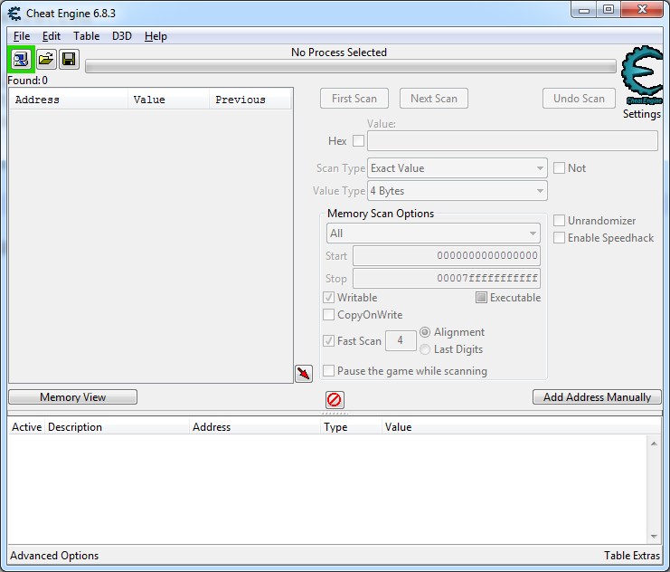
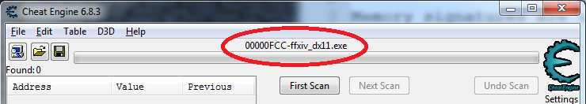
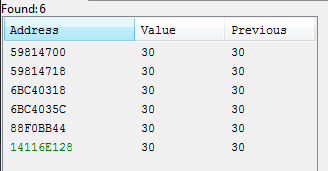
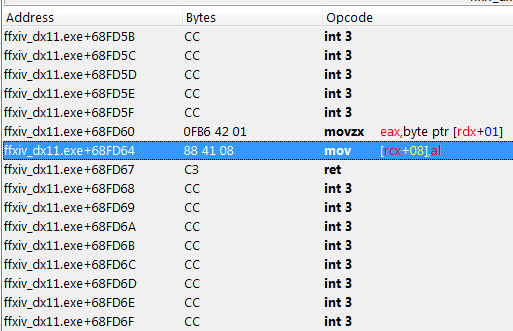
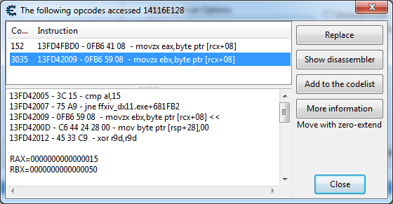

# 内存签名与CE指南

内存签名是一种独一无二的二进制字符串，用于在程序运行中寻找其特定位置的内存地址。

找到这些签名后，即便游戏本身拒绝提供任何API，你也可以通过签名获取游戏状态。(例如：是否处于战斗中，职业量谱的各种数值，仇恨数值的具体量等等)

这一篇指南旨在介绍如何使用CE(Cheat Engine)查找此类内存签名。如果您了解一些基本的汇编语言或编程经验，并且有水滴石穿的耐心，那么这篇文章可能对您有一定的帮助。

## 目录

* [安装](#安装)
* [查找新的内存签名](#查找新的内存签名)
  * [连接CE到游戏中](#连接CE到游戏中)
  * [初始内存搜索](#初始内存搜索)
  * [再次扫描](#再次扫描)
  * [浏览内存](#浏览内存)
  * [方法1：找出写内存的代码](#方法--1-找出写内存的代码)
  * [方法2：跟踪](#方法--2-跟踪)
  * [方法3：找出读内存的代码](#方法--3-找出读内存的代码)
  * [汇编代码和指针](#汇编代码和指针)
  * [从汇编代码中提取签名](#从汇编代码中提取签名)
* [扫描现有的内存签名](#扫描现有的内存签名)

## 安装

安装[最新版本的 Cheat Engine](https://github.com/cheat-engine/cheat-engine/releases/latest)。安装程序带了一些流氓软件，因此请确保不要勾选它们，不要盲目地一直“下一步”。抱歉，  真的很流氓。

## 查找新的内存签名



### 连接CE到游戏中

启动最终幻想14并登录。

然后，打开CE。点击**文件**，选择**打开进程**，然后选择最终幻想14。

此时，顶部栏应当会显示**ffxiv_dx11.exe**。



### 初始内存搜索

假设我们正在寻找您的角色在内存中的职业量谱。为了简单起见，我们以寻找战士职业量谱中的兽魂值。由于内存中存在许多零值，我们从一个非零值开始会简单一些。

在游戏中切换到战士职业，打几下木人，让你的兽魂值达到80。

切换到CE。


输入80的值（不要勾选十六进制）。扫描类型应为`精确值`，数值类型应为`4字节`。此时，我们还不知道兽魂值占用了多少字节。如果是4个字节最好了，要进行筛选的选项要少得多。但是，我们目前还不能做这个假设。我们也要寻找可写但不可执行的内存。

然后，单击**首次扫描**。

这可能会为您提供一大堆值为80的内存地址。但这是一个好的开端！


这是所有这些内存地址的实时视图，一旦值被更改就会变为红色。其中有一些值，即使我们完全没有在游戏中做任何事情，它们也在不断闪烁变化。您可以点击多次**再次扫描**按钮以重复扫描并舍弃这些值。

### 再次扫描

在游戏中使用裂石飞环使兽魂降低到30。

切换到CE。将**数值**更改为30。单击**再次扫描**。这将大大减少内存地址的数量。

重复此过程，改变游戏中的兽魂值，然后重新扫描新的值，直到地址的数量降低到只有几个为止。



其中，黑色的地址是堆地址。而绿色的地址是[静态地址](https://medium.com/@nickteixeira/stack-vs-heap-whats-the-difference-and-why-should-i-care-5abc78da1a88)。在一般情况下，你应当使用静态地址。因为引用它的代码更容易寻找，并且这些地址通常是永久性的。

继续扫描，直到找到唯一的绿色的静态地址。

右键单击地址，然后选择**将选中的地址添加到地址列表**。地址会出现在底部的列表。在我们的例子里，这个静态地址是 `14116E128`。


如果您正在按照此示例进行操作，则您所得到的静态地址很可能与此不同。不仅如此，每次在您重新启动游戏时，这个地址都会变化。这是因为Windows启用了[地址空间布局随机化](https://en.wikipedia.org/wiki/Address_space_layout_randomization) ，很大程度上使得难以进行我们现在正在做的事情。

这也是我们需要找到内存签名的原因。如果可执行文件和DLL地址布局没有随机化，则静态地址在每次运行时都是一致的。

### 浏览内存

在地址列表中，右键单击我们刚刚添加的地址，然后选择**浏览相关内存区域**。

这将会打开“内存浏览器”窗口。此窗口的上半部分是反汇编视图，下半部分是内存浏览器。虽然这两个视图位于同一窗口中，这些视图的功能是互不干扰的，也*不会*同步，这可能令人有些困惑。在您使用**反汇编此内存区域**或**浏览相关内存区域**时会跳转到您选择的最后一个地址。


但是，您应当可以看到，这个屏幕截图的左上部的数值是十六进制的 `1E`，也就是[十进制的30](https://www.google.com/search?q=0x1e+in+decimal)。

浏览内存使您看到周围的其他内容。这对于诸如实体或玩家的数据等尤其有用。

对于职业数据，附近的内存确实没有什么有趣的。

### 方法1：找出写内存的代码

现在，我们需要找到一些与此地址相关的代码。最简单的方式是找到修改此值的代码。

右键单击地址列表中的地址，然后选择**找出是什么改写了这个地址**。它会提示您附加调试器，单击“是”。 将会弹出一个新窗口。

返回到FF14，并改变兽魂的值。在这种情况下，我们打出咆哮，让兽魂从30涨到80。

返回到CE，调试窗口应出现一些新的信息。


这是写入到兽魂内存地址的汇编代码。

需要的话，您可以单击**显示反汇编器**以查看周围的代码。



不幸的是，在这个例子中，是两个操作数的函数调用。

更改值的一行汇编是 `mov [rcx + 08], al`。我不是很了解汇编语言，但是谷歌老师告诉我 `al` 是 `eax` 寄存器的后8位，该寄存器的值是在前面的 `movzx eax, byte ptr [rdx+01]` 一行上设置的。很明显这是写入内存的一行汇编，即 `[rcx + 08]` 是我们关心的指针，但我们需要先找到设置 `rcx` 的值的代码。这个寄存器的值在运行时会被设置多次。

我们在这里有两个不同的选择。一个方式是[进行跟踪以找到调用代码](#方法--2-跟踪)。第二种方式是[跟踪读取了该地址的代码](#方法--3-找出读内存的代码)（例如，切换职业会通过其他方式修改其值吗？）

### 方法2：跟踪

若仅仅依靠反汇编无法得知足够的上下文信息，则应当考虑CE的“断点跟踪”功能。返回到[浏览内存](#浏览内存)的视图。此功能无法直接在地址列表中使用。

右键单击 `1E` 字节值。选择**数据断点**，然后点击**中断和跟踪**按钮。选项都保持默认就可以了。由于我们在寻找的是写入此区域的代码，因此需要勾选**写入时中断**。点击**确认**。

这将会打开跟踪窗口。返回到FF14，并改变兽魂的值。由于CE会尝试记录函数调用栈，此时游戏很可能会很卡。切换回跟踪窗口。


双击跟踪窗口中的汇编代码会让内存浏览器的反汇编窗口跳转到该位置。

此时，我们可以点击三角箭头令其展开，并双击 `ret` (类似return) 汇编指令，让我们得以直通此前我们在反汇编窗口中看到的代码。

双击 `mov rdx, [rsp+50]` 则会导航至我们此前看到的代码所调用的代码。


这里的 `call` 正是我们正在寻找的 `call` 调用。因此，接下来就是找到写入 `rcx` 的代码了。可以看出来应该是通过 `r9` 赋值的，而 `r9` 的值来自于存储于 `r14` 的指针。这似乎有点复杂了。 尽管我们可以不停地检视汇编代码以找到对应的代码，但也许有更好的方式。

### 方法3：找出读内存的代码

寻找写入值的代码也许很不错，但我们还可以寻找读取值的代码。

右键选择地址列表中的内存地址，然后点击**找出是什么访问了这个地址**。

与写入不同的是，这个地址似乎被某段代码定时访问。因此您需要在收集了足够的位置信息后按下**停止**按钮。



在这个例子中，有两处代码访问了这块内存。其中一个访问了3000余次之多，而另一个相对来说没有如此频繁，仅有152次。

通过检视反汇编的代码，我们可以发现第二行代码像是个更加翔实的函数，我们从这一个开始吧。


太好了！这可比上一节的代码简单多了。

### 汇编代码和指针

由于我们寻找的是静态地址，在程序启动后就不会改变了。我们的目标是找到包含了我们需要的地址的一些稳定的汇编代码。这让我们不管在哪里启动程序，都可以通过搜索这段内存代码找到该地址。

汇编代码中读取兽魂值的代码为 `movzx ebx, byte ptr [rcx+08]`。用自然语言描述则是这样：它先读取 `rcx` 寄存器中存储的指针，向后移动8个字节，然后将该指针所指的地址中的值存储到 `ebx` 寄存器中。(movzx 操作会对该值进行 [零扩展(zero extends)](https://www.felixcloutier.com/x86/movzx)，尽管这不是我们所关心的。)

那么，我们现在就需要从 `rcx` 这个寄存器开始，向后查找对 `rcx` 寄存器进行赋值的代码行。在此处的例子中，`mov rcx,[ffxiv_dx11.exe+1AAE118]` 这一行，正是对 `rcx` 进行赋值的代码行。 该行的含义是对 `rcx` 所赋的值来源于此处显示的内存地址中所存储的值。

```assembly
48 8B 0D 23C14201     - mov rcx,[ffxiv_dx11.exe+1AAE118] { (14116E120) }
48 85 C9              - test rcx,rcx
74 B8                 - je ffxiv_dx11.exe+681FB2
48 8B 05 67C14201     - mov rax,[ffxiv_dx11.exe+1AAE168] { (21) }
```

换句话说，此处的 `23C14201` 就是我们要寻找的内存地址。在此我先简要介绍一下RIP相对寻址方式。RIP相对寻址，即相对于指令指针偏移的寻址方式。其中 `RIP` 指的是指令指针寄存器，其内容为紧跟于当前指令之后的指令的地址。双击下一行(即 `text rcx，rcx` 行)就可以得到该地址。在我们的例子中，这个地址为 `13FD41FF5`。由于我们处在一个 [little endian(小端)](https://en.wikipedia.org/wiki/Endianness)系统中，此处的十六进制数 `23C14201` 应当为 `01 42 C1 23` (即以字节为单位反着读)。若将 0x0142C123 与 0x13FD41FF5 [相加](https://www.google.com/search?q=0x0142C123+%2B+0x13FD41FF5) 则得到0x14116E118。双击指令时，CE也会帮你计算该数字。如当你双击本例中的 `mov rcx` 一行，Cheat Engine会自动计算并显示为 `mov rcx,[14116E118]`。因此，您根本不需要自行运算，但是知道此处的数学原理对我们后续的理解有一定帮助。

在Cheat Engine的注释一列中，可以看到`mov rcx` 行的值恰好就是 `14116E120`。这意味着地址 `14116E118` 中存储的值为 `14116E120`。此前我们找到的存储变量的地址为 `14116E128`，则我们可以得出 `14116E120 + 08` 正是我们所需要的值，可以看到读取该变量的代码也确实是在其地址加上了8字节。

您可以手动将地址 `14116E118` 添加到内存区域，或在兽魂的地址附近寻找，毕竟离得不远。


在以上的屏幕截图中，小圆圈中的 `14116E128` 是兽魂的值所在的地址，而较大的椭圆中的 `14116E118` 则是用于加载 `rcx` 寄存器的地址。内存查找也证明了这一点，可以看到地址 `14116E118` 中存储的值为 `000000014116E120`。(同样，不要忘记对字节进行反向排列，因为此处是小端系统。)

### 从汇编代码中提取签名

现在我们得到了包含了指向兽魂值的指针的指针的汇编代码。我们需要从汇编代码中选出一部分字节作为内存签名。

想要挑选好的签名也有一定技巧。譬如，应当忽略相对寻址偏移，在上述例子中则为 `23C14201`。尽管这些偏移量在每次运行游戏时都是一致的，但在游戏客户端跨版本更新后出现变化的概率很大。寻找签名是很麻烦的一件事，因此理想情况下，我们希望能找到经得起时间考验的签名。

在这个例子中， 我们先从 `mov rcx, ...` 一行开始，复制左边的字节列中的十六进制代码。

```assembly
48 8B 0D 23C14201     - mov rcx,[ffxiv_dx11.exe+1AAE118] { (14116E120) }
48 85 C9              - test rcx,rcx
74 B8                 - je ffxiv_dx11.exe+681FB2
48 8B 05 67C14201     - mov rax,[ffxiv_dx11.exe+1AAE168] { (21) }
```

复制出来的是 `48 8B 0D 23C14201 48 85 C9 74 B8 48 8B 05 67C14201`

其中两个四字节的串都是指针，因此我们可以直接删掉后面那个，并将第一个替换为通配符。通配符可以是问号，在cactbot和CE中都是通用的。

因此，最终我们的签名是：`488B0D????????4885C974B8488B05`

此签名中的问号指代的四字节地址便是我们所关心的指针的地址。

Cactbot中也有一个可供参考的[例子](https://github.com/OverlayPlugin/cactbot/blob/df176c4feff81bab356a8e5e6e6b453e94626320/CactbotOverlay/FFXIVProcess.cs#L189)。

为了确保签名是唯一的，我们需要再做一次[扫描现有的内存签名](#扫描现有的内存签名)。

然后，在插件中的逻辑如下：

* 在内存中搜索此签名
* 将RIP相对寻址转换为实际指针 (例如 `14116E118`)
* 找到该内存区域中的指针 (例如 `14116E120`)
* 该指针是指向兽魂的指针

由于地址 `14116E118` 向后数8个字节就是地址 `14116E120`，我们还可以再作一个假设，我们在签名找到的地址加上16字节即为我们需要的地址。至少在整个4.0版本中都是如此。

呵呵。

## 扫描现有的内存签名

如果您已有内存签名，也可以使用CE在内存中搜索。


重新开始扫描。这次应当设置**值类型**为**字节数组**，然后勾选**搜索该数组**和**十六进制**的复选框，然后将内存签名粘贴到文本框中。同时确保**可执行**复选框是选中状态，这是因为我们这次要搜索的是代码。

点击**首次扫描**应当给出独一无二的结果。右键单击该地址，然后选择**反编译该地址**，应当能跳转到我们之前找到的代码。
