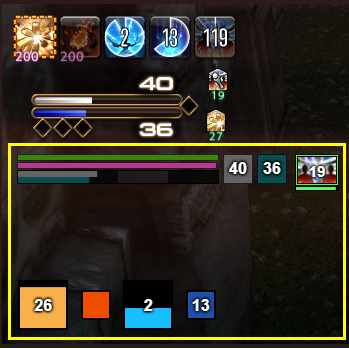

# cactbot (ffxiv raid 悬浮窗)


[](https://github.com/quisquous/cactbot/actions?query=workflow%3ATest+branch%3Amain) [](https://github.com/quisquous/cactbot/releases/latest)

🌎 [[English](../../README.md)] [**简体中文**] [[한국어](../ko-KR/README.md)]

1. [关于](#关于)
1. [安装](#安装)
1. [从源码构建](#从源码构建)
1. [UI模块概述](#uI模块概述)
1. [疑难解答](#疑难解答)
1. [Cactbot自定义](#cactbot自定义教程)
1. [支持语言](#支持语言)

## 关于

cactbot是一个ACT悬浮窗，可为 [Final Fantasy XIV](http://www.finalfantasyxiv.com/)提供战斗辅助。 该项目是 [ngld的OverlayPlugin](https://github.com/ngld/OverlayPlugin) 的悬浮窗插件，而OverlayPlugin是 [Advanced Combat Tracker](http://advancedcombattracker.com/)的插件。

cactbot提供以下模块：

* raidboss: 内置时间轴和触发器

 

* oopsyraidsy: 错误和死亡报告


* jobs: 用于buff与触发监控的紧凑型职业量谱



* eureka: 优雷卡恶名精英监控地图


* fisher: 捕鱼垂钓时间监控


* radar: 通知狩猎怪方向及开怪信息


* dps: 提供更多功能的dps悬浮窗


### 视频实例

* [O4S raidboss + 武僧职业量谱](https://www.twitch.tv/videos/209562337)
* [O3S 女王之舞提示](https://clips.twitch.tv/StrangeHungryGarageShadyLulu)

## 安装

### 依赖

安装4.6.1版本及以上的[.NET Framework](https://www.microsoft.com/net/download/framework)。

您必须为最终幻想14启用 [DirectX 11](http://imgur.com/TjcnjmG)。

如果尚未安装64位版本的 [Advanced Combat Tracker](http://advancedcombattracker.com/)，请安装。

### 安装FFXIV ACT解析插件

如果您刚刚安装了ACT， 那么你会看到一个启动向导。 否则，您需要通过点击 `Options` ， 然后点击 `Show Startup Wizard` 启动启动向导。


在启动向导中， 选择 `FFXIV Parsing Plugin` ，然后单击 `Download/Enable Plugin` 按钮。 这将下载 `%APPDATA%Advanced Combat Tracker\Plugins\FFXIV_ACT_Plugin.dll`， 并在插件列表中启用它。


此外，您必须启用网络解析方式，并确保为ACT开启防火墙准入。 请确保FFXIV解析插件的设置中已勾选“包含HP用于触发器”按钮。 此选项在 `插件列表` ->`FFXIV Settings` -> `Options`中。

其他FFXIV插件指南：

* [fflogs video guide](https://www.fflogs.com/help/start/)
* [TomRichter guide](https://gist.github.com/TomRichter/e044a3dff5c50024cf514ffb20a201a9#installing-act--ffxiv-plugin)

### 安装ngld OverlayPlugin

此时，如果选择 `插件` 标签，然后切换至 `插件列表`， 您的插件列表中应当如下所示：


单击 `Get Plugins` 可以打开ACT插件安装程序。

选择 `悬浮窗插件` ，然后单击 `Download and Enable`按钮。


这会将ngld OverlayPlugin下载到 `%APPDATA%\Advanced Combat Tracker\Plugins\OverlayPlugin` 文件夹中， 并自动在插件列表中启用 `OverlayPlugin.dll`。

注意，您必须使用 [ngld](https://github.com/ngld) 版本的OverlayPlugin， 而不是原本RainbowMage的版本或hibiyasleep的fork版本。

### 安装cactbot

再次，点开 `Plugins` 标签， 再点开 `Plugin Listing` 标签， 然后选择 `Get Plugins`。

选择 `Cactbot` ，然后单击 `Download and Enable` 按钮。


这会将cactbot下载到 `%APPDATA%\Advanced Combat Tracker\Plugins\cactbot-version\cactbot` 文件夹中， 并在插件列表中启用 `CactbotOverlay.dll`。

**注意**： 由于ACT和cactbot对于zip格式处理的差异性， 它可能会生成一个形如 `cactbot-0.15.2` 的文件夹， 这里的版本号是根据你下载cactbot时的最早版本决定的。 该文件夹的名称无关紧要，并且很美观。

确认您的插件加载顺序正确。 正确的顺序应该是：FFXIV解析插件，OverlayPlugin，cactbot。 如果您按照上述说明进行操作，顺序应当如下所示：


最后，重启ACT。

## 添加悬浮窗模块

下面的例子展示了如何设置raidboss悬浮窗模块。 设置其他的cactbot悬浮窗的操作也类似这样。

1. 打开ACT。
1. 添加了cactbot插件后，请确保已重新启动ACT。
1. 导航到ACT的 `Plugins` 标签页，然后跳转到其中的 `OverlayPlugin.dll` 标签页。
1. 单击“新建”按钮，然后在“预设”列表中选择 `Cactbot Raidboss`。

    

1. 此时，您应该能看到屏幕上会出现测试用UI。 这是cactbot提供的默认测试用UI， 一个较大的虚线红色边框，以及蓝色的背景， 可以帮助你在屏幕上调整悬浮窗的位置大小等。 当您在悬浮窗的配置面板中锁定该悬浮窗时，这些测试用UI都将消失。 在您完成了调整悬浮窗大小和位置之后，应该始终保持锁定悬浮窗。

    

1. 您可以输入任意的名字作为悬浮窗的名称，例如 `raidbossy`。
1. 单击 `确定` 按钮将其添加为悬浮窗。 则它将会出现在 `Plugns` -> `OverlayPlugin.dll` 标签页的悬浮窗列表中。

1. 将悬浮窗拖放到所需的位置。

1. 在 `Raidboss` 悬浮窗的 `通用` 选项卡中，勾选 `锁定悬浮窗` 和 `鼠标穿透` 复选框。 一旦悬浮窗被锁定，测试用的进度条，文本，红色虚线边框，以及蓝色阴影背景都将会消失。

    

1. 如果要测试raidboss插件，请传送到盛夏农庄，然后在聊天框输入 `/ countdown 5` 并回车。

1. 您可以用同样的方法添加其他cactbot悬浮窗。 步骤是一样的，只是选择了不同的cactbot预设。

## 从源码构建

请先遵循上述的步骤安装好cactbot。 有两种方式可以安装依赖：**通过脚本** 或 **手动**。

### 安装依赖：脚本方式

1. 必须先安装 `curl`（用于下载依赖项）
1. 运行 `./util/fetch_deps.py` 脚本
1. 下转 **构建步骤**

### 安装依赖：手动方式

1. 请从 <https://github.com/EQAditu/AdvancedCombatTracker/releases/>下载最新的Zip文件。
1. 将 `Advanced Combat Tracker.exe` 解压到 `cactbot/plugin/ThirdParty/ACT/` 下
1. 请从 [https://github.com/ravahn/FFXIV_ACT_Plugin/](https://github.com/ravahn/FFXIV_ACT_Plugin/) 下载最新的SDK Zip文件（确保文件名称中包含SDK字样）
1. 解压 `SDK文件夹` 和 `FFXIV_ACT_Plugin.dll` 到 `cactbot/plugin/ThirdParty/FFXIV_ACT/` 下
1. 请从 <https://github.com/ngld/OverlayPlugin/releases/>下载最新的Zip文件。
1. 解压 `libs文件夹` 和 `OverlayPlugin.dll` 到 `cactbot/plugin/ThirdParty/OverlayPlugin/` 下
1. 下转 **构建步骤**

该文件夹应如下所示（请注意，将来文件结构可能会随着更新而更改）：

```plaintext
ThirdParty
|- ACT
|  |- Advanced Combat Tracker.exe
|- FFXIV_ACT
|  |- SDK
|  |  |- FFXIV_ACT_Plugin.Common.dll
|  |  |- FFXIV_ACT_Plugin.Config.dll
|  |  |- FFXIV_ACT_Plugin.LogFile.dll
|  |  |- FFXIV_ACT_Plugin.Memory.dll
|  |  |- FFXIV_ACT_Plugin.Network.dll
|  |  |- FFXIV_ACT_Plugin.Overlay.dll
|  |  |- FFXIV_ACT_Plugin.Parse.dll
|  |  |- FFXIV_ACT_Plugin.Resource.dll
|  |- FFXIV_ACT_Plugin.dll
|- OverlayPlugin
   |- libs
   |  |- HtmlRenderer.dll
   |  |- Markdig.Signed.dll
   |  |- Newtonsoft.Json.dll
   |  |- OverlayPlugin.Common.dll
   |  |- OverlayPlugin.Core.dll
   |  |- OverlayPlugin.Updater.dll
   |  |- SharpCompress.dll
   |  |- System.ValueTuple.dll
   |  |- websocket-sharp.dll
   |- OverlayPlugin.dll
```

### 构建插件的步骤

1. 在Visual Studio中打开解决方案（已在Visual Studio 2017测试通过）。
1. 采用“Release”和“ x64”的配置开始构建。
1. 该插件将构建到 **bin/x64/Release/CactbotOverlay.dll**。
1. 将构建好的插件添加到ACT。  在ACT-> Plugins -> Plugin Listing 标签页中，单击 `Browse` 按钮，然后导航至构建完成的 **bin/x64/Release/CactbotOverlay.dll** 文件。  然后单击 `Add/Enable Plugin` 按钮。

### npm 和 webpack

如果您不是cactbot开发人员，并且尝试修改cactbot，添加自己的个人触发器。 您不应直接修改本地的cactbot文件，而应该参考 [自定义文档](./CactbotCustomization.md) 进行自定义。

安装npm并启动Webpack，请按照下列步骤操作：

1. 安装 [nodejs 和 npm](https://nodejs.org/en/download/)
1. 在cactbot的根目录下运行 `npm install`。
1. 运行 `npm run build` 或 `npm start`。

关于使用Webpack的更多信息，请参见 [贡献文档](CONTRIBUTING.md#validating-changes-via-webpack) 。

## UI模块概述

[ui/](ui/) 文件夹中包含cactbot的所有ui模块。 如果您按照上述说明安装了cactbot， 则很有可能是 `%APPDATA%Advanced Combat Tracker\Plugins\cactbot-version\cactbot\ui\`。

每个cactbot ui模块都应当作为单独的悬浮窗添加。 有关配置的更多信息，请参见“ [添加悬浮窗模块](#添加悬浮窗模块) 部分。

### [raidboss](../../ui/raidboss) 模块

要使用该模块，定位到cactbot下面的 **ui/raidboss/raidboss.html** 或使用 `Cactbot Raidboss` 预设。

此模块提供预知战斗事件的时间轴， 以及文本和音频提示，以帮助提高团队对raid的意识。 这些文字和声音警报一般基于战斗时间轴，或是来自游戏中发生的日志消息。简单地说，这是一个类似于ACT的“自定义触发器”的功能。 该模块被设计为类似于《魔兽世界》的 [BigWigs Bossmods](https://www.curseforge.com/wow/addons/big-wigs) 插件的外观和感觉。

[此页面](https://quisquous.github.io/cactbot/util/coverage/coverage.html) 列出了当前cactbot中支持的副本。 我们会持续添加更多支持 (随时欢迎贡献代码！) 尽管目前大部分旧副本仍未支持。

战斗时间轴原本是设计为用于 [ACT时间轴](https://github.com/grindingcoil/act_timeline)插件的文件， 具有 [特殊的扩展名](./TimelineGuide.md)， 这里是该插件的 [文档](http://dtguilds.enjin.com/forum/m/37032836/viewthread/26353492-act-timeline-plugin)。

这里有三个等级的警报提示，重要性从低到高分别为： `info(信息)`、 `alert(警告)` 和 `alarm(警报)`。 文本信息只会有这三种等级，等级越高，越重要，则文字会越大，颜色也会越醒目。  如果你更喜欢文本到语音(TTS)，你也可以配置这个提示方式。

在[ui/raidboss/data](../../ui/raidboss/data)文件夹下存在定义了文本显示和声音提示的时间轴和触发器等， 时间轴文件拥有 `.txt` 扩展名，而触发器文件则为 `.js` 扩展名。

在下方的截图中，高亮的是raidboss模块，其中时间轴用红色圆圈圈出， 文本警报用黄色圆圈圈出，可见的是 `警告`等级的文字提示。


### raidboss模拟器

如果在编写触发器或时间轴，并要对其进行测试， 您可以使用此处的raidboss模拟器： **ui/raidboss/raidemulator.html**。

但是，目前只能在浏览器中加载它，不支持加载为悬浮窗。 该模拟器在最新版本的Chrome中可以完美运行， 理论上在其他浏览器中也可以运行，但是并没有测试过。

操作步骤：

1. 启动ACT。
1. 确保WS Server已启动，可以在 Plugins -> OverlayPlugin WSServer-> Stream/Local Overlay 中对此进行配置。
1. 从URL列表中选择 `Cactbot Raidboss (Combined Alerts and Timelines)`。
1. 编辑网址，将 `raidboss.html` 替换为 `raidemulator.html`。
1. 将修改后的网址复制并粘贴到Chrome中。
1. 拖放一个 [网络日志](./FAQ-Troubleshooting.md#how-to-find-a-network-log) 文件到该页面中。
1. 选择区域和战斗记录，然后单击 `Load Encounter`。

如果模拟器无法正常工作，请检查控制台中是否显示了错误日志。 该页面在通过websocket连接到ACT之前，任何按钮都无法工作。


### [oopsyraidsy](../../ui/oopsyraidsy) 模块

要使用该模块，定位到cactbot下面的 **ui/raidboss/oopsyraidsy.html** 或使用 `Cactbot OopsyRaidsy` 预设。

此模块提供错误追踪和死亡报告。  通过 oopsy raidsy 模块可以检查战斗中出了什么问题，以及队友死亡的原因，以减少攻略副本的时间。  在战斗中，仅显示一定数量的错误（以避免混乱），但脱战后可以显示完整的可滚动列表。

当某人死亡时，他/她遭受伤害的最后一个伤害事件会记录在日志中。  例如，当日志显示：":skull: Poutine: Iron Chariot (82173/23703)"，这意味着Poutine最有可能死于Iron Chariot这个技能，造成了82173伤害，且当时他具有23703的血量。  血量值本身并不完美，由于服务器更新周期的存在，或者因为同时存在多个伤害技能，血量值可能有数秒的延迟。

当错误本身可以避免时，oopsy会将其记录为警告（:warning:）和失败（:no_entry_sign:）消息，并说明出现了什么问题。

[ui/oopsyraidsy/data](../../ui/oopsyraidsy/data) 文件夹中为每个副本指定了错误触发器。


### [jobs](../../ui/jobs) 模块

要使用该模块，定位到cactbot下面的 **ui/raidboss/jobs.html** 或使用 `Cactbot Jobs` 预设。

该模块提供了HP和MP条，以及重要团辅技能的图标和计时条等，如太阳神之衡和攻其不备。 该模块同样提供食物增益效果提示，使您可在迷宫或Raid中保持食物增益。 此外，该模块还提供了可视化的倒计时条。

该模块为某些职业提供了较为完整的支持，但是对另外一些职业的支持仍然*非常*不完善。

<details>
<summary>支持的职业 (点击展开)</summary>

|                                                 职业                                                  |                                       功能                                        |
|:---------------------------------------------------------------------------------------------------:|:-------------------------------------------------------------------------------:|
|  <br> 骑士  |                          显示当前的忠义值和赎罪剑层数。 以及监控沥血剑的DoT。                           |
|  <br> 战士  |               显示兽魂值，并监控剩余的暴风碎Buff时间，给出以GCD为基准的补buff提示，同时显示剩余连击时间。               |
| <br> 暗黑骑士 |                  显示暗血值和暗黑剩余时间，嗜血，血乱和掠影示现的持续时间和冷却时间，并且显示剩余连击时间。                  |
| <br> 绝枪战士 |                    显示无情的持续时间&冷却时间，血壤&烈牙的冷却时间，晶壤数量，并显示剩余连击时间。                    |
| <br> 白魔法师 |                 显示治疗&血百合数量，距离获得下一朵治疗百合的时间，DoT剩余时间，以及法令&醒梦的冷却时间。                 |
|  <br> 学者  |                 显示以太超流的层数、异想以太量/炽天使剩余时间、DoT剩余时间，并显示以太超流&醒梦的冷却。                  |
| <br> 占星术士 |                 显示已有的印记数量，标注是否应该发当前卡/应该发给谁，DoT剩余时间和抽卡&醒梦的冷却时间。                  |
|  <br> 武僧  | 显示斗气档数，身形持续时间，并监控连击效果提高、双掌打buff和破碎拳DoT时间。 |
| <br> 龙骑士  |               显示龙血时间&龙眼数，开膛枪buff剩余时间，跳跃的冷却时间，以及猛枪&巨龙视线的持续时间和冷却时间。               |
|  <br> 忍者  |                显示忍气量，风遁剩余时间，攻其不备持续时间&冷却时间，分身之术&结印的冷却，并显示连击剩余时间。                 |
|  <br> 武士  |                  显示剑气量，剑压档数，士风、阵风和彼岸花的剩余时间，回返的冷却时间，以及显示连击剩余时间。                  |
| <br> 吟游诗人 |        显示当前歌谣及其持续时间，诗心档数，灵魂之声量，直线射击预备buff监控，DoT持续时间，以及显示你的DoT造成伤害时机的计时条。        |
| <br> 机工士  |    显示热量计、电能计、连击计时器、钻头/毒菌冲击&空气锚的冷却时间，野火的冷却时间&持续时间。 当野火发动时，将显示你已在野火中打出的GCD数目。     |
|  <br> 舞者  |                   显示连击计时器、幻扇量谱、伶俐量谱、标准舞步冷却、技巧舞步&百花争艳的冷却&持续时间。                   |
| <br> 黑魔法师 |           显示DoT剩余时间，火苗&雷云触发的剩余时间，获得下一个通晓的剩余时间，魔力恢复时间点监控，冰火档数以及灵极心档数。            |
| <br> 召唤师  |           显示DoT剩余时间。能量吸收冷却时间，龙神/不死鸟附体冷却时间，以太超流档数，亚灵神召唤的剩余时间以及毁绝预备的档数。           |
| <br> 赤魔法师 |                        显示黑白魔元量，监控赤飞石&赤火焰预备触发，以及显示醒梦的冷却。                         |
| <br> 青魔法师 |                         显示防御解除&醒梦的冷却时间，以及苦闷之歌DoT的剩余时间。                          |

</details>

在此截图中，以赤魔法师的jobs模块为例。 紫色圆圈圈出的是体力条与魔力条，还有赤魔法师的黑/白魔元监控；橙色箭头指向的是一个大大的团辅监控图标。 <del>赤魔近战连击监控功能已被移除，略。</del> 绿色圈出的是触发监控。


### [eureka](../../ui/eureka) 模块

要使用该模块，定位到cactbot下面的 **ui/raidboss/eureka.html** 或使用 `Cactbot Eureka` 预设。

该模块会自动追踪NM的出现和死亡。  还会显示特殊天气/夜晚计时器以及粘贴到聊天中的优雷卡追踪器链接。  聊天中的所有坐标信息也都会临时显示在地图上。

当前，该模块不会直接读取优雷卡追踪器的信息。  但如果您点击优雷卡追踪器左侧红色的“复制已杀死的NM”按钮来复制当前已死NM的列表，则可以将其粘贴到游戏中，例如`/echo 冷却中的NM: 蝎子 (7m) → 魔界花 (24m) → 独眼 (54m)`，以便该模块从此列表自动同步数据。

如果您看不到表情符号，请确保已安装[此Windows更新](https://support.microsoft.com/en-us/help/2729094/an-update-for-the-segoe-ui-symbol-font-in-windows-7-and-in-windows-ser)。


### [radar](../../ui/radar) 模块

要使用该模块，定位到cactbot下面的 **ui/raidboss/radar.html** 或使用 `Cactbot Radar` 预设。

该模块可让您发现附近的狩猎怪（S级，A级等）。 当一个狩猎怪出现时，该模块会显示一个箭头（基于角色面向）指向该狩猎怪并会显示您与该狩猎怪之间的距离。

控制面板中的选项可以设置显示哪位玩家开了狩猎怪，还可以配置radar模块的显示方式。 您还可以为不同等级的狩猎怪设置自定义选项（例如为S级怪发出声音，但对B级怪保持沉默），或为您想监控的任何目标名称添加自定义触发器。

有关更多选项，请参见`cactbot/user/radar-example.js`文件。


### [fisher](../../ui/fisher) 模块

要使用该模块，定位到cactbot下面的 **ui/raidboss/fisher.html** 或使用 `Cactbot Fisher` 预设。

当您在一个渔场投出鱼线时，该模块会一直追踪您何时钓到了什么鱼，以便您日后知道提钩时将会钓到什么鱼。


目前该模块仅会记录您的钓鱼记录，因此只有在您钓到了鱼时才会有数据。 绿色的条形代表轻杆，黄色的条形代表中杆，红色的条形代表鱼王杆/重杆。

有关不同杆种类型的示例，请参见[此处](https://www.youtube.com/watch?v=GHgWIA-Zhug)。

在[此链接](./FAQ-Troubleshooting.md#fisher-module)中可以找到fisher模块的常见问题解答。

### [dps](../../ui/dps) 统计模块

cactbot可以与为OverlayPlugin的数据统计功能设计的任何DPS统计悬浮窗共同使用，并可以选择通过cactbot附加的Javascript API扩展更多功能。  cactbot还可以在团灭时自动停止统计，因此您可以将ACT的战斗时间配置为无限。

[xephero](../../ui/dps/xephero)DPS统计悬浮窗具有在多列显示对副本的每个阶段的DPS数据进行分段的功能。 在下面的截图中，各阶段分别命名为B1、B2、B3。  它们会在4人本的BOSS自动生成，也可以用来区分Raid副本的阶段。


[rdmty](../../ui/dps/rdmty)DPS统计悬浮窗为4.X职业进行了适配更新，并为了匹配[fflogs](http://fflogs.com)进行了重新着色。


### [pull counter](../../ui/pullcounter) 模块

这个小模块可以显示您在高难度副本中当前的重试次数。 此功能是为主播或查看录屏的玩家准备的。 通过这个数字，您可以轻松浏览视频并查找到特定的某场战斗来进行检阅。

您可以通过在游戏聊天窗口中键入`/echo pullcounter reset`来重置当前副本/区域的重试计数。 您也可以直接在`%APPDATA%\Advanced Combat Tracker\Config\RainbowMage.OverlayPlugin.config.json`文件中修改该计数。


### [test](../../ui/test) 模块

要使用该模块，定位到cactbot下面的 **ui/raidboss/test.html** 或使用 `Cactbot Test` 预设。

该模块仅用于cactbot所用变量的可视化测试，并不适合在正常游戏时使用。 该模块可用来测试所有数据的获取是否正常、模块能否按照预期正常工作，或用来调试悬浮窗的错误。


## 疑难解答

您可以在[此链接](./FAQ-Troubleshooting.md)中查看Cactbot的常见问题解答。

## Cactbot自定义教程

大部分的cactbot配置可通过ACT内的cactbot控制面板来完成。


您可以在插件->OverlayPlugin.dll->Cactbot找到Cactbot的控制面板。

特别是如果您想使用TTS播报RaidBoss模块的警报，您可以将“默认警报提示信息输出方式”选项修改为“只使用TTS”或“文字显示与TTS”。 您还可以对任意触发器进行特殊设置。

如果您出于某些原因（？？？），不想听到cactbot的准备确认提示音，您也可以在此控制面板中禁用它。 请转到Raidboss -> 通用触发器-> General-> General Ready Check，并将其设置为`禁用`。

此处的选项会存储于 `%APPDATA%\Advanced Combat Tracker\Config\RainbowMage.OverlayPlugin.config.json` 文件中。 不建议直接编辑该文件，因为它必须是[标准的JSON](https://jsonlint.com/)，如果该文件被错误地修改，ACT可能无法启动。

强烈建议您通过此控制面板而不是用户文件来完成大部分的配置。 `cactbot/user/` 中的文件功能更加强大并且可以覆盖控制面板中的任何配置。 然而，当控制面板没有正确地调整`cactbot/user/`内的文件正在悄悄覆盖的配置时，也会造成困惑。

有关自定义javascript和css文件的更多详细信息，请参见[本文档](CactbotCustomization.md#user-folder-config-overrides)。

## 支持语言

cactbot已在当前版本的国际服（英语、德语、法语、日语）、国服以及韩服经过测试并可以正常工作。 某些翻译工作仍在进行中。

## 许可、商标与授权

cactbot基于[Apache License, Version 2.0](../../LICENSE)开放源代码。

FINAL FANTASY是株式会社史克威尔艾尼克斯控股(株式会社スクウェア・エニックス・ホールディングス，Square Enix Holdings Co., Ltd.)的注册商标。

《最终幻想》艺术作品和图标基于[FINALFANTASY®XIV素材使用许可](https://support.na.square-enix.com/rule.php?id=5382)，以非商业方式二次使用。

有关其他内建项目的详细信息，请参见 [LICENSE](../../LICENSE) 文件。
