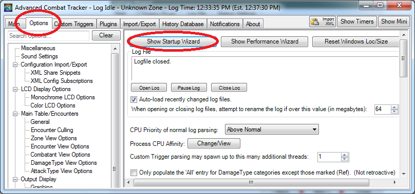

# cactbot (ffxiv raid 悬浮窗)


[](https://github.com/quisquous/cactbot/actions?query=workflow%3ATest+branch%3Amain) [](https://github.com/quisquous/cactbot/releases/latest)

🌎 [[English](../../README.md)] [**简体中文**] [[한국어](../ko-KR/README.md)]

1. [关于](#关于)
1. [安装](#安装)
1. [从源码构建](#从源码构建)
1. [UI 模块概述](#ui-模块概述)
1. [疑难解答](#疑难解答)
1. [Cactbot 自定义](#cactbot-自定义教程)
1. [支持语言](#支持语言)

## 关于

cactbot 是一个 ACT 悬浮窗，可为 [Final Fantasy XIV](http://www.finalfantasyxiv.com/)提供战斗辅助。 该项目是 [OverlayPlugin](https://github.com/OverlayPlugin/OverlayPlugin) 的悬浮窗插件，而 OverlayPlugin 是 [Advanced Combat Tracker](http://advancedcombattracker.com/)的插件。

cactbot 提供以下模块：

* raidboss: 内置时间轴和触发器

 

* oopsyraidsy: 错误和死亡报告


* jobs: 监控职业资源、重要技能冷却、buff 与触发的紧凑型职业量谱


* eureka: 特殊场景探索（优雷卡、博兹雅）监控地图


* fisher: 捕鱼垂钓时间监控


* radar: 通知狩猎怪方向及开怪信息


* dps: 提供更多功能的 dps 悬浮窗


## 安装

### 依赖

安装 4.6.1 版本及以上的 [.NET Framework](https://www.microsoft.com/net/download/framework)。

您必须为最终幻想 14 启用 [DirectX 11](http://imgur.com/TjcnjmG)。

安装 64 位版本的 [Advanced Combat Tracker](http://advancedcombattracker.com/)。

### 安装 FFXIV ACT 解析插件

如果您刚刚安装了 ACT， 你会看到一个启动向导。否则，您需要通过点击 `Options` ，然后点击 `Show Startup Wizard` 打开启动向导。



在启动向导中，选择 `FFXIV Parsing Plugin`，然后单击 `Download/Enable Plugin` 按钮。这将把解析插件下载到 `%APPDATA%\Advanced Combat Tracker\Plugins\FFXIV_ACT_Plugin.dll`，并在插件列表中启用它。


其他 FFXIV 插件指南：

* [fflogs video guide](https://www.fflogs.com/help/start/)
* [TomRichter guide](https://gist.github.com/TomRichter/e044a3dff5c50024cf514ffb20a201a9#installing-act--ffxiv-plugin)

### 安装 OverlayPlugin

此时，如果选择 `插件` 标签，然后切换至 `插件列表`，您的插件列表中应当如下所示：


单击 `Get Plugins` 可以打开 ACT 插件安装程序。

选择 `Overlay Plugin`，然后单击 `Download and Enable` 按钮。


这会将 OverlayPlugin 下载到 `%APPDATA%\Advanced Combat Tracker\Plugins\OverlayPlugin` 文件夹中，并自动在插件列表中启用 `OverlayPlugin.dll`。

注意，您必须使用 [当前最新](https://github.com/OverlayPlugin/OverlayPlugin) 版本的 OverlayPlugin，而不是原本 RainbowMage 的版本或 hibiyasleep 的 fork 版本。

### 安装 cactbot

再次点开 `Plugins` 标签，再点开 `Plugin Listing` 标签，然后选择 `Get Plugins`。

选择 `Cactbot`，然后单击 `Download and Enable` 按钮。


这会将 cactbot 下载到 `%APPDATA%\Advanced Combat Tracker\Plugins\cactbot-version\cactbot` 文件夹中，并在插件列表中启用 `CactbotOverlay.dll`。

**注意**：由于 ACT 和 cactbot 对于 zip 格式处理的差异性，它可能会生成一个形如 `cactbot-0.15.2` 的文件夹，这里的版本号是根据你下载 cactbot 时的最早版本决定的。该文件夹的名称无关紧要，并且很美观。

### 插件加载顺序

由于 cactbot 的依赖关系，它需要在 FFXIV 解析插件和 OverlayPlugin 之后加载。正确的顺序应该是：

* FFXIV 解析插件
* OverlayPlugin，
* cactbot


最后，重启 ACT。

## 添加悬浮窗模块

下面的例子展示了如何设置 raidboss 悬浮窗模块。 设置其他的 cactbot 悬浮窗的操作也类似这样。

1. 打开 ACT。
1. 添加了 cactbot 插件后，请确保已重新启动 ACT。
1. 导航到 ACT 的 `Plugins` 标签页，然后跳转到其中的 `OverlayPlugin.dll` 标签页。
1. 单击 “新建” 按钮，然后在 “预设” 列表中选择 `Cactbot Raidboss`。

    

1. 此时，您应该能看到屏幕上会出现测试用 UI。 这是 cactbot 提供的默认测试用 UI， 一个较大的虚线红色边框，以及蓝色的背景， 可以帮助你在屏幕上调整悬浮窗的位置大小等。 当您在悬浮窗的配置面板中锁定该悬浮窗时，这些测试用 UI 都将消失。 在您完成了调整悬浮窗大小和位置之后，应该始终保持锁定悬浮窗。

    

1. 您可以输入任意的名字作为悬浮窗的名称，例如 `raidbossy`。

1. 单击 `确定` 按钮将其添加为悬浮窗。则它将会出现在 `Plugns` -> `OverlayPlugin.dll` 标签页的悬浮窗列表中。

1. 将悬浮窗拖放到所需的位置。

1. 在 `Raidboss` 悬浮窗的 `通用` 选项卡中，勾选 `锁定悬浮窗` 和 `鼠标穿透` 复选框。一旦悬浮窗被锁定，测试用的进度条，文本，红色虚线边框，以及蓝色阴影背景都将会消失。

    

1. 如果要测试 raidboss 插件，请传送到盛夏农庄，然后在聊天框输入 `/countdown 5` 并回车。

1. 您可以用同样的方法添加其他 cactbot 悬浮窗。步骤是一样的，只要选择不同的 cactbot 预设即可。

## 从源码构建

请先遵循上述的步骤安装好 cactbot。有两种方式可以安装依赖：**通过脚本** 或 **手动**。

### 安装依赖：脚本方式

1. 必须先安装 `curl`（用于下载依赖项）
1. 运行 `ts-node ./util/fetch_deps.ts` 脚本
1. 下转 **构建步骤**

### 安装依赖：手动方式

1. 请从 <https://github.com/EQAditu/AdvancedCombatTracker/releases/> 下载最新的 Zip 文件。
1. 解压 `Advanced Combat Tracker.exe` 到 `cactbot/plugin/ThirdParty/ACT/` 下
1. 请从 <https://github.com/ravahn/FFXIV_ACT_Plugin/> 下载最新的 SDK Zip 文件（确保文件名称中包含 SDK 字样）
1. 解压 `SDK文件夹` 和 `FFXIV_ACT_Plugin.dll` 到 `cactbot/plugin/ThirdParty/FFXIV_ACT/` 下
1. 请从 <https://github.com/OverlayPlugin/OverlayPlugin/releases/> 下载最新的 Zip 文件。
1. 解压 `libs文件夹` 和 `OverlayPlugin.dll` 到 `cactbot/plugin/ThirdParty/OverlayPlugin/` 下
1. 下转 **构建步骤**

该文件夹应如下所示（请注意，将来文件结构可能会随着更新而更改）：

```plaintext
ThirdParty
|- ACT
|  |- Advanced Combat Tracker.exe
|- FFXIV_ACT
|  |- SDK
|  |  |- FFXIV_ACT_Plugin.Common.dll
|  |  |- FFXIV_ACT_Plugin.Config.dll
|  |  |- FFXIV_ACT_Plugin.LogFile.dll
|  |  |- FFXIV_ACT_Plugin.Memory.dll
|  |  |- FFXIV_ACT_Plugin.Network.dll
|  |  |- FFXIV_ACT_Plugin.Overlay.dll
|  |  |- FFXIV_ACT_Plugin.Parse.dll
|  |  |- FFXIV_ACT_Plugin.Resource.dll
|  |- FFXIV_ACT_Plugin.dll
|- OverlayPlugin
   |- libs
   |  |- HtmlRenderer.dll
   |  |- Markdig.Signed.dll
   |  |- Newtonsoft.Json.dll
   |  |- OverlayPlugin.Common.dll
   |  |- OverlayPlugin.Core.dll
   |  |- OverlayPlugin.Updater.dll
   |  |- SharpCompress.dll
   |  |- System.ValueTuple.dll
   |  |- websocket-sharp.dll
   |- OverlayPlugin.dll
```

### 构建插件的步骤

1. 在 Visual Studio 中打开解决方案（已在 Visual Studio 2017 测试通过）。
1. 采用 “Release” 和 “x64” 的配置开始构建。
1. 该插件将构建到 **bin/x64/Release/CactbotOverlay.dll**。
1. 将构建好的插件添加到 ACT。在 ACT-> Plugins -> Plugin Listing 标签页中，单击 `Browse` 按钮，然后导航至构建完成的 **bin/x64/Release/CactbotOverlay.dll** 文件。然后单击 `Add/Enable Plugin` 按钮。

### npm 和 webpack

如果您不是 cactbot 开发人员，并且尝试修改 cactbot，添加自己的个人触发器。您不应直接修改本地的 cactbot 文件，而应该参考 [自定义文档](./CactbotCustomization.md) 进行自定义。

安装 npm 并启动 Webpack，请按照下列步骤操作：

1. 安装 [nodejs 和 npm](https://nodejs.org/en/download/)
1. 在 cactbot 的根目录下运行 `npm install`。
1. 运行 `npm run build` 或 `npm start`。

关于使用 Webpack 的更多信息，请参见 [贡献文档](CONTRIBUTING.md#validating-changes-via-webpack) 。

## UI 模块概述

[ui/](ui/) 文件夹中包含 cactbot 的所有 ui 模块。如果您按照上述说明安装了 cactbot，则很有可能是 `%APPDATA%\Advanced Combat Tracker\Plugins\cactbot-version\cactbot\ui\`。

每个 cactbot ui 模块都应当作为单独的悬浮窗添加。有关配置的更多信息，请参见 “ [添加悬浮窗模块](#添加悬浮窗模块) 部分。

### [raidboss](../../ui/raidboss) 模块

要使用该模块，定位到 cactbot 下面的 **ui/raidboss/raidboss.html** 或使用 `Cactbot Raidboss` 预设。

此模块提供预知战斗事件的时间轴，以及文本和音频提示，以帮助提高团队对 raid 的意识。这些文字和声音警报一般基于战斗时间轴，或是来自游戏中发生的日志消息。简单地说，这是一个类似于 ACT 的 “自定义触发器” 的功能。该模块被设计为类似于《魔兽世界》的 [BigWigs Bossmods](https://www.curseforge.com/wow/addons/big-wigs) 插件的外观和感觉。

[此页面](https://quisquous.github.io/cactbot/util/coverage/coverage.html) 列出了当前 cactbot 中支持的副本。我们会持续添加更多支持 (随时欢迎贡献代码！) 尽管许多旧副本仍未支持。

战斗时间轴原本是设计为用于 [ACT 时间轴](https://github.com/grindingcoil/act_timeline)插件的文件，不过增加了一些[扩展语法](./TimelineGuide.md)。这里是原插件的 [文档](http://dtguilds.enjin.com/forum/m/37032836/viewthread/26353492-act-timeline-plugin)。

这里有三个等级的警报提示，重要性从低到高分别为：`info(信息)`、`alert(警告)` 和 `alarm(警报)`。文本信息只会有这三种等级，等级越高，越重要，则文字会越大，颜色也会越醒目。如果你更喜欢文本到语音 (TTS)，你也可以配置成语音提示。

在[ui/raidboss/data](../../ui/raidboss/data)文件夹下存放了定义了文本显示和声音提示的时间轴和触发器等， 时间轴文件拥有 `.txt` 扩展名，而触发器文件则为 `.ts` 扩展名。

在下方的截图中，高亮的是 raidboss 模块，其中时间轴用红色圆圈圈出，文本警报用黄色圆圈圈出，可见的是 `警告`等级的文字提示。


### raidboss 模拟器

如果在编写触发器或时间轴，并要对其进行测试，您可以使用此处的 raidboss 模拟器：**ui/raidboss/raidemulator.html**。

但是，目前只能在浏览器中加载它，不支持加载为悬浮窗。 该模拟器在最新版本的 Chrome 中可以完美运行， 理论上在其他浏览器中也可以运行，但是并没有测试过。

操作步骤：

1. 启动 ACT。
1. 确保 WS Server 已启动，可以在 Plugins -> OverlayPlugin WSServer-> Stream/Local Overlay 中对此进行配置。

如果您正在为cactbot仓库开发触发器，
您可以通过 `npm run start` 启动本地开发服务器，
并在Chrome中访问 `http://127.0.0.1:8080/ui/raidboss/raidemulator.html?OVERLAY_WS=ws://127.0.0.1:10501/ws`

如果您正在开发用户自定义触发器，
您可以在Chrome中访问 `https://quisquous.github.io/cactbot/ui/raidboss/raidemulator.html?OVERLAY_WS=ws://127.0.0.1:10501/ws`

如果您正在尝试复现一个问题，
您可以在Chrome中访问 `https://quisquous.github.io/cactbot/ui/raidboss/raidemulator.html`
在这种情况下，您不需要运行WS服务器。

成功加载网页后，继续按照以下说明使用模拟器。

1. 拖放一个 [网络日志](/docs/FAQ-Troubleshooting.md#how-to-find-a-network-log) 文件到该页面中。
1. 选择区域和战斗记录，然后单击 `Load Encounter`。

如果模拟器无法正常工作，请检查控制台中是否显示了错误日志。


### [oopsyraidsy](../../ui/oopsyraidsy) 模块

要使用该模块，定位到 cactbot 下面的 **ui/oopsyraidsy/oopsyraidsy.html** 或使用 `Cactbot OopsyRaidsy` 预设。

此模块提供错误追踪和死亡报告。通过 oopsy raidsy 模块可以检查战斗中出了什么问题，以及队友死亡的原因，以减少攻略副本的时间。在战斗中，仅显示一定数量的错误（以避免混乱），但脱战后可以显示完整的可滚动列表。

当某人死亡时，TA 遭受伤害的最后一个伤害事件会记录在日志中。例如，当日志显示：":skull: Poutine: Iron Chariot (82173/23703)"，这意味着 Poutine 最有可能死于 Iron Chariot 这个技能，造成了 82173 伤害，且当时他具有 23703 的血量。血量值由于服务器更新周期的存在可能有数秒的延迟。短时间内被多个伤害技能致死的情况下，具体致死的是哪一个可能不准确。

当错误本身可以避免时，oopsy 会将其记录为警告（:warning:）和失败（:no\_entry\_sign:）消息，并说明出现了什么问题。

[ui/oopsyraidsy/data](../../ui/oopsyraidsy/data) 文件夹中为每个副本指定了错误触发器。


点击 oopsy 的每一行即可复制该行的内容到剪贴板中。（你可能需要先解除 OverlayPlugin 选项中的 `允许鼠标穿透` 复选框。）

### [jobs](../../ui/jobs) 模块

要使用该模块，定位到 cactbot 下面的 **ui/raidboss/jobs.html** 或使用 `Cactbot Jobs` 预设。

该模块分为三个部分：悬浮窗顶部中间的资源区、顶部右方的团辅区、以及底部的监控区。

* **资源区**：显示血条，职业量谱信息，以及各职业可能具有的特色计时器或计数器。
* **监控区**：显示职业特色的重要 buff 和 debuff 的持续时间、重要技能的冷却时间或持续时间、以及触发 buff 的存在时间。
* **团辅区**：显示重要团辅的持续时间和即将冷却完毕的团辅冷却时间。

通过用户面板设置可以更改部分外观和行为，例如只显示团辅区，以及缩小资源区和监控区之间的空隙等。

但 jobs 模块的可自定义程度比较低，如冷却提示阈值、各界面元素顺序等暂不支持调整。

在此截图中，以赤魔法师的 jobs 模块为例。上半是游戏内的 UI 显示、下半是 jobs 模块的显示。体力条、魔力条、赤魔法师的黑 / 白魔元信息位于中间的紫色框内，其右侧的黄色框内是团辅监控图标。底部红色框内的 4 个方框分别是赤飞石预备持续时间、赤火炎预备持续时间、飞刺冷却时间和六分反击冷却时间。


#### 各职业的特性

<details>
<summary>职业特性表 (点击展开)</summary>

| 职业 | 功能（从左到右，从上到下）|
|:-:|-|
|<br> 骑士 |**资源区**：忠义值、忠义之剑层数、连击计时器、安魂祈祷层数（处于安魂祈祷状态时）。<br> **监控区**：沥血剑冷却时间、战逃反应持续时间和冷却时间、偿赎剑冷却时间。|
|<br> 战士 |**资源区**：兽魂值、连击计时器。<br> **监控区**：战场风暴 buff 持续时间、动乱和群山隆起冷却时间、原初的解放冷却时间。|
|<br> 暗黑骑士 |**资源区**：暗血值、连击计时器。<br> **监控区**：暗黑持续时间、嗜血冷却时间、血乱冷却时间、掠影示现冷却时间。|
|<br> 绝枪战士 |**资源区**：晶壤数量、连击计时器。<br> **监控区**：烈牙冷却时间、无情持续时间和冷却时间、血壤冷却时间。|
|<br> 白魔法师 |**资源区**：治疗百合获得计时器、治疗百合和血百合的数量。<br> **监控区**：天辉 DoT 持续时间、法令冷却时间、醒梦冷却时间。|
|<br> 学者 |**资源区**：以太超流档数、异想以太量和炽天使持续时间。<br> **监控区**：蛊毒法 DoT 持续时间、以太超流冷却时间、醒梦冷却时间。|
|<br> 占星术士 |**资源区**：奥秘卡提示器、持有的小奥秘卡、持有的印记。<br> **监控区**：焚灼 DoT 持续时间、抽卡冷却时间、小奥秘卡冷却时间、醒梦冷却时间。|
|<br> 贤者 |**资源区**：蛇胆获得计时器、蛇胆和蛇刺的数量。<br> **监控区**：均衡注药 DoT 持续时间、发炎冷却时间、根素冷却时间、醒梦冷却时间。|
|<br> 武僧 |**资源区**：斗气档数、身形计时器、必杀技量谱。<br> **监控区**：连击效果提高 buff 持续时间、功力 buff 持续时间、破碎拳 DoT 持续时间。|
|<br> 龙骑士 |**资源区**：巨龙怒目档数或红莲龙血持续时间、天龙眼档数。<br> **监控区**：跳跃冷却时间、龙枪 buff 持续时间、猛枪持续时间与冷却时间、巨龙视线持续时间与冷却时间。|
|<br> 忍者 |**资源区**：忍气量、连击计时器。<br> **监控区**：风遁持续时间、攻其不备持续时间和冷却时间、分身之术冷却时间、结印冷却时间。|
|<br> 武士 |**资源区**：剑气量、剑压档数、连击计时器、持有的闪。<br> **监控区**：风月 buff 持续时间、风花 buff 持续时间、燕回返冷却时间、彼岸花 DoT 持续时间。|
|<br> 钐镰客 |**资源区**：灵魂量值、魂衣量值、连击计时器、夜游魂和虚无魂档数（处于附体状态时）。<br> **监控区**：死亡烙印持续时间、灵魂切割和灵魂钐割冷却时间、暴食冷却时间、神秘环持续时间和冷却时间。|
|<br> 吟游诗人 |**资源区**：诗心档数、灵魂之声量、诗心获得计时器、持有的尾声。<br> **监控区**：风蚀箭和毒咬箭 DoT 持续时间、当前战歌持续时间、九天连箭冷却时间、直线射击预备触发持续时间。|
|<br> 机工士 |**资源区**：枪管热度量或过热档数、电能量或后式自走人偶持续时间、连击计时器、野火 GCD 计数器（发动野火时）。<br> **监控区**：钻头和毒菌冲击冷却时间、空气锚冷却时间、回转飞锯冷却时间、野火持续时间与冷却时间。|
|<br> 舞者 |**资源区**：幻扇数、伶俐量、连击计时器。<br> **监控区**：标准舞步冷却时间、技巧舞步持续时间与冷却时间、百花争艳持续时间与冷却时间。|
|<br> 黑魔法师 |**资源区**：灵极冰与星极火持续时间、通晓获得计时器、魔力恢复计时器、灵极心档数和通晓档数。<br> **监控区**：火苗触发持续时间、雷系 DoT 持续时间、雷云触发持续时间。|
|<br> 召唤师 |**资源区**：附体或属性以太持续时间、以太超流档数、持有的宝石奥秘和保存在其中的属性以太。<br> **监控区**：能量吸收和能量抽取冷却时间、龙神召唤或不死鸟召唤冷却时间、醒梦冷却时间。|
|<br> 赤魔法师 |**资源区**：白魔元与黑魔元量、魔元集档数（如果有）。<br> **监控区**：赤飞石预备持续时间、赤火炎预备持续时间、飞刺冷却时间、六分反击冷却时间。|
|<br> 青魔法师 |**资源区**：无。<br> **监控区**：破防和惊奇光冷却时间、苦闷之歌或月下彼岸花或以太火花 DoT 持续时间、醒梦冷却时间。|

</details>

### [eureka](../../ui/eureka) 模块

要使用该模块，定位到 cactbot 下面的 **ui/raidboss/eureka.html** 或使用 `Cactbot Eureka` 预设。

该模块会自动追踪 NM 或 CE 的出现和死亡，以及博兹雅地图上的冲突战。还会显示特殊天气 / 夜晚计时器以及粘贴到聊天中的优雷卡追踪器链接。聊天中的所有坐标信息也都会临时显示在地图上。

当前，该模块不会直接读取优雷卡追踪器的信息。但如果您点击优雷卡追踪器左侧红色的 “复制已杀死的 NM” 按钮来复制当前已死 NM 的列表，则可以将其粘贴到游戏中，例如`/echo 冷却中的NM: 蝎子 (7m) → 魔界花 (24m) → 独眼 (54m)`，以便该模块从此列表自动同步数据。

如果您看不到表情符号，请确保已安装[此 Windows 更新](https://support.microsoft.com/en-us/help/2729094/an-update-for-the-segoe-ui-symbol-font-in-windows-7-and-in-windows-ser)。


### [radar](../../ui/radar) 模块

要使用该模块，定位到 cactbot 下面的 **ui/radar/radar.html** 或使用 `Cactbot Radar` 预设。

该模块可让您发现附近的狩猎怪（S 级，A 级等）。当一个狩猎怪出现时，该模块会显示一个箭头（基于角色面向）指向该狩猎怪并会显示您与该狩猎怪之间的距离。

控制面板中的选项可以设置显示哪位玩家开了狩猎怪，还可以配置 radar 模块的显示方式。您还可以为不同等级的狩猎怪设置自定义选项（例如为 S 级怪发出声音，但对 B 级怪保持沉默），或为您想监控的任何目标名称添加自定义触发器。

有关更多选项，请参见`cactbot/user/radar-example.js`文件。


### [fisher](../../ui/fisher) 模块

要使用该模块，定位到 cactbot 下面的 **ui/fisher/fisher.html** 或使用 `Cactbot Fisher` 预设。

当您在一个渔场投出鱼线时，该模块会一直追踪您何时钓到了什么鱼，以便您日后知道提钩时将会钓到什么鱼。


目前该模块仅会记录您的钓鱼记录，因此只有在您钓到了鱼时才会有数据。绿色的条形代表轻杆，黄色的条形代表中杆，红色的条形代表鱼王杆 / 重杆。

在[此链接](./FAQ-Troubleshooting.md#fisher-module)中可以找到 fisher 模块的常见问题解答。

### [dps](../../ui/dps) 统计模块

cactbot 可以与为 OverlayPlugin 的数据统计功能设计的任何 DPS 统计悬浮窗共同使用，并可以选择通过 cactbot 附加的 Javascript API 扩展更多功能。cactbot 还可以在团灭时自动停止统计，因此您可以将 ACT 的战斗时间配置为无限。

[xephero](../../ui/dps/xephero)DPS 统计悬浮窗具有在多列显示对副本的每个阶段的 DPS 数据进行分段的功能。在下面的截图中，各阶段分别命名为 B1、B2、B3。它们会在 4 人本的 BOSS 自动生成，也可以用来区分 Raid 副本的阶段。
要使用该悬浮窗，定位到 cactbot 下面的 **ui/dps/xephero/xephero-cactbot.html**


[rdmty](../../ui/dps/rdmty)DPS 统计悬浮窗为 4.X 职业进行了适配更新，并为了匹配[fflogs](http://fflogs.com)进行了重新着色。
要使用该悬浮窗，定位到 cactbot 下面的 **ui/dps/rdmty/dps.html**


### [pull counter](../../ui/pullcounter) 模块

这个小模块可以显示您在高难度副本中当前的重试次数。 此功能是为主播或查看录屏的玩家准备的。 通过这个数字，您可以轻松浏览视频并查找到特定的某场战斗来进行检阅。

您可以通过在游戏聊天窗口中键入 `/echo pullcounter reset` 来重置当前副本 / 区域的重试计数。您也可以直接在 `%APPDATA%\Advanced Combat Tracker\Config\RainbowMage.OverlayPlugin.config.json` 文件中修改该计数。


### [test](../../ui/test) 模块

要使用该模块，定位到 cactbot 下面的 **ui/test/test.html** 或使用 `Cactbot Test` 预设。

该模块仅用于 cactbot 所用变量的可视化测试，并不适合在正常游戏时使用。该模块可用来测试所有数据的获取是否正常、模块能否按照预期正常工作，或用来调试悬浮窗的错误。


## 疑难解答

您可以在[此链接](./FAQ-Troubleshooting.md)中查看 Cactbot 的常见问题解答。

## Cactbot 自定义教程

大部分的 cactbot 配置可通过 ACT 内的 cactbot 控制面板来完成。


您可以在插件 ->OverlayPlugin.dll->Cactbot 找到 Cactbot 的控制面板。

如果您想使用 TTS 播报 RaidBoss 模块的警报，您可以将 “默认警报提示信息输出方式” 选项修改为 “只使用 TTS” 或 “文字显示与 TTS”。 您还可以对任意触发器进行特殊设置。

如果您出于某些原因（？？？），不想听到 cactbot 的准备确认提示音，您也可以在此控制面板中禁用它。请转到 Raidboss -> 通用触发器 -> General-> General Ready Check，并将其设置为 `禁用`。

此处的选项会存储于 `%APPDATA%\Advanced Combat Tracker\Config\RainbowMage.OverlayPlugin.config.json` 文件中。不建议直接编辑该文件，因为它必须是[标准的 JSON](https://jsonlint.com/)，如果该文件被错误地修改，ACT 可能无法启动。

强烈建议您通过此控制面板而不是用户文件来完成大部分的配置。`cactbot/user/` 中的文件功能更加强大并且可以覆盖控制面板中的任何配置。然而，`cactbot/user/`内的文件可以静默覆盖的控制面板的配置，使行为与控制面板显示不一致而造成困惑。

有关自定义 javascript 和 css 文件的更多详细信息，请参见[本文档](CactbotCustomization.md#user-folder-config-overrides)。

## 支持语言

cactbot 已在当前版本的国际服（英语、德语、法语、日语）、国服以及韩服经过测试并可以正常工作。某些翻译工作仍在进行中。

## 许可、商标与授权

cactbot 基于 [Apache License, Version 2.0](../../LICENSE) 开放源代码。

FINAL FANTASY 是史克威尔艾尼克斯控股公司 (株式会社スクウェア・エニックス・ホールディングス，Square Enix Holdings Co., Ltd.) 的注册商标。

《最终幻想》艺术作品和图标基于[FINALFANTASY®XIV 素材使用许可](https://support.na.square-enix.com/rule.php?id=5382)，以非商业方式二次使用。

有关其他内建项目的详细信息，请参见 [LICENSE](../../LICENSE) 文件。
