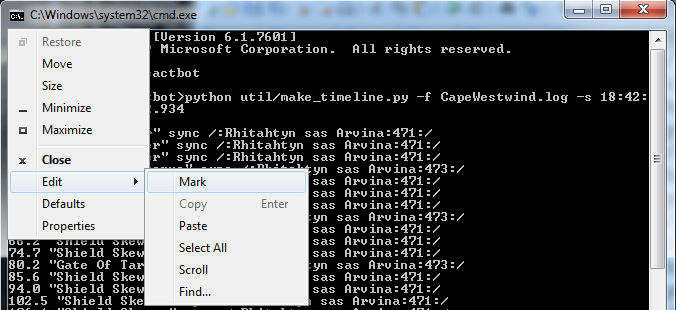

# 时间轴指南

本指南旨在帮助用户编写适用于cactbot的时间轴文件。


cactbot在[raidboss模块](https://github.com/OverlayPlugin/cactbot#raidboss-module)中定义触发器和时间轴。这两者是紧密结合的，因此您既可以基于技能编写触发器，也可以基于时间轴编写触发器。

## 目录

* [历史](#历史)
* [时间轴文件语法](#时间轴文件语法)
  * [注释](#注释)
  * [条目](#条目)
  * [指令](#指令)
  * [示例](#示例)
  * [测试](#测试)
  * [Shasta Kota的指南](#shasta-kota的指南)
* [Cactbot样式指南](#cactbot样式指南)
* [基于时间轴的触发器](#基于时间轴的触发器)
* [时间轴注入](#时间轴注入)
* [时间轴翻译](#时间轴翻译)
* [创建时间轴示例](#创建时间轴示例)
  * [多次攻略副本](#多次攻略副本)
  * [软件需求](#软件需求)
  * [时间轴基础骨架](#时间轴基础骨架)
  * [生成初始时间轴文件](#生成初始时间轴文件)
  * [构建循环](#构建循环)
  * [添加战斗阶段](#添加战斗阶段)
  * [下一个战斗阶段](#下一个战斗阶段)
  * [最终阶段](#最终阶段)
  * [样板附注](#样板附注)
  * [定义循环](#循环循环)
  * [珠联璧合](#珠联璧合)
  * [测试时间轴](#测试时间轴)
  * [测试其他时间轴](#测试其他时间轴)

## 历史

2016年，Shasta Kota 在 the Death and Taxes 网站上发布了一篇[指南](https://dtguilds.enjin.com/forum/m/37032836/viewthread/26353492-act-timeline-plugin)，讲解如何使用 anoyetta 的[ACT timeline 插件](https://github.com/anoyetta/ACT.Hojoring)。此插件现在已经成为了Hojoring的一部分。

在 anoyetta 之前也有过一个更旧的 [kaizoban](https://github.com/090/act_timeline/releases) 版本，有一部分玩家也曾使用过该插件。

cactbot 的时间轴文件原本设计为向后兼容这些文件格式，因此 cactbot 的扩展语法需要通过触发器文件注入。

## 时间轴文件语法

时间轴文件的每一行称作时间轴的条目。条目与条目之间没有绝对的顺序。时间轴文件中按一定顺序排列仅仅是方便读者阅读而已。

### 注释

时间轴中的 `#` 符号用于定义注释，其后的所有内容均会被忽略。

### 条目

以下是一些时间轴条目的语法示例。每一行的条目均以事件时间和事件名称开始。

`数字 "字符串" (duration 数字)`

`数字 "字符串" sync /正则/ (window 数字,数字) (jump 数字) (duration 数字)`

此处的括号表示这个部分是可选的，括号本身并不是语法的组成部分。

数字可以是整数，如 `34`；也可以是浮点数，如 `84.381`。

字符串一般为事件名，如 `"坠落"` 或 `"双重攻击"`。

正则是一个标准的 [Javascript 正则表达式](https://developer.mozilla.org/en-US/docs/Web/JavaScript/Guide/Regular_Expressions)。

事件时间与事件名称永远在最开始的位置，但 `window`、`jump`、`duration`、以及 `sync` 并没有明确的顺序规定。但是在代码规范里，sync通常放在前面。

`duration 数字` 规定了显示该技能的时间长度，单位为秒。通常情况下，时间轴条目在倒数到0后会立刻消失。但有时需要表示一个正在释放或持续释放的技能时，便可使用此参数。例如要使用单行条目表示五次连续的巴哈姆特之爪时，您就可以使用 `duration` 参数规定显示时间长度。这个语法不需要配合sync属性。

`window 数字,数字` 规定了同步的时间范围。若 `window` 未设置，cactbot默认将其视同为设置了 `window 2.5,2.5`。也就是，相对于当前事件时间的前2.5秒至后2.5秒之间。例如，对于此时间轴条目：`3118.9 "Lancing Bolt" sync /:Raiden:3876:/`， 当正则表达式`/:Raiden:3876:/` 在 3116.4 到 3121.4 之间的任意时间点被匹配到时，时间轴会同步并回溯至 3118.9。时间轴通常在独特的技能上使用较大的window值，以确保时间轴即使在战斗中才启动也可以正确地同步到正确的位置。

`jump 数字` 告诉时间轴在匹配sync成功时跳转至指定的时间点。跳转至0意味着停止时间轴，通常用于阶段跳转或循环。尽管我们一般跳转至时间轴中已有的其他条目的时间点，但跳转到其他时间点也是可行的。

### 指令

您可以使用 `hideall` 隐藏某个事件。绝大多数时间轴都会定义 `hideall "--sync--"` 来隐藏与游戏战斗阶段同步化的条目，因为玩家没有必要看到这些控制性条目。

此外还有一些基于时间轴条目的用于生成警报文本的指令。该指令尽管目前依旧支持，但文档中并没有记载，在cactbot中您应当使用[基于时间轴的触发器](#基于时间轴的触发器) 来实现此需求。

### 示例

```bash
677.0 "Heavensfall Trio"
1044 "Enrage" # ???
35.2 "Flare Breath x3" duration 4
1608.1 "Petrifaction" sync /:Melusine:7B1:/ window 1610,5
1141.4 "Leg Shot" sync /:Mustadio:3738:/ duration 20
# 这是一个注释
hideall "--sync--"

28.0 "Damning Edict?" sync /:Chaos:3150:/ window 30,10 jump 2028.0
524.9 "Allagan Field" sync /:The Avatar:7C4:/ duration 31 jump 444.9
1032.0 "Control Tower" duration 13.5 sync /:Hashmal, Bringer Of Order starts using Control Tower on Hashmal/ window 20,20 # 从开始读条到塔坠落
```

### 测试

在cactbot中运行 `npm run test` 会在node中运行 **test/check_timelines.js** 程序以验证时间轴语法。

### Shasta Kota的指南

您也可以阅读Shasta Kota的原版[指南](https://dtguilds.enjin.com/forum/m/37032836/viewthread/26353492-act-timeline-plugin)，至今看来仍然十分优秀。

## Cactbot格式指南

以下是cactbot中对于时间轴的编写建议：

* 为所有可能发生的事件添加同步正则
* 总是添加Engage!(战斗开始！) 的独立条目，同时添加同步正则，以防玩家没有使用倒计时。
* 若Boss的第一个技能是自动攻击，应把该自动攻击添加为独立条目以启动时间轴。(需要注意的是，有的Boss的自动攻击的技能名并不是“攻击”)
* 在顶部的注释中添加用于生成时间轴的命令行参数
* 添加同步正则时，除非同步NPC台词是唯一的可行方式，否则应当优先考虑技能。
* 当用NPC台词同步阶段时，应当为下一个技能添加一个较大的window值
* 同步正则尽可能短
* 尽可能使用游戏中的原名
* 循环应当使用 `jump`，而不是给循环的技能设定较大的window
* 适当换行并添加注释以提升时间轴的可读性
* 触发器/TTS/提示文本应当与时间轴分离
* 使用[基于时间轴的触发器](#基于时间轴的触发器)来显示提示文本
* 出现循环时，应额外在循环后方添加至少30秒的后续时间轴
* 将7秒内发动的技能的同步正则注释在后方 (使将来的维护人员可以很方便地获知技能ID)

### 触发器文件名

通常触发器的文件名应与玩家社区对此副本的称呼一致。讨伐战一般以Boss名字称呼， raid则通常是带有数字的缩写，而迷宫挑战通常采用副本区域名称。

文件名中应使用下划线分割单词。讨伐战中的 `nm` (假神)，`hm` (真神) 与 `ex` (极神)，则以减号分割。高难度迷宫挑战的名字中应当写出完整的单词“hard”。冠词如 `The` 可以省略。Raid通常会有一定顺序的数字称呼，例如 `t1` 到 `t13` 以及 `a1s` 到 `a12s` 等。零式讨伐通常需要加上 `s` 后缀，而普通难度则采用 `n` 后缀。(然而，这一规则不适用于巴哈姆特大迷宫，它只有6-9层拥有零式副本。)

示例:

* 魔法宫殿宇宙宫(The Grand Cosmos): `grand_cosmos`
* 泰坦歼殛战(Titan Extreme): `titan-ex`
* 红宝石神兵狂想作战(Ruby Weapon Extreme): `ruby_weapon-ex`
* 秘本宝库迦巴勒幻想图书馆(The Great Gubal Library (Hard)): `great_gubal_library_hard`
* 欧米茄零式时空狭缝 西格玛幻境2(Sigmascape V2.0 (Savage)): `o6s`
* 亚历山大机神城 启动之章3(Alexander - The Arm of the Father): `a3n`
* 巴哈姆特大迷宫 真源之章4(The Final Coil of Bahamut): `t13`

## 基于时间轴的触发器

Cactbot的触发器文件支持添加基于时间轴的触发器。这是由于人们对于默认启用的触发器有特定的偏好，cactbot时间轴语法扩展又与其他时间轴插件不兼容，所以cactbot在触发器文件中添加了基于时间轴的触发器的功能。

您只需要添加 `timelineTriggers` 至触发器文件即可。

示例:

* [乐欲之所瓯博讷修道院](https://github.com/OverlayPlugin/cactbot/blob/main/ui/raidboss/data/04-sb/alliance/orbonne_monastery.ts)
* [T9](https://github.com/OverlayPlugin/cactbot/blob/main/ui/raidboss/data/02-arr/raid/t9.ts)
* [O12 普通难度](https://github.com/OverlayPlugin/cactbot/blob/main/ui/raidboss/data/04-sb/raid/o12n.ts)

这些触发器和普通的触发器拥有[相同的语法](https://github.com/OverlayPlugin/cactbot/blob/main/ui/raidboss/data/README.txt)。这意味着您依旧可以使用函数，返回任何您想要的东西。您也可以使用[condition](https://github.com/OverlayPlugin/cactbot/blob/5a7011c662d65f44c12c2fbff255484f2d31b8ef/ui/raidboss/data/02-arr/raid/t9.js#L10)，使其仅针对特定职业/职能激活。

但是，他们之间仍然有一些区别：

例如 `regex` 部分不能翻译，而且必须与时间轴文件中的某个条目完全一致。也就是说，它需要匹配时间轴的某一行中用双引号括起来的技能名。函数中的 `matches` 参数也返回此名字。

此触发器还支持 `beforeSeconds` 参数，使您可以指定触发器相对于技能提前提示的时间。

## 时间轴注入

理论上经过精心构造的时间轴适用于任何人。但是，有时候人们想要隐藏时间轴的某些部分，或者添加一些其他项。

Cactbot默认并不包含这些配置，这个功能更适合用户自行配置。

触发器文件有一个名为 `timeline` 的参数入口，这是一个数组，其中元素会添加到时间轴中。若元素都是字符串，则会直接添加。若元素是函数，那么cactbot会调用该函数，并添加其返回值至时间轴中。(但是传入函数的 `data` 参数仅包含了玩家的职能和职业，不包含其他参数。)

测试时间轴可以在盛夏农庄通过倒计时或对木人行礼后触发。另行参见：[test.js](https://github.com/OverlayPlugin/cactbot/blob/79239abda888dd7a277da0501a7d4ac60d8cf963/ui/raidboss/data/triggers/test.js#L10)。

您也可以在 **cactbot/user/raidboss.js** 文件中添加定制化的时间轴和触发器。另行参见：[user/raidboss.js](https://github.com/quisquous/cactbot-user/blob/641488590e3ea499cc3b54cc9f2f2f856dee4ad8/raidboss.js#L28)。

## 时间轴翻译

为支持多语言，cactbot的触发器文件中提供了 `timelineReplace` 参数。[o12s.js](https://github.com/OverlayPlugin/cactbot/blob/ecbb723f097328c7bd0476352e5135bd5f776248/ui/raidboss/data/triggers/o12s.js#L608) 是一个不错的例子。该文件的参数集中包含了许多用于替换同步正则、文字和效果名的正则表达式。这有两个目的：

其一是为了让工具软件能为触发器自动生成正则表达式翻译。

其二是为了能在运行中动态替换时间轴文字和正则。cactbot会使用 `replaceSync` 参数集自动替换 `sync /text/` 中的任意文字，同样地，`replaceText` 参数集则用于自动替换技能名文字。

正则表达式仅匹配上述定义的部分文字，不匹配整行。因此您需要格外注意，替换的正则表达式可能匹配到非预期的元素导致翻译错误。

## 创建时间轴示例

这里有一个例子，展示了如何使用cactbot提供的工具制作里塔提恩强攻战的时间轴。这个副本的逻辑非常简单，而且可以单人进行测试，是一个绝佳的实例副本。

### 多次攻略副本

制作时间轴的第一步是生成一些ACT日志。

您也可以通过fflogs的通关记录生成时间轴，但这个方式会丢失许多日志行，例如NPC台词、区域封锁/解锁的提示文本以及对象实体刷新信息。

当您攻略副本之后，您可以获得一些[网络日志文件](LogGuide.md#network-log-lines)。

找到对应的副本攻略记录，点击**Raw**，然后右键选择**Save As**，将其保存到磁盘上。

要获得一份好的日志，你应当：

1. 尽量延长攻略时间，直到狂暴
1. 带足够的队员以看到所有机制 (例如 t11 中连线机制至少要两人才出现)
1. 对于每个阶段，拖够时间直到看到机制循环
1. 攻略多次以便于之后的测试

### 软件需求

* [Python 3](https://www.python.org/downloads/release/python-373/)
* [Node.js](https://nodejs.org/en/)
* 一份cactbot的[源代码](https://github.com/OverlayPlugin/cactbot/archive/main.zip)拷贝

安装 Python 3 时，推荐为该系统上的所有用户安装，这种安装方式会将 Python 写入 Windows 的 PATH 变量中，使您可以从命令提示符方便地运行 Python。

### 时间轴基础骨架

在cactbot中创建时间轴有三大步骤。

(1) 创建一个空时间轴文件。

新建一个文本文件名为 **ui/raidboss/data/timelines/cape_westwind.txt**。内容保持空白即可。

(2) 若没有触发器文件，则新建一个。

新建 **ui/raidboss/data/02-arr/trial/cape_westwind.js**。此文件可任意命名。 时间轴文件仅能被触发器文件加载，因此触发器文件总是必须的。

最初的触发器文件应当如下所示：

```javascript
export default {
  zoneId: ZoneId.CapeWestwind,
  timelineFile: 'cape_westwind.txt',
  triggers: [
  ],
};
```

(3) 更新manifest文件。

在 **ui/raidboss/data/raidboss_manifest.txt** 文件中添加您新建的触发器文件与时间轴文件的路径。

(4) 构建 cactbot。

在 cactbot 源码根目录下运行 `npm run build` 以构建cactbot。
若在此之前您从未安装依赖，则应当先运行 `npm install`。

(4) 重载raidboss悬浮窗

确保 raidboss 悬浮窗的路径指向 `dist/ui/raidboss/raidboss.html`。
若您已经对这些文件进行了修改，则可以通过重载cactbot的raidboss悬浮窗以应用更改。

若您使用的是 `webpack-dev-server`，它会在您每次保存更改后自动重载。

### 生成初始时间轴文件

在你拿到网络日志文件后，您应该找到战斗的开始与结束时间点。

[在ACT中查看日志](LogGuide.md#viewing-logs-after-a-fight)，找到开始与结束。


例如，对于此战斗记录，您可以看到与之关联的日志行与时间。

```log
[18:42:23.614] 15:105E5703:Potato Chippy:2E:Tomahawk:4000EE16:Rhitahtyn sas Arvina:710003:9450000:1C:2E8000:0:0:0:0:0:0:0:0:0:0:0:0:140279:140279:8010:8010:1000:1000:-707.8608:-822.4221:67.74045:3858:74095:4560:0:1000:1000:-693.7162:-816.4633:65.55687:
[18:49:22.934] 19:Rhitahtyn Sas Arvina was defeated by Potato Chippy.
```

(已知缺陷：有时处理来自于他人的网络日志时可能需要转换时差。  欢迎补充相关代码。)

基于这些时间，您可以通过下面的命令生成时间轴。

```bash
python util/make_timeline.py -f CapeWestwind.log -s 18:42:23.614 -e 18:49:22.934

0 "Start"
2.0 "Shield Skewer" sync /:Rhitahtyn sas Arvina:471:/
10.6 "Shield Skewer" sync /:Rhitahtyn sas Arvina:471:/
19.0 "Shield Skewer" sync /:Rhitahtyn sas Arvina:471:/
24.4 "Gate Of Tartarus" sync /:Rhitahtyn sas Arvina:473:/
29.8 "Shield Skewer" sync /:Rhitahtyn sas Arvina:471:/
38.4 "Shield Skewer" sync /:Rhitahtyn sas Arvina:471:/
46.8 "Shield Skewer" sync /:Rhitahtyn sas Arvina:471:/
52.2 "Gate Of Tartarus" sync /:Rhitahtyn sas Arvina:473:/
57.7 "Shield Skewer" sync /:Rhitahtyn sas Arvina:471:/
66.2 "Shield Skewer" sync /:Rhitahtyn sas Arvina:471:/
74.7 "Shield Skewer" sync /:Rhitahtyn sas Arvina:471:/
80.2 "Gate Of Tartarus" sync /:Rhitahtyn sas Arvina:473:/
85.6 "Shield Skewer" sync /:Rhitahtyn sas Arvina:471:/
94.0 "Shield Skewer" sync /:Rhitahtyn sas Arvina:471:/
102.5 "Shield Skewer" sync /:Rhitahtyn sas Arvina:471:/
106.1 "Shield Skewer" sync /:Rhitahtyn sas Arvina:471:/
110.4 "Shrapnel Shell" sync /:Rhitahtyn sas Arvina:474:/
114.9 "Winds Of Tartarus" sync /:Rhitahtyn sas Arvina:472:/
119.2 "Firebomb" sync /:Rhitahtyn sas Arvina:476:/
123.5 "Shield Skewer" sync /:Rhitahtyn sas Arvina:471:/
127.8 "Drill Shot" sync /:Rhitahtyn sas Arvina:475:/
132.1 "Winds Of Tartarus" sync /:Rhitahtyn sas Arvina:472:/
136.4 "Firebomb" sync /:Rhitahtyn sas Arvina:476:/
140.7 "Shield Skewer" sync /:Rhitahtyn sas Arvina:471:/
145.2 "Shrapnel Shell" sync /:Rhitahtyn sas Arvina:474:/
149.8 "Winds Of Tartarus" sync /:Rhitahtyn sas Arvina:472:/
154.3 "Firebomb" sync /:Rhitahtyn sas Arvina:476:/
158.8 "Shield Skewer" sync /:Rhitahtyn sas Arvina:471:/
163.3 "Drill Shot" sync /:Rhitahtyn sas Arvina:475:/
167.8 "Winds Of Tartarus" sync /:Rhitahtyn sas Arvina:472:/
172.3 "Firebomb" sync /:Rhitahtyn sas Arvina:476:/
175.8 "Gate Of Tartarus" sync /:Rhitahtyn sas Arvina:473:/
179.3 "Shield Skewer" sync /:Rhitahtyn sas Arvina:471:/
184.5 "Shield Skewer" sync /:Rhitahtyn sas Arvina:471:/
189.0 "Shrapnel Shell" sync /:Rhitahtyn sas Arvina:474:/
193.7 "Winds Of Tartarus" sync /:Rhitahtyn sas Arvina:472:/
195.9 "Fast Blade" sync /:7th Cohort Optio:2CD:/
196.1 "Fast Blade" sync /:7th Cohort Optio:2CD:/
198.2 "Firebomb" sync /:Rhitahtyn sas Arvina:476:/
202.7 "Shield Skewer" sync /:Rhitahtyn sas Arvina:471:/
202.9 "Fast Blade" sync /:7th Cohort Optio:2CD:/
203.3 "Fast Blade" sync /:7th Cohort Optio:2CD:/
207.2 "Drill Shot" sync /:Rhitahtyn sas Arvina:475:/
207.6 "Rampart" sync /:7th Cohort Optio:0A:/
210.0 "Fast Blade" sync /:7th Cohort Optio:2CD:/
211.7 "Winds Of Tartarus" sync /:Rhitahtyn sas Arvina:472:/
212.6 "Shield Bash" sync /:7th Cohort Optio:2CE:/
214.3 "Fast Blade" sync /:7th Cohort Optio:2CD:/
214.9 "Fight Or Flight" sync /:7th Cohort Optio:14:/
216.2 "Firebomb" sync /:Rhitahtyn sas Arvina:476:/
217.3 "Rampart" sync /:7th Cohort Optio:0A:/
218.0 "Celeris" sync /:7th Cohort Optio:194:/
220.8 "Shield Skewer" sync /:Rhitahtyn sas Arvina:471:/
222.0 "Fight Or Flight" sync /:7th Cohort Optio:14:/
225.2 "Shrapnel Shell" sync /:Rhitahtyn sas Arvina:474:/
226.3 "Fast Blade" sync /:7th Cohort Optio:2CD:/
229.9 "Winds Of Tartarus" sync /:Rhitahtyn sas Arvina:472:/
234.4 "Firebomb" sync /:Rhitahtyn sas Arvina:476:/
239.0 "Shield Skewer" sync /:Rhitahtyn sas Arvina:471:/
243.4 "Drill Shot" sync /:Rhitahtyn sas Arvina:475:/
259.1 "Shrapnel Shell" sync /:Rhitahtyn sas Arvina:474:/
263.6 "Firebomb" sync /:Rhitahtyn sas Arvina:476:/
267.9 "Winds Of Tartarus" sync /:Rhitahtyn sas Arvina:472:/
269.1 "Magitek Missiles" sync /:Rhitahtyn sas Arvina:478:/
274.2 "Drill Shot" sync /:Rhitahtyn sas Arvina:475:/
278.5 "Firebomb" sync /:Rhitahtyn sas Arvina:476:/
282.8 "Winds Of Tartarus" sync /:Rhitahtyn sas Arvina:472:/
299.3 "Shrapnel Shell" sync /:Rhitahtyn sas Arvina:474:/
303.8 "Firebomb" sync /:Rhitahtyn sas Arvina:476:/
308.1 "Winds Of Tartarus" sync /:Rhitahtyn sas Arvina:472:/
309.3 "Magitek Missiles" sync /:Rhitahtyn sas Arvina:478:/
314.4 "Drill Shot" sync /:Rhitahtyn sas Arvina:475:/
318.7 "Firebomb" sync /:Rhitahtyn sas Arvina:476:/
323.0 "Winds Of Tartarus" sync /:Rhitahtyn sas Arvina:472:/
339.5 "Shrapnel Shell" sync /:Rhitahtyn sas Arvina:474:/
344.0 "Firebomb" sync /:Rhitahtyn sas Arvina:476:/
348.3 "Winds Of Tartarus" sync /:Rhitahtyn sas Arvina:472:/
349.5 "Magitek Missiles" sync /:Rhitahtyn sas Arvina:478:/
354.6 "Drill Shot" sync /:Rhitahtyn sas Arvina:475:/
358.9 "Firebomb" sync /:Rhitahtyn sas Arvina:476:/
363.2 "Winds Of Tartarus" sync /:Rhitahtyn sas Arvina:472:/
378.7 "Shrapnel Shell" sync /:Rhitahtyn sas Arvina:474:/
383.2 "Firebomb" sync /:Rhitahtyn sas Arvina:476:/
387.5 "Winds Of Tartarus" sync /:Rhitahtyn sas Arvina:472:/
388.7 "Magitek Missiles" sync /:Rhitahtyn sas Arvina:478:/
393.8 "Drill Shot" sync /:Rhitahtyn sas Arvina:475:/
398.1 "Firebomb" sync /:Rhitahtyn sas Arvina:476:/
402.4 "Winds Of Tartarus" sync /:Rhitahtyn sas Arvina:472:/
```

(注意：您也可以通过 `-lf` 列出网络日志中所有的独立战斗记录。

```bash
python make_timeline.py -f CapeWestwind.log -lf
1. 02:03:44.018 02:16:53.632 Cape Westwind
2. 18:32:52.981 18:36:14.086 Cape Westwind
3. 18:42:23.614 18:49:22.934 Cape Westwind
4. 18:57:09.114 19:10:13.200 Cape Westwind
5. 19:29:42.265 19:36:22.437 Cape Westwind
6. 19:40:20.606 19:46:44.342 Cape Westwind
```

基于此，您可以加上战斗记录id然后重新运行命令，比如 `-lf 3`。)

当然，此时间轴仍无法使用，但是千里之行，始于足下。将输出的内容粘贴至 **ui/raidboss/data/timelines/cape_westwind.txt**。

若您正在使用的终端是Windows的命令提示符或者MINGW32，则您可以点击窗口左上方的图标，然后分别点击**编辑** -> **标记**。然后您可以用鼠标选择文本，被选中的文本会高亮显示。按下回车键后选中的文本会复制到剪贴板，然后您就可以随意粘贴了。



应当注意的是，日志中来自于小怪的无用日志行不胜枚举。大多数情况下，我们不可依赖小怪的时间去推测Boss的机制，因此通常我们会移除小怪的相关日志。

make_timeline.py 脚本支持两个选项以提供此功能。其一为“忽略实体”，其一为“忽略id”。如 `-ic "7Th Cohort Optio"` 或 `-ii 0A 2CD 2CE 194 14` 就可以隐藏这些技能。我们在这里使用忽略id的功能。

重新运行命令，这次带上忽略id的选项：`python util/make_timeline.py -f CapeWestwind.log -s 18:42:23.614 -e 18:49:22.934 -ii 0A 2CD 2CE 194 14`

您最好再次阅览生成的时间轴，以确认是否还有小怪的日志行。我们通常要手动添加 [added combatant (添加实体)](LogGuide.md#line-03-0x03-addcombatant) 或用于匹配的NPC话语的 [game log lines (游戏日志行)](LogGuide.md#line-00-0x00-logline)。您可以自己研究如何将其添加进时间轴中。(欢迎向 **make_timeline.py** 贡献代码以自动实现这一步骤。)

相关日志如下所示：

```log
[18:45:27.041] 03:Added new combatant 7Th Cohort Optio.  Job: 0 Level: 49 Max HP: 24057 Max MP: 8010 Pos: (-665.5159,-804.6631,62.33055).
[18:45:27.041] 03:Added new combatant 7Th Cohort Optio.  Job: 0 Level: 49 Max HP: 24057 Max MP: 8010 Pos: (-665.5013,-807.1013,62.45256).
[18:42:24.000] 00:0044:Rhitahtyn sas Arvina:I will suffer none to oppose Lord van Baelsar!
[18:44:08.000] 00:0044:Rhitahtyn sas Arvina:My shields are impregnable! Join the countless challengers who have dashed themselves against them!
[18:46:27.000] 00:0044:Rhitahtyn sas Arvina:Your defeat will bring Lord van Baelsar's noble conquest one step closer to fruition!
[18:48:27.000] 00:0044:Rhitahtyn sas Arvina:Ungh... Though it cost me my life...I will strike you down!
```

您可以将其出现的时间与战斗开始时间相减，即可得到正确的相对时间。对于此实例，小怪出现在183.5秒 (通过 18:45:27.041 - 18:42:23.614 得到)。

### 构建循环

下一步是在每个阶段内构建循环。观察可得，此处有若干个不同阶段。

这是我们的初始阶段划分，此处加了一些空行以便清晰的分辨。

```bash
2.0 "Shield Skewer" sync /:Rhitahtyn sas Arvina:471:/
10.6 "Shield Skewer" sync /:Rhitahtyn sas Arvina:471:/
19.0 "Shield Skewer" sync /:Rhitahtyn sas Arvina:471:/
24.4 "Gate Of Tartarus" sync /:Rhitahtyn sas Arvina:473:/

29.8 "Shield Skewer" sync /:Rhitahtyn sas Arvina:471:/
38.4 "Shield Skewer" sync /:Rhitahtyn sas Arvina:471:/
46.8 "Shield Skewer" sync /:Rhitahtyn sas Arvina:471:/
52.2 "Gate Of Tartarus" sync /:Rhitahtyn sas Arvina:473:/

57.7 "Shield Skewer" sync /:Rhitahtyn sas Arvina:471:/
66.2 "Shield Skewer" sync /:Rhitahtyn sas Arvina:471:/
74.7 "Shield Skewer" sync /:Rhitahtyn sas Arvina:471:/
80.2 "Gate Of Tartarus" sync /:Rhitahtyn sas Arvina:473:/
```

可以看出来，这里的循环长度大约在27.8到27.9之间。我们假定它是27.8吧。

对于构建循环，我们有个优秀的工具 **util/timeline_adjust.py**。 这个脚本可以遍历整个时间轴文件，并以可正可负的一定偏移值调整时间轴， 最后将调整后的时间轴输出。

若您在使用VSCode，您还可以使用 [Cactbot Highlight](https://marketplace.visualstudio.com/items?itemName=MaikoTan.cactbot-highlight) 插件中的 [调整时间功能](https://github.com/MaikoTan/cactbot-highlight#adjust-time)，非常方便简单，一键即可调整时间。

(注意：不管哪种方式都不会调整jump。)

下面是通过该脚本调整后的时间轴的一部分：

```bash
python util/timeline_adjust.py --file=ui/raidboss/data/timelines/cape_westwind.txt --adjust=27.8

29.8 "Shield Skewer" sync /:Rhitahtyn sas Arvina:471:/
38.4 "Shield Skewer" sync /:Rhitahtyn sas Arvina:471:/
46.8 "Shield Skewer" sync /:Rhitahtyn sas Arvina:471:/
52.2 "Gate Of Tartarus" sync /:Rhitahtyn sas Arvina:473:/

57.6 "Shield Skewer" sync /:Rhitahtyn sas Arvina:471:/
66.2 "Shield Skewer" sync /:Rhitahtyn sas Arvina:471:/
74.6 "Shield Skewer" sync /:Rhitahtyn sas Arvina:471:/
80.0 "Gate Of Tartarus" sync /:Rhitahtyn sas Arvina:473:/

85.5 "Shield Skewer" sync /:Rhitahtyn sas Arvina:471:/
94.0 "Shield Skewer" sync /:Rhitahtyn sas Arvina:471:/
102.5 "Shield Skewer" sync /:Rhitahtyn sas Arvina:471:/
108.0 "Gate Of Tartarus" sync /:Rhitahtyn sas Arvina:473:/
```

相比于原本的时间轴，该循环已经接近完美。第一个循环非常完美，但第二个则略有一点偏移，这里调整后的时间为57.6、74.6、80.0，但原本是57.7、74.7、80.2。  虽然不够完美，但已经很接近了。

在cactbot中，有一个配置项可以设置显示多久之后的时间轴。默认是30秒，因此您应额外在循环后方添加至少30秒的后续时间轴。

那么第一阶段的最终版本就完成了。

注意，我们倾向于使用 **timeline_adjust.py** 生成的时间，而不是原本的时间。(您也可以使用 `Cactbot Highlight` 插件。) 这样我们从52.2跳转到24.4的时候，时间差依旧是正确的。每次 `Gate Of Tartarus` 释放后5.4秒总会出现 `Shield Skewer`。

之后我们会添加jump。现在它如下所示：

```bash
2.0 "Shield Skewer" sync /:Rhitahtyn sas Arvina:471:/
10.6 "Shield Skewer" sync /:Rhitahtyn sas Arvina:471:/
19.0 "Shield Skewer" sync /:Rhitahtyn sas Arvina:471:/
24.4 "Gate Of Tartarus" sync /:Rhitahtyn sas Arvina:473:/

29.8 "Shield Skewer" sync /:Rhitahtyn sas Arvina:471:/
38.4 "Shield Skewer" sync /:Rhitahtyn sas Arvina:471:/
46.8 "Shield Skewer" sync /:Rhitahtyn sas Arvina:471:/
52.2 "Gate Of Tartarus" sync /:Rhitahtyn sas Arvina:473:/

57.6 "Shield Skewer" sync /:Rhitahtyn sas Arvina:471:/
66.2 "Shield Skewer" sync /:Rhitahtyn sas Arvina:471:/
74.6 "Shield Skewer" sync /:Rhitahtyn sas Arvina:471:/
80.0 "Gate Of Tartarus" sync /:Rhitahtyn sas Arvina:471:/
```

### 添加新的战斗阶段

现在开始编写P2的时间轴。通过观察接下来的日志文件可以发现，boss会在血量降至80%之后喊话并开始使用新的技能。

不幸的是，boss开启P2的技能是 `Shield Skewer`，这一技能在P1被多次使用，这使得通过同步该技能来确认是否进入P2这一方式并不太合理。

**make_timeline.py** 中有一项功能可以把某技能的第一次使用定义至特定的一个时间点。由于cactbot的时间轴只会显示该时间点向后30秒内的内容，因此您可以在30秒后的任意时间点定义你的分P起点。

让我们假定P2第一个技能开始的时间点为200。`Shrapnel Shell` 发动时间位于第一个技能发动4.3秒后；我们把 `Shrapnel Shell` 的初次使用时间点定义为204.3。

下面给出了一个新的命令行： `python util/make_timeline.py -f CapeWestwind.log -s 18:42:23.614 -e 18:49:22.934 -ii 0A 2CD 2CE 194 14 -p 474:204.3`

执行上述命令行可获得P2时间轴如下所示，我们在文件中手动添加了一些空白行以区分不同的循环阶段：

```bash
# 手动添加同步
199.0 "--sync--" sync /00:0044:[^:]*:My shields are impregnable/
200.0 "Shield Skewer" sync /:Rhitahtyn sas Arvina:471:/

# make_timeline 的输出
204.3 "Shrapnel Shell" sync /:Rhitahtyn sas Arvina:474:/
208.8 "Winds Of Tartarus" sync /:Rhitahtyn sas Arvina:472:/
213.1 "Firebomb" sync /:Rhitahtyn sas Arvina:476:/

217.4 "Shield Skewer" sync /:Rhitahtyn sas Arvina:471:/
221.7 "Drill Shot" sync /:Rhitahtyn sas Arvina:475:/
226.0 "Winds Of Tartarus" sync /:Rhitahtyn sas Arvina:472:/
230.3 "Firebomb" sync /:Rhitahtyn sas Arvina:476:/

234.6 "Shield Skewer" sync /:Rhitahtyn sas Arvina:471:/
239.1 "Shrapnel Shell" sync /:Rhitahtyn sas Arvina:474:/
243.7 "Winds Of Tartarus" sync /:Rhitahtyn sas Arvina:472:/
248.2 "Firebomb" sync /:Rhitahtyn sas Arvina:476:/

252.7 "Shield Skewer" sync /:Rhitahtyn sas Arvina:471:/
257.2 "Drill Shot" sync /:Rhitahtyn sas Arvina:475:/
261.7 "Winds Of Tartarus" sync /:Rhitahtyn sas Arvina:472:/
266.2 "Firebomb" sync /:Rhitahtyn sas Arvina:476:/
```

这一段时间轴内存在一个清晰的循环，每次循环内必定有2次 `Firebomb` 和2次 `Shield Skewer`。
该循环时长为34.6秒。是时候再次执行 **timeline_adjust.py** 了。

执行 `python util/timeline_adjust.py --file=ui/raidboss/data/timelines/cape_westwind.txt --adjust=27.8`，输出结果如下：

```bash
234.6 "Shield Skewer" sync /:Rhitahtyn sas Arvina:471:/
238.9 "Shrapnel Shell" sync /:Rhitahtyn sas Arvina:474:/
243.4 "Winds Of Tartarus" sync /:Rhitahtyn sas Arvina:472:/
247.7 "Firebomb" sync /:Rhitahtyn sas Arvina:476:/

252.0 "Shield Skewer" sync /:Rhitahtyn sas Arvina:471:/
256.3 "Drill Shot" sync /:Rhitahtyn sas Arvina:475:/
260.6 "Winds Of Tartarus" sync /:Rhitahtyn sas Arvina:472:/
264.9 "Firebomb" sync /:Rhitahtyn sas Arvina:476:/
```

这次获得的时间轴与原始时间轴存在较大的误差，最后一次 Firebomb 出现时间为264.9，而原始时间轴中为266.2。如果你想要获得更加精确的时间轴，那么你需要将脚本执行结果所得时间轴与其他脚本运行结果做对比校核。

在 Cape Westwind 这个副本中，这点误差将不会造成太大的影响，因此我们将直接使用 **timeline_adjust.py** 运行所得时间轴替换掉原始时间轴中P2部分。

由此所得的时间轴文件如下所示：

```bash
0 "Start"
2.0 "Shield Skewer" sync /:Rhitahtyn sas Arvina:471:/
10.6 "Shield Skewer" sync /:Rhitahtyn sas Arvina:471:/
19.0 "Shield Skewer" sync /:Rhitahtyn sas Arvina:471:/
24.4 "Gate Of Tartarus" sync /:Rhitahtyn sas Arvina:473:/

29.8 "Shield Skewer" sync /:Rhitahtyn sas Arvina:471:/
38.4 "Shield Skewer" sync /:Rhitahtyn sas Arvina:471:/
46.8 "Shield Skewer" sync /:Rhitahtyn sas Arvina:471:/
52.2 "Gate Of Tartarus" sync /:Rhitahtyn sas Arvina:473:/

57.6 "Shield Skewer" sync /:Rhitahtyn sas Arvina:471:/
66.2 "Shield Skewer" sync /:Rhitahtyn sas Arvina:471:/
74.6 "Shield Skewer" sync /:Rhitahtyn sas Arvina:471:/
80.0 "Gate Of Tartarus" sync /:Rhitahtyn sas Arvina:473:/

# 80%
199.0 "--sync--" sync /00:0044:[^:]*:My shields are impregnable/
200.0 "Shield Skewer" sync /:Rhitahtyn sas Arvina:471:/
204.3 "Shrapnel Shell" sync /:Rhitahtyn sas Arvina:474:/
208.8 "Winds Of Tartarus" sync /:Rhitahtyn sas Arvina:472:/
213.1 "Firebomb" sync /:Rhitahtyn sas Arvina:476:/

217.4 "Shield Skewer" sync /:Rhitahtyn sas Arvina:471:/
221.7 "Drill Shot" sync /:Rhitahtyn sas Arvina:475:/
226.0 "Winds Of Tartarus" sync /:Rhitahtyn sas Arvina:472:/
230.3 "Firebomb" sync /:Rhitahtyn sas Arvina:476:/

234.6 "Shield Skewer" sync /:Rhitahtyn sas Arvina:471:/
238.9 "Shrapnel Shell" sync /:Rhitahtyn sas Arvina:474:/
243.4 "Winds Of Tartarus" sync /:Rhitahtyn sas Arvina:472:/
247.7 "Firebomb" sync /:Rhitahtyn sas Arvina:476:/

252.0 "Shield Skewer" sync /:Rhitahtyn sas Arvina:471:/
256.3 "Drill Shot" sync /:Rhitahtyn sas Arvina:475:/
260.6 "Winds Of Tartarus" sync /:Rhitahtyn sas Arvina:472:/
264.9 "Firebomb" sync /:Rhitahtyn sas Arvina:476:/

# 60%
```

### 下一个战斗阶段

通过观察，我们发现下一阶段 (P3) 将于boss血量降至60%开始，同时boss会召唤2只小怪。

观察时间轴可以发现，小怪出现的时间点附近有一个叫做 "Gate of Tartarus" 的技能。

下面是未经调整的原始时间轴文件：

```bash
175.8 "Gate Of Tartarus" sync /:Rhitahtyn sas Arvina:473:/
183.5 "Adds"
```

遗憾的是，boss在P1阶段就会使用 `Gate of Tartarus`，因此我们不能像在P2阶段那样用 `-p` 这个参数来处理。（欢迎各位发布可以增加相关优化选项的补丁？）

为了解决这个问题，我们可以使用 **timeline_adjust.py** 将时间轴向前移动一段时间。 如果我们将原始时间轴整体附加 400-175.8=224.2 的时间偏移， 则可以从 t = 400 开始定义P3阶段。

下面是包含手动添加的召唤小怪时间点的调整后的时间轴：

```bash
400.0 "Gate Of Tartarus" sync /:Rhitahtyn sas Arvina:473:/
403.5 "Shield Skewer" sync /:Rhitahtyn sas Arvina:471:/

407.7 "Adds"
408.7 "Shield Skewer" sync /:Rhitahtyn sas Arvina:471:/
413.2 "Shrapnel Shell" sync /:Rhitahtyn sas Arvina:474:/
417.9 "Winds Of Tartarus" sync /:Rhitahtyn sas Arvina:472:/
422.4 "Firebomb" sync /:Rhitahtyn sas Arvina:476:/

426.9 "Shield Skewer" sync /:Rhitahtyn sas Arvina:471:/
431.4 "Drill Shot" sync /:Rhitahtyn sas Arvina:475:/
435.9 "Winds Of Tartarus" sync /:Rhitahtyn sas Arvina:472:/
440.4 "Firebomb" sync /:Rhitahtyn sas Arvina:476:/

445.0 "Shield Skewer" sync /:Rhitahtyn sas Arvina:471:/
449.4 "Shrapnel Shell" sync /:Rhitahtyn sas Arvina:474:/
454.1 "Winds Of Tartarus" sync /:Rhitahtyn sas Arvina:472:/
458.6 "Firebomb" sync /:Rhitahtyn sas Arvina:476:/

463.2 "Shield Skewer" sync /:Rhitahtyn sas Arvina:471:/
467.6 "Drill Shot" sync /:Rhitahtyn sas Arvina:475:/

# 40% 转阶段？？
483.3 "Shrapnel Shell" sync /:Rhitahtyn sas Arvina:474:/
487.8 "Firebomb" sync /:Rhitahtyn sas Arvina:476:/
492.1 "Winds Of Tartarus" sync /:Rhitahtyn sas Arvina:472:/

493.3 "Magitek Missiles" sync /:Rhitahtyn sas Arvina:478:/
407.7 "Adds"
```

由于没有战斗过程的录像，我们并不能非常肯定 `Shrapnel Shell` 这一技能是属于P3还是P4阶段。不过通过观察日志文件，我们可以确定 `Magitek Missiles` 这一技能属于最后一个战斗阶段，也即P4。由于这个 `Sharpnel Shell` 打断了之前的技能循环模式，让我们假设是这个技能开启了P4阶段。我们会在稍后的内容里对它进行测试。

新阶段的时间轴的循环与P2有些类似。

首先来判断一下这一循环是否与P2的循环完全一致。您可以使用 **timeline_adjust.py** 把P3之前的P2最后一段 `Shield Skewer` 小循环整体偏移 +208.7。遗憾的是，您可以发现偏移后的时间轴与新阶段的小循环并不完全相同。因此，我们需要构建P3阶段的时间轴。

很明显，P3阶段的小循环也是一个36.2秒的循环。 使用 **timeline_adjust.py** 对时间轴中第一个小循环附加一个36.2秒偏移调整，可以得到如下结果：

```bash
445.0 "Shield Skewer" sync /:Rhitahtyn sas Arvina:471:/
449.5 "Shrapnel Shell" sync /:Rhitahtyn sas Arvina:474:/
454.2 "Winds Of Tartarus" sync /:Rhitahtyn sas Arvina:472:/
458.7 "Firebomb" sync /:Rhitahtyn sas Arvina:476:/

463.2 "Shield Skewer" sync /:Rhitahtyn sas Arvina:471:/
467.7 "Drill Shot" sync /:Rhitahtyn sas Arvina:475:/
472.2 "Winds Of Tartarus" sync /:Rhitahtyn sas Arvina:472:/
476.7 "Firebomb" sync /:Rhitahtyn sas Arvina:476:/
```

添加偏移后的小循环时间点与原始时间轴中的第二小循环时间点非常接近，因此我们可以认为它就是P3的技能循环。

### 最终阶段

战斗的最后一个阶段将在boss血量降至40%的时候开启。我们在这里假设由 `Shrapnel Shell` 这一技能开启这一阶段的战斗。显而易见的是，这个技能并不是这一阶段独有的技能。`Magitek Missiles` 才是P4独有技能，它的初次使用位于 Shrapnel Shell 这一技能的10秒后。让我们把P4的开始时间定义在600秒处，把 `Magitek Missile` (技能ID 478) 的初次使用时间定为610。

下面执行最后一个命令行，包括第二阶段：`python util/make_timeline.py -f CapeWestwind.log -s 18:42:23.614 -e 18:49:22.934 -ii 0A 2CD 2CE 194 14 -p 474:204.3 478:610`

```bash
# 手动添加
595.0 "--sync--" sync /00:0044:[^:]*:Your defeat will bring/ window 600,0
600.0 "Shrapnel Shell" sync /:Rhitahtyn sas Arvina:474:/
604.5 "Firebomb" sync /:Rhitahtyn sas Arvina:476:/
608.8 "Winds Of Tartarus" sync /:Rhitahtyn sas Arvina:472:/

# make_timeline的部分输出
610.0 "Magitek Missiles" sync /:Rhitahtyn sas Arvina:478:/
615.1 "Drill Shot" sync /:Rhitahtyn sas Arvina:475:/
619.4 "Firebomb" sync /:Rhitahtyn sas Arvina:476:/
623.7 "Winds Of Tartarus" sync /:Rhitahtyn sas Arvina:472:/
640.2 "Shrapnel Shell" sync /:Rhitahtyn sas Arvina:474:/
644.7 "Firebomb" sync /:Rhitahtyn sas Arvina:476:/
649.0 "Winds Of Tartarus" sync /:Rhitahtyn sas Arvina:472:/

650.2 "Magitek Missiles" sync /:Rhitahtyn sas Arvina:478:/
655.3 "Drill Shot" sync /:Rhitahtyn sas Arvina:475:/
659.6 "Firebomb" sync /:Rhitahtyn sas Arvina:476:/
663.9 "Winds Of Tartarus" sync /:Rhitahtyn sas Arvina:472:/
680.4 "Shrapnel Shell" sync /:Rhitahtyn sas Arvina:474:/
684.9 "Firebomb" sync /:Rhitahtyn sas Arvina:476:/
689.2 "Winds Of Tartarus" sync /:Rhitahtyn sas Arvina:472:/

690.4 "Magitek Missiles" sync /:Rhitahtyn sas Arvina:478:/
695.5 "Drill Shot" sync /:Rhitahtyn sas Arvina:475:/
699.8 "Firebomb" sync /:Rhitahtyn sas Arvina:476:/
704.1 "Winds Of Tartarus" sync /:Rhitahtyn sas Arvina:472:/
719.6 "Shrapnel Shell" sync /:Rhitahtyn sas Arvina:474:/
724.1 "Firebomb" sync /:Rhitahtyn sas Arvina:476:/
728.4 "Winds Of Tartarus" sync /:Rhitahtyn sas Arvina:472:/

729.6 "Magitek Missiles" sync /:Rhitahtyn sas Arvina:478:/
734.7 "Drill Shot" sync /:Rhitahtyn sas Arvina:475:/
739.0 "Firebomb" sync /:Rhitahtyn sas Arvina:476:/
743.3 "Winds Of Tartarus" sync /:Rhitahtyn sas Arvina:472:/
```

很明显P4拥有一个40.2秒的小循环。使用 **timeline_adjust.py** 对时间轴中的第一个小循环附加一个40.2秒的偏移调整，我们可以得到如下结果：

```bash
650.2 "Magitek Missiles" sync /:Rhitahtyn sas Arvina:478:/
655.3 "Drill Shot" sync /:Rhitahtyn sas Arvina:475:/
659.6 "Firebomb" sync /:Rhitahtyn sas Arvina:476:/
663.9 "Winds Of Tartarus" sync /:Rhitahtyn sas Arvina:472:/
680.4 "Shrapnel Shell" sync /:Rhitahtyn sas Arvina:474:/
684.9 "Firebomb" sync /:Rhitahtyn sas Arvina:476:/
689.2 "Winds Of Tartarus" sync /:Rhitahtyn sas Arvina:472:/
```

所得结果与原始时间轴的第二小循环完美契合，因此我们可以认定该循环即为P4的技能循环。

### 样板附注

通常来说，大多数时间轴文件都应该在文件抬头给出一些模板，类似下面这样：

```bash
# Cape Westwind
# -ii 0A 2CD 2CE 194 14 -p 474:204 478:610

hideall "--Reset--"
hideall "--sync--"

0.0 "--Reset--" sync / 21:........:4000000F:/ window 10000 jump 0

0 "Start"
0.0 "--sync--" sync /:Engage!/ window 0,1
2.0 "Shield Skewer" sync /:Rhitahtyn sas Arvina:471:/
```

您最好能给出您用于生成代码所用的命令，以便他人可以追溯您制作代码时所作的前期工作。

`hideall` 命令可以隐藏某一命令的执行信息，因此玩家不会看到 `--sync--` 的执行信息，但这不意味着时间轴本身没有执行这些同步命令。`hideall` 后面的文本内容可以是任意命令名，这里只是以 `--sync--` 作为例子进行说明。

当战斗过程存在转阶段时，最好使用重置时间轴来停止之前的时间轴。在战斗过程中存在场地转换的副本中 (例如欧米茄系列, a4s, a8s, a12s, t9, t13)，`sync / 21:........:4000000F:/` 是一个相当好用的同步命令。在进入战斗后会封锁战斗区域的副本 (例如a1s, t1-8)，则应使用区域封锁这条消息来进行时间轴重置。
”
您的时间轴文件抬头应该设置一句与“开始战斗！”同步的命令以开启战斗同步，同时保持与战斗倒计时同步。如果boss的第一个技能在战斗开始后很长一段时候后才会使用，那么您应该把它也加入时间轴文件以保证时间轴正常启动。

举个栗子，在o11s的时间轴文件中，抬头两行如下所示：

```bash
0.0 "--sync--" sync /:Engage!/ window 0,1
2.5 "--sync--" sync /:Omega:368:/ window 3,0
```

### 定义循环

下文再次给出了P1阶段的小循环。我们将对它进行改写，以便时间轴每次执行至52.2秒时，它会直接跳回24.4秒处。

```bash
2.0 "Shield Skewer" sync /:Rhitahtyn sas Arvina:471:/
10.6 "Shield Skewer" sync /:Rhitahtyn sas Arvina:471:/
19.0 "Shield Skewer" sync /:Rhitahtyn sas Arvina:471:/
24.4 "Gate Of Tartarus" sync /:Rhitahtyn sas Arvina:473:/

29.8 "Shield Skewer" sync /:Rhitahtyn sas Arvina:471:/
38.4 "Shield Skewer" sync /:Rhitahtyn sas Arvina:471:/
46.8 "Shield Skewer" sync /:Rhitahtyn sas Arvina:471:/
52.2 "Gate Of Tartarus" sync /:Rhitahtyn sas Arvina:473:/

57.6 "Shield Skewer" sync /:Rhitahtyn sas Arvina:471:/
66.2 "Shield Skewer" sync /:Rhitahtyn sas Arvina:471:/
74.6 "Shield Skewer" sync /:Rhitahtyn sas Arvina:471:/
80.0 "Gate Of Tartarus" sync /:Rhitahtyn sas Arvina:473:/
```

我们在52.2这一行上添加一句 `window 1,100 jump 24.4` 。这一句命令的意思是，如果您在这一行执行前10秒至执行后100秒内看到boss使用该技能，那么时间轴将跳回24.4秒处。默认情况下，除了一些需要特殊设置同步时间范围的语句，所有的同步语句都应该设置 `window 5,5` ，它表示在该行执行的前后5秒内与该技能进行同步。

添加该语句之后的时间轴文件中，57.6至80.0秒范围内的技能将不会被同步，因为当时间轴运行到52.2秒的技能后，它会跳回我们设置的24.4秒处。因此我们可以把这一部分内容删除。

最后值得一提的是，由于有时候日志文件中会丢失一些信息，而ACT也可能是在战斗中途才被开启，您最好在那些boss不常用或者非常重要的技能上设置一个较长的同步窗口期，以便即使出现上述情况也能使得时间轴能及时与战斗同步。

当您做完上述编辑后，我们可以得到下面这样的时间轴文件，它就是初始小循环的最终版本。

```bash
2.0 "Shield Skewer" sync /:Rhitahtyn sas Arvina:471:/
10.6 "Shield Skewer" sync /:Rhitahtyn sas Arvina:471:/
19.0 "Shield Skewer" sync /:Rhitahtyn sas Arvina:471:/
24.4 "Gate Of Tartarus" sync /:Rhitahtyn sas Arvina:473:/ window 30,10

29.8 "Shield Skewer" sync /:Rhitahtyn sas Arvina:471:/
38.4 "Shield Skewer" sync /:Rhitahtyn sas Arvina:471:/
46.8 "Shield Skewer" sync /:Rhitahtyn sas Arvina:471:/
52.2 "Gate Of Tartarus" sync /:Rhitahtyn sas Arvina:473:/ window 10,100 jump 24.4

# 假的时间轴 仅用于显示
57.6 "Shield Skewer"
66.2 "Shield Skewer"
74.6 "Shield Skewer"
80.0 "Gate Of Tartarus"
```

您可以对其余几个阶段的小循环执行相同的改写。

### 珠联璧合

让我们把已经改写完毕的全部小循环整合到一起，可以得到如下时间轴：

由于本文举例的时间轴文件中 `Shield Skewer` 这一技能频繁出现，各个小循环重复率较低，在编写时间轴的时候需要更加小心。

```bash
# Cape Westwind
# -ii 0A 2CD 2CE 194 14 -p 474:204 478:610

hideall "--Reset--"
hideall "--sync--"

0.0 "--Reset--" sync / 21:........:400000)F:/ window 10000 jump 0

### Phase 1: skewers and stuns
0 "Start"
0.0 "--sync--" sync /:Engage!/ window 0,1
2.0 "Shield Skewer" sync /:Rhitahtyn sas Arvina:471:/
10.6 "Shield Skewer" sync /:Rhitahtyn sas Arvina:471:/
19.0 "Shield Skewer" sync /:Rhitahtyn sas Arvina:471:/
24.4 "Gate Of Tartarus" sync /:Rhitahtyn sas Arvina:473:/ window 30,10

29.8 "Shield Skewer" sync /:Rhitahtyn sas Arvina:471:/
38.4 "Shield Skewer" sync /:Rhitahtyn sas Arvina:471:/
46.8 "Shield Skewer" sync /:Rhitahtyn sas Arvina:471:/
52.2 "Gate Of Tartarus" sync /:Rhitahtyn sas Arvina:473:/ window 10,100 jump 24.4

57.6 "Shield Skewer"
66.2 "Shield Skewer"
74.6 "Shield Skewer"
80.0 "Gate Of Tartarus"


### Phase 2 (80%): firebombs
199.0 "--sync--" sync /00:0044:[^:]*:My shields are impregnable/ window 200,0
200.0 "Shield Skewer" sync /:Rhitahtyn sas Arvina:471:/
204.3 "Shrapnel Shell" sync /:Rhitahtyn sas Arvina:474:/ window 205,10
208.8 "Winds Of Tartarus" sync /:Rhitahtyn sas Arvina:472:/
213.1 "Firebomb" sync /:Rhitahtyn sas Arvina:476:/

217.4 "Shield Skewer" sync /:Rhitahtyn sas Arvina:471:/
221.7 "Drill Shot" sync /:Rhitahtyn sas Arvina:475:/
226.0 "Winds Of Tartarus" sync /:Rhitahtyn sas Arvina:472:/
230.3 "Firebomb" sync /:Rhitahtyn sas Arvina:476:/

234.6 "Shield Skewer" sync /:Rhitahtyn sas Arvina:471:/
238.9 "Shrapnel Shell" sync /:Rhitahtyn sas Arvina:474:/ window 20,100 jump 204.3
243.4 "Winds Of Tartarus"
247.7 "Firebomb"

252.0 "Shield Skewer"
256.3 "Drill Shot"
260.6 "Winds Of Tartarus"
264.9 "Firebomb"


### Phase 3 (60%): Adds
400.0 "Gate Of Tartarus" sync /:Rhitahtyn sas Arvina:473:/ window 200,20
403.5 "Shield Skewer" sync /:Rhitahtyn sas Arvina:471:/

407.7 "Adds"
408.7 "Shield Skewer" sync /:Rhitahtyn sas Arvina:471:/
413.2 "Shrapnel Shell" sync /:Rhitahtyn sas Arvina:474:/ window 20,20
417.9 "Winds Of Tartarus" sync /:Rhitahtyn sas Arvina:472:/
422.4 "Firebomb" sync /:Rhitahtyn sas Arvina:476:/

426.9 "Shield Skewer" sync /:Rhitahtyn sas Arvina:471:/
431.4 "Drill Shot" sync /:Rhitahtyn sas Arvina:475:/
435.9 "Winds Of Tartarus" sync /:Rhitahtyn sas Arvina:472:/
440.4 "Firebomb" sync /:Rhitahtyn sas Arvina:476:/

445.0 "Shield Skewer" sync /:Rhitahtyn sas Arvina:471:/
449.5 "Shrapnel Shell" sync /:Rhitahtyn sas Arvina:474:/ window 20,100 jump 413.2
454.2 "Winds Of Tartarus"
458.7 "Firebomb"

463.2 "Shield Skewer"
467.7 "Drill Shot"
472.2 "Winds Of Tartarus"
476.7 "Firebomb"


### Phase 4 (40%): magitek missiles
595.0 "--sync--" sync /00:0044:[^:]*:Your defeat will bring/ window 600,0

600.0 "Shrapnel Shell" sync /:Rhitahtyn sas Arvina:474:/
604.5 "Firebomb" sync /:Rhitahtyn sas Arvina:476:/
608.8 "Winds Of Tartarus" sync /:Rhitahtyn sas Arvina:472:/

610.0 "Magitek Missiles" sync /:Rhitahtyn sas Arvina:478:/ window 610,30
615.1 "Drill Shot" sync /:Rhitahtyn sas Arvina:475:/
619.4 "Firebomb" sync /:Rhitahtyn sas Arvina:476:/
623.7 "Winds Of Tartarus" sync /:Rhitahtyn sas Arvina:472:/
640.2 "Shrapnel Shell" sync /:Rhitahtyn sas Arvina:474:/
644.7 "Firebomb" sync /:Rhitahtyn sas Arvina:476:/
649.0 "Winds Of Tartarus" sync /:Rhitahtyn sas Arvina:472:/

650.2 "Magitek Missiles" sync /:Rhitahtyn sas Arvina:478:/ window 20,100 jump 610.0
655.3 "Drill Shot"
659.6 "Firebomb"
663.9 "Winds Of Tartarus"
680.4 "Shrapnel Shell"
684.9 "Firebomb"
689.2 "Winds Of Tartarus"
```

### 测试时间轴

cactbot有一个名为 **util / test_timeline.py** 的测试工具，可以使用网络日志文件或fflog来测试现有的时间轴文件。

这个测试工具可以告知您时间轴是否存在与战斗无法同步的情况，还能告知您在同步过程中那些未能匹配而被跳过的时间轴内容。但它不会告诉您时间轴文件中没有包含的却出现在战斗中的技能。

它会告知您实际战斗与时间轴的同步偏移有多大，这可以帮助您调整时间轴文件以使其更加准确。

这里有一个例子。 这里的 `-t` 参数是用来指代您在 **ui/raidboss/data/timelines** 文件夹下面的想要测试的时间轴文件名称，-t 后的文件名应舍弃文件后缀 .txt。 (与 `make_timeline` 类似，您可以使用 `-lf` 参数来列出全部的时间轴文件。)

```bash
$ python util/test_timeline.py -f CapeWestwind.log -s 18:42:23.614 -e 18:49:22.
934 -t cape_westwind
0.000: Matched entry: 2.0 Shield Skewer (+2.000s)
10.556: Matched entry: 10.6 Shield Skewer (+0.044s)
18.985: Matched entry: 19.0 Shield Skewer (+0.015s)
24.411: Matched entry: 24.4 Gate Of Tartarus (-0.011s)
29.810: Matched entry: 29.8 Shield Skewer (-0.010s)
38.372: Matched entry: 38.4 Shield Skewer (+0.028s)
46.835: Matched entry: 46.8 Shield Skewer (-0.035s)
52.239: Matched entry: 52.2 Gate Of Tartarus (-0.039s)
    Jumping to 24.400
29.897: Matched entry: 29.8 Shield Skewer (-0.097s)
38.286: Matched entry: 38.4 Shield Skewer (+0.114s)
46.851: Matched entry: 46.8 Shield Skewer (-0.051s)
52.291: Matched entry: 52.2 Gate Of Tartarus (-0.091s)
    Jumping to 24.400
29.831: Matched entry: 29.8 Shield Skewer (-0.031s)
38.204: Matched entry: 38.4 Shield Skewer (+0.196s)
46.888: Matched entry: 46.8 Shield Skewer (-0.088s)
48.695: Matched entry: 199.0 --sync-- (+150.305s)
    Missed sync: Gate Of Tartarus at 52.2 (last seen at 24.411)
200.693: Matched entry: 200.0 Shield Skewer (-0.693s)
204.273: Matched entry: 204.3 Shrapnel Shell (+0.027s)
208.809: Matched entry: 208.8 Winds Of Tartarus (-0.009s)
213.111: Matched entry: 213.1 Firebomb (-0.011s)
217.417: Matched entry: 217.4 Shield Skewer (-0.017s)
221.711: Matched entry: 221.7 Drill Shot (-0.011s)
226.017: Matched entry: 226.0 Winds Of Tartarus (-0.017s)
230.313: Matched entry: 230.3 Firebomb (-0.013s)
234.642: Matched entry: 234.6 Shield Skewer (-0.042s)
239.144: Matched entry: 238.9 Shrapnel Shell (-0.244s)
    Jumping to 204.300
208.885: Matched entry: 208.8 Winds Of Tartarus (-0.085s)
213.304: Matched entry: 213.1 Firebomb (-0.204s)
217.623: Matched entry: 217.4 Shield Skewer (-0.223s)
221.857: Matched entry: 221.7 Drill Shot (-0.157s)
226.191: Matched entry: 226.0 Winds Of Tartarus (-0.191s)
230.480: Matched entry: 230.3 Firebomb (-0.180s)
233.846: Matched entry: 400.0 Gate Of Tartarus (+166.154s)
    Missed sync: Shield Skewer at 234.6 (last seen at 217.623)
    Missed sync: Shrapnel Shell at 238.9 (last seen at 204.273)
403.546: Matched entry: 403.5 Shield Skewer (-0.046s)
408.741: Matched entry: 408.7 Shield Skewer (-0.041s)
413.195: Matched entry: 413.2 Shrapnel Shell (+0.005s)
417.897: Matched entry: 417.9 Winds Of Tartarus (+0.003s)
422.385: Matched entry: 422.4 Firebomb (+0.015s)
426.890: Matched entry: 426.9 Shield Skewer (+0.010s)
431.389: Matched entry: 431.4 Drill Shot (+0.011s)
435.882: Matched entry: 435.9 Winds Of Tartarus (+0.018s)
440.393: Matched entry: 440.4 Firebomb (+0.007s)
444.969: Matched entry: 445.0 Shield Skewer (+0.031s)
449.380: Matched entry: 449.5 Shrapnel Shell (+0.120s)
    Jumping to 413.200
417.884: Matched entry: 417.9 Winds Of Tartarus (+0.016s)
422.366: Matched entry: 422.4 Firebomb (+0.034s)
426.975: Matched entry: 426.9 Shield Skewer (-0.075s)
431.292: Matched entry: 431.4 Drill Shot (+0.108s)
431.400: Matched entry: 595.0 --sync-- (+163.600s)
    Missed sync: Winds Of Tartarus at 435.9 (last seen at 417.884)
    Missed sync: Firebomb at 440.4 (last seen at 422.366)
    Missed sync: Shield Skewer at 445.0 (last seen at 426.97499999999997)
    Missed sync: Shrapnel Shell at 449.5 (last seen at 413.195)
620.783: Matched entry: 610.0 Magitek Missiles (-10.783s)
    Missed sync: Shrapnel Shell at 600.0 (last seen at 610.739)
    Missed sync: Firebomb at 604.5 (last seen at 615.247)
    Missed sync: Winds Of Tartarus at 608.8 (last seen at 619.564)
615.098: Matched entry: 615.1 Drill Shot (+0.002s)
619.409: Matched entry: 619.4 Firebomb (-0.009s)
623.711: Matched entry: 623.7 Winds Of Tartarus (-0.011s)
640.166: Matched entry: 640.2 Shrapnel Shell (+0.034s)
644.715: Matched entry: 644.7 Firebomb (-0.015s)
649.012: Matched entry: 649.0 Winds Of Tartarus (-0.012s)
650.179: Matched entry: 650.2 Magitek Missiles (+0.021s)
    Jumping to 610.000
615.137: Matched entry: 615.1 Drill Shot (-0.037s)
619.413: Matched entry: 619.4 Firebomb (-0.013s)
623.709: Matched entry: 623.7 Winds Of Tartarus (-0.009s)
640.170: Matched entry: 640.2 Shrapnel Shell (+0.030s)
644.712: Matched entry: 644.7 Firebomb (-0.012s)
649.013: Matched entry: 649.0 Winds Of Tartarus (-0.013s)
650.177: Matched entry: 650.2 Magitek Missiles (+0.023s)
    Jumping to 610.000
615.135: Matched entry: 615.1 Drill Shot (-0.035s)
619.418: Matched entry: 619.4 Firebomb (-0.018s)
623.709: Matched entry: 623.7 Winds Of Tartarus (-0.009s)
639.166: Matched entry: 640.2 Shrapnel Shell (+1.034s)
644.713: Matched entry: 644.7 Firebomb (-0.013s)
649.014: Matched entry: 649.0 Winds Of Tartarus (-0.014s)
650.175: Matched entry: 650.2 Magitek Missiles (+0.025s)
    Jumping to 610.000
615.131: Matched entry: 615.1 Drill Shot (-0.031s)
619.413: Matched entry: 619.4 Firebomb (-0.013s)
623.709: Matched entry: 623.7 Winds Of Tartarus (-0.009s)
```

由于此时间轴是针对网络日志生成的，因此大多数时间都非常准确。

您应该格外关注 `Missed sync` 所在的行。

下面给出的三个示例实际上并没有什么影响，因为未匹配的内容出现在某一战斗阶段的结尾处，时间轴已经在循环结束之后跳到了下一个阶段。(欢迎提供相关补丁以弄清楚如何对这种跳转不发出警告。)

```text
48.695: Matched entry: 199.0 --sync-- (+150.305s)
    Missed sync: Gate Of Tartarus at 52.2 (last seen at 24.411)

233.846: Matched entry: 400.0 Gate Of Tartarus (+166.154s)
    Missed sync: Shield Skewer at 234.6 (last seen at 217.623)
    Missed sync: Shrapnel Shell at 238.9 (last seen at 204.273)

431.400: Matched entry: 595.0 --sync-- (+163.600s)
    Missed sync: Winds Of Tartarus at 435.9 (last seen at 417.884)
    Missed sync: Firebomb at 440.4 (last seen at 422.366)
    Missed sync: Shield Skewer at 445.0 (last seen at 426.97499999999997)
    Missed sync: Shrapnel Shell at 449.5 (last seen at 413.195)
```

下面这个示例则确实属于时间轴出现了问题：

```text
620.783: Matched entry: 610.0 Magitek Missiles (-10.783s)
    Missed sync: Shrapnel Shell at 600.0 (last seen at 610.739)
    Missed sync: Firebomb at 604.5 (last seen at 615.247)
    Missed sync: Winds Of Tartarus at 608.8 (last seen at 619.564)
```

看起来我们似乎把boss喊话时间放在了错误的位置。所幸我们在 `Magitek Missile` 这个技能上设置了较长的同步窗口期，使得时间轴文件在这个技能处重新同步 (运气真好)，但是在这个技能之前的那些内容存在错误。

原来的时间轴是这样的：

```bash
595.0 "--sync--" sync /00:0044:[^:]*:Your defeat will bring/ window 600,0
600.0 "Shrapnel Shell" sync /:Rhitahtyn sas Arvina:474:/
```

然而，实际上 Shrapnel Shell 技能使用的时间比时间轴设定的时间点迟了10.7秒，测试结果显示它出现在了610.739处。解决办法是将boss喊话的文本同步时间往前偏移这一差值。我们获得的新的喊话同步点为 595-10.7=584.3。

```bash
584.3 "--sync--" sync /00:0044:[^:]*:Your defeat will bring/ window 600,0
600.0 "Shrapnel Shell" sync /:Rhitahtyn sas Arvina:474:/
```

让我们重新运行一次测试脚本 (下面的结果已省略大部分无关的输出)

```bash
$ python util/test_timeline.py -f CapeWestwind.log -s 18:42:23.614 -e 18:49:22.
934 -t cape_westwind

431.400: Matched entry: 584.3 --sync-- (+152.900s)
    Missed sync: Winds Of Tartarus at 435.9 (last seen at 417.884)
    Missed sync: Firebomb at 440.4 (last seen at 422.366)
    Missed sync: Shield Skewer at 445.0 (last seen at 426.97499999999997)
    Missed sync: Shrapnel Shell at 449.5 (last seen at 413.195)
600.039: Matched entry: 600.0 Shrapnel Shell (-0.039s)
604.508: Matched entry: 604.5 Firebomb (-0.008s)
608.817: Matched entry: 608.8 Winds Of Tartarus (-0.017s)
610.019: Matched entry: 610.0 Magitek Missiles (-0.019s)
```

这样的结果才是我们想要的。前面这些关于丢失同步的报错内容都是由于阶段跳转，而 `Shrapnel Shell` 技能现在出现在了正确的位置。

### 测试其他时间轴

为了保证时间轴的正确运行，您应该尽可能多的进行实战测试。 下面给出了针对 **CapeWestwind2.log** 的测试结果：

执行 `python util/test_timeline.py -f CapeWestwind2.log -s 13:21:00.688 -e 13:29:36.976 -t cape_westwind`，可以发现至少2个问题。

第一个问题属于小毛病，测试结果显示时间轴文件给出的boss技能时间点与实际有偏差：

```text
447.329: Matched entry: 445.0 Shield Skewer (-2.329s)
443.789: Matched entry: 445.0 Shield Skewer (+1.211s)
444.792: Matched entry: 445.0 Shield Skewer (+0.208s)
447.361: Matched entry: 445.0 Shield Skewer (-2.361s)
```

`Shield Skewer` 这一技能在P3阶段的不同时间点均会出现。然而，这技能前后的技能时间轴看上去都没什么问题。一般来说，如果出现了这种个别频繁使用的技能时间不匹配的情况，最好的办法就是确保该技能附近的其他技能拥有一个较长的同步窗口期，以整个时间轴文件不会因为这些偏差导致延迟。

第二个问题显然更为严重，测试结果显示时间轴文件同步过程中丢失了一个 `Shield Skewer`：

```text
403.454: Matched entry: 403.5 Shield Skewer (+0.046s)
407.876: Matched entry: 413.2 Shrapnel Shell (+5.324s)
    Missed sync: Shield Skewer at 408.7 (last seen at 403.454)
417.748: Matched entry: 417.9 Winds Of Tartarus (+0.152s)
```

在我们的多次测试结果中有一次时间轴成功同步了2次 `Shield Skewer`，而另外一次只同步了1次。`Shrapnel Shell` 在这里丢失1次同步是一个很糟糕的情况。

该如何处理这一问题就因人而异了。下面给出了一些参考建议：

* 获取更多的战斗数据，然后针对更为通用的情况调整时间轴文件。
* 在时间轴这一部分留下注释。
* 如果丢失同步的技能是一个非常重要的技能 (例如死刑)，请在丢失技能的时间轴行上打上问号，以便玩家能够明白这部分时间轴并不能保证准确。
